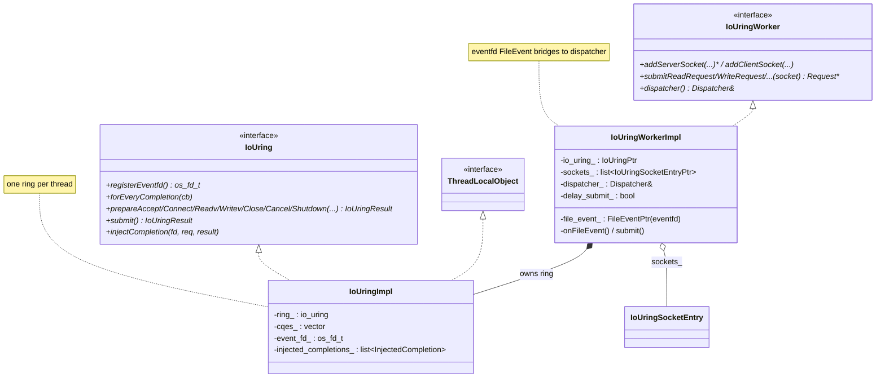
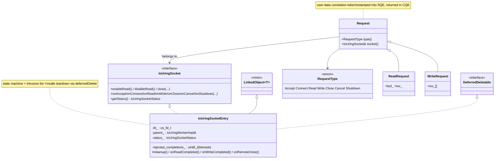

# io_uring — class hierarchy (UML)

UML-style Mermaid for the io_uring types. See [`OVERVIEW.md`](OVERVIEW.md) for behavior.

---

## Ring & worker

---

## Socket entry & requests

---

## Relationship summary

| Relationship | Type | Meaning |
|---|---|---|
| `IoUringImpl` → `IoUring` + `ThreadLocalObject` | implements | One ring per worker thread. |
| `IoUringWorkerImpl` → `IoUringImpl` | composition | Owns the ring. |
| `IoUringWorkerImpl` → `IoUringSocketEntry` | aggregation | Tracks all sockets (intrusive list). |
| `IoUringWorkerImpl` → `FileEvent` (eventfd) | composition | Bridges completions into the dispatcher. |
| `IoUringSocketEntry` → `IoUringSocket` | implements | Upper-layer-facing socket abstraction. |
| `IoUringSocketEntry` → `DeferredDeletable` | implements | Safe teardown via dispatcher. |
| `ReadRequest`/`WriteRequest` → `Request` | inheritance | Per-op user-data with payload. |
| `Request` → `IoUringSocket` | reference | Routes completion back to its socket. |
