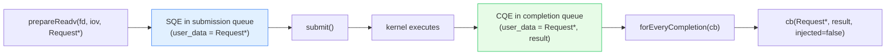
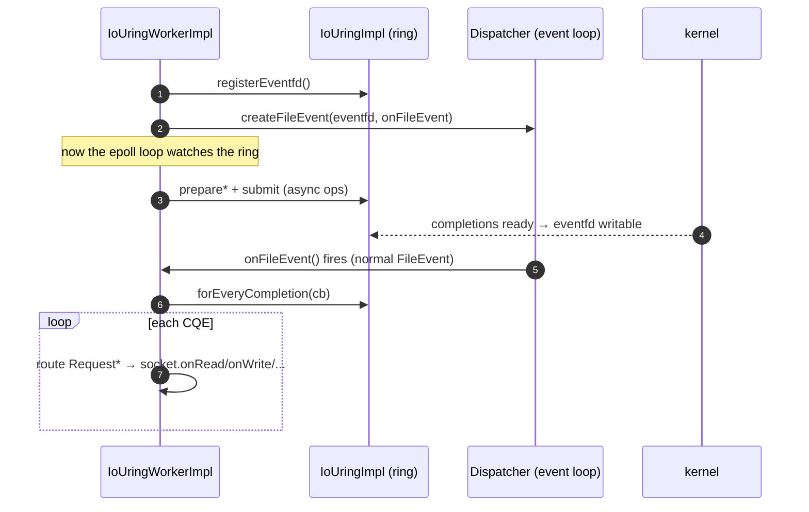
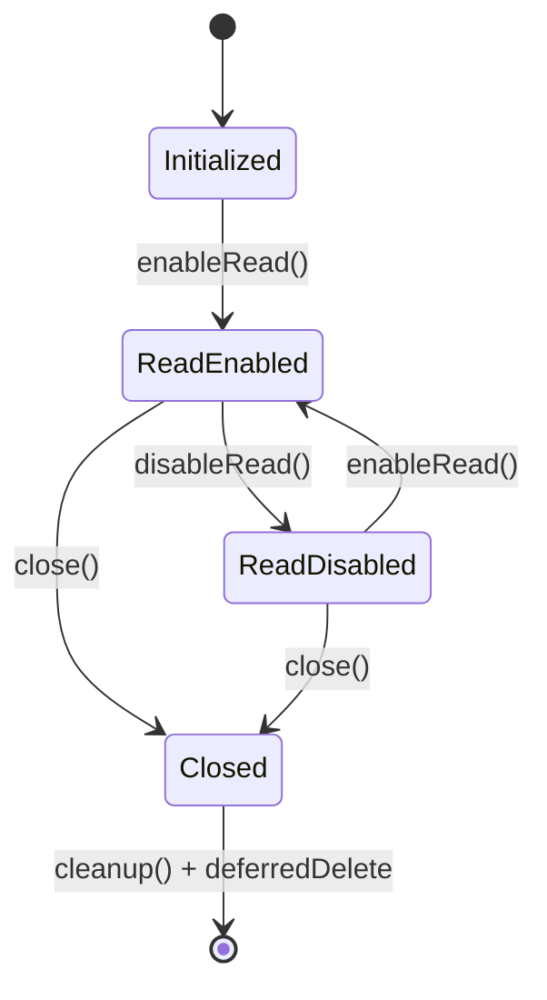

# io_uring — architecture & design

The ring wrapper, the per-thread worker, the per-socket state machine, and how completions are bridged into the
event loop. Read [`README.md`](README.md) first.

---

## Part 1 — `IoUringImpl`: the liburing wrapper

`IoUringImpl` is a thin, RAII layer over `liburing`'s `struct io_uring`. It's a `ThreadLocal::ThreadLocalObject`
(one ring per thread — rings are not shared across threads). Construction takes the **ring size** and whether to
use **submission-queue polling**:

```cpp
IoUringImpl(uint32_t io_uring_size, bool use_submission_queue_polling);
```

Its API mirrors io_uring operations 1:1:

| Method | io_uring op | Notes |
|---|---|---|
| `prepareAccept` / `prepareConnect` | accept / connect | server & client socket setup |
| `prepareReadv` / `prepareWritev` | readv / writev | vectored I/O with `iovec`s |
| `prepareClose` / `prepareShutdown` | close / shutdown | teardown |
| `prepareCancel` | cancel | cancel an in-flight request |
| `submit` | `io_uring_submit` | flush queued SQEs to the kernel |
| `forEveryCompletion(cb)` | reap CQEs | iterate completions, mark consumed |
| `registerEventfd` / `unregisterEventfd` | — | wire the ring to an eventfd |
| `injectCompletion` / `removeInjectedCompletion` | — | synthetic (non-kernel) completions |

Each `prepare*` returns `IoUringResult` — **`Ok`**, **`Busy`** (SQ full — submit and retry), or **`Failed`**.



The `Request*` carried as user-data is the **correlation token**: it's how a completion is matched back to the
operation (and socket) that issued it.

---

## Part 2 — `IoUringWorkerImpl`: the per-thread manager

One per worker thread. It owns the ring, the list of sockets, and the eventfd `FileEvent`. Responsibilities:

1. **Socket management** — `addServerSocket` / `addClientSocket` create `IoUringSocketEntry`s.
2. **Operation submission** — `submitReadRequest`, `submitWriteRequest`, `submitConnectRequest`,
   `submitCloseRequest`, `submitCancelRequest`, `submitShutdownRequest` build a `Request`, `prepare*` it on the
   ring, and arrange a `submit()`.
3. **Completion dispatch** — `onFileEvent()` (driven by the eventfd) calls `forEveryCompletion` and routes each
   `Request*` to its socket's `onRead`/`onWrite`/`onClose`/… handler.

### The eventfd bridge to the existing event loop

This is the key integration trick. io_uring is a completion model, but the rest of Envoy is a readiness loop. The
bridge:



So io_uring doesn't replace the dispatcher — it **rides on it**. The ring's readiness (via eventfd) is just
another `FileEvent`, which means all the existing watchdog, scope-tracking, and loop-timing machinery from
[`../event/`](../event/OVERVIEW.md) still applies.

### Delayed submit

`delay_submit_` exists because requests submitted *from inside a completion callback* shouldn't trigger an
immediate `submit()` syscall per request — they're batched and flushed once after the completion loop, cutting
syscalls. This is an explicit batching optimization on the write path.

---

## Part 3 — `IoUringSocketEntry`: the per-socket state machine

Each socket is an `IoUringSocketEntry`, which is simultaneously:

- an `IoUringSocket` (the interface upper layers use),
- a `LinkedObject<IoUringSocketEntry>` (intrusively listed in the worker's `sockets_`),
- an `Event::DeferredDeletable` (so it can be torn down safely via the dispatcher's deferred-delete — see
  [`../event/lifecycle_and_threading.md`](../event/lifecycle_and_threading.md)).

It tracks a status:

```cpp
enum IoUringSocketStatus { Initialized, ReadEnabled, ReadDisabled, Closed, ... };
```



On each completion type the entry has an `onAccept`/`onConnect`/`onRead`/`onWrite`/`onClose`/`onCancel`/`onShutdown`
handler. These also reconcile **injected completions**: `injected_completions_` is a bitmask of `RequestType`s
that were synthetically delivered, so the entry doesn't double-process a real + injected completion of the same
type. When the socket finishes closing, `cleanup()` removes it from the worker and defers its deletion.

### Why injected completions exist

Sometimes Envoy needs to deliver a completion the kernel will never produce — e.g. forcing a "close" path, or
surfacing a locally-detected condition through the same code path as a real completion. `injectCompletion` queues
an `InjectedCompletion{fd, Request*, result}` that `forEveryCompletion` delivers with `injected=true`, keeping the
socket's handling logic uniform whether the event came from the kernel or from Envoy itself.

---

## Part 4 — requests as user-data

`Request` (in the interface) is the base for per-operation user-data. The worker defines payload-carrying
subclasses:

| Subclass | Carries |
|---|---|
| `ReadRequest` | an owned read buffer (`buf_`) + its `iovec` |
| `WriteRequest` | the `iovec[]` describing the slices to write |

The `Request*` is stamped into the SQE and comes back in the CQE, so its lifetime spans the in-flight operation;
the worker frees it when the completion is processed.

---

## Part 5 — opt-in & support detection

`isIoUringSupported()` probes whether the running kernel supports the required io_uring features. io_uring is
enabled via config (socket interface / bootstrap), and falls back to the epoll path when unsupported — so a single
Envoy binary runs on old and new kernels alike. The ring size and SQ-polling flag are tunables that trade memory
and a CPU core (for the poller) against syscall reduction.

---

## Design themes

| Theme | How `io/` expresses it |
|---|---|
| **Completion over readiness** | submit work, reap results — batched, fewer syscalls. |
| **Ride the existing loop** | eventfd → `FileEvent`, no parallel event system. |
| **Per-thread, no sharing** | one ring per worker (`ThreadLocalObject`). |
| **Uniform event path** | injected completions look like kernel completions to sockets. |
| **Graceful fallback** | `isIoUringSupported()` + config gating. |

---

## Cross-references

- [`CLASS_HIERARCHY.md`](CLASS_HIERARCHY.md) — UML.
- [`../event/OVERVIEW.md`](../event/OVERVIEW.md) — the `FileEvent`/dispatcher the eventfd bridges into.
- [`../event/lifecycle_and_threading.md`](../event/lifecycle_and_threading.md) — the deferred-delete the socket
  entry uses.
