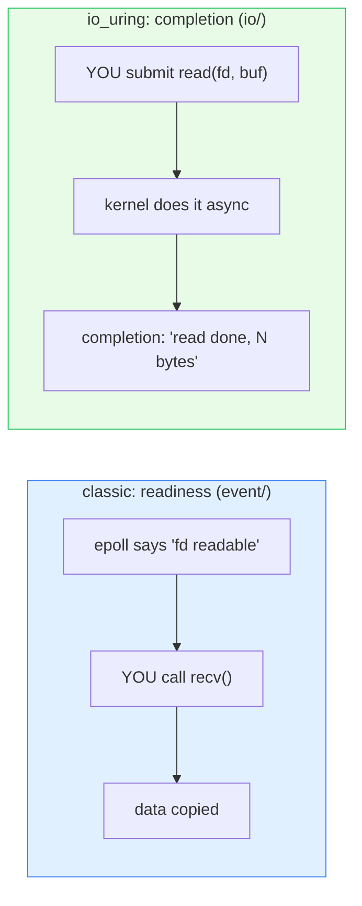
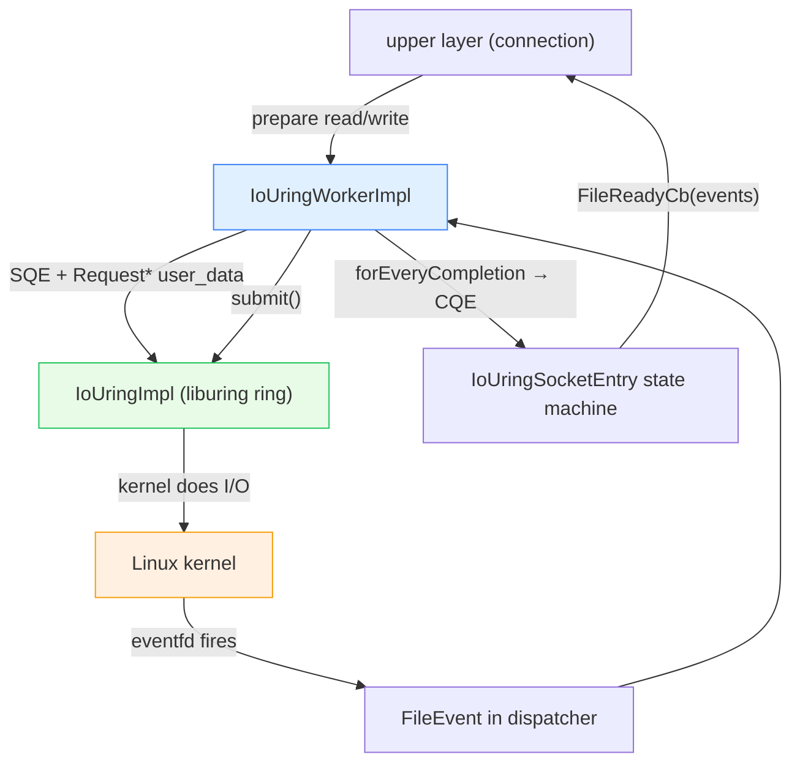

# `source/common/io/` — `io_uring` asynchronous I/O

This folder is Envoy's integration with **Linux `io_uring`** — the modern asynchronous I/O interface that lets you
submit batches of socket/file operations (accept, connect, read, write, close, shutdown) to the kernel and reap
their completions later, **without a syscall per operation**. It's an alternative to the classic
readiness-based model (epoll + `recv`/`send`) used everywhere else in Envoy.

This is an **opt-in, Linux-only, advanced** path. Most deployments still use the epoll-based
[`../event/`](../event/README.md) `FileEvent` model. `io/` exists to push tail latency and syscall overhead down
on supported kernels.

> **TL;DR** — this folder owns:
> - `IoUringImpl` — a thin RAII wrapper over `liburing` (the ring, submission/completion queues, eventfd),
> - `IoUringWorkerImpl` — a per-thread manager that owns one ring, tracks sockets, and bridges completions into
>   the dispatcher's event loop,
> - `IoUringSocketEntry` — per-socket state machine (read/write/close lifecycle) on top of the ring,
> - `Request` subclasses (`ReadRequest`, `WriteRequest`) — the "user data" attached to each in-flight operation.

---

## Readiness model vs completion model



- **Readiness (epoll):** the kernel tells you *when you can act*; you then make the syscall. One notify + one
  syscall per op.
- **Completion (io_uring):** you tell the kernel *what to do*; it does the work and notifies you when *done*. Ops
  are **batched** into a submission queue (SQ) and reaped from a completion queue (CQ) — potentially many ops per
  syscall, or even zero with submission-queue polling.

---

## The one-paragraph mental model

Each worker thread that uses io_uring owns one `IoUringWorkerImpl`, which owns one `IoUringImpl` (= one kernel
ring). The ring is **registered with an eventfd**, and that eventfd is added to the dispatcher as a normal
`FileEvent` — so the existing [`../event/`](../event/README.md) loop wakes the worker when completions are ready.
To do I/O you `prepare*` an operation (accept/connect/read/write/close/shutdown) — which places a Submission Queue
Entry (SQE) carrying a `Request*` as user-data — then `submit()`. When the kernel finishes, the eventfd fires, the
worker calls `forEveryCompletion`, and each `Request*` is routed back to its `IoUringSocketEntry`, which advances
its state machine and ultimately invokes the same `FileReadyCb` the rest of Envoy expects. So io_uring is hidden
behind a socket abstraction that *looks* event-driven to upper layers.

---

## Folder map

```
source/common/io/
├── BUILD
├── io_uring_impl.{h,cc}          # IoUringImpl — liburing wrapper (ring + eventfd + prepare/submit/reap)
└── io_uring_worker_impl.{h,cc}   # IoUringWorkerImpl + IoUringSocketEntry + Read/WriteRequest
```

Interface: `envoy/common/io/io_uring.h` (`IoUring`, `IoUringWorker`, `IoUringSocket`, `Request`,
`CompletionCb`, `IoUringResult`).

---

## Key concepts

| Concept | What it is |
|---|---|
| **SQE** (submission queue entry) | one queued operation; carries a `Request*` as user-data. |
| **CQE** (completion queue entry) | one finished operation; carries the same `Request*` + result code. |
| **eventfd** | the fd registered with the ring so the epoll loop can wake on completions. |
| **`Request`** | base for per-op user-data; `RequestType` ∈ {Accept, Connect, Read, Write, Close, Cancel, Shutdown}. |
| **injected completion** | a synthetic completion the worker delivers without the kernel (e.g. forced close). |
| **SQ polling** | optional kernel thread that polls the SQ, removing even the `submit()` syscall. |

---

## Per-topic table

| Topic | Document | Source |
|---|---|---|
| Ring lifecycle, the worker, the socket state machine, dispatcher bridge | [`OVERVIEW.md`](OVERVIEW.md) | both impls |
| Class hierarchy (UML) | [`CLASS_HIERARCHY.md`](CLASS_HIERARCHY.md) | interfaces + impls |

---

## Big picture



---

## Reading order

1. This `README.md` — readiness vs completion, the actors.
2. [`OVERVIEW.md`](OVERVIEW.md) — ring lifecycle, submit/reap, the socket state machine, the eventfd bridge.
3. [`CLASS_HIERARCHY.md`](CLASS_HIERARCHY.md) — UML map.
