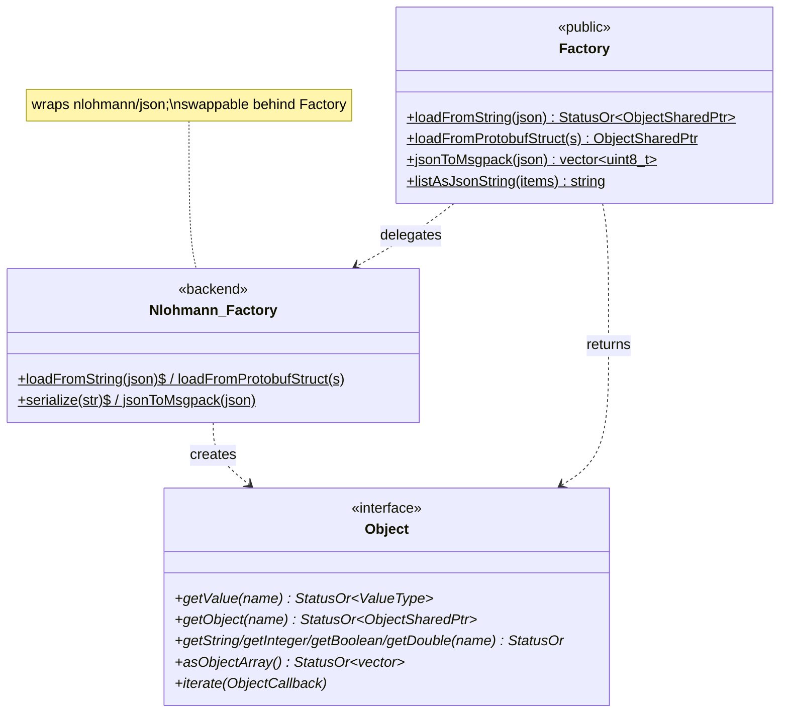
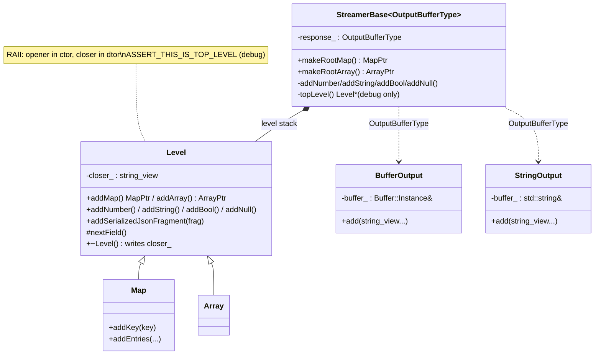
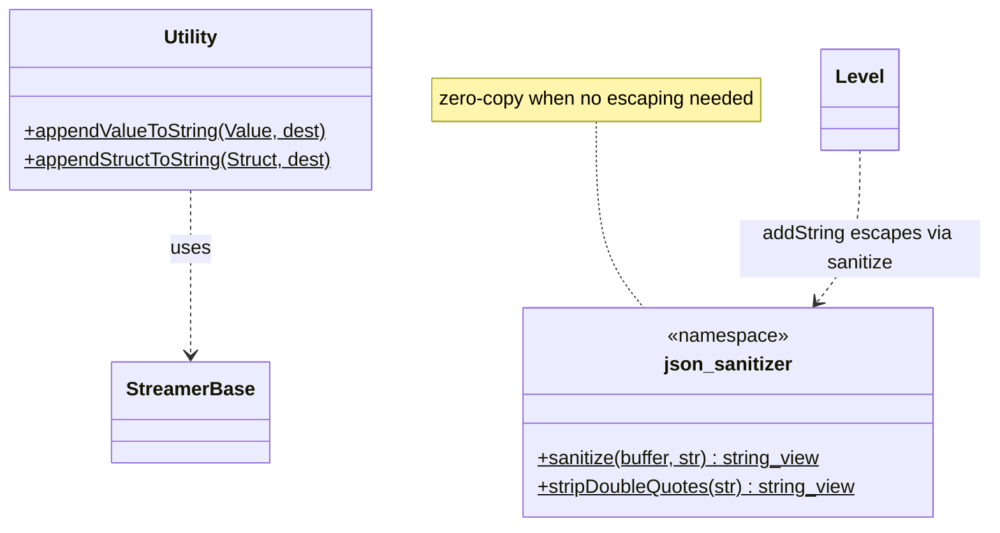

# JSON — class hierarchy (UML)

UML-style Mermaid for the JSON object model, factories, and streamer. See [`OVERVIEW.md`](OVERVIEW.md) for
behavior.

---

## Object model & factories

---

## The streamer

---

## Sanitizer & utility (free functions)

---

## Relationship summary

| Relationship | Type | Meaning |
|---|---|---|
| `Factory` → `Nlohmann_Factory` | delegation | Public API forwards to the nlohmann backend. |
| `Nlohmann_Factory` → `Object` | factory | Produces the navigable tree. |
| `StreamerBase` → `Level` | composition | Maintains the open map/array stack. |
| `Map`/`Array` → `Level` | inheritance | Concrete level kinds (RAII open/close). |
| `StreamerBase` → `BufferOutput`/`StringOutput` | template param | Pluggable output sink. |
| `Level::addString` → `sanitize()` | uses | Escapes strings on the way out. |
| `Utility` → `StreamerBase` | uses | protobuf → JSON via the streamer. |
