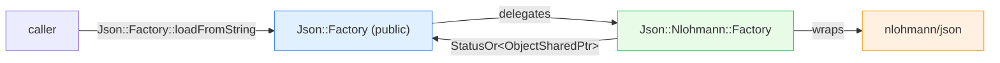

# JSON — architecture & design

The object model (parsing), the streaming serializer, the sanitizer, and the nlohmann backend. Read
[`README.md`](README.md) first.

---

## Part 1 — the object model (parsing)

`envoy/json/json_object.h` defines `Json::Object`, the navigable node interface. Values are an
`absl::variant`:

```cpp
using ValueType = absl::variant<bool, int64_t, double, std::string>;
using ObjectSharedPtr = std::shared_ptr<Object>;
using ObjectCallback = std::function<bool(const std::string&, const Object&)>;  // false = stop iterating
```

`Json::Factory` (in `json_loader`) is the public entry:

```cpp
absl::StatusOr<ObjectSharedPtr> loadFromString(const std::string& json);   // parse
ObjectSharedPtr loadFromProtobufStruct(const Protobuf::Struct& s);         // convert
std::vector<uint8_t> jsonToMsgpack(const std::string& json);               // → MessagePack
```

Navigation methods on `Object` return `absl::StatusOr<...>` (`getValue`, `getObject`, `getString`,
`getInteger`, `asObjectArray`, …) — **errors are values, not exceptions**, consistent with the rest of modern
Envoy. (`Json::Exception` exists for legacy paths but new code uses `StatusOr`.)

### The nlohmann backend

The interface is deliberately separate from the implementation. `Json::Nlohmann::Factory` (in `json_internal`)
is the concrete backend built on [nlohmann/json](https://github.com/nlohmann/json):



The indirection means the JSON library could be swapped (Envoy has historically migrated JSON backends) without
touching callers — only `json_internal` changes.

---

## Part 2 — the streamer (serialization without an intermediate tree)

`StreamerBase<OutputBufferType>` is the performance-critical path. Its docstring states the motivation directly:

> "The advantage of this approach is that it does not require building an intermediate data structure with
> redundant copies of all strings, maps, and arrays."

### Output adapters

The streamer is templated on an output sink with a tiny interface (`add(string_view)` and a 3-arg `add`):

| Adapter | Writes to |
|---|---|
| `BufferOutput` | a `Buffer::Instance` (the network/admin path) |
| `StringOutput` | a `std::string` |

You can supply your own adapter by implementing the two `add` methods.

### The level stack

You serialize by opening nested `Level`s — `Map` and `Array` — each of which writes its opener (`{` / `[`) on
construction and its closer (`}` / `]`) on destruction (RAII):

```mermaid
flowchart TD
    S["StreamerBase(buffer)"] --> M1["makeRootMap() → '{'"]
    M1 --> K1["addKey(\"name\") → '\"name\":'"]
    K1 --> V1["addString(\"envoy\") → '\"envoy\"'"]
    M1 --> K2["addKey(\"items\")"]
    K2 --> A1["addArray() → '['"]
    A1 --> E1["addNumber(1), addNumber(2)"]
    A1 -->|"~Array"| Aclose["']'"]
    M1 -->|"~Map"| Mclose["'}'"]

    style M1 fill:#e1f0ff,stroke:#3b82f6
    style A1 fill:#e7fbe7,stroke:#22c55e
```

The value types a level accepts: `addNumber` (double/uint64/int64), `addString` (sanitized), `addBool`,
`addNull`, `addMap`/`addArray` (nested), and `addSerializedJsonFragment` (insert pre-validated JSON verbatim — used
to embed already-serialized sub-documents without re-escaping).

### Correctness guardrails (debug-only)

Streaming serializers are easy to misuse — write to a parent while a child is open and you produce malformed JSON.
The streamer guards against this with **debug assertions** that only the *innermost* open level is written to:

```cpp
#ifdef NDEBUG
#define ASSERT_THIS_IS_TOP_LEVEL do {} while (0)     // compiled out in release
#else
#define ASSERT_THIS_IS_TOP_LEVEL ASSERT(this->streamer_.topLevel() == this)
#endif
```

Every `add*` on a `Level` calls `ASSERT_THIS_IS_TOP_LEVEL` + `nextField()` (which emits the `,` separator and
tracks "is this the first entry"). In release builds these checks vanish — zero overhead — relying on tests to
have caught misuse. This is the same "verify in debug, trust in release" philosophy used across Envoy.

---

## Part 3 — the sanitizer (fast, correct escaping)

`sanitize(buffer, str)` escapes a string for inclusion in a double-quoted JSON context. The design priority is
**speed on the common case** (no escaping needed):

- if `str` requires no escaping and is valid UTF-8, it returns `str` **unchanged** — no copy, no allocation;
- only if a character needs escaping does it write into the caller-provided `buffer` and return a view of that.

The header includes a benchmark showing the no-escape path at ~10 ns vs ~1445 ns for the proto encoder — which is
why stats/admin output (lots of mostly-ASCII keys) uses it. `stripDoubleQuotes()` is the inverse helper for
already-quoted strings.

> The caller owns the `buffer` and need not clear it; `sanitize` clears it only if it actually needs it. The
> returned view is valid only as long as **both** `str` and `buffer` live — a deliberate zero-copy contract.

---

## Part 4 — protobuf → JSON helpers

`Json::Utility` bridges protobuf well-known types to JSON, built on the streamer:

```cpp
static void appendValueToString(const Protobuf::Value& value, std::string& dest);
static void appendStructToString(const Protobuf::Struct& struct_value, std::string& dest);
```

These are used wherever a `google.protobuf.Struct`/`Value` (common in xDS metadata and filter config) needs to be
rendered as JSON — e.g. metadata in access logs.

---

## Design themes

| Theme | How `json/` expresses it |
|---|---|
| **Two modes for two needs** | tree (navigable) vs streamer (fast emit). |
| **Backend isolation** | public `Factory` ↔ `Nlohmann::Factory`; swappable library. |
| **Errors as values** | `StatusOr` everywhere new. |
| **Debug-checked, release-fast** | `ASSERT_THIS_IS_TOP_LEVEL` compiled out in release. |
| **Zero-copy fast path** | `sanitize()` returns input unchanged when no escaping needed. |

---

## Cross-references

- [`CLASS_HIERARCHY.md`](CLASS_HIERARCHY.md) — UML.
- [`../protobuf/`](../protobuf/README.md) — the protobuf utilities that feed `loadFromProtobufStruct` and
  `Json::Utility`.
