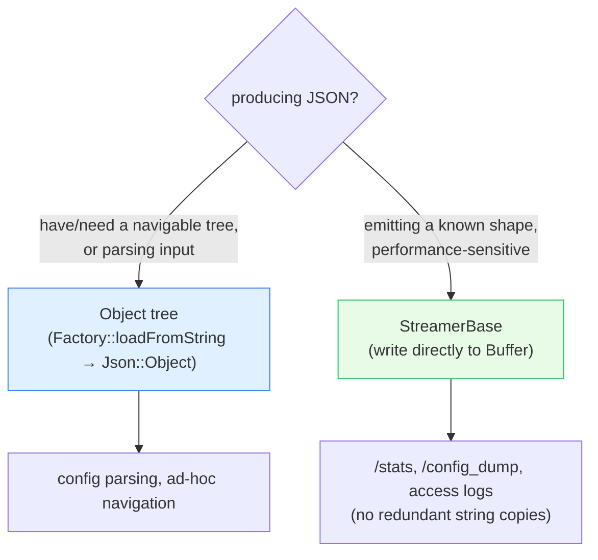

# `source/common/json/` — JSON parsing, serialization & streaming

This folder is Envoy's **JSON layer**. It parses JSON into a navigable object tree, serializes protobufs and
strings *to* JSON, escapes/sanitizes strings safely, and — most importantly for the hot path — provides a
**streaming** serializer that emits JSON directly to a buffer with no intermediate data structure.

It backs config loading, admin endpoints (`/config_dump`, `/stats?format=json`), access logs with JSON
formatters, structured logging, and gRPC-JSON transcoding.

> **TL;DR** — this folder owns:
> - `Json::Factory` (`json_loader`) — parse a string / protobuf `Struct` into a `Json::Object` tree,
> - `Json::Nlohmann::Factory` (`json_internal`) — the actual [nlohmann/json](https://github.com/nlohmann/json)
>   backend behind the interface,
> - `StreamerBase` (`json_streamer`) — allocation-light streaming JSON output to a `Buffer` or `string`,
> - `sanitize()` (`json_sanitizer`) — fast, correct string escaping for JSON contexts,
> - `Json::Utility` (`json_utility`) — protobuf `Value`/`Struct` → JSON string helpers.

---

## Two ways to produce JSON (and when to use each)



The **streamer** exists because building a `Json::Object` (or a protobuf) just to serialize it means copying every
string, key, and number into an intermediate structure first. For large outputs (think stats dumps with thousands
of entries) that's wasteful. The streamer writes tokens straight to the output buffer as you call `addKey` /
`addString` / `addNumber`.

---

## The one-paragraph mental model

To **read** JSON you call `Json::Factory::loadFromString(str)` and get an `absl::StatusOr<ObjectSharedPtr>` — a
tree of `Json::Object` nodes you navigate with `getObject`, `getString`, `getInteger`, `asObjectArray`, etc. The
interface lives in `envoy/json/json_object.h`; the implementation delegates to nlohmann/json
(`Json::Nlohmann::Factory`). To **write** JSON efficiently you create a `StreamerBase<BufferOutput>` (or
`StringOutput`), open a map/array `Level`, and push keys and values; the streamer enforces (via debug assertions)
that you only write to the innermost open level, and escapes strings via `sanitize()`. For one-shot protobuf →
JSON, `Json::Utility::appendValueToString` / `appendStructToString` wrap the streamer.

---

## Folder map

```
source/common/json/
├── BUILD
├── json_loader.{h,cc}      # Json::Factory — public parse / msgpack / list-as-json
├── json_internal.{h,cc}    # Json::Nlohmann::Factory — nlohmann/json backend + serialize()
├── json_streamer.h         # StreamerBase<Output> + Level/Map/Array — streaming output
├── json_sanitizer.{h,cc}   # sanitize() / stripDoubleQuotes() — fast escaping
└── json_utility.h          # Json::Utility — protobuf Value/Struct → JSON string
```

Interface: `envoy/json/json_object.h` (`Json::Object`, `ValueType`, `ObjectCallback`, `Exception`).

---

## What each piece does

| Piece | Direction | Role |
|---|---|---|
| `Json::Factory::loadFromString` | parse | string → `Json::Object` tree (`StatusOr`). |
| `Json::Factory::loadFromProtobufStruct` | convert | protobuf `Struct` → `Json::Object`. |
| `Json::Factory::jsonToMsgpack` | convert | JSON string → MessagePack bytes. |
| `Json::Nlohmann::Factory` | backend | the nlohmann/json implementation + `serialize()`. |
| `StreamerBase` | serialize | streaming output to `Buffer`/`string`, no intermediate tree. |
| `sanitize()` | escape | escape a string for a double-quoted JSON context (fast path: no copy). |
| `Json::Utility` | serialize | protobuf `Value`/`Struct` → JSON string. |

---

## Per-topic table

| Topic | Document | Source |
|---|---|---|
| Object model, the streamer, the sanitizer, the nlohmann backend | [`OVERVIEW.md`](OVERVIEW.md) | all files |
| Class hierarchy (UML) | [`CLASS_HIERARCHY.md`](CLASS_HIERARCHY.md) | interfaces + impls |

---

## Reading order

1. This `README.md` — tree vs streaming, and the pieces.
2. [`OVERVIEW.md`](OVERVIEW.md) — how each works, with the streamer's level-stack model.
3. [`CLASS_HIERARCHY.md`](CLASS_HIERARCHY.md) — UML map.
