# Envoy Active Stream Listener Architecture - Part 1: Core Architecture and Lifecycle

> **Note**: This document is Part 1 of 2. See [Part 2: Operations and Management](ACTIVE_STREAM_LISTENER_ARCHITECTURE_PART2.md) for socket management, statistics, memory management, and advanced topics.

## Overview

The Active Stream Listener subsystem manages the lifecycle of incoming TCP connections in Envoy, from socket acceptance through listener filter processing to active connection establishment. It provides a sophisticated framework for connection management with support for filter chains, graceful draining, and flexible connection tracking.

---

## Architecture Overview

### High-Level Flow

**This diagram shows how a TCP connection flows through Envoy's listener architecture:**

- **Listener Layer**: The OS socket listener receives incoming TCP connections from clients
- **Stream Listener Base**: Three layered base classes manage the progression from raw socket to established connection
  - `ActiveListenerImplBase`: Holds listener statistics and configuration
  - `ActiveStreamListenerBase`: Manages sockets during the listener filter phase
  - `OwnedActiveStreamListenerBase`: Groups connections by their filter chain for efficient management
- **Socket Processing**: Newly accepted sockets undergo listener filter processing (TLS inspection, protocol detection)
- **Connection Management**: After passing filters, connections are organized by filter chain and managed throughout their lifetime

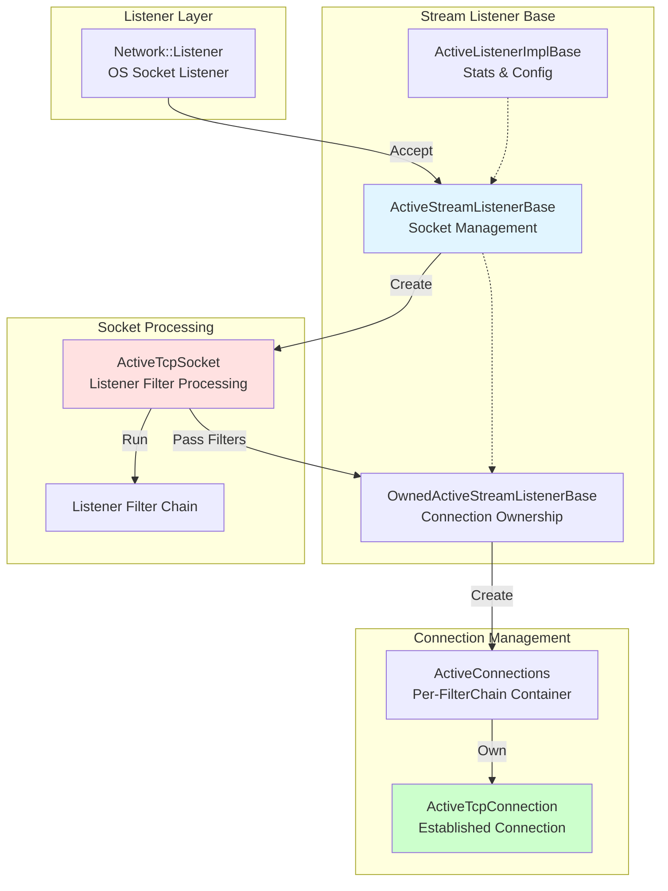

---

## Table of Contents

**Part 1 (this document): Core Architecture and Lifecycle**
1. [Class Hierarchy](#1-class-hierarchy)
2. [Connection Lifecycle](#2-connection-lifecycle)
3. [ActiveTcpSocket State Machine](#3-activetcpsocket-state-machine)
4. [Listener Filter Processing](#4-listener-filter-processing)
5. [Connection Management by Filter Chain](#5-connection-management-by-filter-chain)
6. [Filter Chain Draining](#6-filter-chain-draining)
7. [Connection Lifecycle Events](#7-connection-lifecycle-events)
8. [Timeout Handling](#8-timeout-handling)

**Part 2: Operations and Management** (see [ACTIVE_STREAM_LISTENER_ARCHITECTURE_PART2.md](ACTIVE_STREAM_LISTENER_ARCHITECTURE_PART2.md))
9. Socket Management
10. Statistics and Logging
11. Memory Management
12. Integration Points
13. Error Handling
14. Configuration
15. Performance Considerations
16. Key Design Patterns

---

## 1. Class Hierarchy

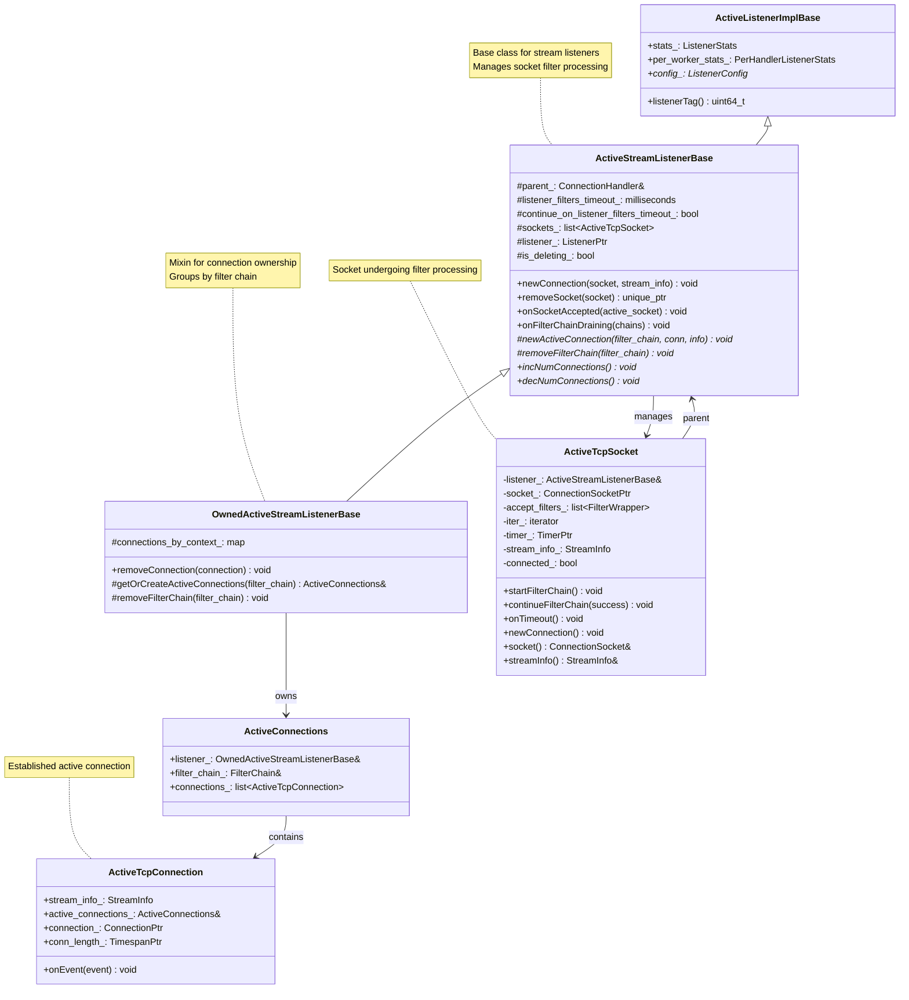

**Class Hierarchy Code Responsibilities:**

**`ActiveListenerImplBase`** (Base for all active listeners):
- **Purpose**: Stores listener statistics and configuration shared across TCP/UDP/QUIC/Internal listeners
- **Key Members**:
  - `stats_: ListenerStats` - Per-listener counters (`downstream_cx_total`, `downstream_cx_active`, `no_filter_chain_match`)
  - `per_worker_stats_: PerHandlerListenerStats` - Per-worker thread connection counts for balancing
  - `config_: ListenerConfig*` - Reference to listener config (filter chains, socket options, bind address)
- **Key Method**:
  - `listenerTag()` - Returns unique identifier for this listener (used in maps and logs)
- **Code Location**: `active_stream_listener_base.h:25-50`

**`ActiveStreamListenerBase`** (TCP/Unix socket base):
- **Purpose**: Manages socket lifecycle during listener filter processing phase (before filter chain matching)
- **Key Members**:
  - `sockets_: list<ActiveTcpSocket>` - Sockets currently in filter chain execution, waiting for completion or timeout
  - `listener_: ListenerPtr` - OS socket (performs `accept()`), registered with epoll/kqueue
  - `listener_filters_timeout_: milliseconds` - Max time for filters to complete (default 15s)
  - `continue_on_listener_filters_timeout_: bool` - Proceed vs reject on timeout
  - `is_deleting_: bool` - Set during destruction to prevent new connections
- **Key Methods**:
  - `newConnection(socket, stream_info)` - Called after filters pass → finds filter chain → creates active connection
  - `removeSocket(socket)` - Removes from `sockets_` list → returns `unique_ptr` for deletion
  - `onSocketAccepted(socket)` - Initial handler when OS accepts connection → creates `ActiveTcpSocket`
  - `onFilterChainDraining(chains)` - Gracefully closes connections using specified filter chains
- **Protected Abstract Method**:
  - `newActiveConnection(filter_chain, conn, info)` - Template method for derived classes to implement storage strategy
- **Code Location**: `active_stream_listener_base.h:55-185`

**`OwnedActiveStreamListenerBase`** (Connection ownership layer):
- **Purpose**: Groups active connections by filter chain for efficient draining during config updates (in-place filter chain modification)
- **Key Members**:
  - `connections_by_context_: map<FilterChain*, ActiveConnections>` - One container per unique filter chain
- **Key Methods**:
  - `removeConnection(connection)` - Removes from appropriate `ActiveConnections` container → deferred deletion
  - `getOrCreateActiveConnections(filter_chain)` - Lazy container creation via `map[key]` → returns reference
  - `removeFilterChain(filter_chain)` - Drains all connections using this chain → closes gracefully → removes map entry
- **Why Needed**: Allows filter chain updates without listener socket close/reopen (hot reload optimization)
- **Code Location**: `active_stream_listener_base.h:190-235`

**`ActiveTcpSocket`** (Transient state during filter processing):
- **Purpose**: Wraps connection socket while listener filters examine it (TLS Inspector, Proxy Protocol, Original Dst, etc.)
- **Lifecycle**: Created on `accept()` → destroyed after promotion to `ActiveTcpConnection` or rejection
- **Key Members**:
  - `socket_: ConnectionSocketPtr` - Network socket with local/remote addresses
  - `accept_filters_: list<FilterWrapper>` - Listener filters to execute sequentially
  - `iter_: iterator` - Current position in filter list
  - `timer_: TimerPtr` - Timeout for entire filter chain processing
  - `stream_info_: StreamInfo` - Accumulates metadata from filters (SNI, ALPN, dynamic metadata)
  - `connected_: bool` - Flag prevents duplicate `newConnection()` calls
- **Key Methods**:
  - `startFilterChain()` - Begins iteration → calls first filter's `onAccept()`
  - `continueFilterChain(success)` - Resume after async filter or timeout → advance iterator
  - `onTimeout()` - Handle filter timeout based on `continue_on_listener_filters_timeout` config
  - `newConnection()` - Promote to `ActiveTcpConnection` after filters pass
- **Code Location**: `active_tcp_socket.h:30-125`

**`ActiveConnections`** (Container for connections on same filter chain):
- **Purpose**: Holds all `ActiveTcpConnection` objects using identical filter chain configuration
- **Why Useful**: When filter chain is removed (config update), all its connections can be found and drained together efficiently
- **Key Members**:
  - `listener_: OwnedActiveStreamListenerBase&` - Back-reference to owner for cleanup
  - `filter_chain_: FilterChain&` - The filter chain these connections share
  - `connections_: list<ActiveTcpConnection>` - Active connections list
- **Lifetime**: Created lazily on first connection → destroyed when last connection closes (if not draining)
- **Code Location**: `active_stream_listener_base.h:240-265`

**`ActiveTcpConnection`** (Established connection):
- **Purpose**: Represents active TCP connection after successful listener filter processing and filter chain matching
- **Lifecycle**: Created after filter chain match → destroyed on connection close event
- **Key Members**:
  - `stream_info_: StreamInfo` - Connection metadata (start time, bytes, protocol)
  - `active_connections_: ActiveConnections&` - Container this connection belongs to
  - `connection_: ConnectionPtr` - `Network::Connection` for data I/O through network filters
  - `conn_length_: TimespanPtr` - Tracks connection duration for stats
- **Key Method**:
  - `onEvent(event)` - Handles `LocalClose`/`RemoteClose` → calls `removeConnection()` → emits access logs
- **Code Location**: `active_stream_listener_base.cc:310-380`

**Design Patterns Applied:**

1. **Template Method Pattern**:
   - Base class (`ActiveStreamListenerBase`) defines algorithm skeleton: `newConnection()` → find filter chain → `newActiveConnection()`
   - Derived class (`OwnedActiveStreamListenerBase`) implements specific steps: how to create and store connection
   - Benefit: Base handles common logic (filtering, matching), derived handles storage strategy

2. **Object Lifecycle Management**:
   - Transient objects (`ActiveTcpSocket`) exist only during processing phase
   - Long-lived objects (`ActiveTcpConnection`) persist until connection closes
   - Deferred deletion via `dispatcher_.deferredDelete()` ensures safe cleanup after event loop iteration

---

## 2. Connection Lifecycle

### Complete Flow

**Code Path Through Connection Lifecycle:**

**Socket Acceptance Phase** (`active_tcp_listener.cc:347-366`):
- OS places completed TCP connection in accept queue → `TcpListenerImpl::onSocketEvent()` triggered by epoll/kqueue
- Calls `accept()` syscall → returns fd + peer address
- Creates `ConnectionSocketImpl` wrapping fd with local/remote `Address::Instance`
- Admission control: `rejectCxOverGlobalLimit()` checks `num_connections_` counter against limit
- If pass: `cb_.onAccept(socket)` → delegates to `ActiveTcpListener::onAccept()`
- If reject: `socket->close()`, increment `downstream_global_cx_overflow_` stat

**Filter Chain Processing Phase** (`active_tcp_socket.cc:85-165`):
- `ActiveTcpSocket` constructor stores socket, initializes `StreamInfo` with connection metadata
- `createListenerFilterChain()` builds filter list from `listener_filter_factories_`
- `continueFilterChain(true)` starts iteration at `iter_ = accept_filters_.begin()`
- Each filter's `onAccept()` returns:
  - **Continue**: `++iter_`, immediately invoke next filter
  - **StopIteration**: `startTimer(listener_filters_timeout_)`, add to `sockets_` list, wait for I/O
  - **Close**: Rejection, proceed to socket closure
- On timeout: `onTimeout()` checks `continue_on_listener_filters_timeout_` config
  - If true: resume with `continueFilterChain(true)` (may match less-specific chain)
  - If false: reject with `continueFilterChain(false)`

**Filter Chain Matching** (`filter_chain_manager_impl.cc:380-520`):
- `newConnection()` calls `findFilterChain(socket, stream_info)`
- Matching algorithm walks LC-trie in precedence order:
  - Destination port → `destination_ports_map_[port]`
  - Destination IP → LC-trie lookup in `destination_ips_trie_`
  - Server name (SNI) → exact or wildcard match in `server_names_map_`
  - Transport protocol → "tls", "raw_buffer"
  - ALPN → "h2", "http/1.1"
  - Source IP/port → range checks
- Returns `FilterChain*` or `default_filter_chain_` or `nullptr`

**Connection Establishment** (`active_stream_listener_base.cc:195-220`):
- If match found: `newActiveConnection(filter_chain, conn, stream_info)`
- `getOrCreateActiveConnections(filter_chain)` lazily creates `ActiveConnections` container
- `ActiveTcpConnection` constructed, added to `connections_by_context_[filter_chain]`
- Network filter chain built via `filter_chain->networkFilterFactories()->createNetworkFilterChain()`
- Connection registered: `active_connections_.insert(conn)`
- Stats updated: `downstream_cx_total_.inc()`, `downstream_cx_active_.inc()`

**Active Connection Phase**:
- Connection processes data through network filter pipeline (HTTP codec, TCP proxy, etc.)
- Each filter `onData()` called as bytes arrive

**Connection Termination Phase** (`active_tcp_connection.cc:55-75`):
- `onEvent(LocalClose | RemoteClose)` → triggers `removeConnection(this)`
- Parent removes from `connections_` list
- `emitLogs()` writes access log entry with `StreamInfo` data
- `dispatcher_.deferredDelete()` schedules destruction after event loop iteration completes

**This sequence diagram shows the complete journey of a TCP connection from acceptance to active processing:**

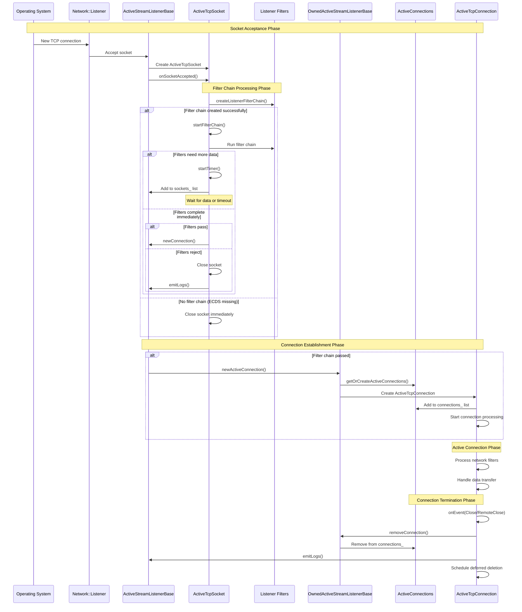

---

## 3. ActiveTcpSocket State Machine

**This state machine tracks an ActiveTcpSocket's lifecycle from creation through listener filter processing:**

**Key States:**
- **Created**: Socket accepted from OS, wrapper object created, StreamInfo initialized
- **FilterProcessing**: Listener filter chain execution begins
- **FilterIterating**: Walking through the filter list, each filter examines the connection
- **NeedMoreData**: A filter needs additional network data before making a decision (e.g., waiting for TLS ClientHello)
- **Waiting**: Socket is in the waiting list with an active timeout timer
- **Timeout**: Timer expired before filters completed
- **FilterPassed**: All filters approved the connection - ready to become active
- **FilterFailed**: A filter rejected the connection or timeout behavior says to close
- **Connected**: Promoted to ActiveTcpConnection, begins normal request processing
- **Closed**: Connection rejected, resources cleaned up

**Critical Decision Points:**
- When a filter returns `StopIteration`, socket enters waiting state with timer
- On timeout, `continue_on_listener_filters_timeout` config determines whether to proceed or reject
- Filter rejection immediately moves to close state
- Successful completion promotes the socket to a full connection

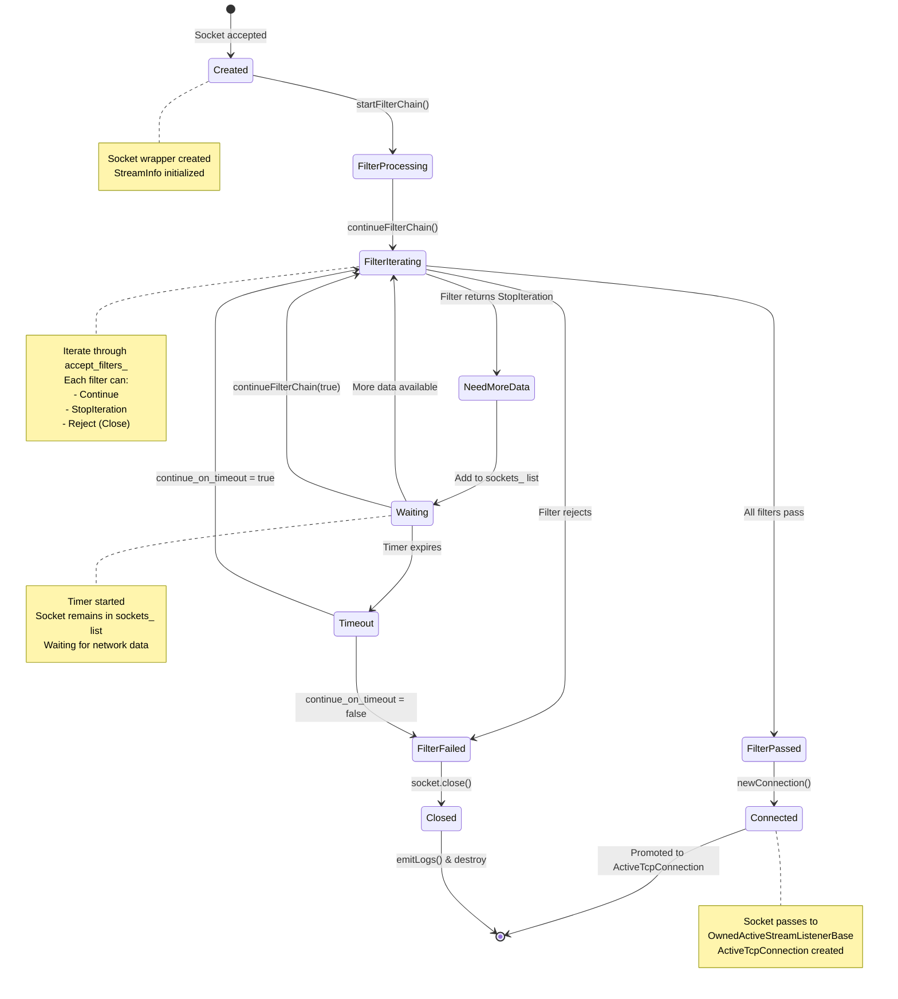

**State Transition Code Paths:**

| From State | Event/Trigger | Condition | Action Taken | Code Location | Next State |
|------------|---------------|-----------|--------------|---------------|------------|
| Created | `startFilterChain()` called | Always | `iter_ = accept_filters_.begin()` | `active_tcp_socket.cc:85` | FilterProcessing |
| FilterProcessing | `continueFilterChain()` | `iter_ != end()` | Call `(*iter_)->onAccept(socket_)` | `active_tcp_socket.cc:95` | FilterIterating |
| FilterIterating | Filter returns `Continue` | Not at end | `++iter_`, loop continues | `active_tcp_socket.cc:120` | FilterIterating |
| FilterIterating | Filter returns `StopIteration` | `!isEndFilterIteration()` | `startTimer()`, `moveIntoListBack(sockets_)` | `active_tcp_socket.cc:135` | NeedMoreData |
| FilterIterating | Filter returns `Close` | Always | Set failure reason in `stream_info_` | `active_tcp_socket.cc:145` | FilterFailed |
| FilterIterating | `iter_ == end()` | All filters passed | Prepare for connection | `active_tcp_socket.cc:150` | FilterPassed |
| NeedMoreData | Socket added | Always | Wait for I/O event or timeout | `active_tcp_socket.cc:140` | Waiting |
| Waiting | Data arrives on socket | Before timeout | `continueFilterChain(true)` resumes | `active_tcp_socket.cc:175` | FilterIterating |
| Waiting | `timer_->enableTimer()` fires | `continue_on_timeout=true` | `continueFilterChain(true)` | `active_tcp_socket.cc:160` | FilterIterating |
| Waiting | `timer_->enableTimer()` fires | `continue_on_timeout=false` | `continueFilterChain(false)` | `active_tcp_socket.cc:165` | FilterFailed |
| FilterPassed | All filters complete | `connected_ == false` | `newConnection()` called | `active_tcp_socket.cc:195` | Connected |
| FilterFailed | Rejection | Always | `socket_->close()`, `emitLogs()` | `active_tcp_socket.cc:210` | Closed |
| Connected | Promotion complete | Always | Remove from `sockets_` list | `active_stream_listener_base.cc:200` | [End] |
| Closed | Socket destroyed | Always | `dispatcher_.deferredDelete(this)` | `active_tcp_socket.cc:75` | [End] |

**Critical Fields State Changes:**
- `iter_`: Advances through `accept_filters_` list, tracks current filter position
- `connected_`: Boolean flag set after `newConnection()`, prevents duplicate promotion
- `timer_`: Armed when filter returns `StopIteration`, disarmed on data arrival or timeout
- `stream_info_`: Accumulates metadata from each filter (dynamic metadata, SNI, ALPN)
- `listener_filter_buffer_`: Optional buffer for filters needing to peek at initial bytes

---

## 4. Listener Filter Processing

### Filter Chain Execution

**This flowchart details the listener filter chain execution logic:**

**Initial Phase:**
- Socket is accepted and `ActiveTcpSocket` is created
- Filter chain creation is attempted - if it fails (e.g., due to missing ECDS config), socket is closed immediately
- Filter iterator is initialized to the beginning of the filter list

**Filter Iteration Loop:**
- Each filter is invoked sequentially
- Filter can return three statuses:
  - **Continue**: Proceed to next filter
  - **StopIteration**: Socket needs more data - add to waiting list, start timer
  - **Close**: Reject connection immediately

**Waiting State:**
- When a filter returns `StopIteration`, socket is added to `sockets_` list
- Timer is started with duration from `listener_filters_timeout` config (typically 15 seconds)
- Socket waits for:
  - More network data arriving (filter can resume)
  - Timeout expiration

**Timeout Handling:**
- If `continue_on_listener_filters_timeout` is **true**: Continue with remaining filters (may match less specific filter chain)
- If `continue_on_listener_filters_timeout` is **false**: Reject connection and close socket

**Success Path:**
- All filters pass: Call `newConnection()` to find matching filter chain
- Socket is promoted to `ActiveTcpConnection`
- Listener filter instances are destroyed (no longer needed)

**Failure Path:**
- Filter rejection or timeout-based closure
- Access logs are emitted with connection metadata
- Socket is closed and resources cleaned up

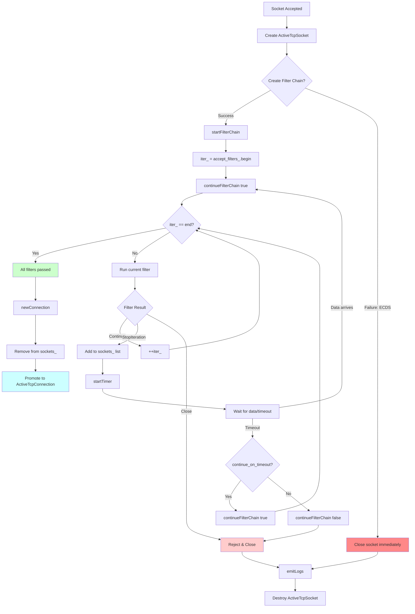

### Filter Status Handling

| Filter Status | Action | Next Step |
|--------------|--------|-----------|
| **Continue** | Move to next filter | `++iter_` → Continue chain |
| **StopIteration** | Pause filter chain | Add to `sockets_`, start timer, wait for data |
| **Close** | Reject connection | Close socket, emit logs, destroy |

---

## 5. Connection Management by Filter Chain

### ActiveConnections Container

**This diagram shows how connections are organized by their matched filter chain:**

**Why Group by Filter Chain:**
- Enables efficient draining when filter chains are updated
- All connections using a specific filter chain can be found and closed together
- Supports filter-chain-only updates without full listener restart

**Structure:**
- `OwnedActiveStreamListenerBase` maintains a map: `connections_by_context_`
- Key: pointer to `FilterChain` instance
- Value: `ActiveConnections` container holding all connections for that filter chain

**Example Scenario:**
- Filter Chain A: TLS connections to `api.example.com` - has 3 active connections
- Filter Chain B: TLS connections to `*.example.com` - has 2 active connections
- Filter Chain C: Raw TCP connections - has 1 active connection
- When Filter Chain B is updated, only those 2 connections need to be drained

**Lookup Performance:**
- Map lookup is O(1) using filter chain pointer as key
- Each `ActiveConnections` container uses a linked list for O(1) insertion/removal
- Connection removal can happen at any time without invalidating iterators

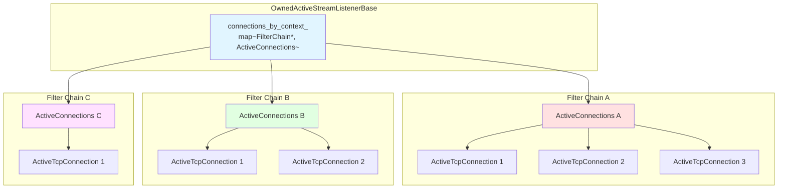

### getOrCreateActiveConnections

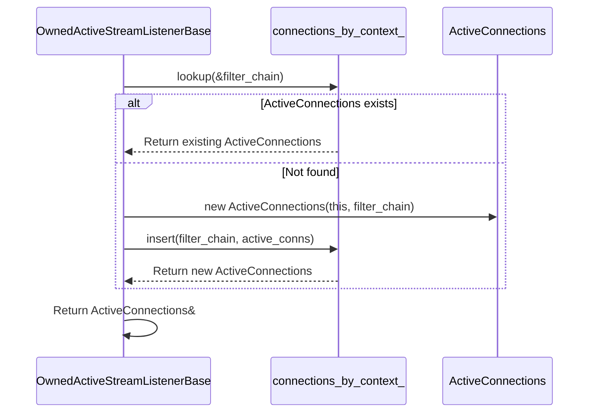

---

## 6. Filter Chain Draining

### Drain Process

**This flowchart shows how filter chains are gracefully removed during configuration updates:**

**When Draining Occurs:**
- Configuration update removes or modifies a filter chain
- The old filter chain needs to be gracefully shut down
- Existing connections on that chain should complete their work before closing

**Drain Sequence:**
1. `onFilterChainDraining()` is called with list of filter chains to drain
2. `is_deleting_` flag is temporarily set to prevent concurrent modifications
3. For each draining filter chain:
   - Find its `ActiveConnections` container in the map
   - Schedule graceful close for all connections in that chain
   - Connections close with `FlushWrite` - complete pending writes before closing
4. Remove the filter chain entry from `connections_by_context_` map
5. Schedule deferred deletion of `ActiveConnections` object

**Graceful Close:**
- Connections are not forcibly terminated
- Pending response data is written before closing
- Gives applications time to complete in-flight requests
- Drain timer (configurable, default 600s) determines maximum drain time

**Why This Matters:**
- Allows zero-downtime filter chain updates
- Minimizes disruption to active connections
- Supports gradual rollout of configuration changes

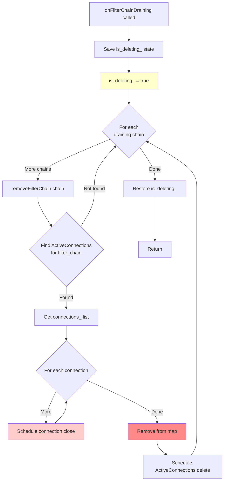

### removeFilterChain Implementation

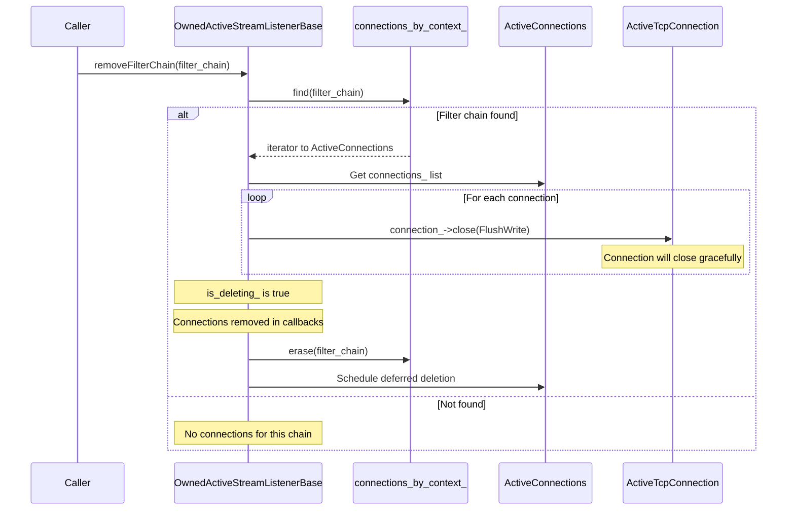

---

## 7. Connection Lifecycle Events

### ActiveTcpConnection Event Handling

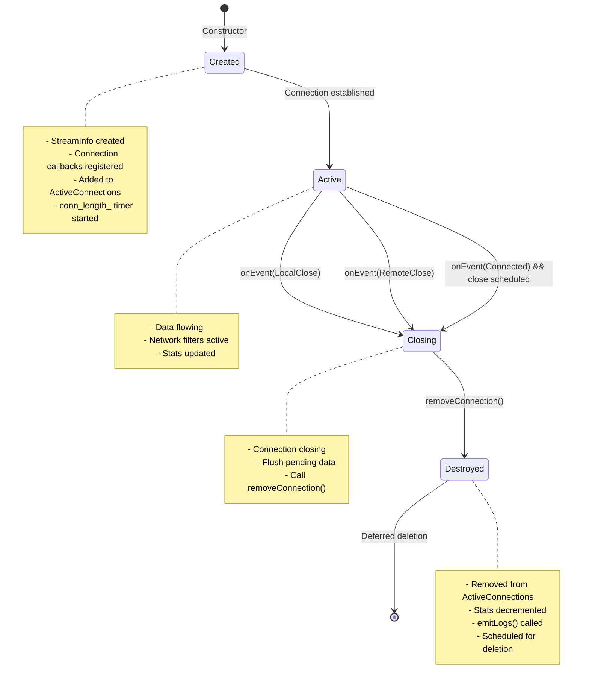

### Connection Event Processing

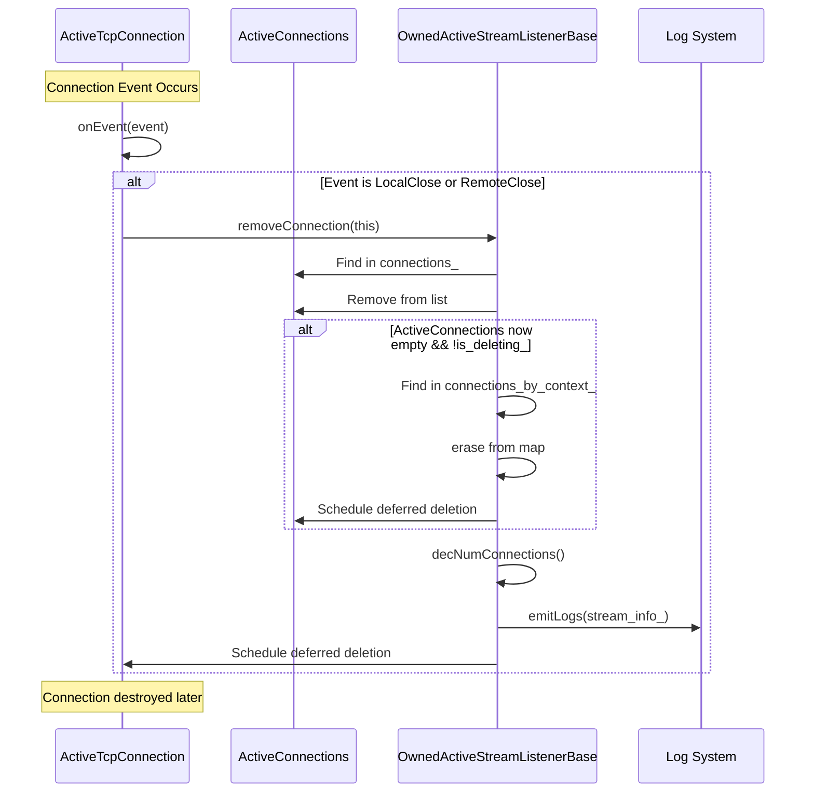

---

## 8. Timeout Handling

### Listener Filter Timeout

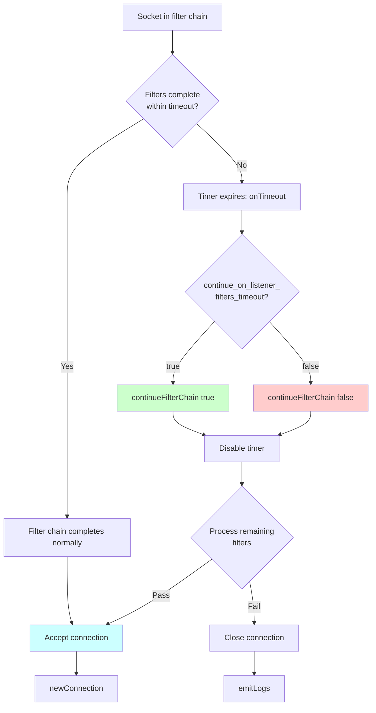

### Timeout Configuration

```cpp
// From listener config
listener_filters_timeout_: std::chrono::milliseconds
continue_on_listener_filters_timeout_: bool

// Typical values:
// timeout: 15s (15000ms)
// continue_on_timeout: false (reject by default)
```

---

## Continue to Part 2

For socket management, statistics, memory management, integration points, error handling, configuration, performance, and design patterns, see [ACTIVE_STREAM_LISTENER_ARCHITECTURE_PART2.md](ACTIVE_STREAM_LISTENER_ARCHITECTURE_PART2.md).
