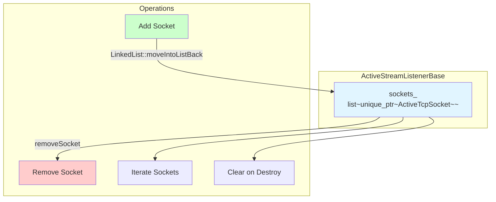
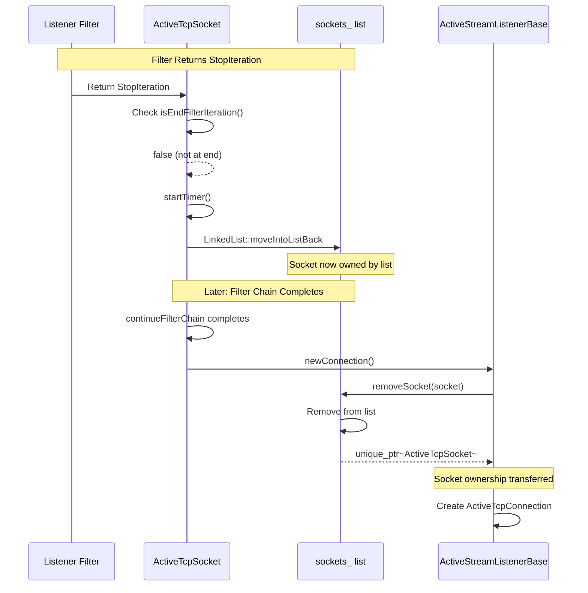
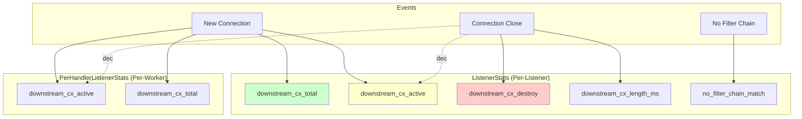
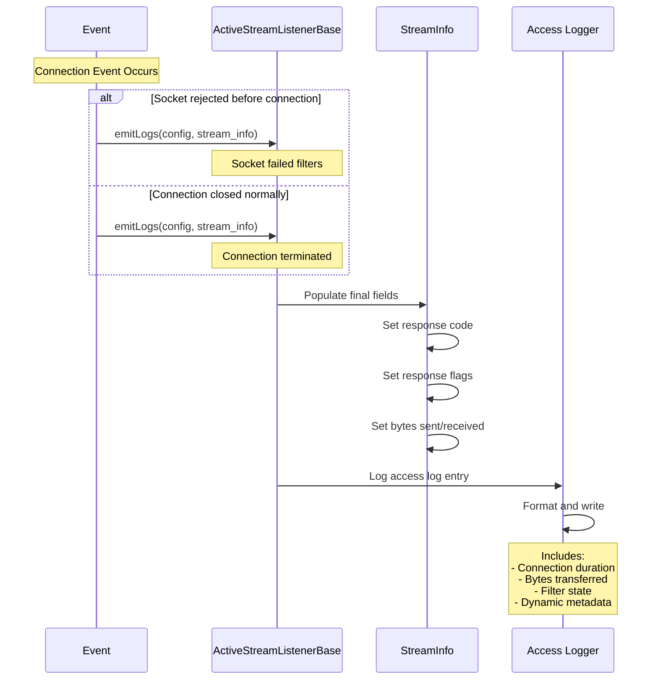
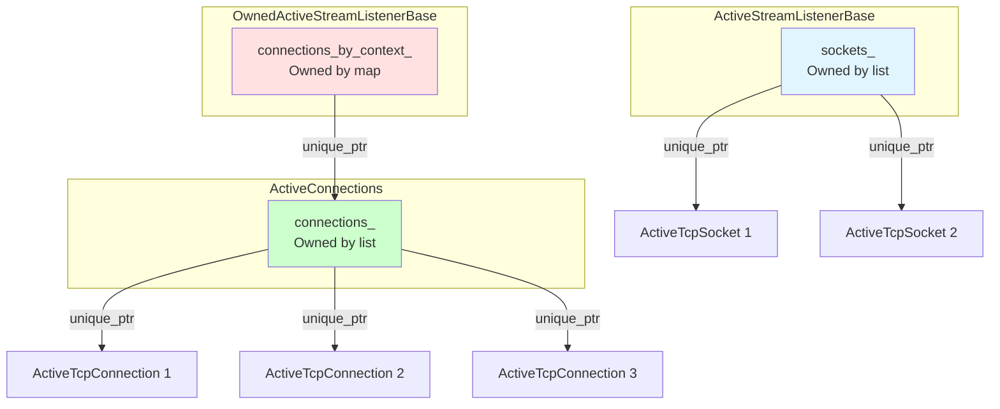
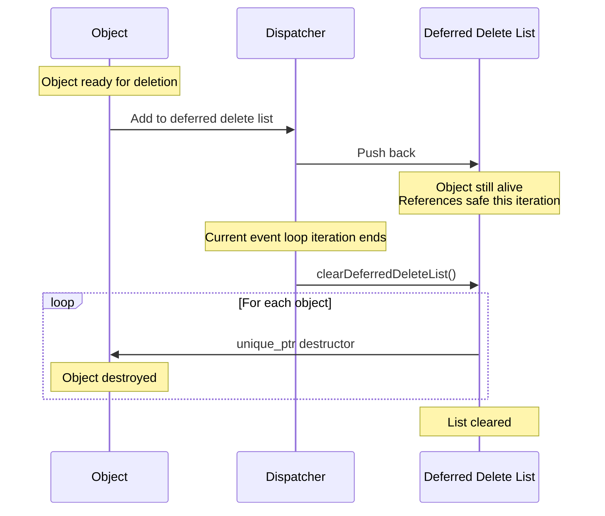
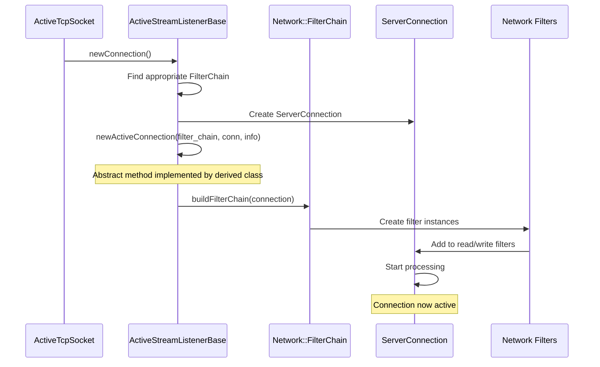
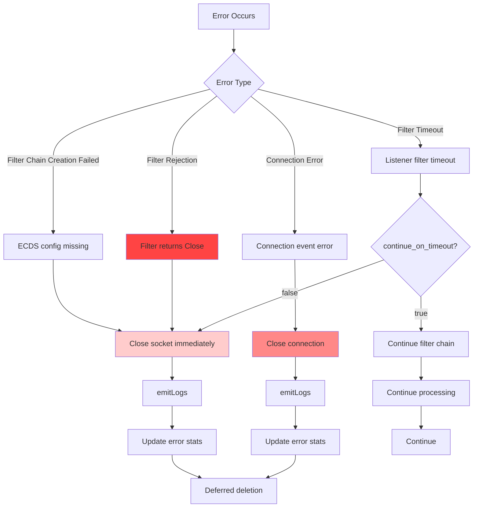
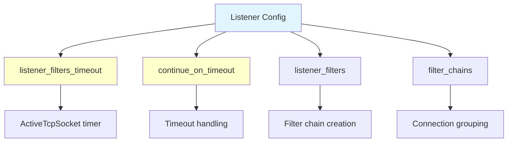
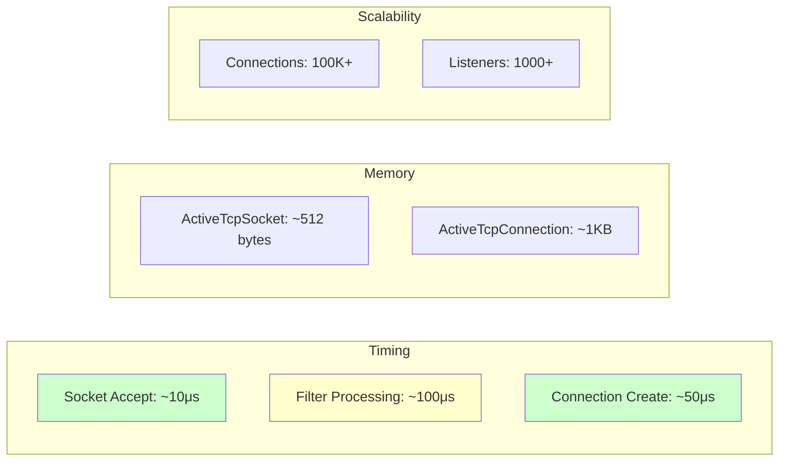

# Envoy Active Stream Listener Architecture - Part 2: Operations and Management

> **Note**: This document is Part 2 of 2. See [Part 1: Core Architecture and Lifecycle](ACTIVE_STREAM_LISTENER_ARCHITECTURE_PART1.md) for class hierarchy, connection lifecycle, state machines, and filter processing.

## Overview

This document covers the operational aspects of Active Stream Listeners including socket management, statistics collection, memory management, integration points, error handling, configuration options, and performance considerations.

---

## Table of Contents

**Part 1: Core Architecture and Lifecycle** (see [ACTIVE_STREAM_LISTENER_ARCHITECTURE_PART1.md](ACTIVE_STREAM_LISTENER_ARCHITECTURE_PART1.md))
1. Class Hierarchy
2. Connection Lifecycle
3. ActiveTcpSocket State Machine
4. Listener Filter Processing
5. Connection Management by Filter Chain
6. Filter Chain Draining
7. Connection Lifecycle Events
8. Timeout Handling

**Part 2 (this document): Operations and Management**
9. [Socket Management](#9-socket-management)
10. [Statistics and Logging](#10-statistics-and-logging)
11. [Memory Management](#11-memory-management)
12. [Integration Points](#12-integration-points)
13. [Error Handling](#13-error-handling)
14. [Configuration](#14-configuration)
15. [Performance Considerations](#15-performance-considerations)
16. [Key Design Patterns](#16-key-design-patterns)

---

## 9. Socket Management

### Sockets List Operations



### Socket Addition and Removal



---

## 10. Statistics and Logging

### Listener Statistics



### Log Emission



---

## 11. Memory Management

### Ownership Model



### Deferred Deletion



**Objects using deferred deletion:**
- `ActiveTcpSocket`
- `ActiveTcpConnection`
- `ActiveConnections`

---

## 12. Integration Points

### Connection Handler Integration

```mermaid
graph TB
    subgraph "ConnectionHandler"
        Handler[ConnectionHandler]
        ActiveListener[ActiveListener Interface]
    end

    subgraph "Listener Implementation"
        StreamListener[ActiveStreamListenerBase]
        OwnedListener[OwnedActiveStreamListenerBase]
    end

    subgraph "Concrete Implementations"
        TcpListener[ActiveTcpListener]
        UdpListener[ActiveRawUdpListener]
    end

    Handler --> ActiveListener
    ActiveListener <|.. StreamListener
    StreamListener <|-- OwnedListener
    OwnedListener <|-- TcpListener
    OwnedListener <|-- UdpListener

    style Handler fill:#e1f5ff
    style StreamListener fill:#ffe1e1
    style TcpListener fill:#ccffcc
```

### Network Filter Chain Integration



---

## 13. Error Handling

### Error Scenarios



### Error Statistics

| Error Type | Stat Name | Trigger |
|-----------|-----------|---------|
| No filter chain match | `no_filter_chain_match` | Cannot find matching filter chain |
| Connection create failed | `downstream_cx_destroy` | Connection failed during creation |
| Filter timeout | Custom filter stat | Listener filter timeout exceeded |
| Filter rejection | Custom filter stat | Filter explicitly rejects connection |

---

## 14. Configuration

### Key Configuration Parameters

```yaml
# Listener configuration
listener:
  # Listener filter timeout
  listener_filters_timeout: 15s

  # Continue processing after timeout
  continue_on_listener_filters_timeout: false

  # Listener filters
  listener_filters:
    - name: envoy.filters.listener.tls_inspector
    - name: envoy.filters.listener.http_inspector
    - name: envoy.filters.listener.original_dst

  # Filter chains
  filter_chains:
    - filter_chain_match:
        server_names: ["example.com"]
      filters:
        - name: envoy.filters.network.http_connection_manager
```

### Configuration Impact



---

## 15. Performance Considerations

### Optimization Strategies

1. **Lazy Filter Chain Creation**
   - Filter chains created only when needed
   - Reduces memory overhead for idle listeners

2. **Connection Grouping**
   - Connections grouped by filter chain
   - Efficient draining of specific filter chains
   - O(1) lookup by filter chain pointer

3. **Deferred Deletion**
   - Objects deleted at safe points
   - Prevents use-after-free
   - Minimal overhead (end of event loop)

4. **Linked Lists for Ordering**
   - O(1) insertion/removal
   - Maintains connection order
   - Cache-friendly iteration

### Performance Metrics



---

## 16. Key Design Patterns

### Pattern 1: Template Method Pattern
- `ActiveStreamListenerBase` provides template
- Derived classes implement `newActiveConnection()`
- Separation of socket handling from connection management

### Pattern 2: Chain of Responsibility
- Listener filters form a chain
- Each filter can:
  - Pass to next filter
  - Stop and wait
  - Reject connection
- Flexible, extensible filtering

### Pattern 3: Composite Pattern
- `ActiveConnections` groups connections
- Organized by filter chain
- Enables batch operations (drain)

### Pattern 4: Deferred Deletion Pattern
- Objects marked for deletion
- Actual deletion deferred to safe point
- Prevents dangling references

---

## Summary

The Active Stream Listener architecture provides:

1. **Robust Socket Processing**
   - Flexible listener filter chain
   - Timeout handling
   - Graceful failure modes

2. **Efficient Connection Management**
   - Grouped by filter chain
   - O(1) operations for common paths
   - Memory-efficient storage

3. **Lifecycle Management**
   - Clear ownership model
   - Deferred deletion for safety
   - Comprehensive logging

4. **Extensibility**
   - Abstract base for customization
   - Template method pattern
   - Filter chain extensibility

5. **Production Ready**
   - Error handling at all layers
   - Detailed statistics
   - Graceful degradation

This design enables Envoy to efficiently handle millions of connections while maintaining safety, observability, and flexibility for diverse deployment scenarios.

---

## See Also

- [Part 1: Core Architecture and Lifecycle](ACTIVE_STREAM_LISTENER_ARCHITECTURE_PART1.md) - Class hierarchy, connection lifecycle, state machines
- [ACTIVE_TCP_LISTENER_INVOCATION.md](ACTIVE_TCP_LISTENER_INVOCATION.md) - How ActiveTcpListener is invoked
- [LISTENER_MANAGER_ARCHITECTURE.md](LISTENER_MANAGER_ARCHITECTURE.md) - Overall listener manager design
- [BASE_CLASSES_AND_INTERFACES.md](BASE_CLASSES_AND_INTERFACES.md) - Base class reference
