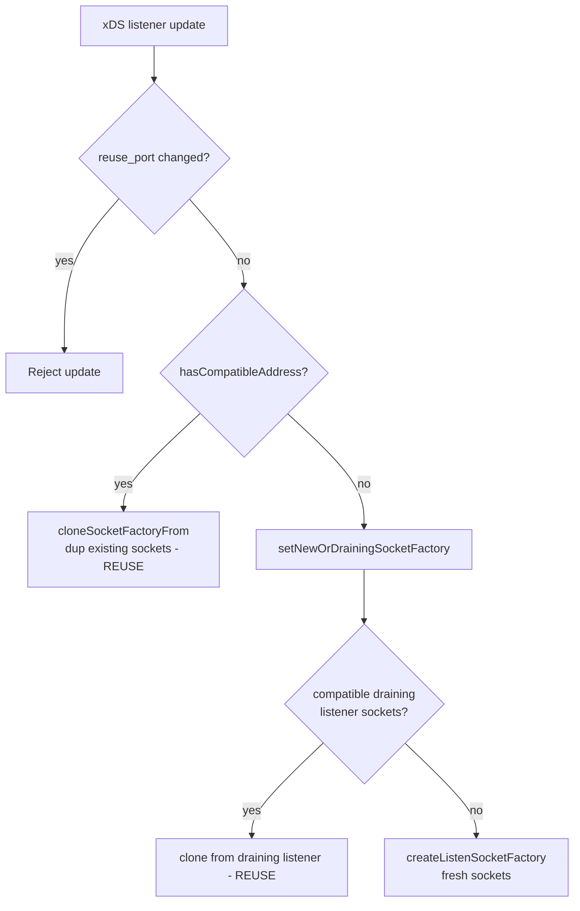

# Socket "Reuse" in the Listener Manager

The word *reuse* shows up in two distinct—but related—places in Envoy's listener
code, and they are easy to conflate:

1. **`reuse_port`** — a kernel feature (`SO_REUSEPORT`) that lets *multiple sockets*
   bind to the *same* address so each worker thread gets its own accept queue.
2. **Socket reuse on listener update / drain** — reusing the *existing* listen
   sockets (via `dup()`) when a listener is updated or re-created, instead of
   opening brand-new sockets, so in-flight connections are never dropped.

This document explains both, how they interact, and the sharp edges to be aware of.

---

## 1. `reuse_port` (`SO_REUSEPORT`)

### What it is

By default (on Linux, for TCP) Envoy sets `SO_REUSEPORT` on its listen sockets.
This kernel option allows **every worker thread to bind its own socket to the same
`ip:port`**. The kernel then hashes each incoming connection to one of those
sockets, giving each worker an **independent accept queue**. This scales accept
throughput and avoids a single-queue thundering-herd bottleneck.

Without `reuse_port`, all workers share **one** listen socket (one kernel accept
queue), and workers compete to `accept()` from it.

### The `BindType` model

Socket binding strategy is captured by an enum (`envoy/server/listener_manager.h`):

```cpp
enum class BindType {
  // The listener will not bind.
  NoBind,
  // The listener will bind a socket shared by all workers.
  NoReusePort,
  // The listener will use reuse_port sockets independently on each worker.
  ReusePort
};
```

| `BindType`     | Sockets created                       | Kernel accept queues | Typical use                       |
| -------------- | ------------------------------------- | -------------------- | --------------------------------- |
| `NoBind`       | none (or 1 unbound)                   | none                 | internal listeners, config-only   |
| `NoReusePort`  | 1, shared by all workers via `dup()`  | 1                    | Unix domain sockets, reuse off    |
| `ReusePort`    | 1 per worker, each bound to same addr | N (one per worker)   | default for TCP on Linux          |

The bind type is chosen in `ListenerManagerImpl::createListenSocketFactory`
(`source/common/listener_manager/listener_manager_impl.cc`):

```cpp
ListenerComponentFactory::BindType bind_type = ListenerComponentFactory::BindType::NoBind;
if (listener.bindToPort()) {
  bind_type = listener.reusePort() ? ListenerComponentFactory::BindType::ReusePort
                                   : ListenerComponentFactory::BindType::NoReusePort;
}
```

### How the value is resolved: `getReusePortOrDefault`

`ListenerImpl::getReusePortOrDefault` (`source/common/listener_manager/listener_impl.cc`)
resolves the effective setting with this precedence:

1. **`enable_reuse_port`** (`BoolValue`, the modern field) — if set, it wins. If both
   `enable_reuse_port` and the legacy `reuse_port` are set, `enable_reuse_port` is
   preferred (with a warning).
2. **`reuse_port`** (legacy bool) — if set to `true`, honored.
3. Otherwise the **server default** (`server.enableReusePortDefault()`), which
   depends on hot restart.

Platform caveats applied afterward:

- **Non-Linux + TCP**: even if requested, `reuse_port` is **force-disabled** with a
  warning (the kernel semantics Envoy relies on are Linux-specific).
- **UDP**: `reuse_port` is effectively the default (required for correct UDP worker
  routing); disabling it with `concurrency > 1` triggers a warning about unstable
  packet proxying.
- **Unix domain sockets (Pipe)**: always downgraded to `NoReusePort` (a shared
  socket), since `SO_REUSEPORT` per-worker binding doesn't apply.

### Immutable across updates

`reuse_port` **cannot be changed by an xDS update**. In
`ListenerManagerImpl::setupSocketFactoryForListener`:

```cpp
if (new_listener.reusePort() != existing_listener.reusePort()) {
  return absl::InvalidArgumentError(fmt::format(
      "Listener {}: reuse port cannot be changed during an update", new_listener.name()));
}
```

To change it you must remove and re-add the listener.

---

## 2. Socket reuse on listener update / drain

### The problem it solves

When a listener is updated in place (same address, new config) Envoy must **not**
tear down the old listen socket and open a new one, because:

- With `SO_REUSEPORT`, **each socket has its own kernel queue**. Closing a socket
  **discards any connections already queued in it** (they are reset, not migrated to
  a sibling socket). So naively re-creating sockets during an update would drop
  in-flight connections.

To avoid this, Envoy **reuses the existing sockets** by `dup()`-ing them into the new
listener's socket factory.

### How it works: cloning the socket factory

The update path (`setupSocketFactoryForListener`) decides between *new* and *reused*
sockets purely on **address compatibility**:

```cpp
if (!existing_listener.hasCompatibleAddress(new_listener)) {
  RETURN_IF_NOT_OK(setNewOrDrainingSocketFactory(new_listener.name(), new_listener));
} else {
  RETURN_IF_NOT_OK(new_listener.cloneSocketFactoryFrom(existing_listener));
}
```

`cloneSocketFactoryFrom` invokes the `ListenSocketFactoryImpl` **copy constructor**
(`source/common/listener_manager/listener_impl.cc`), which duplicates every socket:

```cpp
for (auto& socket : factory_to_clone.sockets_) {
  // In the cloning case we always duplicate() the socket. This makes sure that during
  // listener update/drain we don't lose any incoming connections when using reuse_port.
  // Specifically on Linux the use of SO_REUSEPORT causes the kernel to allocate a
  // separate queue for each socket on the same address. Incoming connections are
  // immediately assigned to one of these queues. If connections are in the queue when
  // the socket is closed, they are closed/reset, not sent to another queue. So avoid
  // making extra queues in the kernel, even temporarily.
  sockets_.push_back(socket->duplicate());
}
```

`duplicate()` produces a new file descriptor that refers to the **same underlying
kernel socket** (and therefore the same accept queue). The new listener adopts the
existing bound/listening sockets seamlessly.

### Reuse from draining listeners

There is a second reuse path for the "removed then re-added on the same address"
case. `setNewOrDrainingSocketFactory` searches the **draining** listeners (and
draining filter-chain managers) for one whose sockets are still open on a compatible
address, and clones from it if found:

```cpp
if (draining_listener_ptr != nullptr) {
  RETURN_IF_NOT_OK(listener.cloneSocketFactoryFrom(*draining_listener_ptr));
} else {
  return createListenSocketFactory(listener);   // fall back to fresh sockets
}
```

This lets a listener that is mid-drain hand its live sockets to the replacement,
again without dropping queued connections.

### Non-reuse_port duplication

Even without an update, the `NoReusePort` (shared socket) case reuses one socket
across workers. In the `ListenSocketFactoryImpl` constructor, only socket `0` is
created; the rest are `dup()`-ed from it:

```cpp
for (uint32_t i = 1; i < num_sockets; i++) {
  if (bind_type_ != ListenerComponentFactory::BindType::ReusePort && sockets_[0] != nullptr) {
    sockets_.push_back(sockets_[0]->duplicate());   // shared socket -> dup per worker
  } else {
    // reuse_port: each worker gets its own freshly-bound socket
    auto socket_or_error = createListenSocketAndApplyOptions(factory, socket_type, i);
    ...
  }
}
```

So `dup()` is used for **two** kinds of reuse: sharing one socket across workers
(`NoReusePort`), and preserving sockets across updates/drains (both bind types).

---

## 3. When does `listen()` actually happen?

Reused/duplicated sockets are already bound (and, for updates, already listening).
The `listen()` syscall is (re)issued in `doFinalPreWorkerInit`
(`source/common/listener_manager/listener_impl.cc`) just before workers start:

```cpp
const auto rc = socket->ioHandle().listen(tcp_backlog_size);
```

For a fresh socket this transitions it to the listening state. For a duplicated
socket it operates on the already-listening kernel socket.

---

## 4. Sharp edges / caveats

- **Changed socket options are silently ignored on update.** Because an update with
  a compatible address always *clones* (reuses) the existing sockets, socket-level
  settings that are applied at socket-creation or `listen()` time are **not
  re-applied**. The code even flags this:

  > `TODO(mattklein123): In the current code as long as the address matches, the
  > socket factory will be cloned, effectively ignoring any changed socket options.`

  A concrete consequence: changing **`tcp_backlog_size`** on an existing listener via
  xDS updates `/config_dump` (read from `ListenerImpl`) but does **not** change the
  kernel backlog, because the cloned socket factory carries the old value and reuses
  the already-listening socket. (See issue
  [envoyproxy/envoy#45478](https://github.com/envoyproxy/envoy/issues/45478).)

- **`reuse_port` is immutable across updates** (see above) — a change is rejected.

- **Address compatibility is the switch.** `hasCompatibleAddress` (not the full
  config) decides reuse vs. rebuild. Same address ⇒ reuse sockets; different address
  ⇒ new/draining socket factory.

- **Closing a `reuse_port` socket drops its queued connections.** This is the whole
  reason duplication exists; keep it in mind when reasoning about connection loss
  during config churn.

---

## Quick reference

| Term                     | Meaning                                                             |
| ------------------------ | ------------------------------------------------------------------- |
| `reuse_port` / `ReusePort` | `SO_REUSEPORT`: one bound socket **per worker**, independent queues |
| `NoReusePort`            | One shared bound socket, `dup()`-ed to each worker                  |
| `NoBind`                 | No socket bound (internal / config-validation listeners)            |
| clone / `duplicate()`    | `dup()` existing sockets into a new factory to **preserve** them    |
| `cloneSocketFactoryFrom` | Update/drain entry point that reuses existing sockets               |
| `doFinalPreWorkerInit`   | Where `listen()` (and post-listen options) are applied              |

### Decision flow (update path)


