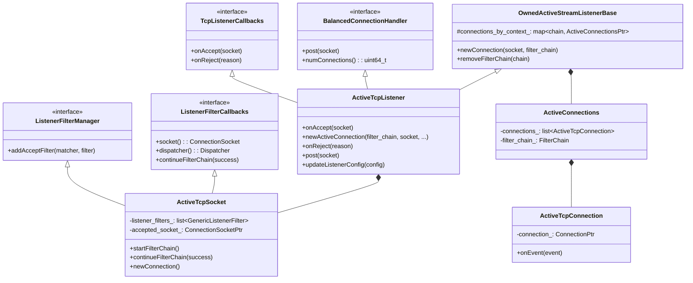
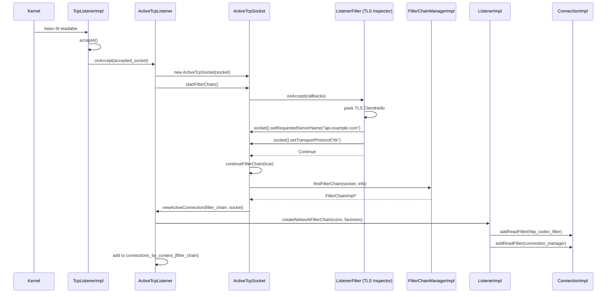
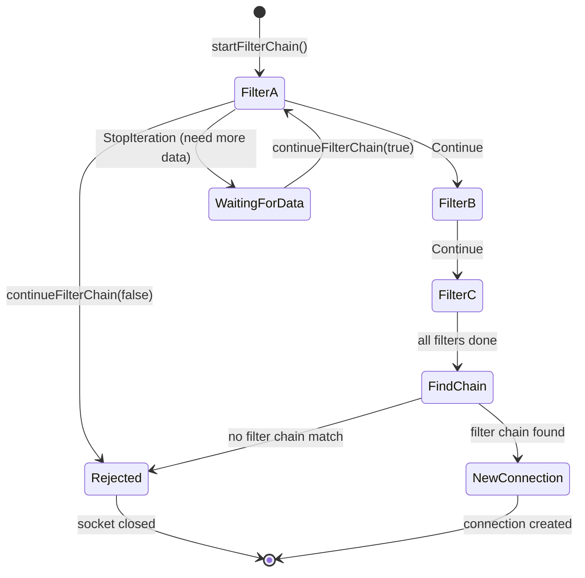
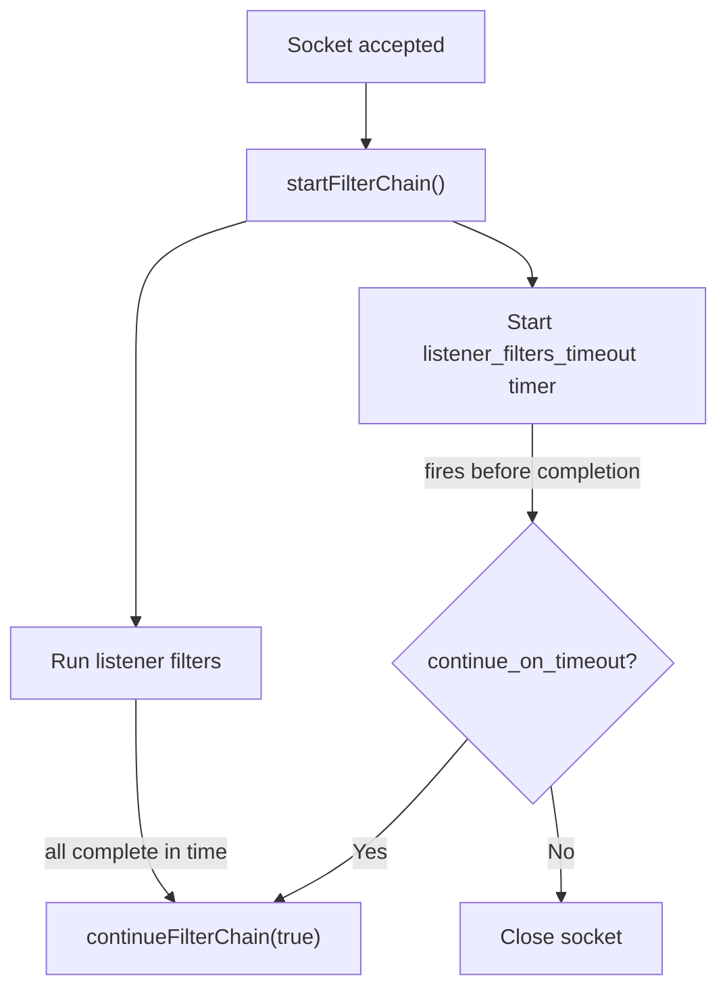
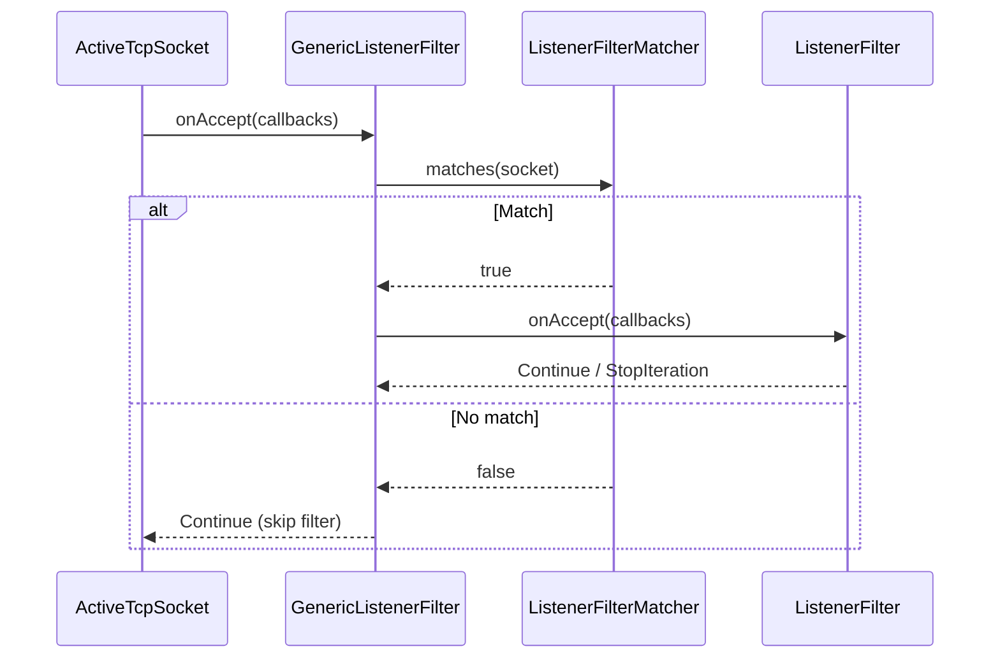
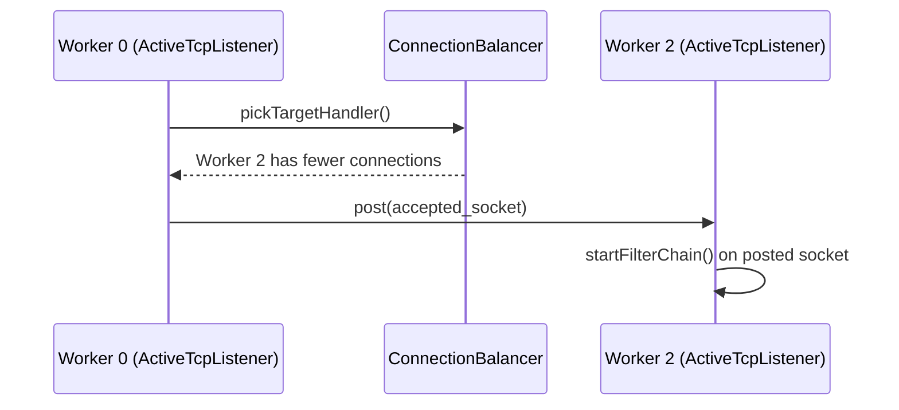
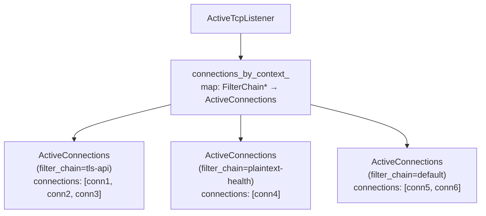
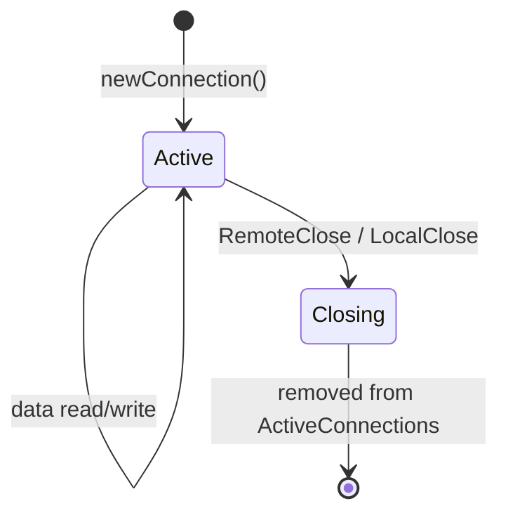
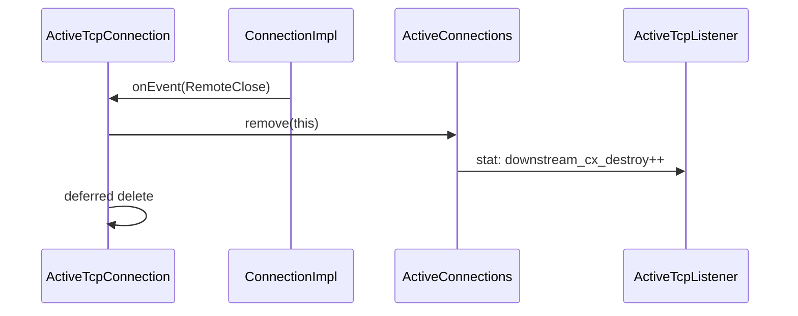
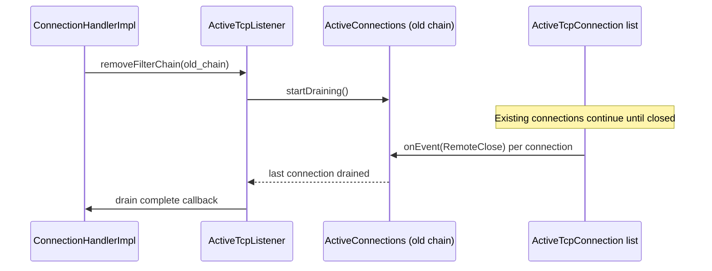

# ActiveTcpListener & ActiveTcpSocket

**Files:**
- `source/common/listener_manager/active_tcp_listener.h/.cc`
- `source/common/listener_manager/active_tcp_socket.h/.cc`
- `source/common/listener_manager/active_stream_listener_base.h/.cc`
**Namespace:** `Envoy::Server`

## Overview

`ActiveTcpListener` is the per-worker wrapper for a TCP listener. When a connection is accepted, it creates an `ActiveTcpSocket` to run listener filters, then selects a filter chain and creates a `ConnectionImpl`. `ActiveStreamListenerBase` provides the base logic for managing connections grouped by filter chain.

### The Two-Phase Connection Model

Understanding `ActiveTcpListener` requires understanding that connections go through two distinct phases before they are ready to process application data:

**Phase 1 — Listener Filter Phase** (`ActiveTcpSocket`): The OS has accepted the TCP connection (3-way handshake complete), but Envoy hasn't yet decided what to do with it. Listener filters run to gather metadata from the raw socket — the TLS ClientHello is peeked at to extract SNI and ALPN, proxy protocol headers are read, the original destination address is retrieved via `SO_ORIGINAL_DST`. During this phase the connection is tracked as an `ActiveTcpSocket` in the listener's `sockets_` list.

**Phase 2 — Network Filter Phase** (`ActiveTcpConnection`): After listener filters complete, the matched filter chain's network filter stack is instantiated. The connection transitions to `ActiveTcpConnection` status and is processed by the selected filters (HTTP connection manager, TCP proxy, etc.). The `ActiveTcpSocket` is destroyed at this transition.

This two-phase model allows Envoy to make routing decisions based on TLS properties without terminating the connection prematurely or doing unnecessary work for connections that will be rejected.

### Why `ActiveTcpListener` Is Not Called Directly

`ActiveTcpListener` is not invoked by user code. It is the **callback target** for `TcpListenerImpl`. When the OS signals that the listen socket has incoming connections, the event loop invokes a lambda that calls `TcpListenerImpl::onSocketEvent()`, which calls `ActiveTcpListener::onAccept()`. The class exists in callback space, not calling space.

## Class Hierarchy



## Accept-to-Connection Flow



## `ActiveTcpSocket` — Listener Filter Chain

### What `ActiveTcpSocket` Is

`ActiveTcpSocket` is a transient wrapper around a raw OS socket that exists only during the listener filter phase. It implements both `ListenerFilterManager` (so listener filters can register callbacks) and `ListenerFilterCallbacks` (so filters can read/write socket metadata, continue or stop the chain, and access the dispatcher).

When a listener filter calls `socket().setRequestedServerName("api.example.com")`, it is calling a method on the `ConnectionSocket` held by `ActiveTcpSocket`. That metadata persists on the socket and is later read by `FilterChainManagerImpl::findFilterChain()`. This is how SNI extracted in the TLS Inspector layer reaches the filter chain matching layer.

### Listener Filter Iteration



### Why Filters Can Return `StopIteration`

Some listener filters — most notably the TLS Inspector — need to read bytes from the socket before they can extract metadata. But the bytes might not have arrived yet. The filter cannot block the event loop thread waiting for data (that would defeat the purpose of async I/O).

Instead, the filter returns `StopIteration`. This puts the socket into the `sockets_` waiting list with an active timeout timer. When more data arrives on the socket fd, the event loop fires a read-ready notification, and the listener filter is resumed via `continueFilterChain(true)`. The filter reads the available bytes, and if it has enough to extract SNI/ALPN, returns `Continue`.

This non-blocking waiting means that even a slow client that sends the TLS ClientHello in multiple TCP segments (common on lossy networks) is handled correctly without blocking any other work on the worker thread.

### Timeout Handling

Listener filters have a configurable timeout. If filters don't complete within the timeout, the socket is either promoted (with whatever metadata is available) or rejected:



### The Timeout Trade-Off

The `listener_filters_timeout` and `continue_on_listener_filters_timeout` settings express a fundamental trade-off:

- **Reject on timeout** (`continue_on_timeout: false`, the default): Connections where filters don't complete are treated as suspicious and closed. This is appropriate when your deployment assumes all clients are well-behaved and should send complete TLS hellos promptly.

- **Continue on timeout** (`continue_on_timeout: true`): After the timeout, matching proceeds with whatever metadata was gathered. SNI may be missing, so the connection may match a less-specific filter chain (or the default). This is appropriate when you expect some non-TLS clients to connect to the same port (e.g., health checkers that send a bare TCP ping).

### `GenericListenerFilter` — Wrapped with Matcher

Each listener filter is wrapped in a `GenericListenerFilter` that checks a `ListenerFilterMatcher` predicate first:



### The `ListenerFilterMatcher` — Conditional Filter Execution

Not every listener filter should run on every connection. For example, the TLS Inspector should only run on connections where TLS is expected, not on plaintext health check ports. `GenericListenerFilter` wraps each listener filter with a `ListenerFilterMatcher` that evaluates a condition before invoking the filter.

The matcher evaluates against the socket at filter-chain-selection time. If it returns false, the filter is skipped with an implicit `Continue`, as if it was never in the chain. This allows a single listener to have connection-type-specific listener filters without configuring multiple listeners.

## Connection Balancing

`ActiveTcpListener` supports connection balancing: an accepted socket can be redirected to another worker if that worker has fewer connections:



### Connection Balancing: When and Why

With `SO_REUSEPORT`, the kernel distributes connections across workers using a flow-hash algorithm. This is generally fair, but not perfectly balanced — bursty traffic or long-lived connections can leave some workers much more loaded than others. Connection balancing corrects this.

When `ActiveTcpListener::onAccept()` is called, before creating an `ActiveTcpSocket`, it asks `ConnectionBalancer::pickTargetHandler()` which worker should handle this connection. If the answer is a different worker, the socket is **posted** to that worker via `Dispatcher::post()`. The socket file descriptor is transferred cross-thread without any kernel system call — it's just a pointer in the dispatcher's task queue.

The most common balancer is the **Exact Balance** strategy: it maintains per-worker connection counts and always picks the worker with the fewest connections. This is suitable for workloads with high connection lifetime variance (some long, some short). The **NopConnectionBalancer** (default) disables rebalancing and trusts the kernel's `SO_REUSEPORT` distribution.

## `ActiveConnections` — Per Filter Chain

Connections are grouped by their matched filter chain. This enables filter-chain-level drain (when a filter chain is updated, only connections using that chain are drained):



### Why Group Connections by Filter Chain?

The `connections_by_context_` map is the key data structure that enables filter-chain-level draining without a full listener restart. When a filter chain is updated (e.g., a TLS certificate rotation), only connections using that specific filter chain need to be drained. Connections on other filter chains are completely unaffected.

Without this grouping, draining any filter chain would require iterating all connections in the listener to find the relevant ones — O(N) for N total connections. With the map, finding all connections for a given filter chain is O(1) — just look up the pointer.

The map is keyed by `FilterChain*` (raw pointer) because filter chain objects are stable in memory for the lifetime of a listener generation. This is safe because the `FilterChainImpl` objects outlive all connections that reference them, thanks to the drain lifecycle managed by `DrainingFilterChainsManager`.

## `ActiveTcpConnection` — Per Connection Lifecycle





### Deferred Deletion: Preventing Use-After-Free

When an `ActiveTcpConnection` closes, it calls `removeConnection(this)` which removes it from the `ActiveConnections` list. But at the point of removal, the current call stack may still be inside the connection's callback — the `onEvent()` handler that triggered the removal. Immediately `delete`-ing the connection while it's still on the call stack would cause a use-after-free crash.

Envoy solves this with **deferred deletion**: instead of deleting immediately, the connection is placed in the dispatcher's deferred delete list (`dispatcher_.deferredDelete()`). The dispatcher deletes all deferred objects at the end of the current event loop iteration, after all callbacks for that event have returned. By then, no code is executing inside the connection object.

This pattern is used consistently throughout the listener stack: `ActiveTcpSocket`, `ActiveTcpConnection`, and `ActiveConnections` are all deferred-deleted.

## Filter Chain Draining

When a filter chain is replaced, only the connections on that specific chain drain:



## Key Data Relationships

```
ActiveTcpListener (per worker, per listen address)
  ├── accepted_sockets_: list<ActiveTcpSocket>
  │     └── listener_filters_: list<GenericListenerFilter>
  └── connections_by_context_: map<FilterChain*, ActiveConnections>
        └── connections_: list<ActiveTcpConnection>
              └── connection_: Network::ConnectionPtr
```
