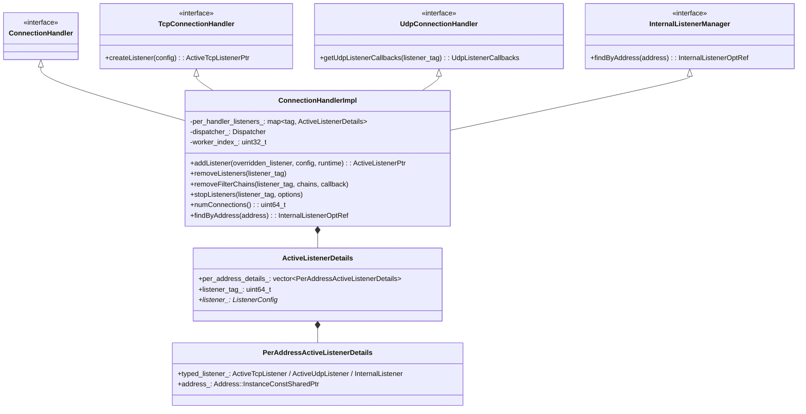
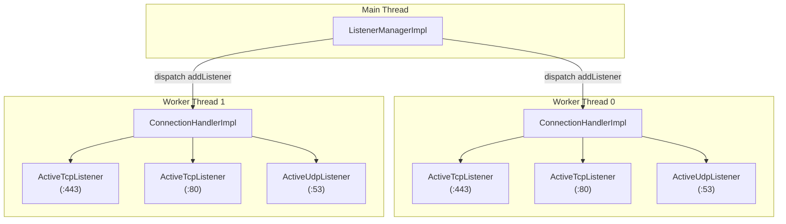
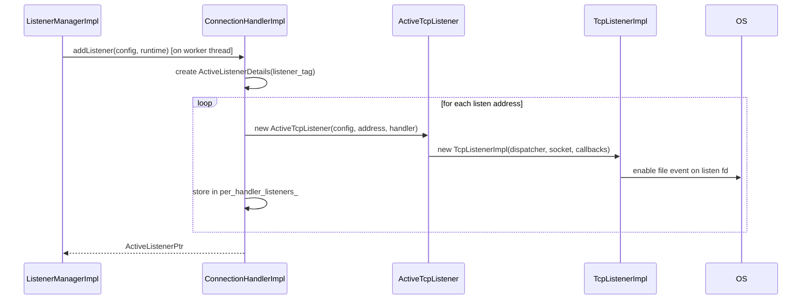
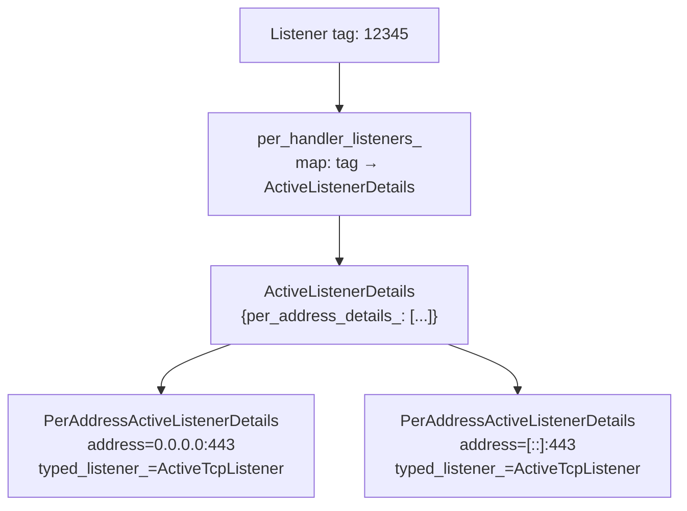
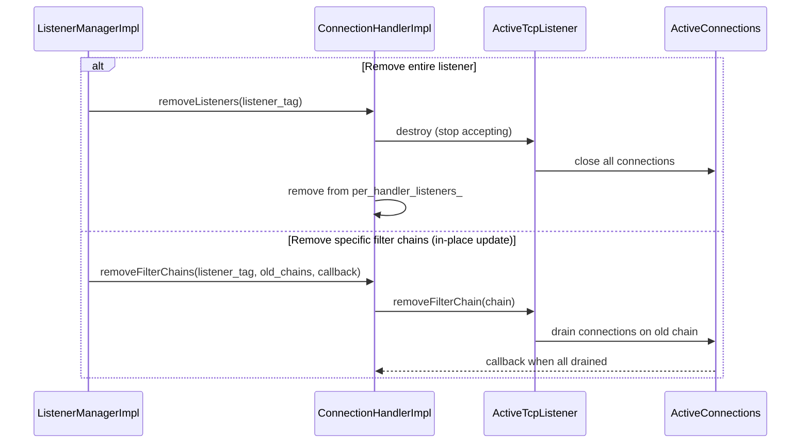
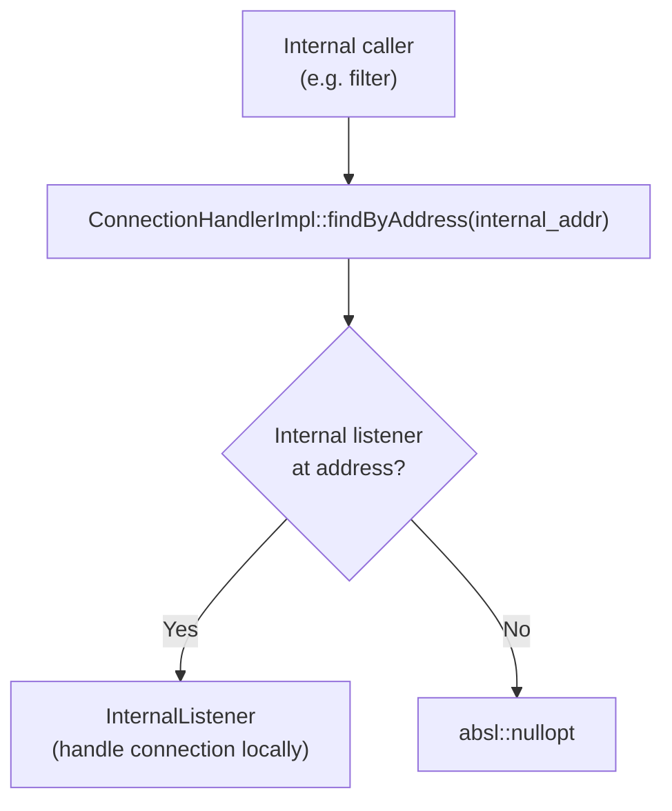

# ConnectionHandlerImpl

**Files:** `source/common/listener_manager/connection_handler_impl.h` / `.cc`  
**Size:** ~8 KB header, ~19 KB implementation  
**Namespace:** `Envoy::Server`

## Overview

`ConnectionHandlerImpl` is the **per-worker thread** connection handler. Each worker thread has one `ConnectionHandlerImpl` that owns all the active listeners and connections for that thread. It creates TCP/UDP listeners, manages listener lifecycle, and dispatches connection operations.

### What Problem It Solves

Envoy is a multi-threaded proxy. The main thread manages configuration — it receives xDS updates and maintains the canonical listener list. But TCP connections cannot be efficiently shared across threads: each connection's entire I/O path must live on a single thread to avoid locking.

`ConnectionHandlerImpl` solves this by being the **per-thread shadow** of `ListenerManagerImpl`. For every listener that the main thread creates, each worker thread gets its own `ConnectionHandlerImpl` instance that holds a `ActiveTcpListener` for that listener. The `ActiveTcpListener` in turn owns a `TcpListenerImpl` which is registered with the worker's `epoll`/`kqueue` event loop. All connection I/O for that worker flows through its `ConnectionHandlerImpl`.

Think of it as a load balancer: the OS distributes incoming connections across worker sockets (via `SO_REUSEPORT` or a single shared socket with round-robin), and each worker's `ConnectionHandlerImpl` independently processes its share.

### Why Per-Worker, Not Shared?

If all workers shared a single connection handler, every connection accept and connection state change would require a lock. At high throughput (tens of thousands of connections/second), lock contention becomes the bottleneck. The per-worker model eliminates locks entirely for the common path — each worker is the sole owner of its connections.

The only cross-thread communication is the initial `addListener` dispatch from the main thread, and the `post()` call for connection rebalancing — both use the dispatcher's lock-free task queue.

## Class Hierarchy

## Worker Thread Architecture

### The `ActiveListenerDetails` Structure

Each listener in `ConnectionHandlerImpl` is stored as an `ActiveListenerDetails` — a container that holds one `PerAddressActiveListenerDetails` entry per listen address. A listener with a single address (the common case) has one entry. A listener with `additional_addresses` (multi-address bind, e.g. dual-stack IPv4+IPv6) has multiple entries, each with its own `ActiveTcpListener` and socket.

The outer map key is the listener's `listener_tag` (a unique 64-bit integer assigned at creation). This allows O(1) lookup by tag for update/remove operations dispatched from the main thread.

## `addListener` Flow

### What Happens During `addListener`

When the main thread wants to activate a new listener on the workers, it posts a task to each worker's dispatcher. That task calls `ConnectionHandlerImpl::addListener()` on the worker thread. The handler:

1. Creates an `ActiveListenerDetails` container keyed by the listener's tag
2. For each listen address in the config, creates a typed listener:
   - **TCP stream** → `ActiveTcpListener` (wraps `TcpListenerImpl`)
   - **UDP/QUIC** → `ActiveRawUdpListener` or `ActiveQuicListener`
   - **Internal** → `InternalListener` (for intra-Envoy communication)
3. Each typed listener calls back into `ConnectionHandlerImpl::createListener()` which creates the OS-level `TcpListenerImpl` and registers the socket fd with the event loop
4. Stores everything in `per_handler_listeners_` keyed by tag

From this point on, the worker's event loop will wake up whenever a new connection arrives on any registered fd and invoke the `ActiveTcpListener` callbacks.

## Listener Lookup

### How Listener Lookup Works at Runtime

Because `per_handler_listeners_` is a flat hash map from tag to details, finding a listener for update or removal is an O(1) operation. Tags are assigned once at listener creation by `ListenerManagerImpl::nextListenerTag()` and never change — so the same tag can be used to find the listener on all workers, even though each worker holds a separate `ConnectionHandlerImpl` instance.

The `PerAddressActiveListenerDetails` also indexes listeners by socket address so that UDP callbacks from the OS can route to the correct listener by address.

## Remove Listeners / Filter Chains

### Removing Listeners vs. Draining Filter Chains

There are two flavors of removal and they are very different in impact:

- **Full listener removal** (`removeListeners`): The entire `ActiveTcpListener` is destroyed. The listen socket fd is closed, no new connections are accepted, and all existing connections are closed immediately (or after a drain period). This happens when a listener is fully deleted via LDS.

- **Filter chain removal** (`removeFilterChains`): Only specific filter chains inside an existing listener are drained. The listen socket stays open and continues accepting new connections (which go to the remaining/updated filter chains). Existing connections on the old chains are drained gracefully. This is the **in-place update** optimization — when only filter chains change, there is zero downtime.

The in-place update path is significantly cheaper because it avoids the OS socket close/reopen cycle and the associated TIME_WAIT accumulation on the port.

## Internal Listener Support

For Envoy internal communication (e.g., between filters or internal redirect), `ConnectionHandlerImpl` supports internal listeners:

### Internal Listener: Intra-Process Communication

Internal listeners are a special type that allows one Envoy filter to open a new connection to another listener within the same Envoy process — without going through the OS network stack. This is used for features like:

- **Tunneling filters**: A TCP proxy filter tunnels a connection through an HTTP CONNECT upgrade to an upstream, and the response side of that tunnel is internally connected back to another listener
- **Internal redirect**: A request is internally forwarded to a different route handler

`ConnectionHandlerImpl::findByAddress()` performs the lookup: given an `EnvoyInternalAddress`, it returns the `InternalListener` registered for that address. The internal listener processes the connection directly without OS socket overhead.

## Stats

Key stats maintained per worker:

| Stat | What it tracks |
|------|---------------|
| `downstream_cx_total` | Total connections accepted |
| `downstream_cx_active` | Currently active connections |
| `downstream_cx_destroy` | Connections destroyed |
| `no_filter_chain_match` | Connections with no matching filter chain |
