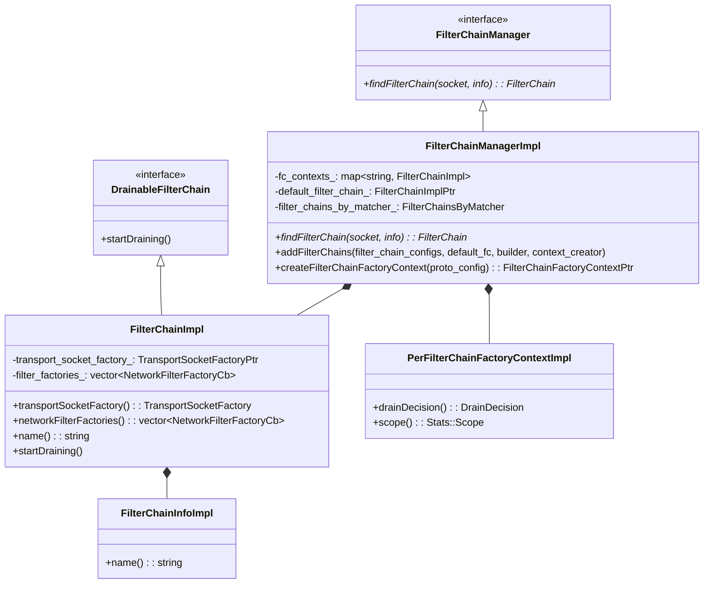
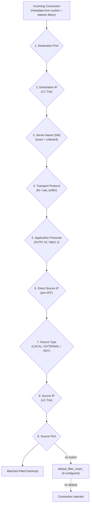
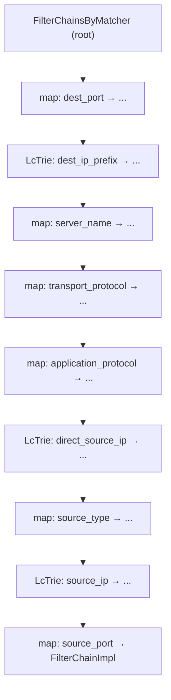
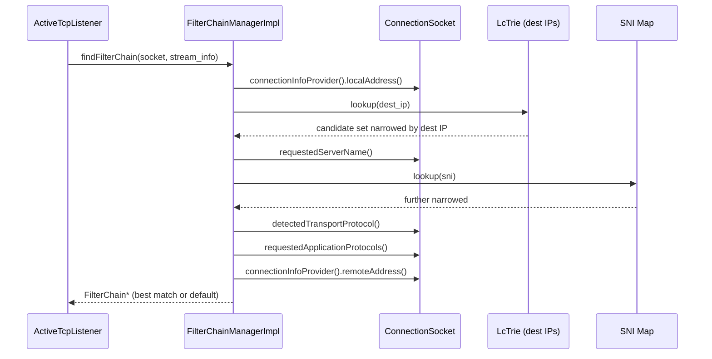
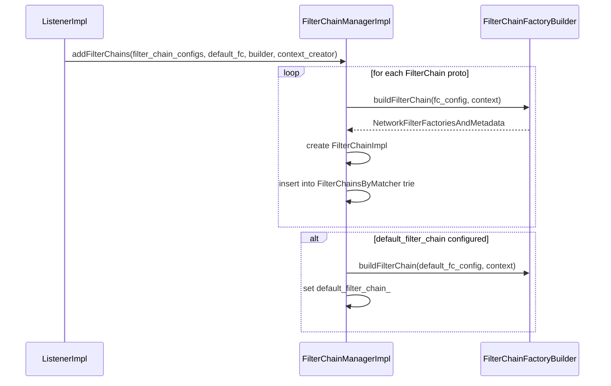
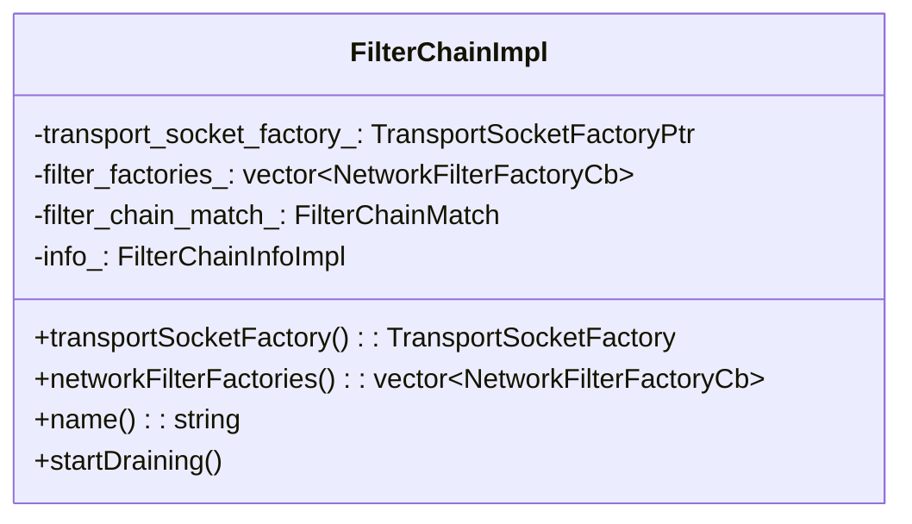
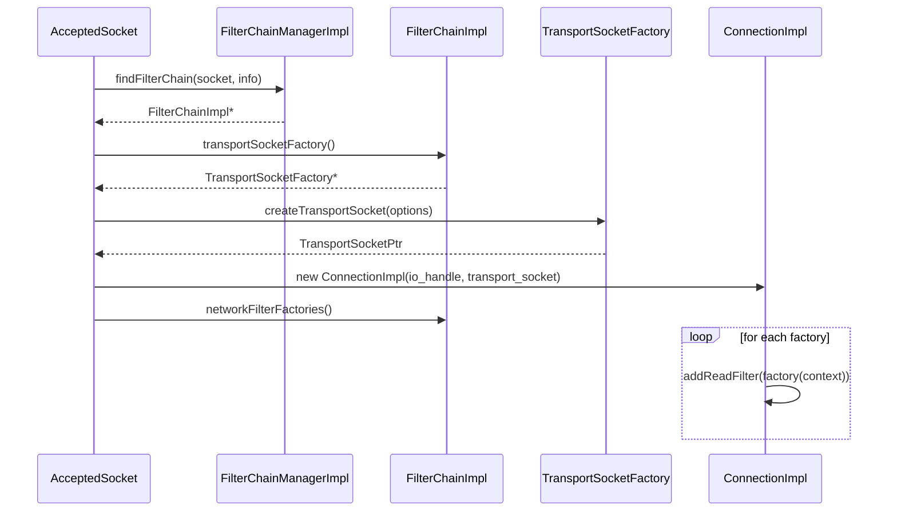
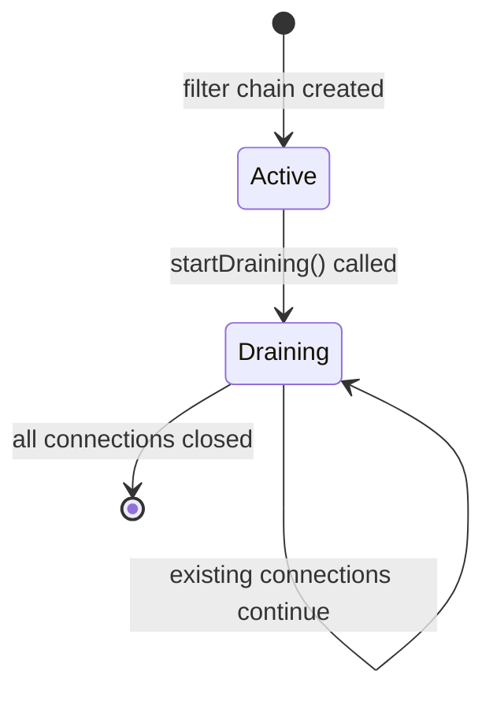

# FilterChainManagerImpl

**Files:** `source/common/listener_manager/filter_chain_manager_impl.h` / `.cc`  
**Size:** ~19 KB header, ~39 KB implementation  
**Namespace:** `Envoy::Server`

## Overview

`FilterChainManagerImpl` selects the correct filter chain for an incoming connection based on the connection's metadata (destination IP, SNI, ALPN, source IP/port). It uses a nested trie structure for fast O(1) matching across multiple criteria. It also manages filter chain lifecycle, draining, and factory context creation.

### What Problem It Solves

A single Envoy listener can serve traffic for many different services: an HTTPS API on `api.example.com`, a health check endpoint on plaintext, an admin interface with mTLS, and a catch-all for unknown hostnames. Each of these requires completely different network filter stacks — different TLS configurations, different codec settings, different routing rules.

`FilterChainManagerImpl` answers the question: **given this accepted TCP connection, which filter chain should handle it?** It does this by inspecting metadata that listener filters have already extracted — primarily the TLS SNI hostname and ALPN protocol list — and matching against the configured `filter_chain_match` criteria.

### When Matching Happens

Matching happens **after** listener filters run but **before** any network filters run. The sequence is:

1. TCP connection accepted → `ActiveTcpSocket` created
2. Listener filters run (TLS Inspector peeks at the ClientHello, extracts SNI and ALPN)
3. Listener filters complete → `ActiveTcpSocket::newConnection()` called
4. `FilterChainManagerImpl::findFilterChain()` called with the socket's accumulated metadata
5. Matched `FilterChainImpl` returned → network filter chain instantiated

This is why `FilterChainManagerImpl` needs to be fast — it's on the critical path for every connection accepted by the listener.

### The LC-Trie for IP Prefix Matching

For IP prefix matching (destination IP and source IP), `FilterChainManagerImpl` uses an LC-Trie (Level-Compressed Trie). An LC-trie is a compact prefix tree that achieves O(1) average-case lookups for CIDR prefix sets. At config build time, all prefix ranges from all filter chains are compiled into the trie. At runtime, a single trie lookup finds all candidate filter chains that match the incoming IP.

## Class Hierarchy



## Filter Chain Selection — Matching Criteria

The nine match criteria are evaluated in a fixed priority order. More specific criteria take precedence over less specific ones. If a filter chain specifies a destination port but no SNI, it matches on port and ignores SNI. If two filter chains both match all criteria, the one with more criteria specified wins (it is more specific).

A key design principle is **specificity wins**. If you have one filter chain matching `*.example.com` and another matching `api.example.com`, a connection with SNI `api.example.com` always goes to the second chain, even though both technically match. The matching algorithm is designed to find the most specific match, not just the first match.

Matching criteria are evaluated in a strict priority order. The first matching filter chain wins:



## Internal Matching Structure — `FilterChainsByMatcher`

The nested structure can be thought of as a decision tree that progressively narrows the candidate filter chains. At each level, only filter chains that match the current criterion (or have no constraint on it) are considered at the next level. This means that at the deepest level (source port), you often have only one or zero candidates — making the final selection trivially fast.

The structure is built once at config time (`addFilterChains`) and is read-only at runtime (`findFilterChain`). Since it is never modified during connection processing, no locking is needed on the matching path.

The matching is implemented as a nested map/trie structure, with each level narrowing the candidate set:



## `findFilterChain` Flow



### Why SNI Is Special

SNI (Server Name Indication) is the most commonly used filter chain match criterion in production Envoy deployments. Almost every TLS-terminating Envoy uses SNI to route connections to different backends for different hostnames — all on port 443.

SNI is available only after the TLS Inspector listener filter peeks at the ClientHello — the first bytes a TLS client sends. This is why listener filters run before filter chain matching. The TLS Inspector must extract the SNI hostname and set it on the socket (`setRequestedServerName()`) before `findFilterChain()` can use it.

If the TLS Inspector is not configured, or the client does not send SNI, the SNI field in the socket metadata is empty. The matching algorithm treats an empty SNI as matching filter chains with no `server_names` constraint.

## SNI Matching — Exact and Wildcard

```mermaid
flowchart TD
    SNI["Requested SNI:<br/>api.example.com"] --> B{Exact match in map?}
    B -->|Yes| Found["Matched: api.example.com"]
    B -->|No| C{Wildcard match?<br/>*.example.com}
    C -->|Yes| WFound["Matched: *.example.com"]
    C -->|No| D{Empty SNI match?<br/>(catch-all)"}
    D -->|Yes| CatchAll["Matched: catch-all chain"]
    D -->|No| NoMatch["No SNI match at this level"]
```

### SNI Wildcard Matching Logic

The SNI matching supports both exact matches and wildcard prefix matches. The algorithm tries matches in this order:
1. Exact match: `api.example.com` matches only `api.example.com`
2. Wildcard prefix: `api.example.com` matches `*.example.com`
3. Longer wildcards first: `api.example.com` preferentially matches `*.api.example.com` before `*.example.com`
4. Empty string catch-all: matches filter chains with no server name constraint

This ordering ensures that more specific patterns are always preferred over broader ones, which is the expected routing behavior.

## `addFilterChains` — Building the Trie



### Building the Trie at Config Time

`addFilterChains()` is called once during `ListenerImpl` construction. For each `FilterChainProto` in the config:

1. The proto's match criteria are extracted and normalized (e.g., port 0 means "any port")
2. A `FilterChainImpl` is constructed with the transport socket factory and filter factory callbacks
3. The `FilterChainImpl` is inserted into the nested trie at the appropriate position for each combination of its match criteria

A single filter chain proto can expand into multiple trie entries. For example, a filter chain with `server_names: ["api.example.com", "admin.example.com"]` creates two entries — one for each hostname — both pointing to the same `FilterChainImpl`. This way the matching lookup never needs to iterate over lists.

## `FilterChainImpl` — Per Filter Chain



What it holds per filter chain:

| Field | Purpose |
|-------|---------|
| `transport_socket_factory_` | Creates the TransportSocket (TLS or raw) for this chain |
| `filter_factories_` | Ordered list of network filter factory callbacks |
| `filter_chain_match_` | The matching criteria proto |
| `info_` | Metadata (name, filter chain info) |

## Connection to Filter Chain — Runtime



### What `FilterChainImpl` Actually Contains

Each `FilterChainImpl` is the factory for connections that matched its criteria. It holds:

- **`transport_socket_factory_`**: Creates the transport socket for each new connection. For TLS filter chains this is `DownstreamSslSocketFactory`, which creates `SslSocket` instances using BoringSSL. For plaintext it is `RawBufferSocketFactory`. The transport socket handles encryption/decryption transparently so network filters above it never deal with TLS directly.

- **`filter_factories_`**: An ordered vector of `NetworkFilterFactoryCb` function objects. Each callback, when invoked with a `FilterFactoryCallback&`, creates one network filter instance and adds it to the connection. Typical entries: HTTP connection manager factory, TCP proxy factory, rate limit filter factory.

These factory callbacks are closures that captured the filter's config at construction time. When a new connection arrives, calling the factories is fast — just function pointer invocations that instantiate pre-configured filter objects.

## Drain Flow

When a filter chain is replaced, the old `FilterChainImpl` is drained:



### Filter Chain Draining: Why Not Just Delete?

When a filter chain is updated, the old `FilterChainImpl` cannot be immediately freed because active connections still hold references to it (they need its transport socket and filter factories for the duration of their lifetime). The drain mechanism handles this.

`FilterChainImpl::startDraining()` marks the chain so no new connections will be created on it. The `ActiveConnections` container (owned by `ActiveTcpListener`) continues holding `ActiveTcpConnection` objects for existing connections on this chain. As those connections close naturally (via `RemoteClose` or `LocalClose`), they are removed. When the last connection closes, the `ActiveConnections` container is empty and the `FilterChainImpl` can be deleted.

A drain timer prevents unbounded waiting: if connections stay open longer than the drain timeout (default 600s), they are forcibly closed.

## Match Criteria Reference

| Priority | Match Field | Proto Field | Example Value |
|----------|-------------|-------------|--------------|
| 1 | Destination port | `destination_port` | `443` |
| 2 | Destination IP prefix | `prefix_ranges` | `10.0.0.0/8` |
| 3 | Server name (SNI) | `server_names` | `api.example.com`, `*.example.com` |
| 4 | Transport protocol | `transport_protocol` | `tls`, `raw_buffer` |
| 5 | Application protocols | `application_protocols` | `h2`, `http/1.1` |
| 6 | Direct source IP | `direct_source_prefix_ranges` | `172.16.0.0/12` |
| 7 | Source type | `source_type` | `LOCAL`, `EXTERNAL`, `ANY` |
| 8 | Source IP | `source_prefix_ranges` | `192.168.0.0/16` |
| 9 | Source port | `source_ports` | `5000` |
