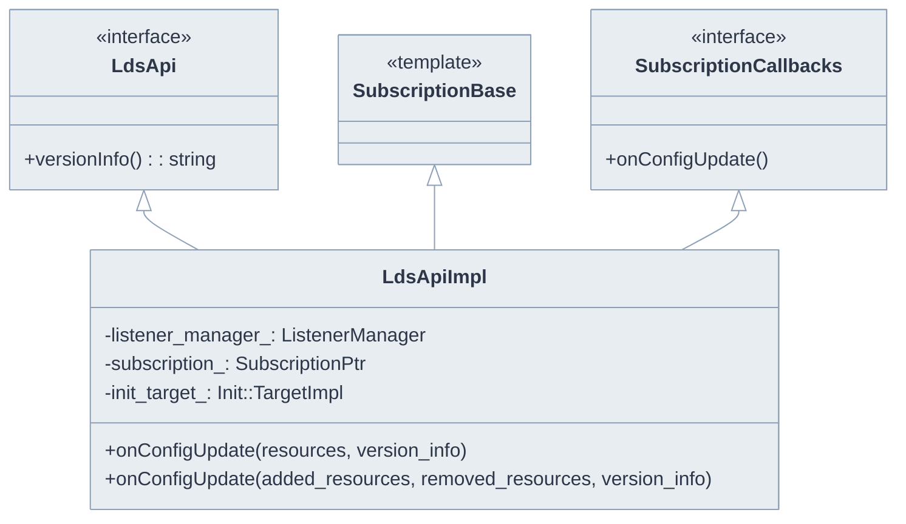
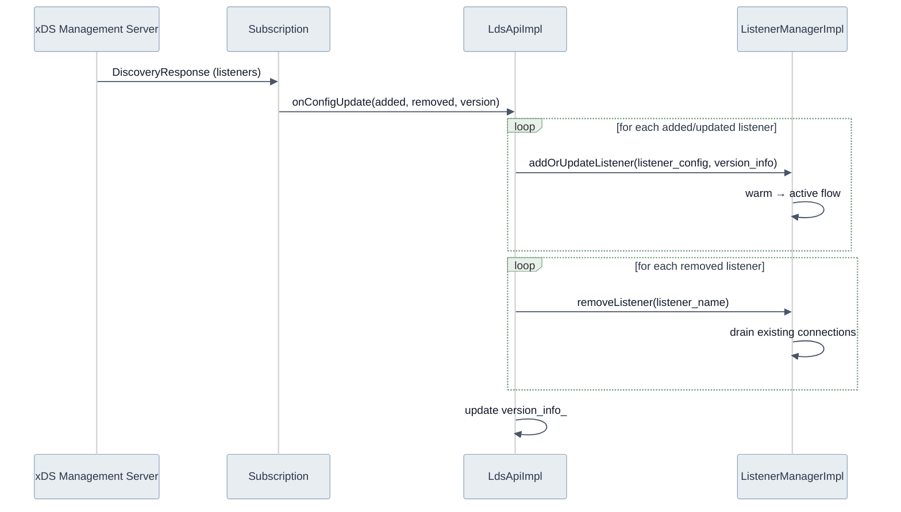
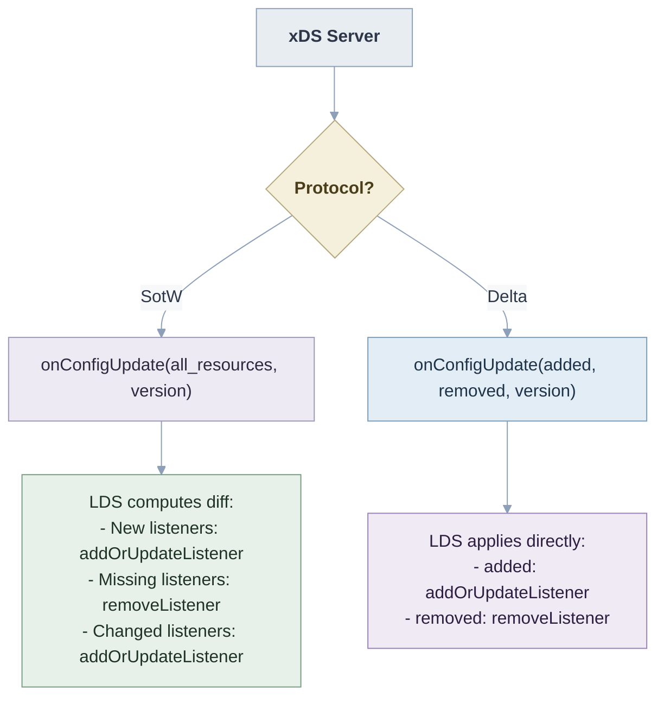
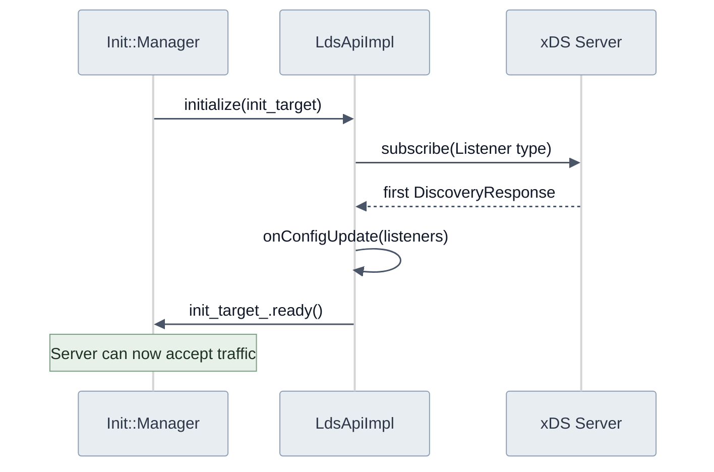
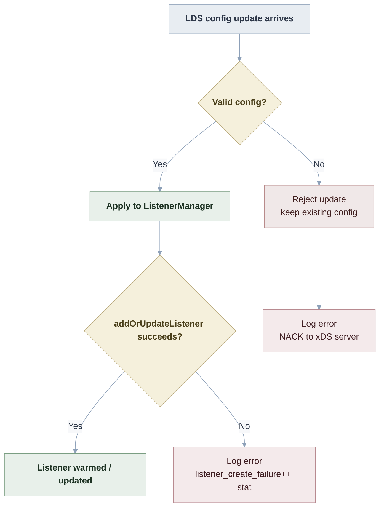

# LdsApiImpl

**Files:** `source/common/listener_manager/lds_api.h` / `.cc`  
**Size:** ~2 KB header, ~6.7 KB implementation  
**Namespace:** `Envoy::Server`

## Overview

`LdsApiImpl` implements the Listener Discovery Service (LDS) API. It subscribes to listener configuration from an xDS management server (or filesystem) and drives `ListenerManagerImpl::addOrUpdateListener()` and `removeListener()` on config changes.

### What Problem It Solves

Without LDS, Envoy's listeners would be static — defined at startup from a YAML file and unchangeable at runtime. LDS makes listeners dynamic: a control plane (like Istio's istiod, or a custom xDS server) can push new listener configurations at any time. Envoy picks them up, validates them, and starts accepting traffic on the new configuration — without restarting.

This is the mechanism behind Istio's ability to push updated routing rules and mTLS policies to sidecars. When a `VirtualService` or `PeerAuthentication` changes in Kubernetes, istiod translates that into an `envoy::config::listener::v3::Listener` proto and streams it to the affected Envoy instances via LDS.

### The Role in the Overall System

`LdsApiImpl` is a thin bridge between the generic xDS subscription infrastructure and the listener-specific logic in `ListenerManagerImpl`. It:

1. Registers itself as a subscriber for the `Listener` xDS resource type
2. Receives decoded `Listener` protos when the xDS server sends them
3. Translates xDS lifecycle events (add / update / remove) into calls on `ListenerManager`
4. Signals the initialization system when the first response has been processed

It does **not** parse or validate the proto itself — that's `ListenerImpl`'s job. It does **not** manage sockets or connections — that's `ListenerManagerImpl`. `LdsApiImpl` is purely a delivery mechanism.

## Class Hierarchy



## LDS Config Update Flow



## How `onConfigUpdate` Works in Detail

When the xDS subscription delivers a response, `LdsApiImpl::onConfigUpdate()` is called with a list of added/updated resources and a list of removed resource names. The method processes removals first, then additions — this ordering matters because it allows a new listener to take over an address that a deleted listener was using, all in a single atomic update.

For each added resource, the proto is cast to the typed `Listener` message and forwarded to `listener_manager_.addOrUpdateListener()`. If that call fails (e.g., the listener config is invalid), the error is collected but processing continues for other listeners. After all listeners are processed, any accumulated errors cause the LDS update to be NACKed back to the xDS server — the server will then retry.

The RDS and SDS xDS streams are **paused** during an LDS update. This is critical: if an updated listener references a new route configuration (RDS), Envoy must not accept traffic on the new listener until that route config is also ready. Pausing RDS/SDS prevents partial states from being observed.

```cpp
// lds_api.cc — pauses RDS and SDS before applying LDS changes
Config::ScopedResume resume_rds_sds = xds_manager_.pause({
    Config::getTypeUrl<envoy::config::route::v3::RouteConfiguration>(),
    Config::getTypeUrl<envoy::config::route::v3::ScopedRouteConfiguration>(),
    Config::getTypeUrl<envoy::extensions::transport_sockets::tls::v3::Secret>()
});
```

## SotW vs Delta xDS

LDS supports both State-of-the-World (SotW) and Delta xDS protocols:



## SotW vs Delta: Two Protocol Modes

The **State-of-the-World (SotW)** protocol sends the full set of resources every time. If a management server sends 10 listeners, Envoy receives all 10 and computes the diff itself — any listener not in the response is considered deleted. This is simpler to implement on the server side but can be wasteful when only one listener changes.

The **Delta xDS** protocol only sends what changed. The server explicitly lists added/updated resources and removed resource names. This is more efficient at scale (thousands of listeners) but requires the server to track per-client state.

`LdsApiImpl` handles both transparently through the `SubscriptionBase<Listener>` template — the underlying subscription machinery calls the correct `onConfigUpdate()` overload.

## Init Target Integration

LDS is an initialization target. Envoy waits for the first LDS response before marking the server as ready:



### Why Init Target Matters

Envoy uses an `Init::Manager` to coordinate startup. Many subsystems are init targets — they must complete their first xDS fetch before Envoy is allowed to declare itself ready and start the health check `LIVE` endpoint. LDS is one of these targets.

If a management server is unavailable at startup, Envoy waits (up to `initial_fetch_timeout`) before proceeding. Once the first LDS response arrives and listeners are created successfully, `init_target_.ready()` is called and the server can start accepting traffic. This prevents a situation where Envoy starts routing before it knows its listener configuration.

## Error Handling



### Error Handling Strategy

Errors in LDS are handled conservatively: **keep what works, reject what doesn't**. If one listener in a batch fails to parse or validate, the others that succeeded are still applied. The failing listener's error is recorded in `UpdateFailureState` and sent back to the xDS server as a NACK for that specific resource.

The `listener_manager.lds.update_rejected` stat is incremented when a full update is rejected. The existing listener configuration continues serving traffic — invalid configs never replace valid ones.

## Subscription Configuration

| Config Field | Purpose |
|-------------|---------|
| `lds_config.api_config_source` | gRPC or REST xDS server address |
| `lds_config.path` | Filesystem path for static LDS config |
| `lds_config.resource_api_version` | V3 API version |
| `lds_config.initial_fetch_timeout` | Max time to wait for first LDS response |
