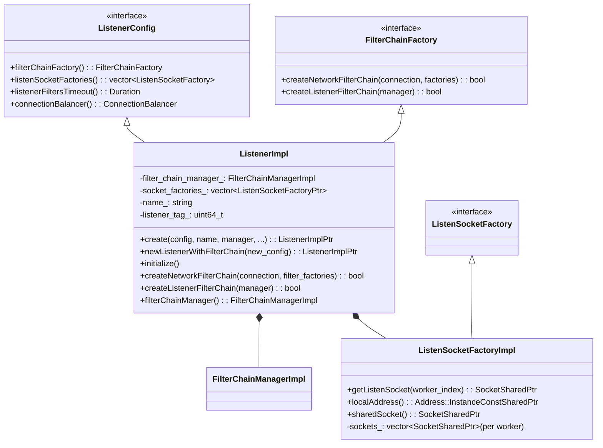
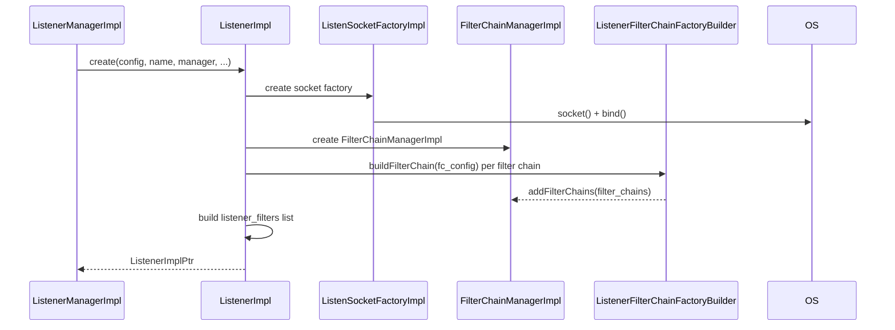
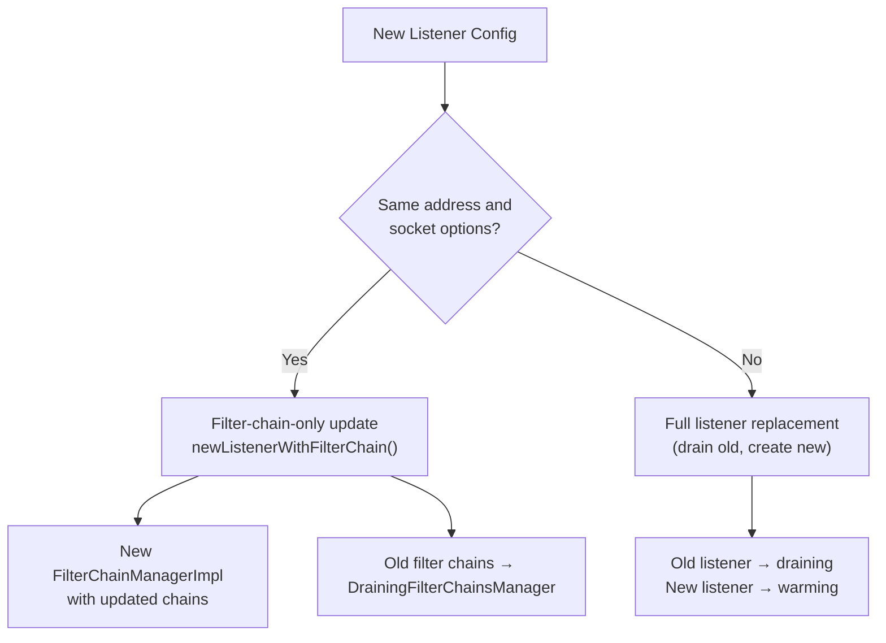
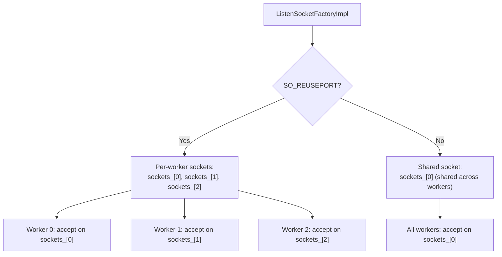
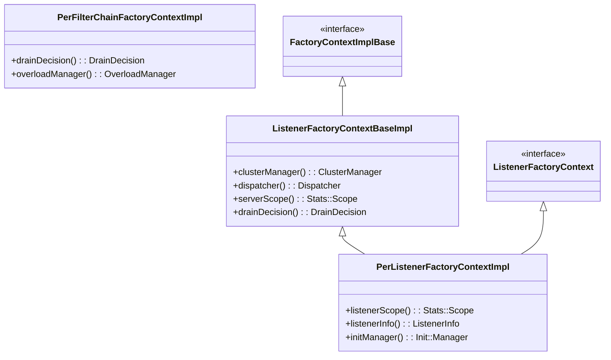
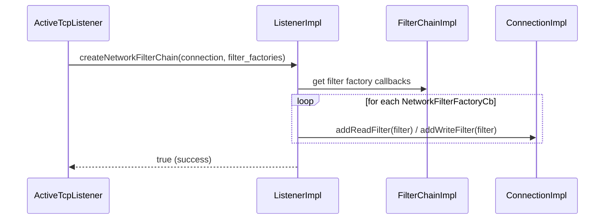
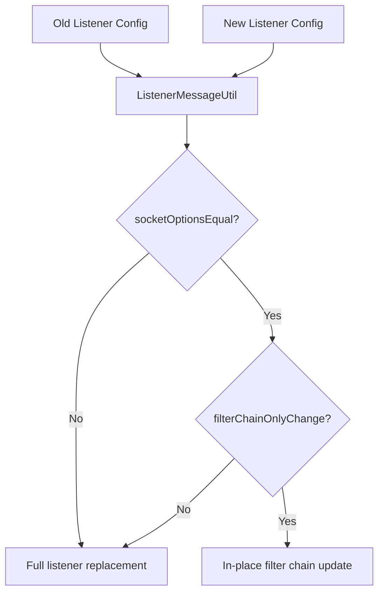

# ListenerImpl

**Files:** `source/common/listener_manager/listener_impl.h` / `.cc`  
**Size:** ~24 KB header, ~66 KB implementation  
**Namespace:** `Envoy::Server`

## Overview

`ListenerImpl` maps a protobuf `Listener` configuration to a runtime listener object. It owns the `FilterChainManagerImpl`, the `ListenSocketFactory`, and all the factory contexts needed to construct filter chains. It implements both `Network::ListenerConfig` (to configure the listener at the network level) and `Network::FilterChainFactory` (to construct filter chains for accepted connections).

### What Problem It Solves

There is a fundamental mismatch between the world of protobuf (a serialized, language-neutral wire format) and the world of C++ objects (live memory, function pointers, polymorphic types). `ListenerImpl` is the translator between these two worlds for the listener layer.

When a `Listener` proto arrives from LDS or bootstrap config, `ListenerImpl::create()` validates it, allocates all necessary resources (sockets, factory contexts, filter chain matchers), and produces a C++ object that workers can query at runtime without ever touching a proto again.

### The Two Roles `ListenerImpl` Plays

`ListenerImpl` implements two distinct interfaces:

**As `Network::ListenerConfig`**: It answers questions about the listener's properties at socket and connection level — what address to bind to, whether to use `SO_REUSEPORT`, what the per-connection buffer limits are, how long to wait for listener filters, what the connection balancer is. Workers query this interface when setting up `TcpListenerImpl` and when creating new connections.

**As `Network::FilterChainFactory`**: It knows how to instantiate a complete filter chain (both listener filters and network filters) for a new connection. `createListenerFilterChain()` is called once per accepted socket to set up the pre-connection filters (TLS inspector, proxy protocol, etc.). `createNetworkFilterChain()` is called after filter chain matching to attach the matched network filters to the `ConnectionImpl`.

### Why Not Just Use the Proto Directly?

Protos are not efficient for high-throughput per-connection use. They involve reflection, heap allocations for optional fields, and no type safety for `Any`-typed extensions. By translating once at config time into C++ factory callbacks (`NetworkFilterFactoryCb`, `ListenerFilterFactoryCb`), the hot path — accepting a connection and creating its filter chain — has zero proto overhead. It just calls pre-built factory lambdas.

## Class Hierarchy

## Listener Creation Flow

### The Static Factory Pattern (`ListenerImpl::create`)

`ListenerImpl` uses a static factory method instead of a public constructor. This is because construction can fail — socket binding might fail, a filter chain might have an invalid type URL, a listener filter might not be registered — and C++ constructors cannot return errors.

The pattern used is:
1. Call `new ListenerImpl(config, ..., creation_status)` via private constructor
2. The constructor sets `creation_status` on any error and returns early
3. The factory checks `RETURN_IF_NOT_OK(creation_status)` and returns the error
4. On success, wrap the raw pointer in a `unique_ptr` and return it as `absl::StatusOr<unique_ptr<ListenerImpl>>`

This allows the caller to handle errors without exceptions and without resource leaks.

## In-Place Filter Chain Update

When only filter chains change (address and socket options are identical), the listener avoids rebinding:

### In-Place Filter Chain Update: Zero Downtime Config Changes

When a new `Listener` config arrives that changes only filter chains (not the bind address, socket options, or listener filters), Envoy performs an **in-place update**: the listen socket stays open and the old filter chains are replaced with new ones without interrupting existing connections.

`ListenerMessageUtil::filterChainOnlyChange()` determines whether an update qualifies. It serializes both the old and new configs to bytes, clears the filter chain fields from both copies, and compares the remainder. If they are identical, the update is in-place.

`newListenerWithFilterChain()` creates a new `ListenerImpl` that shares the same `ListenSocketFactory` (same OS sockets) but has a brand-new `FilterChainManagerImpl` built from the updated filter chain configs. The old filter chains are handed to a `DrainingFilterChainsManager` that lets existing connections on those chains complete naturally.

This optimization is crucial in practice. In a Kubernetes cluster where TLS certificates rotate frequently (every 24 hours), every cert rotation would otherwise cause a brief listener restart. With in-place updates, cert rotation is invisible to active connections.

## `ListenSocketFactoryImpl` — Per-Worker Sockets

With `SO_REUSEPORT`, each worker thread gets its own listen socket. Without it, all workers share a single socket:

### `SO_REUSEPORT`: Why Each Worker Gets Its Own Socket

With `SO_REUSEPORT` (Linux 3.9+), multiple sockets can bind to the same address:port. The kernel load-balances incoming connections across the sockets using a hash of the 4-tuple (src IP, src port, dst IP, dst port). This means each worker has its own socket in the kernel's accept queue, eliminating the thundering-herd problem where all workers race to accept from a single socket.

Without `SO_REUSEPORT`, all workers share `sockets_[0]`. Workers compete for the single socket via `accept()`, which is fine for low connection rates but becomes a bottleneck at high rates. With `SO_REUSEPORT`, each worker independently accepts from its `sockets_[worker_index]` with no contention.

`ListenSocketFactoryImpl::getListenSocket(worker_index)` returns the appropriate socket — either the per-worker one or the shared one, transparently.

## Factory Contexts

### Factory Context Hierarchy: Why Three Levels?

Envoy's filter factory system requires a `FactoryContext` — an object that gives filters access to server-wide resources (cluster manager, dispatcher, stats). But different filters need different scopes:

- **Server-wide resources** (cluster manager, runtime, stats root) → `ListenerFactoryContextBaseImpl`
- **Per-listener resources** (listener stats scope `listener.foo.`, init manager, listener metadata) → `PerListenerFactoryContextImpl`
- **Per-filter-chain resources** (drain decision specific to this chain, per-chain stats scope) → `PerFilterChainFactoryContextImpl`

This three-level hierarchy means a filter like HCM that needs to know its listener's drain decision gets the right context, while a filter that just needs the cluster manager gets access to the server-wide one. Scoping stats correctly at each level (so `listener.foo.http.downstream_cx_total` tracks per-listener, not global) requires these separate contexts.

## `createNetworkFilterChain` — Per-Connection

Called for every new accepted connection to instantiate the network filter chain:

## `ListenerMessageUtil`

Static helper that compares listener configs to determine the type of update:

## Configuration Highlights

| Config Field | Purpose |
|-------------|---------|
| `listener_filters` | Pre-connection filters (TLS inspector, proxy protocol, original dst) |
| `listener_filters_timeout` | Max time to wait for listener filters before closing |
| `filter_chains` | List of filter chains with match criteria (SNI, ALPN, source IP, etc.) |
| `default_filter_chain` | Fallback when no `filter_chain_match` matches |
| `per_connection_buffer_limit_bytes` | Watermark buffer limit per connection |
| `connection_balance_config` | Connection balancing across workers |
| `enable_reuse_port` | Whether to use `SO_REUSEPORT` |
| `bind_to_port` | Whether to bind (false for API listeners) |
| `traffic_direction` | INBOUND / OUTBOUND / UNSPECIFIED |
