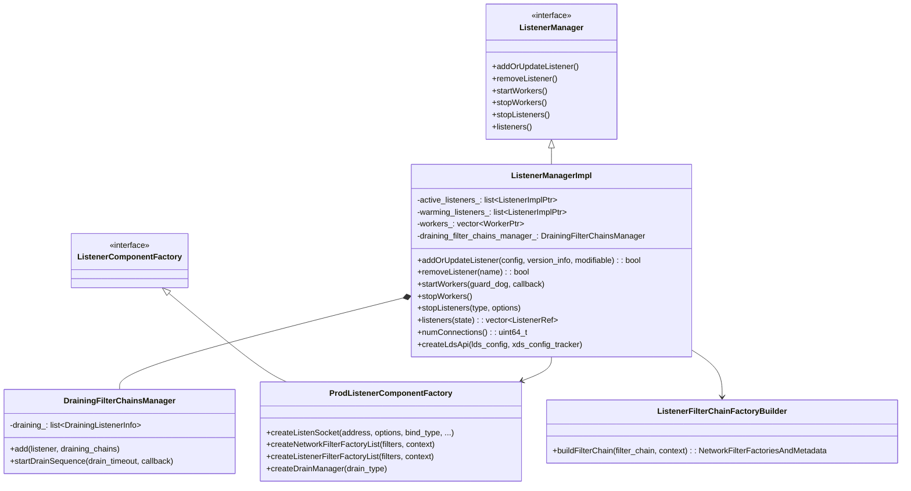
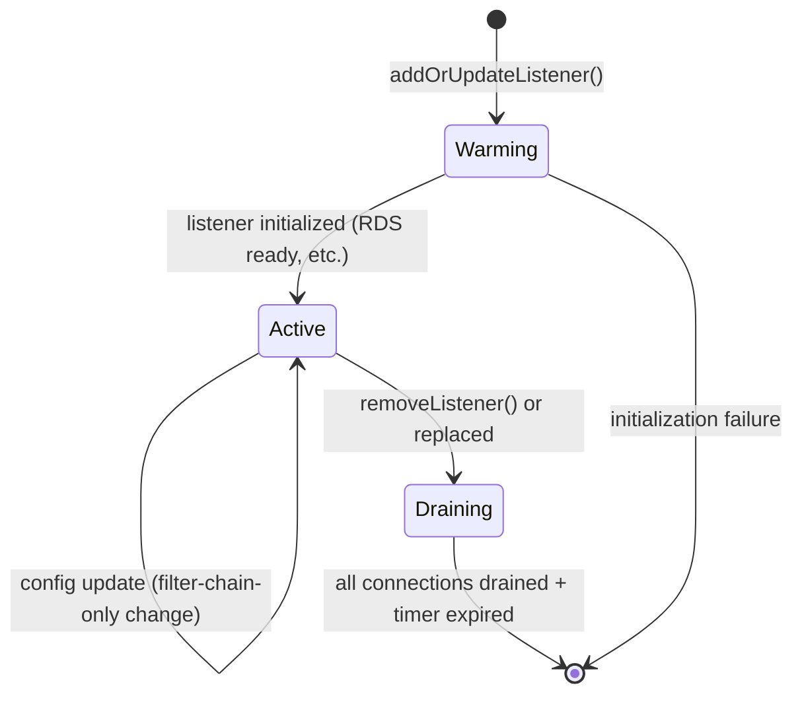
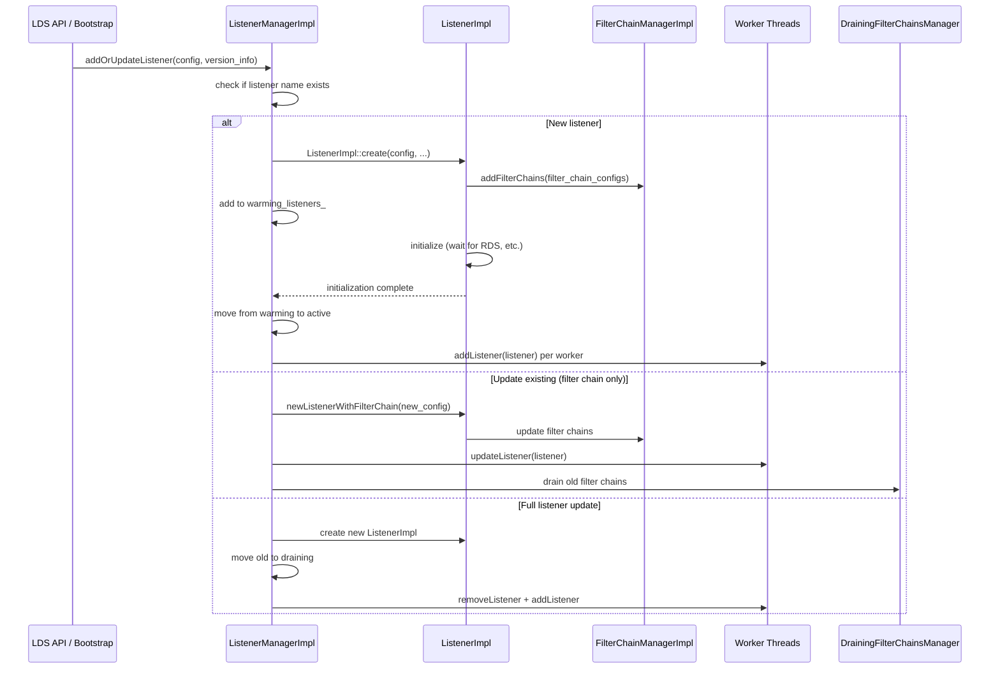
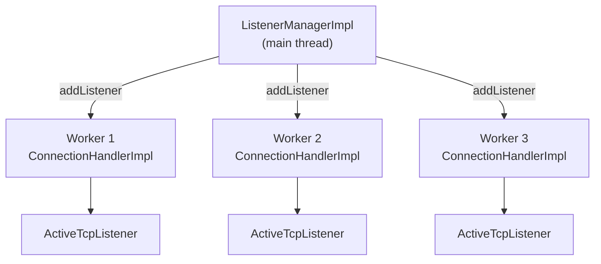
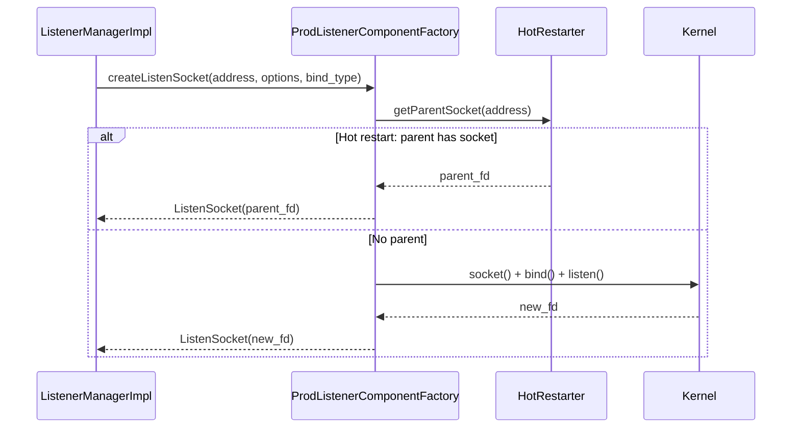
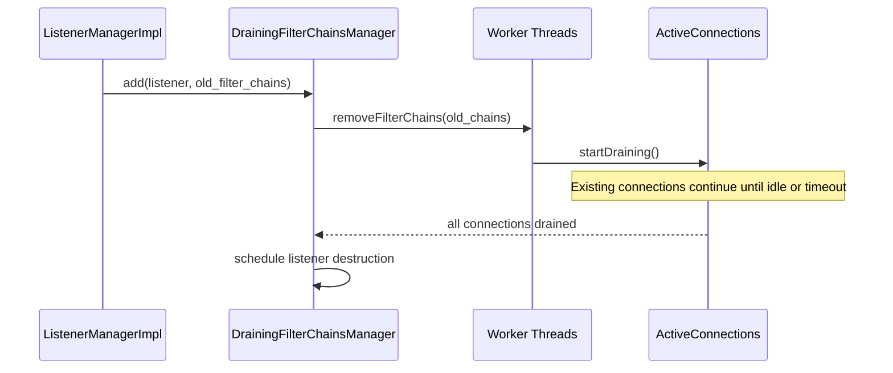
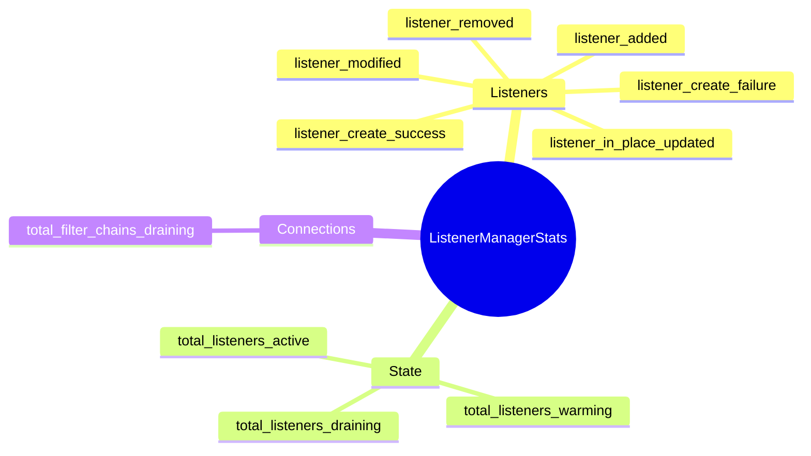

# ListenerManagerImpl

**Files:** `source/common/listener_manager/listener_manager_impl.h` / `.cc`  
**Size:** ~22 KB header, ~62 KB implementation  
**Namespace:** `Envoy::Server`

## Overview

`ListenerManagerImpl` is the top-level manager for all Envoy listeners. It runs on the **main thread** and coordinates:

- Adding, updating, and removing listeners (static and dynamic via LDS)
- Creating and sharing listen sockets (with hot-restart support)
- Dispatching listeners to worker threads
- Draining old listeners and filter chains on config changes
- Managing listener lifecycle (warming → active → draining)

### The Central Coordinator

Think of `ListenerManagerImpl` as the control plane for Envoy's listener layer. It is the single source of truth for what listeners should exist, what state each one is in, and how changes propagate to worker threads. Everything that touches a listener's lifecycle — from the first parse of a `Listener` proto to the final drain of its last connection — passes through `ListenerManagerImpl`.

It deliberately runs only on the main thread. There are no locks protecting its state because nothing else is allowed to touch it concurrently. Worker threads interact with listeners exclusively through their own `ConnectionHandlerImpl` instances, which receive dispatched updates from the main thread.

### The Three Listener Lists

At any point in time, listeners in `ListenerManagerImpl` are in one of three states:

- **`warming_listeners_`**: Listeners that have been created from proto but are not yet ready to serve traffic. A listener is "warming" while it waits for dependent xDS resources to be fetched — most commonly an RDS route configuration. During warming, the listener's `Init::Manager` tracks outstanding dependencies and signals completion when all are ready.

- **`active_listeners_`**: Listeners that are ready and accepting connections. These are the listeners that have been dispatched to all worker threads. This is the steady state.

- **`draining_listeners_`**: Listeners that have been replaced or removed but still have active connections. Envoy does not immediately kill connections — it waits for the drain timeout (configurable, default 600s) or until all connections close naturally.

A listener progresses forward through these states and never goes backward. If a warming listener fails initialization (e.g., RDS is unreachable), it is discarded without ever entering the active state.

## Class Hierarchy



## Listener Lifecycle



### How Updates Are Classified

When `addOrUpdateListener()` is called, it first checks whether a listener with that name already exists:

- **New listener**: Create `ListenerImpl`, enter warming, dispatch to workers after warming completes.
- **Existing listener, filter-chain-only change**: Call `newListenerWithFilterChain()` — shared sockets, new filter chain manager. No socket restart.
- **Existing listener, structural change**: Full replacement — old listener goes to draining, new listener enters warming.

The classification between "filter-chain-only" and "structural" is done by `ListenerMessageUtil::filterChainOnlyChange()`. This is a proto-level comparison: the two configs are serialized, their filter chain sections cleared, and the remainder compared byte-for-byte.

## Add/Update Listener Flow



### The Warming Phase in Detail

A listener enters the warming phase immediately after `ListenerImpl` is created. The `ListenerImpl` has its own `Init::ManagerImpl` that tracks unresolved dependencies. For each filter chain that references an RDS route configuration name, the `RdsRouteConfigProvider` registers an init target. The init manager blocks until all targets are ready.

Once the init manager completes, the listener's `local_init_target_` fires, which calls back into `ListenerManagerImpl::onListenerWarmed()`. Only then does the listener move from `warming_listeners_` to `active_listeners_` and get dispatched to workers.

This means that if you update a listener's TLS certificate but the new TLS SDS secret hasn't been fetched yet, the new listener waits in warming — the old listener continues serving traffic without interruption. Once the secret arrives, the new listener goes active and the old one starts draining.

## Worker Dispatch



### Worker Dispatch: How Listeners Reach Workers

When a listener moves from warming to active, `ListenerManagerImpl` dispatches it to every worker. For each worker, it posts a task to the worker's dispatcher queue. Workers pick up these tasks in their event loops.

The dispatch uses an `absl::BlockingCounter` initialized to the number of workers. Each worker, when it finishes adding the listener, decrements the counter. The main thread waits on the counter (via `workers_waiting_to_run.Wait()`) before considering the listener fully active. This ensures the listener is actually accepting connections on all workers before the main thread proceeds.

```cpp
// listener_manager_impl.cc
absl::BlockingCounter workers_waiting_to_run(workers_.size());
for (auto& worker : workers_) {
    worker->addListener(listener, [&workers_waiting_to_run]() {
        workers_waiting_to_run.DecrementCount();
    });
}
workers_waiting_to_run.Wait();
```

## `ProdListenerComponentFactory` — Socket and Factory Creation



### Hot Restart: Socket Inheritance

`ProdListenerComponentFactory::createListenSocket()` has special logic for Envoy's hot restart feature. When a new Envoy process starts while an old one is still running (hot restart), the old process passes its listen socket file descriptors to the new process via a Unix domain socket. The new process inherits these fds so there is no gap in listener availability.

`HotRestarter::getParentSocket(address)` checks if the parent process has a socket for the given address. If it does, the new process wraps that fd in a `ListenSocket` instead of calling `socket()` + `bind()`. This is why restarting Envoy under load shows no TCP connection resets — the same socket fd keeps accepting connections across the restart.

## `DrainingFilterChainsManager`

Manages the lifecycle of filter chains being replaced. When a listener update only changes filter chains, old filter chains are drained in-place without destroying the listener:



### `DrainingFilterChainsManager`: Graceful Filter Chain Removal

When a filter-chain-only update happens, the old filter chains can't be deleted immediately — existing connections are using them. The `DrainingFilterChainsManager` holds references to these old chains and orchestrates their graceful shutdown.

Each worker is told to remove the old filter chains from its `ActiveTcpListener`. The worker marks those chains as draining and stops creating new connections on them. Existing connections continue until they close. The worker calls a completion callback when all connections on the old chains have closed.

The manager collects completion callbacks from all workers. When the last worker reports complete, the old filter chains are finally destroyed. A safety timer (the drain timeout) ensures chains are eventually cleaned up even if connections never close.

## Stats



## Key Configuration Points

| Config | Effect |
|--------|--------|
| `listener.name` | Unique identifier for update/remove |
| `listener.address` | Bind address (IP:port, UDS, internal) |
| `listener.filter_chains` | List of filter chains with match criteria |
| `listener.listener_filters` | Pre-connection filters (TLS inspector, proxy protocol) |
| `listener.drain_type` | `DEFAULT` (graceful) or `MODIFY_ONLY` |
| `listener.per_connection_buffer_limit_bytes` | Watermark buffer limit per connection |
| `listener.enable_reuse_port` | `SO_REUSEPORT` for multi-worker accept |
