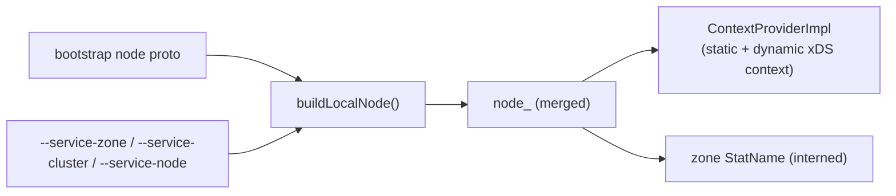

# Local Info — Overview

> Source: `source/common/local_info/local_info_impl.h`. Interface: `envoy/local_info/local_info.h`.

`LocalInfo` is Envoy's **identity of itself** — the answer to "who am I, and where am I running?"
It bundles the bootstrap `Node` proto with the few identity fields that can be overridden on the
command line, and is consumed almost everywhere: xDS (the `Node` sent on discovery requests),
stats (the local zone tag), tracing, logging, and health checking.

## What it holds

`LocalInfoImpl` is a small, immutable-ish value object constructed once at server startup:

| Accessor | Meaning |
|----------|---------|
| `node()` | The full `envoy.config.core.v3.Node` proto sent to management servers. |
| `address()` | This Envoy's local network address. |
| `zoneName()` / `zoneStatName()` | Locality zone (string + interned `StatName` for stats tags). |
| `clusterName()` | The service cluster this Envoy belongs to (`--service-cluster`). |
| `nodeName()` | This node's id (`--service-node`). |
| `contextProvider()` | The xDS context parameters provider (static + dynamic). |

## How it's built

The constructor merges three sources into the final `Node`, with CLI options taking precedence
over the bootstrap proto:

`buildLocalNode()` copies the bootstrap node, then overlays the zone (into `locality.zone`),
cluster, and node id whenever the corresponding CLI flag is non-empty. The zone name is also
interned into the stats symbol table so it can be cheaply used as a stat tag.

## Dynamic context

`LocalInfoImpl` registers a callback with its `ContextProvider` so that when **dynamic xDS
context parameters** change (per resource-type URL), they are copied back into the node's
`dynamic_parameters` map. This keeps the `Node` advertised to management servers up to date
without rebuilding it.

## Where it's used

- **xDS / config** — the `Node` is attached to every discovery request; context parameters
  drive resource matching.
- **Stats** — `zoneStatName()` tags per-zone metrics.
- **Upstream / load balancing** — zone-aware routing compares the local zone to endpoint
  localities.
- **Tracing & access logs** — node id / cluster appear in spans and log fields.

## Mental model

Construct it once from bootstrap + CLI, treat it as the read-only "self" reference, and pass
`const LocalInfo&` wherever a component needs to know this proxy's identity or locality. The
only moving part is the dynamic context, which is updated through the registered callback.
