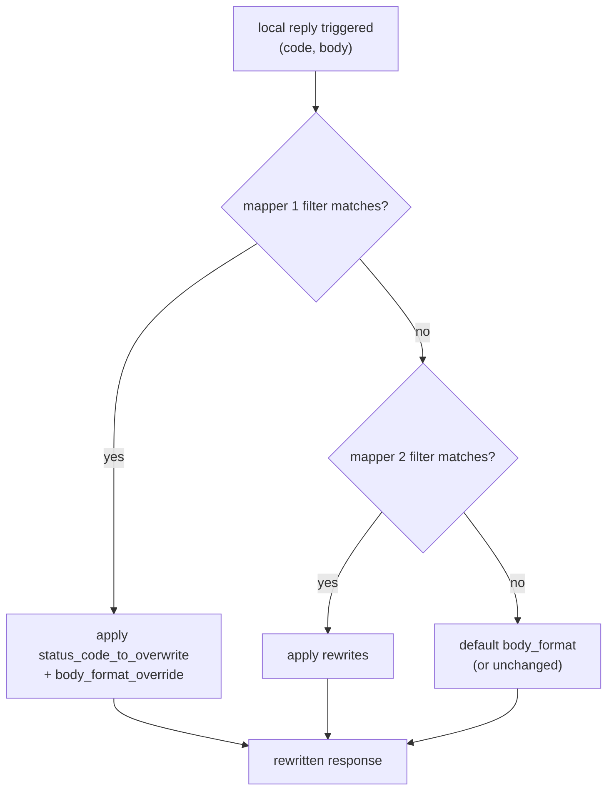

# Local Reply — Overview

> Source: `source/common/local_reply/local_reply.{h,cc}`. Config:
> `envoy.extensions.filters.network.http_connection_manager.v3.LocalReplyConfig`.

A **local reply** is any response Envoy generates itself rather than proxying from upstream —
e.g. a `403` from an authz filter, a `503` when no healthy host exists, a `408` on timeout, or a
`400` on a malformed request. The local_reply subsystem lets operators **customize those
self-generated responses**: remap the status code, reshape the body, and set the content type,
all driven by config.

## What it does

The `LocalReply` interface has a single method:

```cpp
virtual void rewrite(const Http::RequestHeaderMap* request_headers,
                     Http::ResponseHeaderMap& response_headers,
                     StreamInfo::StreamInfo& stream_info,
                     Http::Code& code, std::string& body,
                     absl::string_view& content_type) const PURE;
```

Given the in-progress local response, it may rewrite the status `code`, the `body`, and the
`content_type` in place before the response is sent.

## How config maps to behavior

`LocalReplyConfig` is a list of **mappers**, each with a filter and optional rewrites, plus an
optional body format:



- **Mappers** are evaluated in order; the first whose access-log-style **filter** matches wins.
- A matching mapper can override the **status code** and select a **body format**.
- A top-level **body_format** applies when no mapper overrides it — typically a
  `SubstitutionFormatString` so the body can embed `%RESPONSE_CODE%`,
  `%RESPONSE_FLAGS%`, request headers, etc. (JSON or text).

## The two factory entry points

| Factory | Use |
|---------|-----|
| `Factory::create(config, context)` | Build a configured `LocalReply` from proto (used by HTTP connection manager). |
| `Factory::createDefault()` | A no-op default used where there's no `FactoryContext` and no customization is configured. |

## Mental model

The HTTP connection manager owns a `LocalReply` built from its `LocalReplyConfig`. Whenever
Envoy produces a local response, it runs `rewrite()`, which walks the ordered mappers, applies
the first matching code/body-format override (falling back to the default format), and emits a
consistently-formatted error response. It only ever touches **locally-generated** replies —
upstream responses pass through untouched.
