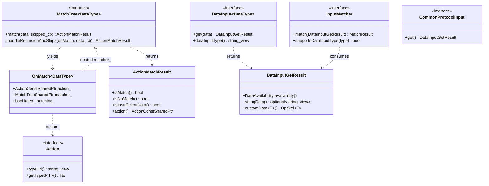
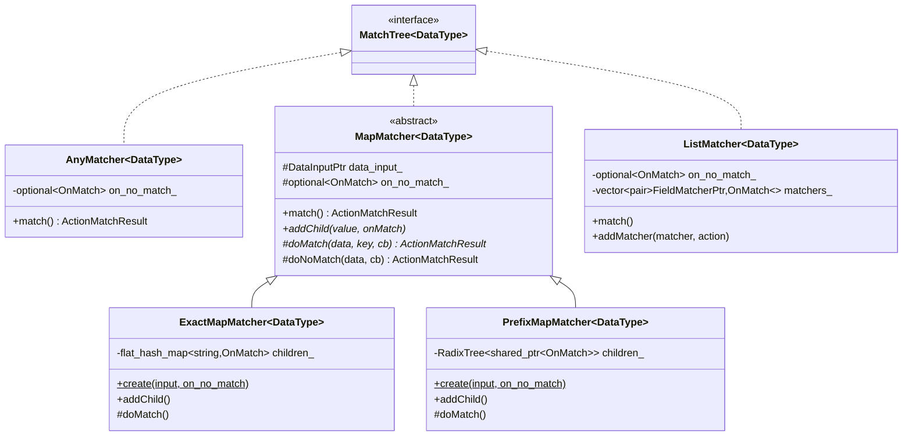
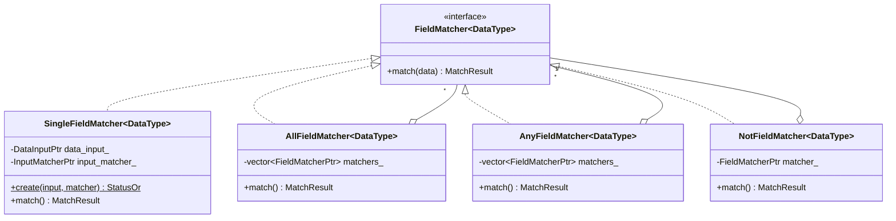
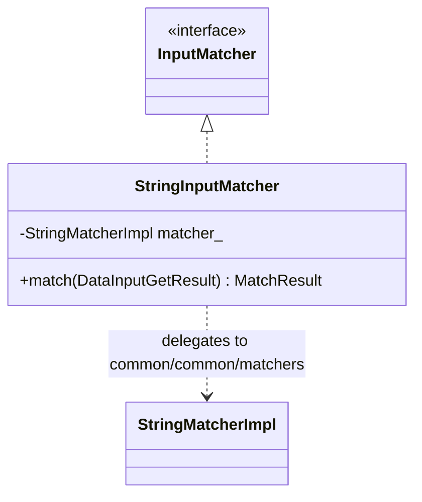
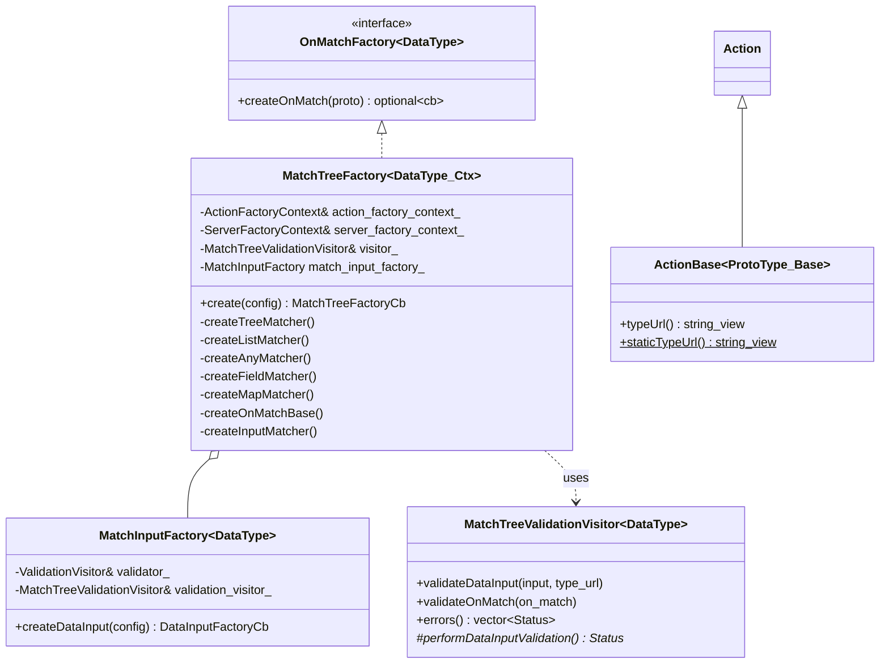
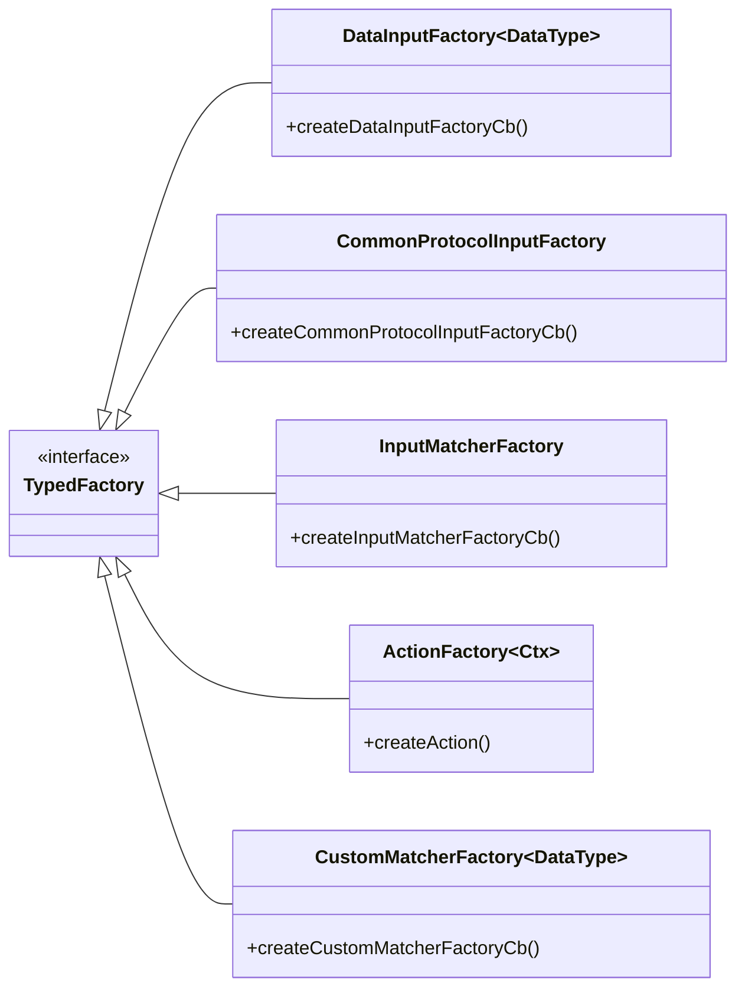
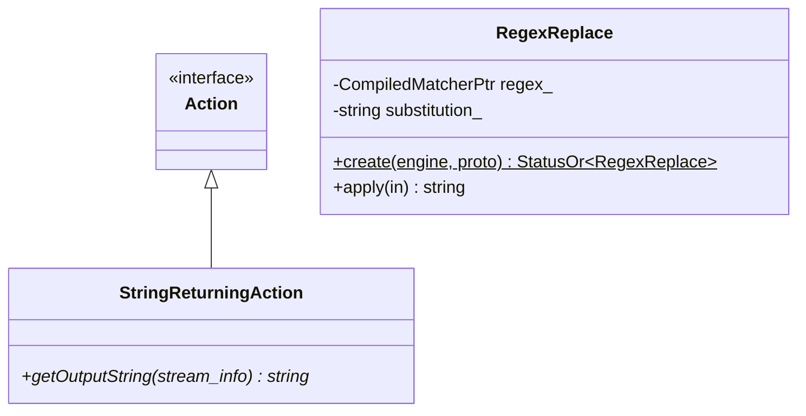

# Matching engine — class hierarchy (UML)

UML for `envoy/matcher/matcher.h` (interfaces) and `source/common/matcher/` (implementations). Split into
sections for readability.

---

## 1. Core interfaces

---

## 2. MatchTree implementations (the nodes)

---

## 3. FieldMatcher implementations (the predicates)

---

## 4. InputMatcher implementations

---

## 5. Factories & glue

---

## 6. Factory typed-registry interfaces

These extend `Config::TypedFactory` so consumers can register protocol-specific pieces:

---

## 7. Actions subfolder & helpers

---

## Key type aliases

| Alias | Definition |
|---|---|
| `MatchTreePtr<DataType>` | `unique_ptr<MatchTree<DataType>>` |
| `MatchTreeSharedPtr<DataType>` | `shared_ptr<MatchTree<DataType>>` |
| `MatchTreeFactoryCb<DataType>` | `function<MatchTreePtr<DataType>()>` |
| `FieldMatcherPtr<DataType>` | `unique_ptr<FieldMatcher<DataType>>` |
| `DataInputPtr<DataType>` | `unique_ptr<DataInput<DataType>>` |
| `InputMatcherPtr` | `unique_ptr<InputMatcher>` |
| `ActionConstSharedPtr` | `shared_ptr<const Action>` |
| `OnMatchFactoryCb<DataType>` | `function<OnMatch<DataType>()>` |

---

## Legend

- `<<interface>>` — pure virtual (mostly in `envoy/matcher/matcher.h`).
- `<<abstract>>` — has pure-virtual members but also shared logic (`MapMatcher`).
- `<|..` implements; `<|--` inherits; `o--` aggregates; `..>` uses.
- `~DataType~` denotes a template parameter.
