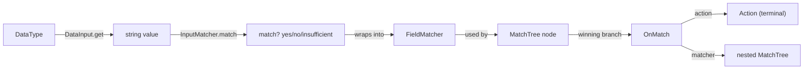
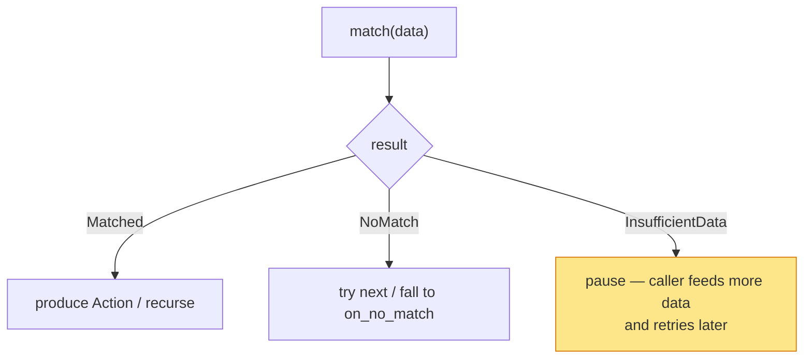
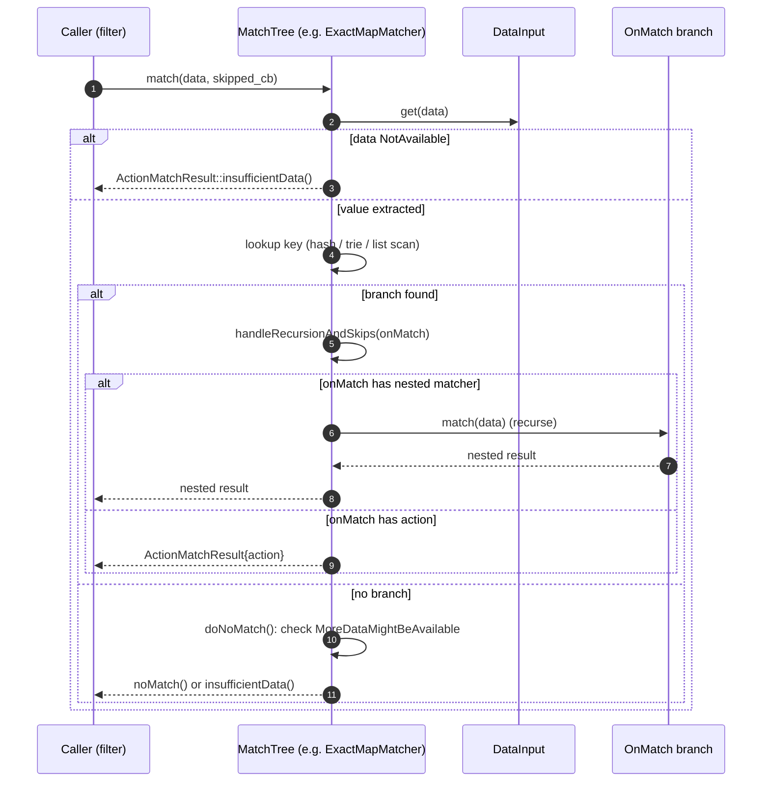
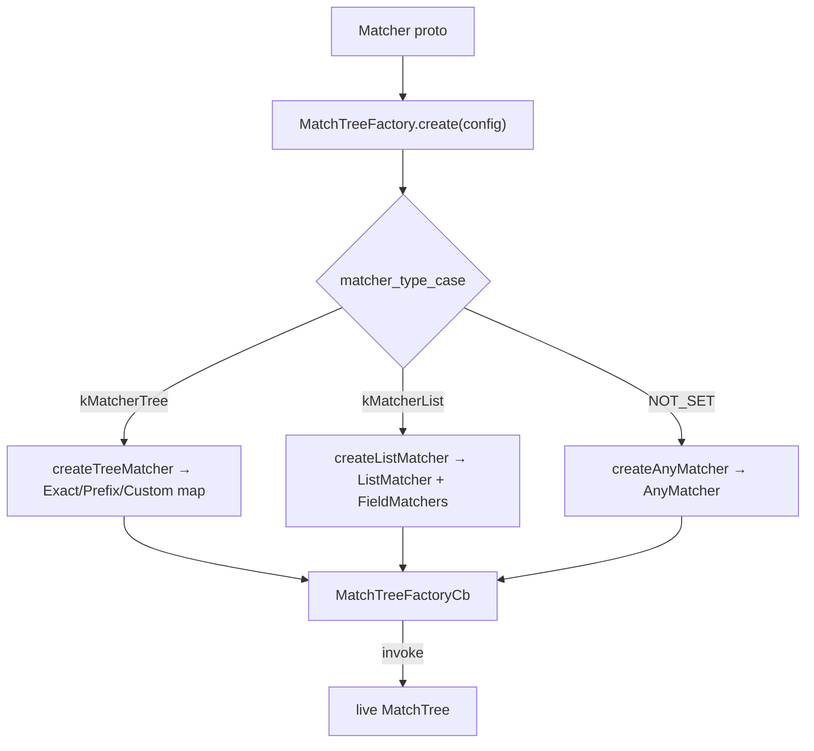

# Matching engine — architecture & design

How the generic matcher works: the vocabulary, the match algorithm, the three-valued result that supports
streaming data, and the cross-cutting features (`keep_matching`, nested trees, validation).

Read [`README.md`](README.md) first.

---

## Vocabulary

| Concept | Interface | Role |
|---|---|---|
| **DataType** | (template param) | The thing being matched against, e.g. `HttpMatchingData`. Must expose a static `name()`. |
| **DataInput\<DataType\>** | `envoy/matcher` | Extracts a string (or custom data) from a `DataType`. E.g. "value of header `:authority`". |
| **InputMatcher** | `envoy/matcher` | Decides whether an extracted value matches. E.g. `StringInputMatcher`. |
| **MatchTree\<DataType\>** | `envoy/matcher` | A node you call `match(data)` on; the unit of the tree. |
| **FieldMatcher\<DataType\>** | `field_matcher.h` | A boolean predicate (DataInput + InputMatcher, plus And/Or/Not combinators). |
| **OnMatch\<DataType\>** | `envoy/matcher` | The result of a successful branch: an `Action` **or** a nested `MatchTree`. |
| **Action** | `envoy/matcher` | The terminal payload produced by a match (downcast by the consumer). |



---

## The two node families

There are two fundamentally different ways a `MatchTree` node decides which branch wins:

### 1. Map matchers (keyed lookup) — `MatcherTree` in proto

Extract **one** string via a single `DataInput`, then look it up in a structure:

- **`ExactMapMatcher`** — `absl::flat_hash_map`, O(1) exact-string match.
- **`PrefixMapMatcher`** — `RadixTree`, longest-prefix match.

### 2. List matcher (linear predicates) — `MatcherList` in proto

Evaluate a **list** of `FieldMatcher` predicates in order; the **first** one that returns `Matched` wins. Each
predicate can itself be a boolean combination (`AND`/`OR`/`NOT`) of sub-predicates, each with its own
`DataInput`.

### 3. `AnyMatcher` — the degenerate node

When the proto sets no matcher at all, the factory builds an `AnyMatcher` that immediately resolves to its
`on_no_match`. Useful as a "always do X" leaf.

---

## The three-valued result (this is the subtle part)

Matching is **not** boolean. Because Envoy often matches on data that arrives incrementally (request headers,
then body, then trailers; or bytes trickling in on a connection), every match step returns one of **three**
states:



- **`MatchResult` / `DataAvailability`** at the leaf level (`InputMatcher`, `DataInput`): `NotAvailable`,
  `MoreDataMightBeAvailable`, `AllDataAvailable`.
- **`ActionMatchResult`** at the tree level: `isMatch()` (with an `Action`), `isNoMatch()`, or
  `isInsufficientData()`.

The propagation rule: if any required input is `NotAvailable`, or a non-match occurs while
`MoreDataMightBeAvailable`, the node returns **InsufficientData** so the caller knows to retry rather than
treating it as a definitive no-match. This is what makes the same engine usable for "match on the full request"
and "match as bytes stream in."

### How `DataInputGetResult` carries this

`DataInput::get()` returns a `DataInputGetResult` holding both the data (a variant of
`monostate | string | string_view | shared_ptr<CustomMatchData>`) **and** an availability enum. `monostate`
means "no value extracted" — which combined with `AllDataAvailable` means a definitive miss, but combined with
`NotAvailable` means "ask again later."

---

## The match algorithm (end-to-end)



The shared helper `MatchTree::handleRecursionAndSkips()` (in `envoy/matcher/matcher.h`) is called by **every**
node to turn an `OnMatch` into an `ActionMatchResult`. It handles three things uniformly: recursing into a nested
matcher, applying `keep_matching`, and invoking the skipped-match callback.

---

## `keep_matching` — "find this, but don't stop"

An `OnMatch` can be flagged `keep_matching`. When set, a successful match is reported to the optional
`SkippedMatchCb` but then **treated as a no-match**, so evaluation continues to later branches / `on_no_match`.
This supports use cases like "log every rule that would have matched" or layered policies. The logic lives in
`handleRecursionAndSkips`:

```cpp
if (on_match->action_ && on_match->keep_matching_) {
  if (skipped_match_cb) skipped_match_cb(on_match->action_);
  return ActionMatchResult::noMatch();   // pretend it didn't match, keep going
}
```

For nested matchers, a parent's `keep_matching` skips whatever the child matched.

---

## Compilation: proto → runnable tree

Trees are built once at config time by `MatchTreeFactory<DataType, ActionFactoryContext>` and then executed many
times on the data path. The factory produces **factory callbacks** (`MatchTreeFactoryCb`) rather than trees
directly, so a tree can be cheaply instantiated per-use where needed.



The factory also resolves `DataInput`s and `InputMatcher`s and `Action`s through Envoy's **typed factory
registry** (`Config::Utility::getAndCheckFactory`), which is how filters plug their own inputs/actions into the
generic engine. See [`matcher_factory.md`](matcher_factory.md).

---

## Validation during construction

`MatchTreeValidationVisitor<DataType>` is threaded through the factory. As each `DataInput` is created, the
visitor's `performDataInputValidation()` can reject inputs that don't make sense for the context (e.g. an input
that needs response headers used in a request-only matcher). Errors **accumulate** in a vector so the user sees
*all* violations, not just the first. It also enforces whether `keep_matching` is permitted in the current
context (`validateOnMatch`).

---

## What this folder does *not* do

- **It defines no concrete `DataInput`s or `Action`s for any specific protocol.** Those live in the consuming
  filters/extensions and are registered via factories. This folder is the engine + the generic node types.
- **It is not stateful across calls** (today). Each `match()` re-traverses from the node it's called on; there's
  a TODO to cache progress for resumed matching. Re-entry on more data starts from the resumable sub-tree
  returned via a nested `OnMatch`, not from arbitrary mid-node positions.
- **It does not own the data.** `DataInputGetResult` may hold a `string_view` into caller-owned memory; the
  caller must keep it alive for the duration of `match()`.

---

## Cross-references

- [`match_trees.md`](match_trees.md) — map & list nodes in detail.
- [`field_matchers.md`](field_matchers.md) — the predicate combinators.
- [`matcher_factory.md`](matcher_factory.md) — proto compilation & factory wiring.
- [`CLASS_HIERARCHY.md`](CLASS_HIERARCHY.md) — UML.
