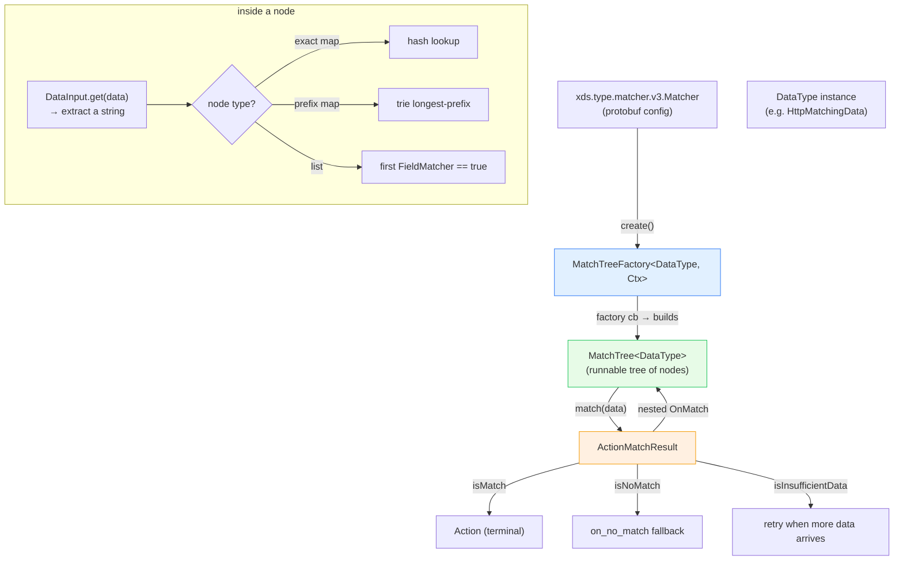

# `source/common/matcher/` — the generic (xDS) matching engine

This folder is Envoy's **unified matching framework**: a protocol-agnostic, configuration-driven engine that
takes some input data (HTTP headers, connection properties, network metadata, …) and walks a **match tree** to
produce an **action**. It is what powers the `xds.type.matcher.v3.Matcher` /
`envoy.config.common.matcher.v3.Matcher` protos used by HTTP/network/listener filter-chain matching, RBAC, rate
limiting, and many extensions.

The big idea: instead of every filter inventing its own "if header X == Y then do Z" config, they all share
**one** generic tree of matchers parameterized on a `DataType` (the thing being matched against).

> **TL;DR** — this folder owns:
> - the **match-tree node types**: `ListMatcher`, `ExactMapMatcher`, `PrefixMapMatcher`, `AnyMatcher`,
> - the **predicate (field-matcher) combinators**: `SingleFieldMatcher`, `AllFieldMatcher`, `AnyFieldMatcher`,
>   `NotFieldMatcher`,
> - the **factory** (`MatchTreeFactory`) that compiles a protobuf `Matcher` into a runnable tree,
> - the **input → matcher glue**: `MatchInputFactory`, `StringInputMatcher`,
> - and supporting bits: `validation_visitor.h`, `regex_replace.{h,cc}`, `actions/`.

The **interfaces** (`MatchTree`, `DataInput`, `InputMatcher`, `Action`, `OnMatch`, …) live in
`envoy/matcher/matcher.h` and are documented alongside the impls here.

---

## The one paragraph mental model

A **MatchTree\<DataType\>** is a node you call `match(data)` on. It uses a **DataInput\<DataType\>** to pull a
string out of `data` (e.g. "the value of header `:path`"), then decides what to do: a **map matcher** looks the
string up in a hash map (exact) or trie (prefix); a **list matcher** runs a series of boolean
**FieldMatchers** until one is true. The winning branch yields an **OnMatch**, which is *either* a terminal
**Action** *or* another nested MatchTree to recurse into. If nothing matches, the tree falls back to its
configured `on_no_match`. Because data can arrive over time (streaming), every step can also answer
"**InsufficientData** — ask me again when you have more."

---

## Folder map

```
source/common/matcher/
├── BUILD
├── matcher.h                 # MatchTreeFactory (proto → tree), AnyMatcher, ActionBase, MatchInputFactory
├── matcher.cc                # (tiny) registration glue
├── map_matcher.h             # MapMatcher base (input extraction + on_no_match)
├── exact_map_matcher.h       # ExactMapMatcher — O(1) hash-map lookup
├── prefix_map_matcher.h      # PrefixMapMatcher — longest-prefix trie lookup
├── list_matcher.h            # ListMatcher — first predicate that matches wins
├── field_matcher.h           # SingleFieldMatcher + And/Any/Not combinators
├── value_input_matcher.h     # StringInputMatcher — wraps StringMatcherImpl
├── validation_visitor.h      # MatchTreeValidationVisitor — validates inputs during construction
├── regex_replace.{h,cc}      # RegexReplace — regex match-and-substitute helper
└── actions/
    └── string_returning_action.{h,cc}  # action that yields a formatted string
```

---

## Per-topic table

| Topic | Document | Source |
|---|---|---|
| Concepts, the match algorithm, streaming data | [`OVERVIEW.md`](OVERVIEW.md) | the whole model |
| Class hierarchy (UML) | [`CLASS_HIERARCHY.md`](CLASS_HIERARCHY.md) | every interface + impl |
| Match-tree nodes (map/list/any) | [`match_trees.md`](match_trees.md) | `map_matcher.h`, `exact_/prefix_map_matcher.h`, `list_matcher.h` |
| Field matchers (predicates) | [`field_matchers.md`](field_matchers.md) | `field_matcher.h`, `value_input_matcher.h` |
| Factory: proto → runnable tree | [`matcher_factory.md`](matcher_factory.md) | `matcher.h` (`MatchTreeFactory`, `MatchInputFactory`) |

---

## Big picture



---

## Who uses this folder

| Consumer | DataType | What it matches |
|---|---|---|
| HTTP filter-chain matching | `HttpMatchingData` | headers, trailers, request properties |
| Network/listener filter matching | `MatchingData` / `NetworkMatchingData` | SNI, ALPN, source/dest IP, transport |
| RBAC | HTTP/network matching data | principal/permission rules |
| Generic xDS extensions | extension-defined | any custom input |

The framework is intentionally generic; concrete `DataInput`s and `Action`s are registered by the consuming
filter via the typed-factory registry.

---

## Reading order

1. This `README.md` — vocabulary and the big picture.
2. [`OVERVIEW.md`](OVERVIEW.md) — the match algorithm, the three-valued result, streaming, `keep_matching`.
3. [`match_trees.md`](match_trees.md) and [`field_matchers.md`](field_matchers.md) — the node types.
4. [`matcher_factory.md`](matcher_factory.md) — how a proto becomes a tree.
5. [`CLASS_HIERARCHY.md`](CLASS_HIERARCHY.md) — keep open as a map.
