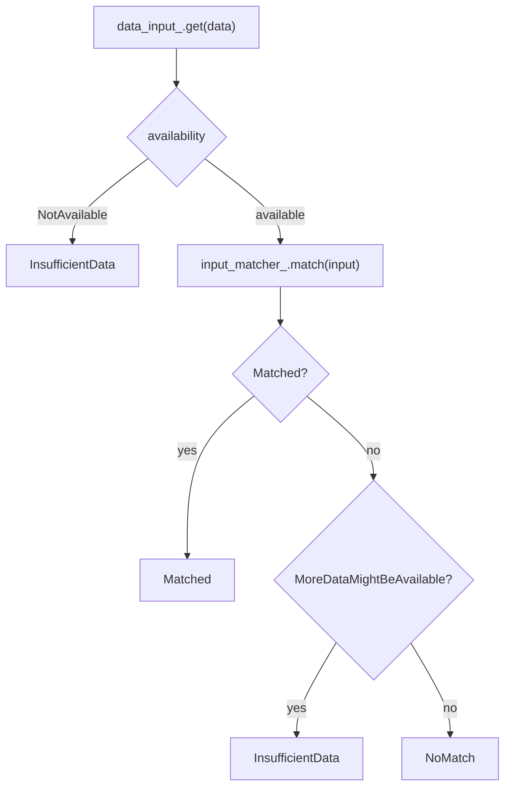
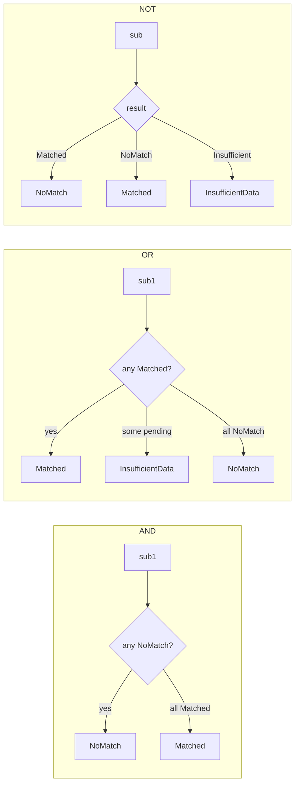

# Deep dive: field matchers (predicates) & input matchers

`field_matcher.h` and `value_input_matcher.h`: the boolean predicate layer used by `ListMatcher`. Read
[`match_trees.md`](match_trees.md) for how the list node drives these.

---

## The `FieldMatcher` interface

A `FieldMatcher` is a **three-valued boolean predicate** over the data:

```cpp
template <class DataType> class FieldMatcher {
public:
  virtual MatchResult match(const DataType& data) PURE;   // Matched / NoMatch / InsufficientData
};
```

Note it returns `MatchResult` (the leaf-level three-state enum), **not** `ActionMatchResult` — field matchers
decide *whether* something matches, not *what action* to take.

There are four implementations: one leaf (`SingleFieldMatcher`) and three combinators (`All`/`Any`/`Not`).

---

## `SingleFieldMatcher` — the leaf predicate

This is where a `DataInput` (extract a value) meets an `InputMatcher` (test the value).

### Construction validates compatibility

```cpp
static absl::StatusOr<std::unique_ptr<SingleFieldMatcher<DataType>>>
create(DataInputPtr<DataType>&& data_input, InputMatcherPtr&& input_matcher) {
  const bool supported = input_matcher->supportsDataInputType(data_input->dataInputType());
  if (!supported) {
    return absl::InvalidArgumentError(
        absl::StrCat("Unsupported data input type: ", data_input->dataInputType()));
  }
  return std::unique_ptr<SingleFieldMatcher<DataType>>{
      new SingleFieldMatcher<DataType>(std::move(data_input), std::move(input_matcher))};
}
```

A factory-time check: the input matcher must declare it supports the input's type (default `"string"`). This
catches misconfigurations like pairing a numeric matcher with a string input before any traffic flows.

### `match` — the streaming-aware leaf logic

```cpp
MatchResult match(const DataType& data) override {
  const auto input = data_input_->get(data);

  if (input.availability() == DataAvailability::NotAvailable) {
    return MatchResult::InsufficientData;                 // (1) nothing yet
  }

  MatchResult current_match = input_matcher_->match(input);
  if (current_match != MatchResult::Matched &&
      input.availability() == DataAvailability::MoreDataMightBeAvailable) {
    return MatchResult::InsufficientData;                 // (2) miss, but more might come
  }
  return current_match;                                   // (3) definitive
}
```

The crucial branch is `(2)`: a **non-match is downgraded to `InsufficientData`** when more data might still
arrive. Only when data is fully available is a non-match reported as a real `NoMatch`. This is the same
streaming principle as in the map matchers, applied at the predicate leaf.



---

## The combinators

### `AllFieldMatcher` (AND)

```cpp
MatchResult match(const DataType& data) override {
  for (const auto& matcher : matchers_) {
    const MatchResult result = matcher->match(data);
    if (result == MatchResult::InsufficientData) return result;   // can't decide AND yet
    if (result == MatchResult::NoMatch) return result;            // one false ⇒ whole AND false
  }
  return MatchResult::Matched;                                    // all true
}
```

Short-circuits on the first `NoMatch` (AND is false) or `InsufficientData` (can't yet decide).

### `AnyFieldMatcher` (OR)

```cpp
MatchResult match(const DataType& data) override {
  bool unable_to_match_some_matchers = false;
  for (const auto& matcher : matchers_) {
    const MatchResult result = matcher->match(data);
    if (result == MatchResult::InsufficientData) {
      unable_to_match_some_matchers = true;
      continue;                                  // keep looking for a definite match
    }
    if (result == MatchResult::Matched) return result;   // one true ⇒ whole OR true
  }
  if (unable_to_match_some_matchers) return MatchResult::InsufficientData;   // a pending one might be true
  return MatchResult::NoMatch;
}
```

Subtle: OR can't conclude `NoMatch` if some sub-matcher was undecided — that pending matcher might later be the
one that's true. So it returns `InsufficientData` unless **every** sub-matcher gave a definite `NoMatch`.

### `NotFieldMatcher` (NOT)

```cpp
MatchResult match(const DataType& data) override {
  const MatchResult result = matcher_->match(data);
  if (result == MatchResult::InsufficientData) return result;     // can't invert the unknown
  return (result == MatchResult::Matched) ? MatchResult::NoMatch : MatchResult::Matched;
}
```

Inverts a definite result; passes `InsufficientData` through unchanged.



These compose recursively — an `AllFieldMatcher` can contain `AnyFieldMatcher`s containing
`SingleFieldMatcher`s, mirroring the proto's nested `and_matcher`/`or_matcher`/`not_matcher`/`single_predicate`.

---

## `StringInputMatcher` — the default `InputMatcher`

`value_input_matcher.h` wraps the shared `Matchers::StringMatcherImpl` (from `common/common/matchers.h`, which
supports exact/prefix/suffix/contains/regex/safe-regex string matching):

```cpp
class StringInputMatcher : public InputMatcher {
public:
  template <class StringMatcherType>
  explicit StringInputMatcher(const StringMatcherType& matcher,
                              Server::Configuration::CommonFactoryContext& context)
      : matcher_(matcher, context) {}

  MatchResult match(const DataInputGetResult& input) override {
    const auto data = input.stringData();
    if (data && matcher_.match(*data)) {
      return MatchResult::Matched;
    }
    return MatchResult::NoMatch;       // includes the empty/monostate input case
  }

private:
  const Matchers::StringMatcherImpl matcher_;
};
```

This is the `value_match` branch of a single predicate; it's the most common leaf in practice. Custom input
matchers are plugged in via `InputMatcherFactory` (see [`matcher_factory.md`](matcher_factory.md)).

---

## How a list predicate maps to proto

```
MatcherList.Predicate
├── single_predicate { input, value_match | custom_match }   → SingleFieldMatcher
├── and_matcher  { predicate[] }                             → AllFieldMatcher
├── or_matcher   { predicate[] }                             → AnyFieldMatcher
└── not_matcher  { predicate }                               → NotFieldMatcher
```

The factory's `createFieldMatcher` recursively walks this structure — see
[`matcher_factory.md`](matcher_factory.md#createfieldmatcher).

---

## Gotchas

- **`SingleFieldMatcher` must be created via `create()`**, not the private constructor — the static method
  performs the input/matcher compatibility check and returns a `StatusOr`.
- **OR's "InsufficientData beats NoMatch" rule** is easy to get wrong if you reimplement it: a pending sub-matcher
  prevents a definitive negative.
- **The empty input is a `NoMatch`, not an error.** `StringInputMatcher` returns `NoMatch` when `stringData()` is
  empty (`monostate`).
- **Combinators are three-valued, not boolean.** Always handle `InsufficientData` when reasoning about them.

---

## Cross-references

- [`match_trees.md`](match_trees.md) — `ListMatcher` consumes these predicates.
- [`matcher_factory.md`](matcher_factory.md) — recursive construction from proto.
- `common/common/matchers.h` — the underlying `StringMatcherImpl`.
