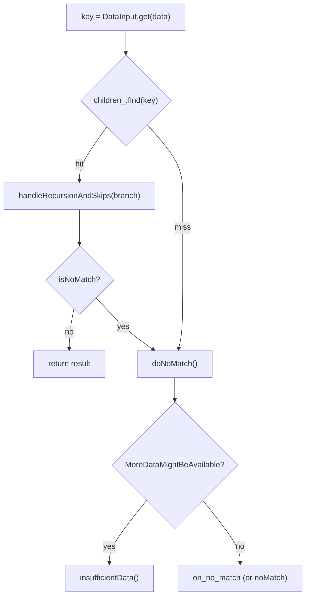
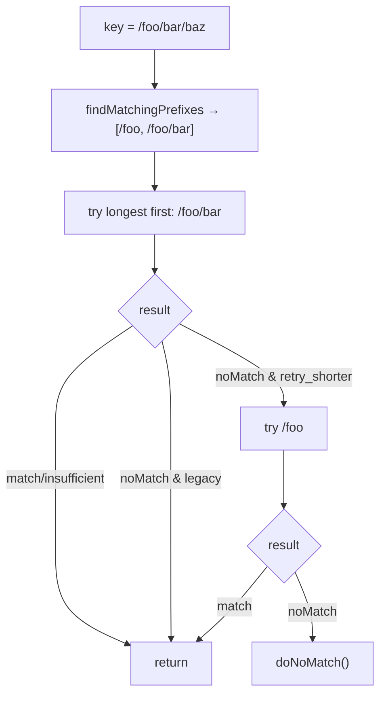
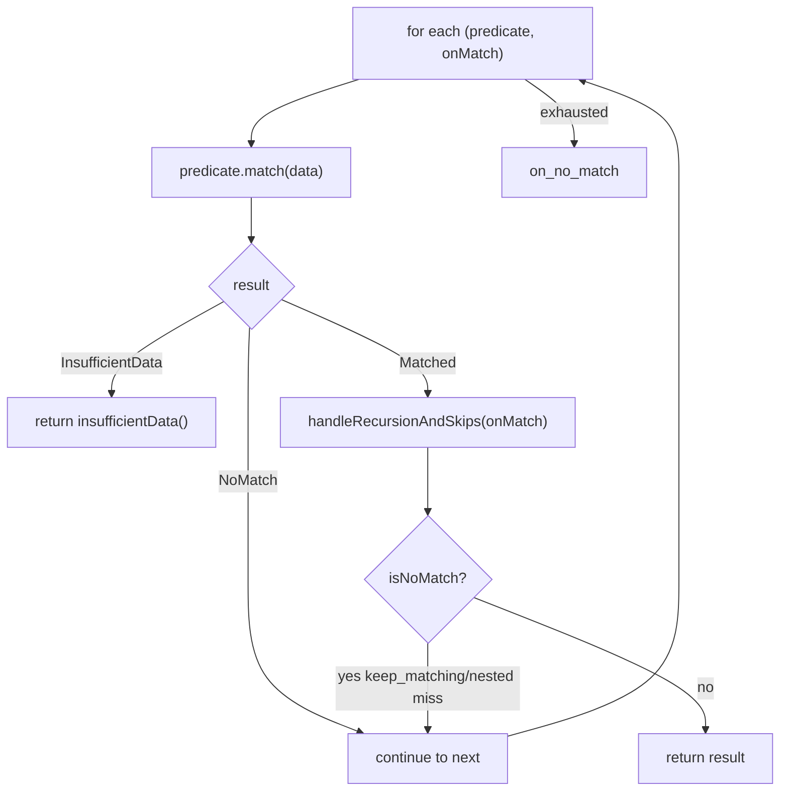

# Deep dive: match-tree nodes (map & list matchers)

The `MatchTree<DataType>` node implementations: `MapMatcher` (base), `ExactMapMatcher`, `PrefixMapMatcher`,
`ListMatcher`, and `AnyMatcher`. Read [`OVERVIEW.md`](OVERVIEW.md) first for the three-valued result and
`handleRecursionAndSkips`.

---

## The shared contract: `MatchTree::match`

Every node implements:

```cpp
virtual ActionMatchResult match(const DataType& data, SkippedMatchCb skipped_match_cb = nullptr) PURE;
```

and is expected to funnel every `OnMatch` through the static helper `handleRecursionAndSkips()` (defined in
`envoy/matcher/matcher.h`), which converts an `OnMatch` into an `ActionMatchResult`, recursing into nested
matchers and honoring `keep_matching`.

---

## `MapMatcher` — the base for keyed lookups

`map_matcher.h` factors out everything the exact and prefix maps share: pulling the key string out of the data,
and the `on_no_match` fallback.

### `match` — extract then delegate

```cpp
ActionMatchResult match(const DataType& data, SkippedMatchCb skipped_match_cb = nullptr) override {
  const auto input = data_input_->get(data);
  if (input.availability() == DataAvailability::NotAvailable) {
    return ActionMatchResult::insufficientData();      // (1) no data yet → retry later
  }
  auto string_data = input.stringData();
  if (!string_data) {
    return MatchTree<DataType>::handleRecursionAndSkips(on_no_match_, data, skipped_match_cb);  // (2)
  }
  return doMatch(data, *string_data, skipped_match_cb); // (3) subclass does the lookup
}
```

1. If the input isn't available at all, **defer** with `insufficientData()`.
2. If the input resolved to "no value" (`monostate`), go straight to `on_no_match`.
3. Otherwise hand the extracted key to the subclass's `doMatch`.

### `doNoMatch` — the streaming-aware fallback

```cpp
ActionMatchResult doNoMatch(const DataType& data, SkippedMatchCb skipped_match_cb) {
  if (data_input_->get(data).availability() == DataAvailability::MoreDataMightBeAvailable) {
    return ActionMatchResult::insufficientData();   // a longer key might match later
  }
  return MatchTree<DataType>::handleRecursionAndSkips(on_no_match_, data, skipped_match_cb);
}
```

The key insight: a lookup miss is only **definitive** if all data is available. If more data might arrive (e.g.
more of a streamed value), the node returns `insufficientData()` so the caller retries instead of prematurely
falling to `on_no_match`.

### Constructor: input-type guard

```cpp
MapMatcher(DataInputPtr<DataType>&& data_input, absl::optional<OnMatch<DataType>> on_no_match,
           absl::Status& creation_status) : data_input_(std::move(data_input)), on_no_match_(...) {
  if (data_input_->dataInputType() != DefaultMatchingDataType) {   // "string"
    creation_status = absl::InvalidArgumentError("... only string type is supported in map matcher");
  }
}
```

Map matchers only work on string keys. Non-string inputs are rejected at construction (returned via the
`creation_status` out-param, surfaced through the static `create()` factory functions).

---

## `ExactMapMatcher` — O(1) exact match

```cpp
absl::flat_hash_map<std::string, OnMatch<DataType>> children_;

ActionMatchResult doMatch(const DataType& data, absl::string_view key, SkippedMatchCb cb) override {
  const auto itr = children_.find(key);
  if (itr != children_.end()) {
    ActionMatchResult result = MatchTree<DataType>::handleRecursionAndSkips(itr->second, data, cb);
    if (!result.isNoMatch()) {
      return result;            // matched (or insufficient): done
    }
  }
  return this->doNoMatch(data, cb);   // miss, or branch reported no-match → fallback
}
```

Simple hash lookup. Note that even on a key hit, the branch can come back `isNoMatch()` (e.g. a nested matcher
didn't match, or `keep_matching` skipped it) — in which case we still fall through to `doNoMatch`.



---

## `PrefixMapMatcher` — longest-prefix match via radix tree

```cpp
RadixTree<std::shared_ptr<OnMatch<DataType>>> children_;

ActionMatchResult doMatch(const DataType& data, absl::string_view key, SkippedMatchCb cb) override {
  const absl::InlinedVector<std::shared_ptr<OnMatch<DataType>>, 4> results =
      children_.findMatchingPrefixes(key);
  bool retry_shorter = Runtime::runtimeFeatureEnabled(
      "envoy.reloadable_features.prefix_map_matcher_resume_after_subtree_miss");
  for (auto it = results.rbegin(); it != results.rend(); ++it) {     // longest first
    ActionMatchResult result = MatchTree<DataType>::handleRecursionAndSkips(**it, data, cb);
    if (!result.isNoMatch() || !retry_shorter) {
      return result;
    }
  }
  return this->doNoMatch(data, cb);
}
```

- `findMatchingPrefixes` returns **all** prefixes of `key` present in the trie, shortest→longest.
- Iterating with `rbegin()` tries the **longest** prefix first (longest-prefix-match semantics).
- The `retry_shorter` runtime flag controls a behavior change: when enabled, if the longest prefix's branch
  comes back `NoMatch` (e.g. its nested subtree didn't match), the matcher **retries shorter prefixes** instead
  of giving up. The legacy behavior (flag off) returns the first result regardless.



---

## `ListMatcher` — first predicate wins

`list_matcher.h` is the linear-scan node. Unlike map matchers it uses **FieldMatchers** (boolean predicates),
not a keyed lookup:

```cpp
ActionMatchResult match(const DataType& matching_data, SkippedMatchCb cb = nullptr) override {
  for (const auto& matcher : matchers_) {
    MatchResult result = matcher.first->match(matching_data);     // run the predicate
    if (result == MatchResult::InsufficientData) {
      return ActionMatchResult::insufficientData();               // defer
    }
    if (result == MatchResult::NoMatch) {
      continue;                                                    // try next predicate
    }
    // Matched: resolve its OnMatch.
    ActionMatchResult processed = MatchTree<DataType>::handleRecursionAndSkips(matcher.second, matching_data, cb);
    if (processed.isNoMatch()) {
      continue;       // nested no-match or keep_matching skip → keep scanning
    }
    return processed;
  }
  return MatchTree<DataType>::handleRecursionAndSkips(on_no_match_, matching_data, cb);
}
```

Semantics:

- Predicates are evaluated **in order**; the **first** `Matched` whose `OnMatch` resolves to a real result wins.
- An `InsufficientData` from any predicate **short-circuits** the whole list (we can't know if an earlier-priority
  rule would have matched given more data).
- `keep_matching` (via `handleRecursionAndSkips` returning `noMatch`) lets evaluation continue past a match.



---

## `AnyMatcher` — the always-fallback node

```cpp
ActionMatchResult match(const DataType& data, SkippedMatchCb cb = nullptr) override {
  return MatchTree<DataType>::handleRecursionAndSkips(on_no_match_, data, cb);
}
```

Built when the proto sets no matcher. It simply resolves to its `on_no_match` every time — i.e. "unconditionally
do this." Handy as a default leaf.

---

## Comparison

| Node | Lookup | Data structure | Selects | Streaming-aware |
|---|---|---|---|---|
| `ExactMapMatcher` | exact key | `flat_hash_map` | one branch | yes (`doNoMatch`) |
| `PrefixMapMatcher` | longest prefix | `RadixTree` | best branch (+retry) | yes (`doNoMatch`) |
| `ListMatcher` | linear predicates | `vector<pair>` | first match | yes (short-circuit) |
| `AnyMatcher` | none | — | `on_no_match` | n/a |

---

## Gotchas

- **A key hit is not a guaranteed match.** The branch's `OnMatch` may resolve to `noMatch` (nested miss or
  `keep_matching`), so all nodes fall through to `doNoMatch`/next.
- **`InsufficientData` propagates aggressively.** This is intentional — returning a premature `NoMatch` while
  more data could arrive would produce wrong results for streaming matchers.
- **Map matchers are string-only.** Construction fails for non-string `DataInput`s.
- **PrefixMapMatcher behavior depends on a runtime flag.** If you see prefix-fallback behavior differences,
  check `envoy.reloadable_features.prefix_map_matcher_resume_after_subtree_miss`.

---

## Cross-references

- [`field_matchers.md`](field_matchers.md) — the predicates used by `ListMatcher`.
- [`matcher_factory.md`](matcher_factory.md) — how these nodes get built from proto.
- [`OVERVIEW.md`](OVERVIEW.md) — `handleRecursionAndSkips`, three-valued results.
