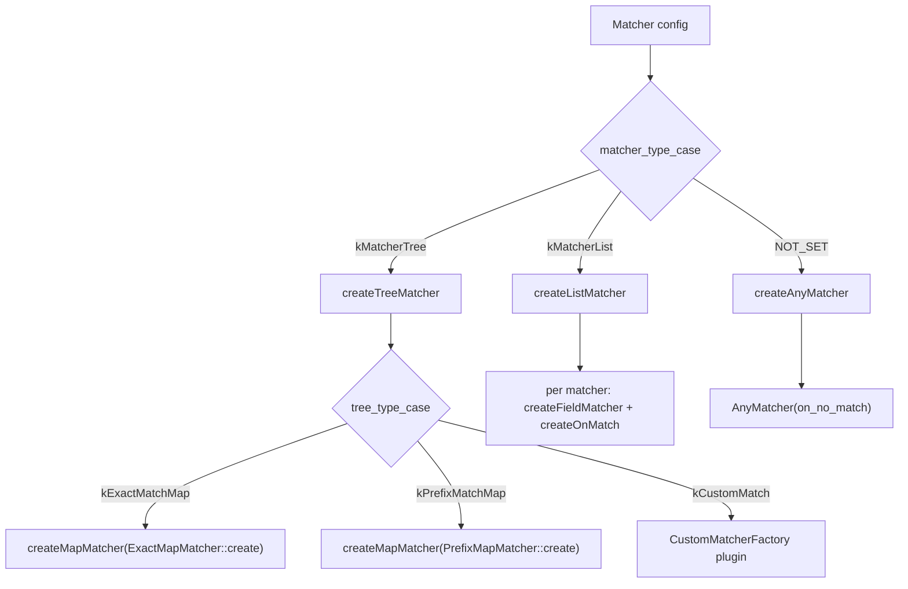
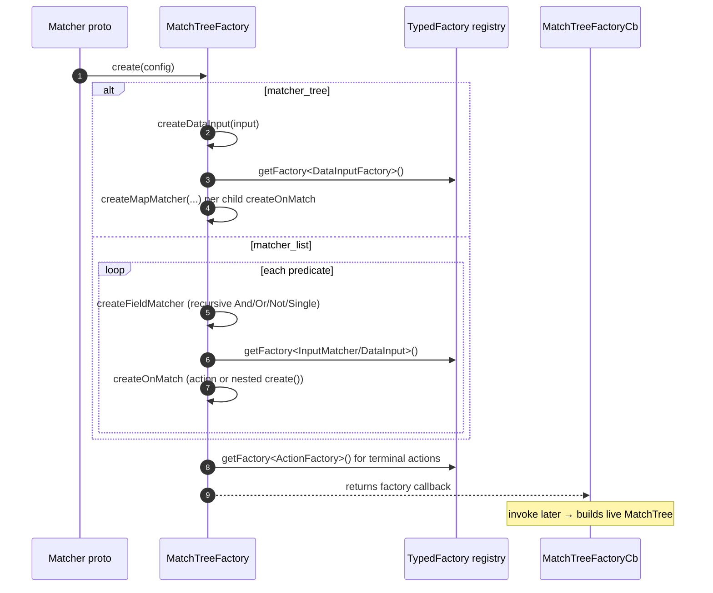

# Deep dive: `MatchTreeFactory` — compiling proto into a runnable tree

`matcher.h`: how a protobuf `Matcher` message is turned into a live `MatchTree`. This is the most intricate file
in the folder. Read [`OVERVIEW.md`](OVERVIEW.md), [`match_trees.md`](match_trees.md), and
[`field_matchers.md`](field_matchers.md) first — this doc shows how those pieces get assembled.

---

## The two template parameters

```cpp
template <class DataType, class ActionFactoryContext>
class MatchTreeFactory : public OnMatchFactory<DataType> { ... };
```

- **`DataType`** — what the tree matches against (e.g. `HttpMatchingData`). Determines which `DataInput`
  factories are in scope.
- **`ActionFactoryContext`** — the context object passed to `Action` factories so actions can capture whatever
  server/filter state they need.

The factory implements `OnMatchFactory<DataType>` so it can be handed to **custom matcher** extensions that need
to build nested `OnMatch`es.

---

## Entry point: `create()`

```cpp
template <class MatcherType> MatchTreeFactoryCb<DataType> create(const MatcherType& config) {
  switch (config.matcher_type_case()) {
  case MatcherType::kMatcherTree:    return createTreeMatcher(config);
  case MatcherType::kMatcherList:    return createListMatcher(config);
  case MatcherType::MATCHER_TYPE_NOT_SET: return createAnyMatcher(config);
  }
  PANIC_DUE_TO_CORRUPT_ENUM;
}
```

Returns a `MatchTreeFactoryCb` — a `std::function` that *builds* a tree when invoked — rather than the tree
itself. This lets the same compiled config cheaply instantiate trees where needed and defers allocation.

The `template <class MatcherType>` exists because there are **two** Matcher protos
(`xds.type.matcher.v3.Matcher` and `envoy.config.common.matcher.v3.Matcher`); the factory is written generically
over both (see the TODO in the source about unifying them).



---

## `createTreeMatcher` — building map nodes

```cpp
template <class MatcherType> MatchTreeFactoryCb<DataType> createTreeMatcher(const MatcherType& matcher) {
  auto data_input = match_input_factory_.createDataInput(matcher.matcher_tree().input());
  auto on_no_match = createOnMatch(matcher.on_no_match());

  switch (matcher.matcher_tree().tree_type_case()) {
  case MatcherType::MatcherTree::kExactMatchMap:
    return createMapMatcher<ExactMapMatcher>(matcher.matcher_tree().exact_match_map(),
                                             data_input, on_no_match, &ExactMapMatcher<DataType>::create);
  case MatcherType::MatcherTree::kPrefixMatchMap:
    return createMapMatcher<PrefixMapMatcher>(matcher.matcher_tree().prefix_match_map(),
                                              data_input, on_no_match, &PrefixMapMatcher<DataType>::create);
  case MatcherType::MatcherTree::kCustomMatch: {
    auto& factory = Config::Utility::getAndCheckFactory<CustomMatcherFactory<DataType>>(...);
    ProtobufTypes::MessagePtr message = Config::Utility::translateAnyToFactoryConfig(...);
    return factory.createCustomMatcherFactoryCb(*message, server_factory_context_, data_input,
                                                on_no_match, *this);
  }
  ...
  }
}
```

- One `DataInput` is built for the whole map (the key extractor).
- `createMapMatcher` (below) wires up the children.
- `kCustomMatch` is the **extension point**: a registered `CustomMatcherFactory` can build any custom node,
  receiving the data input, the `on_no_match`, and `*this` (so it can create nested `OnMatch`es).

### `createMapMatcher` — wiring children

```cpp
template <template <class> class MapMatcherType, class MapType>
MatchTreeFactoryCb<DataType> createMapMatcher(const MapType& map, DataInputFactoryCb<DataType> data_input,
    absl::optional<OnMatchFactoryCb<DataType>>& on_no_match, MapCreationFunction creation_function) {
  std::vector<std::pair<std::string, OnMatchFactoryCb<DataType>>> match_children;
  for (const auto& children : map.map()) {
    match_children.push_back(std::make_pair(children.first, *createOnMatch(children.second)));
  }
  return [match_children, data_input, on_no_match, creation_function]() {
    auto matcher_or_error = creation_function(data_input(),
        on_no_match ? absl::make_optional((*on_no_match)()) : absl::nullopt);
    THROW_IF_NOT_OK_REF(matcher_or_error.status());
    auto multimap_matcher = std::move(*matcher_or_error);
    for (const auto& children : match_children) {
      multimap_matcher->addChild(children.first, children.second());
    }
    return multimap_matcher;
  };
}
```

Each map entry's value is itself an `OnMatch` (possibly a nested matcher), built via `createOnMatch`. The
returned callback instantiates the node and calls `addChild` for each entry.

---

## `createListMatcher` — building the linear node

```cpp
template <class MatcherType> MatchTreeFactoryCb<DataType> createListMatcher(const MatcherType& config) {
  std::vector<std::pair<FieldMatcherFactoryCb<DataType>, OnMatchFactoryCb<DataType>>> matcher_factories;
  for (const auto& matcher : config.matcher_list().matchers()) {
    matcher_factories.push_back(std::make_pair(
        createFieldMatcher<typename MatcherType::MatcherList::Predicate>(matcher.predicate()),
        *createOnMatch(matcher.on_match())));
  }
  auto on_no_match = createOnMatch(config.on_no_match());
  return [matcher_factories, on_no_match]() {
    auto list_matcher = std::make_unique<ListMatcher<DataType>>(...);
    for (const auto& matcher : matcher_factories) {
      list_matcher->addMatcher(matcher.first(), matcher.second());
    }
    return list_matcher;
  };
}
```

Each list entry pairs a **predicate** (compiled by `createFieldMatcher`) with an **OnMatch**.

### `createFieldMatcher` — recursive predicate compilation

```cpp
template <class PredicateType, class FieldMatcherType>
FieldMatcherFactoryCb<DataType> createFieldMatcher(const FieldMatcherType& field_predicate) {
  switch (field_predicate.match_type_case()) {
  case PredicateType::kSinglePredicate: {
    auto data_input  = match_input_factory_.createDataInput(field_predicate.single_predicate().input());
    auto input_matcher = createInputMatcher(field_predicate.single_predicate());
    return [data_input, input_matcher]() {
      return THROW_OR_RETURN_VALUE(
          SingleFieldMatcher<DataType>::create(data_input(), input_matcher()), ...);
    };
  }
  case PredicateType::kOrMatcher:
    return createAggregateFieldMatcherFactoryCb<AnyFieldMatcher<DataType>, PredicateType>(
        field_predicate.or_matcher().predicate());
  case PredicateType::kAndMatcher:
    return createAggregateFieldMatcherFactoryCb<AllFieldMatcher<DataType>, PredicateType>(
        field_predicate.and_matcher().predicate());
  case PredicateType::kNotMatcher: {
    auto matcher_factory = createFieldMatcher<PredicateType>(field_predicate.not_matcher());
    return [matcher_factory]() { return std::make_unique<NotFieldMatcher<DataType>>(matcher_factory()); };
  }
  ...
  }
}
```

This mirrors the proto's recursive predicate structure directly onto the `Single`/`Any`/`All`/`Not` field-matcher
classes. `createAggregateFieldMatcherFactoryCb` simply builds each sub-predicate and wraps them in the aggregate
type.

---

## `createOnMatch` — action vs. nested tree

```cpp
template <class OnMatchType> absl::optional<OnMatchFactoryCb<DataType>>
createOnMatchBase(const OnMatchType& on_match) {
  on_match_validation_visitor_.validateOnMatch(on_match);       // keep_matching allowed here?
  if (!on_match_validation_visitor_.errors().empty()) {
    return []() -> OnMatch<DataType> { return OnMatch<DataType>{}; };
  }
  if (on_match.has_matcher()) {                                  // nested sub-tree
    return [matcher_factory = std::move(create(on_match.matcher())),
            keep_matching = on_match.keep_matching()]() {
      return OnMatch<DataType>{{}, matcher_factory(), keep_matching};
    };
  } else if (on_match.has_action()) {                            // terminal action
    auto& factory = Config::Utility::getAndCheckFactory<ActionFactory<ActionFactoryContext>>(on_match.action());
    ProtobufTypes::MessagePtr message = Config::Utility::translateAnyToFactoryConfig(...);
    auto action = factory.createAction(*message, action_factory_context_, ...);
    return [action, keep_matching = on_match.keep_matching()] {
      return OnMatch<DataType>{action, {}, keep_matching};
    };
  }
  return absl::nullopt;
}
```

This is the recursion hinge: an `OnMatch` is **either** a nested `MatchTree` (calls `create()` again) **or** a
terminal `Action` resolved through the typed-factory registry. `keep_matching` is captured into the `OnMatch`.

---

## `MatchInputFactory` — resolving data inputs

`createDataInput` (used everywhere above) resolves a `TypedExtensionConfig` into a `DataInput` via the registry,
with a fallback to **common protocol inputs**:

```cpp
template <class TypedExtensionConfigType>
DataInputFactoryCb<DataType> createDataInputBase(const TypedExtensionConfigType& config) {
  auto* factory = Config::Utility::getFactory<DataInputFactory<DataType>>(config);
  if (factory != nullptr) {
    validation_visitor_.validateDataInput(*factory, config.typed_config().type_url());  // accumulate errors
    ProtobufTypes::MessagePtr message = Config::Utility::translateAnyToFactoryConfig(...);
    return factory->createDataInputFactoryCb(*message, validator_);
  }
  // Not a typed DataInput → assume a CommonProtocolInput (protocol-independent).
  auto& common = Config::Utility::getAndCheckFactory<CommonProtocolInputFactory>(config);
  ...
  return [common_input]() { return std::make_unique<CommonProtocolInputWrapper>(common_input()); };
}
```

Two kinds of input:
- **`DataInput<DataType>`** — protocol-specific (needs the DataType), e.g. an HTTP header value.
- **`CommonProtocolInput`** — protocol-independent (no DataType needed), wrapped via `CommonProtocolInputWrapper`
  to look like a `DataInput<DataType>`.

The `validateDataInput` call is where the `MatchTreeValidationVisitor` accumulates context-specific violations.

---

## `createInputMatcher` — value match vs. custom

```cpp
template <class SinglePredicateType> InputMatcherFactoryCb createInputMatcher(const SinglePredicateType& predicate) {
  switch (predicate.matcher_case()) {
  case SinglePredicateType::kValueMatch:
    return [&context = server_factory_context_, value_match = predicate.value_match()]() {
      return std::make_unique<StringInputMatcher>(value_match, context);   // the common case
    };
  case SinglePredicateType::kCustomMatch: {
    auto& factory = Config::Utility::getAndCheckFactory<InputMatcherFactory>(predicate.custom_match());
    ...
    return factory.createInputMatcherFactoryCb(*message, server_factory_context_);
  }
  ...
  }
}
```

`value_match` → the built-in `StringInputMatcher`; `custom_match` → a registered `InputMatcherFactory`.

---

## Full compilation flow



---

## Supporting helpers in this folder

- **`ActionBase<ProtoType, Base>`** — CRTP helper so an action's `typeUrl()` is derived from its proto type name
  automatically.
- **`AnyMatcher`** — built by `createAnyMatcher` when no matcher type is set.
- **`evaluateMatch()`** — thin convenience wrapper around `match_tree.match(data)` (with a TODO to make it a
  progress-tracking class for faster repeated traversals).
- **`regex_replace.{h,cc}`** — `RegexReplace`: compile a `RegexMatchAndSubstitute` proto and `apply()` it to a
  string. Used by string-returning actions / substitutions, not by the tree traversal itself.
- **`actions/string_returning_action.{h,cc}`** — an `Action` subtype that produces a formatted string from
  `StreamInfo` (e.g. for substitution-format outputs).

---

## Gotchas

- **The factory returns callbacks, not trees.** `create()` gives you a `MatchTreeFactoryCb`; you must invoke it
  to get a `MatchTree`. This is deliberate (cheap re-instantiation, deferred allocation).
- **Validation errors accumulate, then short-circuit.** If `on_match_validation_visitor_` has errors, the
  `OnMatch` factory returns an empty `OnMatch{}` rather than throwing immediately — the caller checks the
  visitor's error list.
- **Two Matcher protos exist.** The templating over `MatcherType` is to support both `xds.type.matcher.v3` and
  `envoy.config.common.matcher.v3`; don't assume one.
- **Unknown typed config falls back to `CommonProtocolInput`.** If a `DataInput` type_url doesn't resolve, the
  factory tries common inputs before failing — a missing registration can surface as a confusing
  "common input not found" rather than "data input not found."

---

## Cross-references

- [`match_trees.md`](match_trees.md) — the nodes this factory builds.
- [`field_matchers.md`](field_matchers.md) — the predicates `createFieldMatcher` compiles.
- [`OVERVIEW.md`](OVERVIEW.md) — the runtime match algorithm.
- `common/config/utility.{h,cc}` — `getAndCheckFactory` / `translateAnyToFactoryConfig`.
