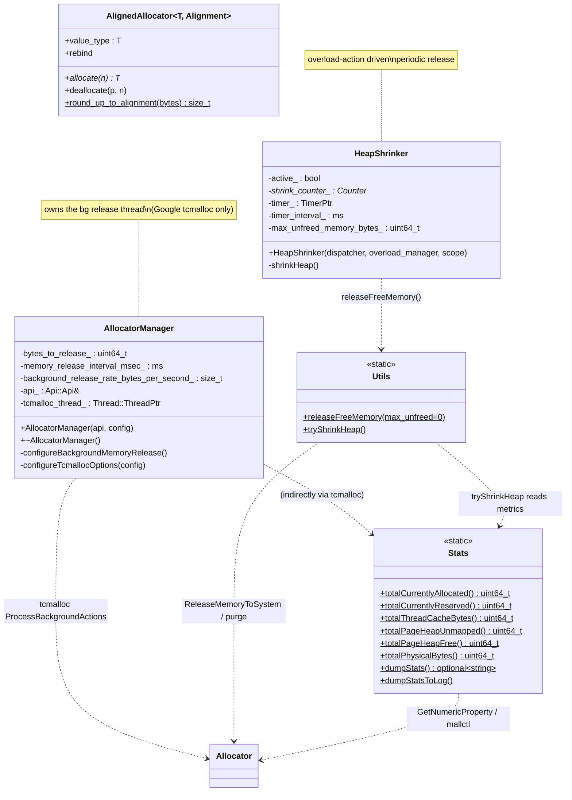
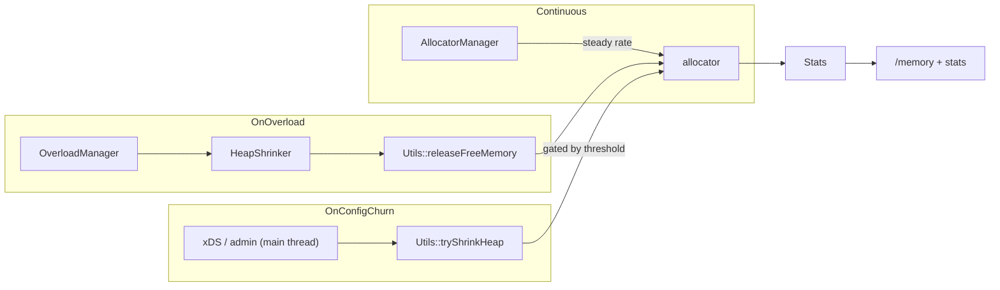
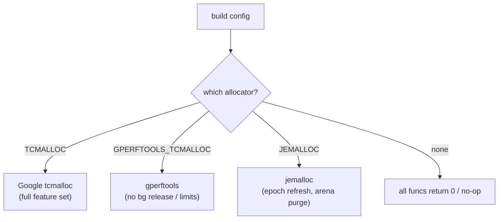

# Memory — class hierarchy (UML)

UML-style Mermaid for the memory utilities. Unlike most folders these are concrete classes with static methods
(no pure-virtual interfaces). See [`OVERVIEW.md`](OVERVIEW.md) for behavior.

---

## Components

---

## How the pieces collaborate

---

## Free functions (namespace `Memory`)

| Function | Meaning |
|---|---|
| `maxUnfreedMemoryBytes()` | Read the global unfreed-memory threshold (default 100 MB). |
| `setMaxUnfreedMemoryBytes(v)` | Set it (atomic). |

---

## Build-time selection (not a class, but the key axis)

---

## Relationship summary

| Relationship | Type | Meaning |
|---|---|---|
| `HeapShrinker` → `Utils` | uses | Releases on overload tick. |
| `Utils` → `Stats` | uses | `tryShrinkHeap` reads physical vs allocated. |
| `AllocatorManager` → allocator | owns thread | Background release loop. |
| `Stats`/`Utils`/`AllocatorManager` → allocator | compile-time `#if` | tcmalloc / gperftools / jemalloc / none. |
| `AlignedAllocator` → (STL) | allocator_traits | Standalone over-aligned allocator. |
