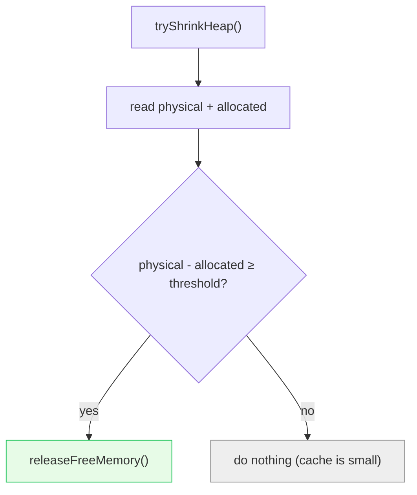
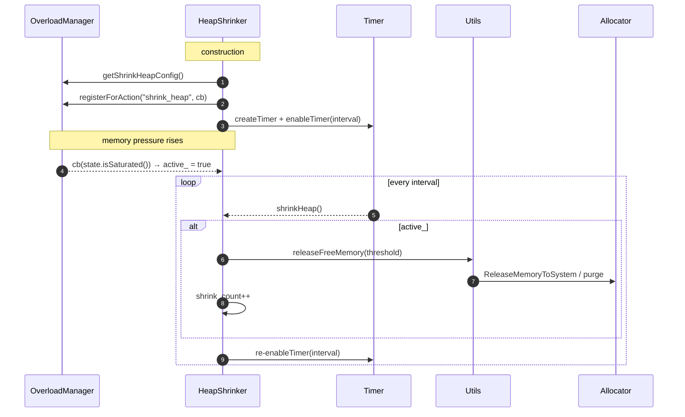
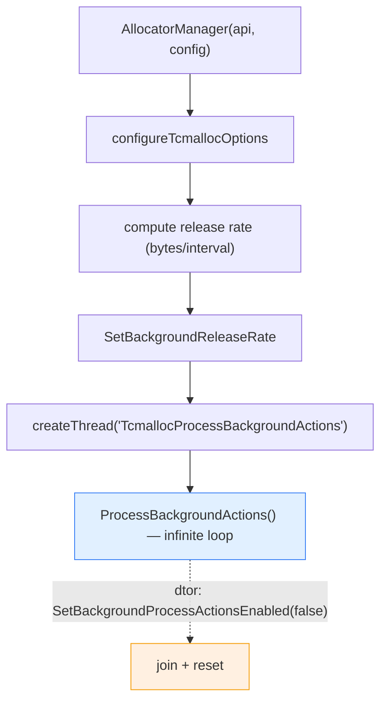

# Memory — architecture & design

How Envoy abstracts over its allocator, the two memory-release paths (background + overload), the metrics, and
the aligned allocator.

Read [`README.md`](README.md) first.

---

## Part 1 — the allocator abstraction (compile-time)

Every function in `stats.cc` and `utils.cc` is a `#if defined(...)` ladder over four worlds:

```cpp
#if defined(TCMALLOC)              // Google's modern tcmalloc
#elif defined(GPERFTOOLS_TCMALLOC) // the older gperftools tcmalloc
#elif defined(JEMALLOC)            // jemalloc
#else                              // no special allocator — return 0 / no-op
#endif
```

So there is **no runtime polymorphism** — the allocator is chosen at build time, and unused branches compile
away. The job of this folder is to present a *uniform* surface (`Stats::total*`, `Utils::releaseFreeMemory`)
regardless of which allocator is underneath.

### The metric translation table

Each `Stats` accessor maps a conceptual number onto the underlying allocator's native name:

| `Stats` accessor | tcmalloc (Google) | gperftools | jemalloc |
|---|---|---|---|
| `totalCurrentlyAllocated` | `generic.current_allocated_bytes` | same | `stats.allocated` |
| `totalCurrentlyReserved` | `generic.heap_size` + `pageheap_unmapped_bytes` | `generic.heap_size` | `stats.mapped` |
| `totalThreadCacheBytes` | `tcmalloc.current_total_thread_cache_bytes` | same | 0 (per-arena, no equiv) |
| `totalPageHeapFree` | `tcmalloc.pageheap_free_bytes` | same | `active - allocated` |
| `totalPageHeapUnmapped` | `tcmalloc.pageheap_unmapped_bytes` | same | `stats.retained` |
| `totalPhysicalBytes` | `generic.physical_memory_used` | `generic.total_physical_bytes` | `stats.resident` |

> **jemalloc gotcha:** jemalloc's stats are cached and only refreshed when you advance its "epoch". Every
> jemalloc accessor first calls `refreshJemallocEpoch()` (a `mallctl("epoch", ...)`) so the numbers it then reads
> are current. The note about `generic.heap_size` for Google tcmalloc is also important: its semantics changed to
> exclude unmapped bytes, so `totalCurrentlyReserved` explicitly adds `pageheap_unmapped_bytes` back.

`dumpStats()` / `dumpStatsToLog()` return the allocator's full human-readable stats blob (used by the `/memory`
admin endpoint and debug logging).

---

## Part 2 — releasing memory back to the OS

There are **two** numbers in tension:

- **app-allocated** bytes (`totalCurrentlyAllocated`) — what Envoy actually asked for and still holds.
- **physical** bytes (`totalPhysicalBytes`) — what the OS thinks the process is using (RSS-ish).

The gap between them is memory the allocator is *caching* — freed by the app but not yet returned to the OS.

### Path A — `Utils::releaseFreeMemory` (unconditional)

A direct request to the allocator to give pages back:

| Allocator | Action |
|---|---|
| tcmalloc (Google) | `ReleaseMemoryToSystem(threshold)` — keeps up to `threshold` unfreed |
| gperftools | `ReleaseFreeMemory()` |
| jemalloc | `mallctl("arena.<ALL>.purge")` — purge dirty pages from all arenas |

The `threshold` defaults to the global `maxUnfreedMemoryBytes()` (100 MB by default), configurable at runtime.

### Path B — `Utils::tryShrinkHeap` (threshold-gated)

Only releases when the cached gap is large enough to be worth it:

```cpp
if (total_physical_bytes >= allocated_size_by_app &&
    (total_physical_bytes - allocated_size_by_app) >= threshold) {
  Utils::releaseFreeMemory();
}
```

This is called from hot-ish main-thread paths (xDS config updates, admin handler) where reclaiming the churn from
a config reload is worthwhile but a release on *every* call would be wasteful. The PR comment in the source notes
all callers run on the main thread, so the performance impact is small.



---

## Part 3 — `HeapShrinker`: the overload-driven release loop

`HeapShrinker` connects the **overload manager's `shrink_heap` action** to periodic release. Construction:

1. Read the `shrink_heap` overload config (timer interval, max-unfreed threshold; defaults 10 s / 100 MB).
2. `registerForAction("shrink_heap", ...)` — the callback flips `active_` whenever the action's saturation
   changes. If the action isn't configured, `registerForAction` returns false and the shrinker stays inert.
3. If registered, create a stat counter `overload.shrink_heap.shrink_count` and a repeating timer.

On each timer tick:

```cpp
void HeapShrinker::shrinkHeap() {
  if (active_) {                                  // only when overload action saturated
    Utils::releaseFreeMemory(max_unfreed_memory_bytes_);
    shrink_counter_->inc();
  }
}
```



So **two independent mechanisms** can return memory: `AllocatorManager` runs continuously at a steady rate
(Part 4), while `HeapShrinker` kicks in only under overload. They complement each other.

---

## Part 4 — `AllocatorManager`: the background release thread

Constructed once at server startup from the bootstrap `MemoryAllocatorManager` config. It does two things:

### 4a. `configureTcmallocOptions`

- Sets the global `maxUnfreedMemoryBytes` if configured.
- (Google tcmalloc only) sets a **soft memory limit** and **max per-CPU cache size**. With other allocators these
  log a warning and are ignored.

### 4b. `configureBackgroundMemoryRelease`

If `bytes_to_release > 0` (and on Google tcmalloc):

1. Compute a steady **release rate** in bytes/sec from `bytes_to_release` ÷ `memory_release_interval`.
2. `SetBackgroundReleaseRate(rate)`.
3. Start a dedicated thread named `TcmallocProcessBackgroundActions` that runs
   `tcmalloc::MallocExtension::ProcessBackgroundActions()` — an **infinite loop** that performs per-CPU cache
   reclamation, cache shuffling, size-class resizing, transfer-cache plundering, and steady memory release.

The destructor cleanly stops it: `SetBackgroundProcessActionsEnabled(false)` → `join()` the thread → reset the
release rate and re-enable background actions so a *subsequent* `AllocatorManager` can start fresh (important for
tests that construct/destruct servers repeatedly).



> **Gotcha:** `ProcessBackgroundActions` is only available on Google tcmalloc and only on platforms where
> `NeedsProcessBackgroundActions()` is true. For gperftools it logs an error (releasing unsupported); for jemalloc
> the background work is handled by jemalloc itself.

---

## Part 5 — `AlignedAllocator<T, Alignment>`

A standalone STL-compatible allocator (unrelated to the release machinery) for allocating objects at a specific
power-of-two alignment — used where types need stronger alignment than `new` guarantees (e.g. cache-line-aligned
structures to avoid false sharing).

- `static_assert`s that `Alignment` is a power of two.
- `allocate` uses `std::aligned_alloc` (rounding the byte count up to a multiple of `Alignment`, as that API
  requires), or `posix_memalign` on old Android (`__ANDROID_API__ < 28`).
- **Returns `nullptr` on failure rather than throwing** `std::bad_alloc`.
- Provides `rebind`, equality operators, and `value_type` so it satisfies `allocator_traits`.

---

## Configuration & tuning knobs

| Knob | Where | Effect |
|---|---|---|
| `max_unfreed_memory_bytes` | bootstrap / `setMaxUnfreedMemoryBytes` | How much cached memory tcmalloc keeps before release (default 100 MB). |
| `bytes_to_release` + `memory_release_interval` | bootstrap | Background release rate. 0 = no background thread. |
| `soft_memory_limit_bytes` | bootstrap (Google tcmalloc) | tcmalloc soft limit. |
| `max_per_cpu_cache_size_bytes` | bootstrap (Google tcmalloc) | Per-CPU cache cap. |
| `shrink_heap` overload action (timer_interval, max_unfreed) | overload config | Drives `HeapShrinker`. |

---

## What this folder does *not* do

- **It doesn't allocate Envoy's data** — the allocator (tcmalloc/jemalloc) does. This is the *control & telemetry*
  layer around it.
- **It is not a per-request arena or buffer pool** — see `Buffer` for that.
- **No runtime allocator switching** — the allocator is fixed at build time.

---

## Cross-references

- [`CLASS_HIERARCHY.md`](CLASS_HIERARCHY.md) — UML.
- The `/memory` admin endpoint and `server.memory_allocated` / `server.memory_heap_size` stats consume `Stats`.
- The overload manager (`envoy/server/overload/`) defines the `shrink_heap` action that drives `HeapShrinker`.
