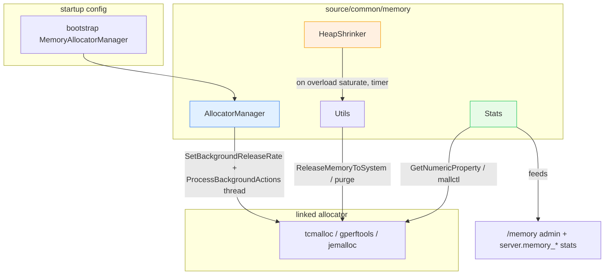

# `source/common/memory/` — allocator stats, heap release & memory tuning

This folder is Envoy's bridge to the **C++ memory allocator** (Google's tcmalloc, gperftools tcmalloc, or
jemalloc). It does three things:

1. **Reports** allocator statistics (`Stats`) — how much is allocated, reserved, cached, physically resident.
2. **Releases** free memory back to the OS on demand (`Utils`) and on overload (`HeapShrinker`).
3. **Configures & drives** the allocator's background maintenance thread (`AllocatorManager`).

Plus a small `AlignedAllocator<T, N>` STL-compatible allocator for over-aligned allocations.

> **Why this matters:** a long-running proxy accumulates freed-but-not-returned memory in the allocator's caches.
> Without active release, RSS creeps up and never comes down. This folder is what keeps Envoy's memory footprint
> honest — it feeds the `/memory` admin endpoint, the `server.memory_*` stats, and the `shrink_heap` overload
> action.

---

## The one paragraph mental model

Everything here is conditionally compiled against whichever allocator was linked: `TCMALLOC` (Google),
`GPERFTOOLS_TCMALLOC`, `JEMALLOC`, or none. `Stats` exposes a uniform set of numbers by translating each
allocator's native property names. `Utils::releaseFreeMemory()` asks the allocator to hand pages back to the OS;
`Utils::tryShrinkHeap()` only does so when the gap between physical and app-allocated bytes exceeds a threshold.
`AllocatorManager` (constructed at server startup from bootstrap config) starts tcmalloc's
`ProcessBackgroundActions` loop on a dedicated thread to release memory at a steady rate. `HeapShrinker` is the
overload-driven path: when the `shrink_heap` overload action saturates, a timer periodically calls
`releaseFreeMemory`.

---

## Folder map

```
source/common/memory/
├── BUILD
├── stats.{h,cc}            # Stats (allocator metrics) + AllocatorManager (bg release thread)
├── utils.{h,cc}            # Utils::releaseFreeMemory / tryShrinkHeap
├── heap_shrinker.{h,cc}    # HeapShrinker — overload-action-driven periodic release
└── aligned_allocator.h     # AlignedAllocator<T, Alignment> — STL allocator for over-aligned types
```

There is **no `envoy/memory/` interface directory** — these are concrete utilities, not abstractions behind pure
virtual interfaces.

---

## Components at a glance

| Component | Kind | Responsibility |
|---|---|---|
| `Stats` | static methods | Uniform allocator metrics across tcmalloc/jemalloc/none. |
| `AllocatorManager` | object (per server) | Configure tcmalloc options + run background release thread. |
| `Utils` | static methods | One-shot release / threshold-gated shrink. |
| `HeapShrinker` | object | Wire the `shrink_heap` overload action to periodic release. |
| `AlignedAllocator<T,N>` | template | `std::aligned_alloc`-based allocator for STL containers. |

---

## Per-topic table

| Topic | Document | Source |
|---|---|---|
| Allocator abstraction, the two release paths, the bg thread, alignment allocator | [`OVERVIEW.md`](OVERVIEW.md) | all files |
| Class/structure hierarchy (UML) | [`CLASS_HIERARCHY.md`](CLASS_HIERARCHY.md) | all files |

---

## Big picture



---

## Reading order

1. This `README.md` — the components and why they exist.
2. [`OVERVIEW.md`](OVERVIEW.md) — the allocator abstraction, release paths, background thread, and tuning knobs.
3. [`CLASS_HIERARCHY.md`](CLASS_HIERARCHY.md) — UML map.
