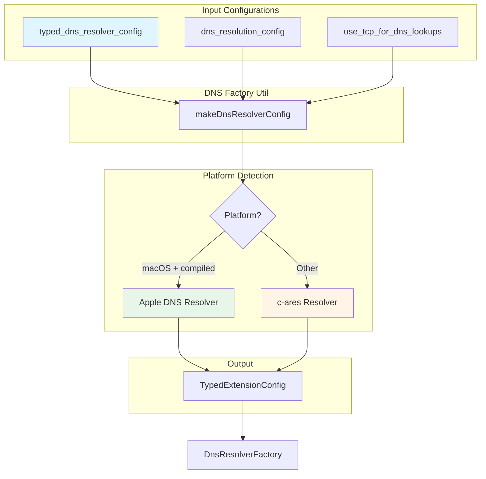
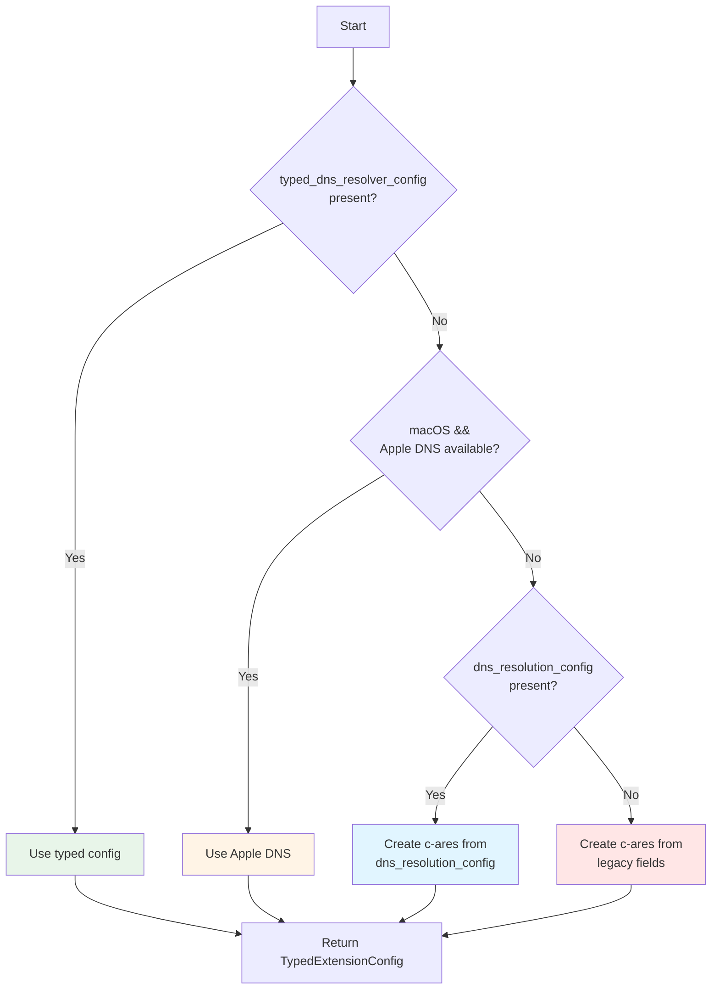
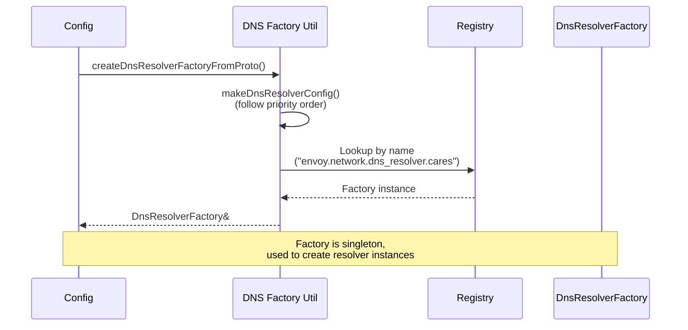
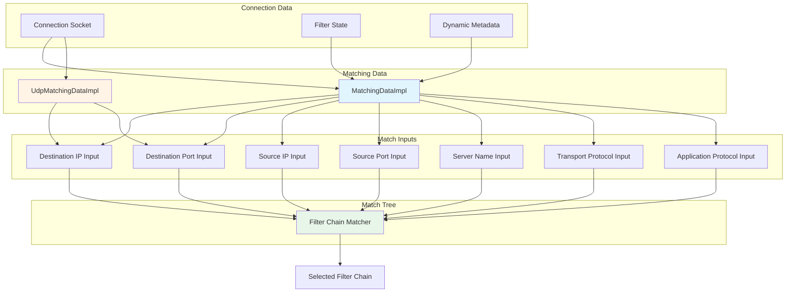
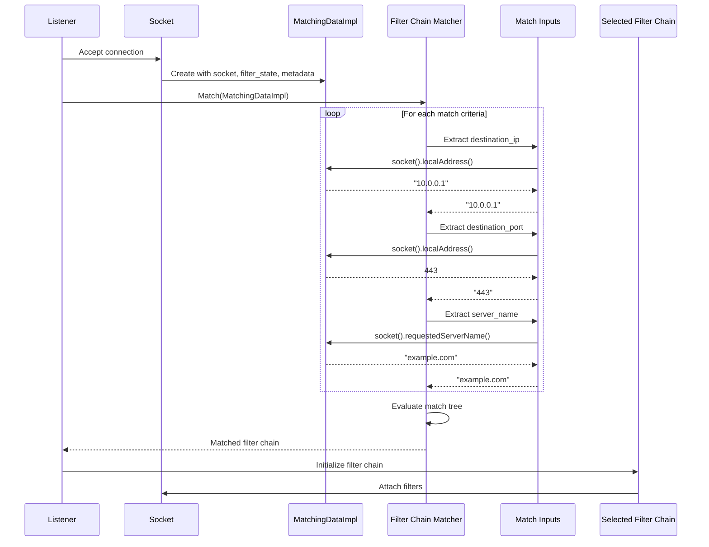

# DNS Resolution and Filter Chain Matching

This document covers DNS resolver configuration utilities and the network-level matching subsystem used for filter chain selection.

---

## Table of Contents

1. [DNS Resolver Factory Utilities](#dns-resolver-factory-utilities)
2. [Network Matching Subsystem](#network-matching-subsystem)
3. [Integration Patterns](#integration-patterns)

---

## DNS Resolver Factory Utilities

**Location:** `dns_resolver/dns_factory_util.h` (115 lines)

These utilities handle the complexity of DNS resolver configuration across different platforms and legacy config formats.

### Architecture Overview



---

## 1. DNS Resolver Types

### c-ares Resolver (Default)

**Protocol:** Uses c-ares library for asynchronous DNS resolution.

**Config Type:** `envoy::extensions::network::dns_resolver::cares::v3::CaresDnsResolverConfig`

**Features:**
- IPv4 and IPv6
- TCP and UDP queries
- Custom DNS servers
- DNS resolver options (timeout, retries)

**Creation:**
```cpp
void makeDefaultCaresDnsResolverConfig(
    envoy::config::core::v3::TypedExtensionConfig& typed_dns_resolver_config);
```

---

### Apple DNS Resolver (macOS)

**Protocol:** Uses native macOS DNS resolution APIs.

**Config Type:** `envoy::extensions::network::dns_resolver::apple::v3::AppleDnsResolverConfig`

**Advantages:**
- Respects system DNS settings
- Integrates with macOS DNS caching
- Supports mDNS/.local domains

**Creation:**
```cpp
void makeDefaultAppleDnsResolverConfig(
    envoy::config::core::v3::TypedExtensionConfig& typed_dns_resolver_config);
```

**Availability Check:**
```cpp
bool tryUseAppleApiForDnsLookups(
    envoy::config::core::v3::TypedExtensionConfig& typed_dns_resolver_config);
```

---

## 2. Configuration Resolution Flow

### Priority Order

Envoy checks configurations in this order:



### Implementation

```cpp
template <class ConfigType>
envoy::config::core::v3::TypedExtensionConfig makeDnsResolverConfig(
    const ConfigType& config) {
    envoy::config::core::v3::TypedExtensionConfig typed_dns_resolver_config;

    // Priority 1: Explicit typed config
    if (checkTypedDnsResolverConfigExist(config, typed_dns_resolver_config)) {
        return typed_dns_resolver_config;
    }

    // Priority 2: Apple DNS (if available)
    if (tryUseAppleApiForDnsLookups(typed_dns_resolver_config)) {
        return typed_dns_resolver_config;
    }

    // Priority 3: dns_resolution_config
    if (checkDnsResolutionConfigExist(config, typed_dns_resolver_config)) {
        return typed_dns_resolver_config;
    }

    // Priority 4: Legacy fields
    handleLegacyDnsResolverData(config, typed_dns_resolver_config);
    return typed_dns_resolver_config;
}
```

---

## 3. Configuration Helpers

### checkTypedDnsResolverConfigExist

Check if modern typed config is present.

```cpp
template <class ConfigType>
bool checkTypedDnsResolverConfigExist(
    const ConfigType& config,
    envoy::config::core::v3::TypedExtensionConfig& typed_dns_resolver_config) {
    if (config.has_typed_dns_resolver_config()) {
        typed_dns_resolver_config.MergeFrom(config.typed_dns_resolver_config());
        return true;
    }
    return false;
}
```

**Example Config:**
```yaml
typed_dns_resolver_config:
  name: envoy.network.dns_resolver.cares
  typed_config:
    "@type": type.googleapis.com/envoy.extensions.network.dns_resolver.cares.v3.CaresDnsResolverConfig
    resolvers:
    - socket_address:
        address: "8.8.8.8"
        port_value: 53
    dns_resolver_options:
      use_tcp_for_dns_lookups: true
      no_default_search_domain: true
```

---

### checkDnsResolutionConfigExist

Convert `dns_resolution_config` to c-ares typed config.

```cpp
template <class ConfigType>
bool checkDnsResolutionConfigExist(
    const ConfigType& config,
    envoy::config::core::v3::TypedExtensionConfig& typed_dns_resolver_config) {
    if (config.has_dns_resolution_config()) {
        envoy::extensions::network::dns_resolver::cares::v3::CaresDnsResolverConfig cares;
        
        // Copy resolvers
        if (!config.dns_resolution_config().resolvers().empty()) {
            cares.mutable_resolvers()->MergeFrom(
                config.dns_resolution_config().resolvers());
        }
        
        // Copy options
        cares.mutable_dns_resolver_options()->MergeFrom(
            config.dns_resolution_config().dns_resolver_options());
        
        typed_dns_resolver_config.mutable_typed_config()->PackFrom(cares);
        typed_dns_resolver_config.set_name(std::string(CaresDnsResolver));
        return true;
    }
    return false;
}
```

**Example Config:**
```yaml
dns_resolution_config:
  resolvers:
  - socket_address:
      address: "8.8.8.8"
      port_value: 53
  dns_resolver_options:
    use_tcp_for_dns_lookups: true
```

---

### handleLegacyDnsResolverData

Handle deprecated `use_tcp_for_dns_lookups` field.

```cpp
template <class ConfigType>
void handleLegacyDnsResolverData(
    const ConfigType& config,
    envoy::config::core::v3::TypedExtensionConfig& typed_dns_resolver_config) {
    envoy::extensions::network::dns_resolver::cares::v3::CaresDnsResolverConfig cares;
    cares.mutable_dns_resolver_options()->set_use_tcp_for_dns_lookups(
        config.use_tcp_for_dns_lookups());
    typed_dns_resolver_config.mutable_typed_config()->PackFrom(cares);
    typed_dns_resolver_config.set_name(std::string(CaresDnsResolver));
}
```

**Specialized for Cluster:**
```cpp
// Cluster config also has dns_resolvers field
void handleLegacyDnsResolverData(
    const envoy::config::cluster::v3::Cluster& config,
    envoy::config::core::v3::TypedExtensionConfig& typed_dns_resolver_config);
```

---

## 4. Factory Creation

### createDnsResolverFactoryFromProto

Main entry point for creating DNS resolver factory from config.

```cpp
template <class ConfigType>
Network::DnsResolverFactory& createDnsResolverFactoryFromProto(
    const ConfigType& config,
    envoy::config::core::v3::TypedExtensionConfig& typed_dns_resolver_config) {
    ASSERT_IS_MAIN_OR_TEST_THREAD();  // Must be called on main thread
    
    typed_dns_resolver_config = makeDnsResolverConfig(config);
    return createDnsResolverFactoryFromTypedConfig(typed_dns_resolver_config);
}
```

**Flow:**



---

### createDnsResolverFactoryFromTypedConfig

Registry lookup for typed config.

```cpp
Network::DnsResolverFactory& createDnsResolverFactoryFromTypedConfig(
    const envoy::config::core::v3::TypedExtensionConfig& typed_dns_resolver_config);
```

**Implementation:**
```cpp
// Lookup in extension registry
auto& factory = Config::Utility::getAndCheckFactory<Network::DnsResolverFactory>(
    typed_dns_resolver_config);
return factory;
```

---

### createDefaultDnsResolverFactory

Create default factory without config.

```cpp
Network::DnsResolverFactory& createDefaultDnsResolverFactory(
    envoy::config::core::v3::TypedExtensionConfig& typed_dns_resolver_config);
```

**Logic:**
1. Try Apple DNS if on macOS
2. Fall back to c-ares
3. Never throws - always returns valid factory

---

## 5. Usage Examples

### Example 1: Bootstrap Configuration

```cpp
// Bootstrap proto has dns_resolution_config
const auto& bootstrap = server.bootstrap();

envoy::config::core::v3::TypedExtensionConfig dns_config;
auto& factory = createDnsResolverFactoryFromProto(bootstrap, dns_config);

// Create resolver instance
auto resolver = factory.createDnsResolver(dispatcher, random, stats);
```

---

### Example 2: Cluster Configuration

```cpp
// Cluster may have dns_resolvers or use_tcp_for_dns_lookups (legacy)
const auto& cluster_config = proto_config;

envoy::config::core::v3::TypedExtensionConfig dns_config;
auto& factory = createDnsResolverFactoryFromProto(cluster_config, dns_config);

auto resolver = factory.createDnsResolver(dispatcher, random, stats);
```

---

### Example 3: Dynamic Forward Proxy

```cpp
// DNS cache config
const auto& dns_cache_config = proto_config;

envoy::config::core::v3::TypedExtensionConfig dns_config;
auto& factory = createDnsResolverFactoryFromProto(dns_cache_config, dns_config);

auto resolver = factory.createDnsResolver(dispatcher, random, stats);
```

---

## Network Matching Subsystem

**Location:** `matching/` subdirectory

The matching subsystem provides connection-level data to the filter chain matching algorithm.

### Architecture



---

## 6. Matching Data Implementation

### MatchingDataImpl

Provides TCP connection data to matchers.

```cpp
class MatchingDataImpl : public MatchingData {
  public:
    explicit MatchingDataImpl(
        const ConnectionSocket& socket,
        const StreamInfo::FilterState& filter_state,
        const envoy::config::core::v3::Metadata& dynamic_metadata)
        : socket_(socket),
          filter_state_(filter_state),
          dynamic_metadata_(dynamic_metadata) {}

    const ConnectionSocket& socket() const override { return socket_; }
    const StreamInfo::FilterState& filterState() const override { return filter_state_; }
    const envoy::config::core::v3::Metadata& dynamicMetadata() const override {
        return dynamic_metadata_;
    }

  private:
    const ConnectionSocket& socket_;
    const StreamInfo::FilterState& filter_state_;
    const envoy::config::core::v3::Metadata& dynamic_metadata_;
};
```

**Provides access to:**
- Connection socket (addresses, ports, SNI, ALPN)
- Filter state (shared data between filters)
- Dynamic metadata (custom attributes)

---

### UdpMatchingDataImpl

Simplified data for UDP listener matching.

```cpp
class UdpMatchingDataImpl : public UdpMatchingData {
  public:
    UdpMatchingDataImpl(
        const Address::Instance& local_address,
        const Address::Instance& remote_address)
        : local_address_(local_address),
          remote_address_(remote_address) {}

    const Address::Instance& localAddress() const override { return local_address_; }
    const Address::Instance& remoteAddress() const override { return remote_address_; }

  private:
    const Address::Instance& local_address_;
    const Address::Instance& remote_address_;
};
```

**Provides access to:**
- Local address (destination)
- Remote address (source)

**Note:** No filter state or metadata for UDP (stateless protocol).

---

## 7. Match Input Factory

### BaseFactory Template

Generic factory for creating match input extractors.

```cpp
template <class InputType, class ProtoType, class MatchingDataType>
class BaseFactory : public Matcher::DataInputFactory<MatchingDataType> {
  public:
    std::string name() const override {
        return "envoy.matching.inputs." + name_;
    }

    Matcher::DataInputFactoryCb<MatchingDataType> createDataInputFactoryCb(
        const Protobuf::Message&,
        ProtobufMessage::ValidationVisitor&) override {
        return []() { return std::make_unique<InputType>(); };
    }

    ProtobufTypes::MessagePtr createEmptyConfigProto() override {
        return std::make_unique<ProtoType>();
    }
};
```

**Purpose:** Simplifies creation of input extractors for matching.

---

## 8. Common Match Inputs

Match inputs extract specific fields from connection data.

### Destination IP

```cpp
class DestinationIPInput : public Matcher::DataInput<MatchingData> {
  public:
    std::string get(const MatchingData& data) override {
        return data.socket().connectionInfoProvider().localAddress()->ip()->addressAsString();
    }
};
```

**Config:**
```yaml
matcher_tree:
  input:
    name: envoy.matching.inputs.destination_ip
    typed_config:
      "@type": type.googleapis.com/envoy.extensions.matching.common_inputs.network.v3.DestinationIPInput
```

---

### Destination Port

```cpp
class DestinationPortInput : public Matcher::DataInput<MatchingData> {
  public:
    std::string get(const MatchingData& data) override {
        return std::to_string(data.socket().connectionInfoProvider().localAddress()->ip()->port());
    }
};
```

---

### Source IP / Source Port

Similar extractors for source address information.

---

### Server Name (SNI)

```cpp
class ServerNameInput : public Matcher::DataInput<MatchingData> {
  public:
    std::string get(const MatchingData& data) override {
        return std::string(data.socket().requestedServerName());
    }
};
```

**Use Case:** TLS SNI-based filter chain selection.

---

### Transport Protocol

```cpp
class TransportProtocolInput : public Matcher::DataInput<MatchingData> {
  public:
    std::string get(const MatchingData& data) override {
        return data.socket().detectedTransportProtocol();
    }
};
```

**Values:** `"tls"`, `"raw_buffer"`, etc.

---

### Application Protocol (ALPN)

```cpp
class ApplicationProtocolInput : public Matcher::DataInput<MatchingData> {
  public:
    std::string get(const MatchingData& data) override {
        const auto& protocols = data.socket().requestedApplicationProtocols();
        return protocols.empty() ? "" : protocols[0];
    }
};
```

**Values:** `"h2"`, `"http/1.1"`, etc.

---

## 9. Filter Chain Matching Flow

### Complete Flow



---

## 10. Integration Patterns

### Pattern 1: DNS Resolver in HTTP Connection Pool

```cpp
class HttpConnPoolImpl {
  public:
    HttpConnPoolImpl(const Cluster& cluster, ...) {
        // Get DNS resolver factory from cluster config
        envoy::config::core::v3::TypedExtensionConfig dns_config;
        auto& factory = createDnsResolverFactoryFromProto(
            cluster.info()->sourceAddress(), dns_config);
        
        // Create resolver instance
        dns_resolver_ = factory.createDnsResolver(dispatcher, random, stats);
    }
    
    void resolveHost(const std::string& hostname) {
        dns_resolver_->resolve(hostname, dns_lookup_family_,
            [this](DnsResolver::ResolutionStatus status,
                   std::list<DnsResponse>&& response) {
                // Handle DNS response
            });
    }
};
```

---

### Pattern 2: Filter Chain Matching on Listener

```cpp
class ActiveTcpListener {
  public:
    void onAccept(ConnectionSocketPtr&& socket) {
        // Create matching data
        auto matching_data = std::make_shared<Matching::MatchingDataImpl>(
            *socket,
            socket->connectionInfoProvider().filterState(),
            socket->connectionInfoProvider().dynamicMetadata()
        );
        
        // Match filter chain
        auto result = filter_chain_manager_.findFilterChain(*matching_data);
        
        if (result.has_value()) {
            // Create connection with matched filter chain
            auto connection = dispatcher_.createServerConnection(
                std::move(socket),
                result.value()->transportSocketFactory().createTransportSocket(nullptr),
                stream_info
            );
            
            // Install filters from matched chain
            result.value()->networkFilterFactory().createNetworkFilterChain(*connection);
        }
    }
};
```

---

### Pattern 3: Dynamic DNS Resolver Selection

```cpp
// Try platform-specific resolver first, fall back to default
envoy::config::core::v3::TypedExtensionConfig dns_config;

if (Runtime::runtimeFeatureEnabled("envoy.reloadable_features.use_apple_dns")) {
    if (tryUseAppleApiForDnsLookups(dns_config)) {
        auto& factory = createDnsResolverFactoryFromTypedConfig(dns_config);
        return factory.createDnsResolver(...);
    }
}

// Fall back to c-ares
auto& factory = createDefaultDnsResolverFactory(dns_config);
return factory.createDnsResolver(...);
```

---

## Configuration Examples

### Example 1: Explicit c-ares Configuration

```yaml
clusters:
- name: example_cluster
  typed_dns_resolver_config:
    name: envoy.network.dns_resolver.cares
    typed_config:
      "@type": type.googleapis.com/envoy.extensions.network.dns_resolver.cares.v3.CaresDnsResolverConfig
      resolvers:
      - socket_address:
          address: "1.1.1.1"
          port_value: 53
      - socket_address:
          address: "8.8.8.8"
          port_value: 53
      dns_resolver_options:
        use_tcp_for_dns_lookups: true
        no_default_search_domain: true
```

---

### Example 2: Apple DNS (macOS)

```yaml
clusters:
- name: example_cluster
  typed_dns_resolver_config:
    name: envoy.network.dns_resolver.apple
    typed_config:
      "@type": type.googleapis.com/envoy.extensions.network.dns_resolver.apple.v3.AppleDnsResolverConfig
      include_unroutable_families: true
```

---

### Example 3: Filter Chain Matching

```yaml
filter_chains:
- filter_chain_match:
    destination_port: 443
    server_names: ["example.com", "*.example.com"]
    transport_protocol: "tls"
    application_protocols: ["h2"]
  filters:
  - name: envoy.filters.network.http_connection_manager
    # HTTP/2 configuration
    
- filter_chain_match:
    destination_port: 443
    server_names: ["api.example.com"]
    transport_protocol: "tls"
  filters:
  - name: envoy.filters.network.http_connection_manager
    # HTTP/1.1 configuration
    
- filter_chain_match:
    destination_port: 80
  filters:
  - name: envoy.filters.network.http_connection_manager
    # Plain HTTP configuration
```

**Matching Logic:**
1. Port 443 + SNI "example.com" + TLS + ALPN "h2" → Chain 1
2. Port 443 + SNI "api.example.com" + TLS → Chain 2
3. Port 80 → Chain 3

---

## Performance Considerations

### DNS Resolution
- **c-ares:** Better for high QPS, configurable resolvers
- **Apple DNS:** Better system integration, respects local resolver config
- **Cache results:** DNS lookups are expensive (5-50ms)
- **Connection pooling:** Reuse connections to avoid repeated lookups

### Filter Chain Matching
- **Overhead:** 1-10μs per connection (depends on match tree complexity)
- **Optimization:** Put most common matches first in config
- **Cache:** Match results cached per (socket, metadata) tuple
- **Simplify:** Fewer match criteria = faster matching

---

## Summary Table

| Component | Purpose | Key APIs |
|-----------|---------|----------|
| **DNS Factory Util** | Unified DNS config handling | `makeDnsResolverConfig()`, `createDnsResolverFactoryFromProto()` |
| **MatchingDataImpl** | TCP connection data for matching | `socket()`, `filterState()`, `dynamicMetadata()` |
| **UdpMatchingDataImpl** | UDP packet data for matching | `localAddress()`, `remoteAddress()` |
| **BaseFactory** | Match input factory template | `createDataInputFactoryCb()` |
| **Match Inputs** | Extract connection attributes | Destination IP/Port, SNI, ALPN, etc. |

---

## Related Documentation

- **Filter State:** See `UTILITY_COMPONENTS.md` for filter state objects
- **Listeners:** See `listeners.md` for listener filter chain management
- **DNS Resolver API:** See `envoy/network/dns_resolver.h` for resolver interface
- **Matcher Framework:** See `envoy/matcher/matcher.h` for generic matching
