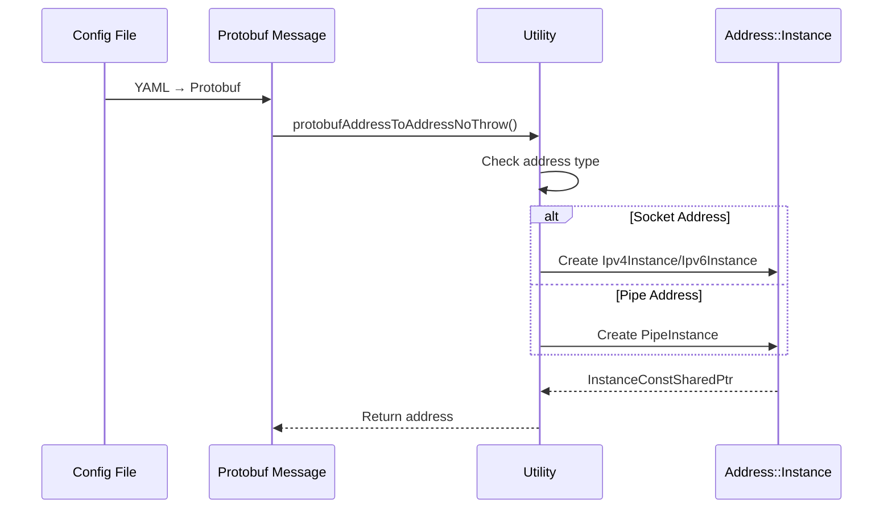
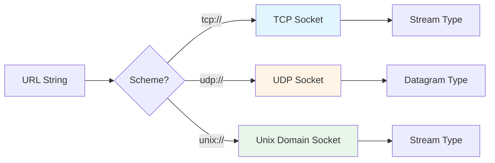
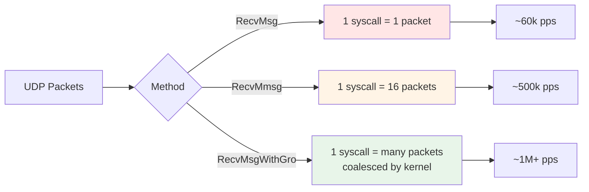
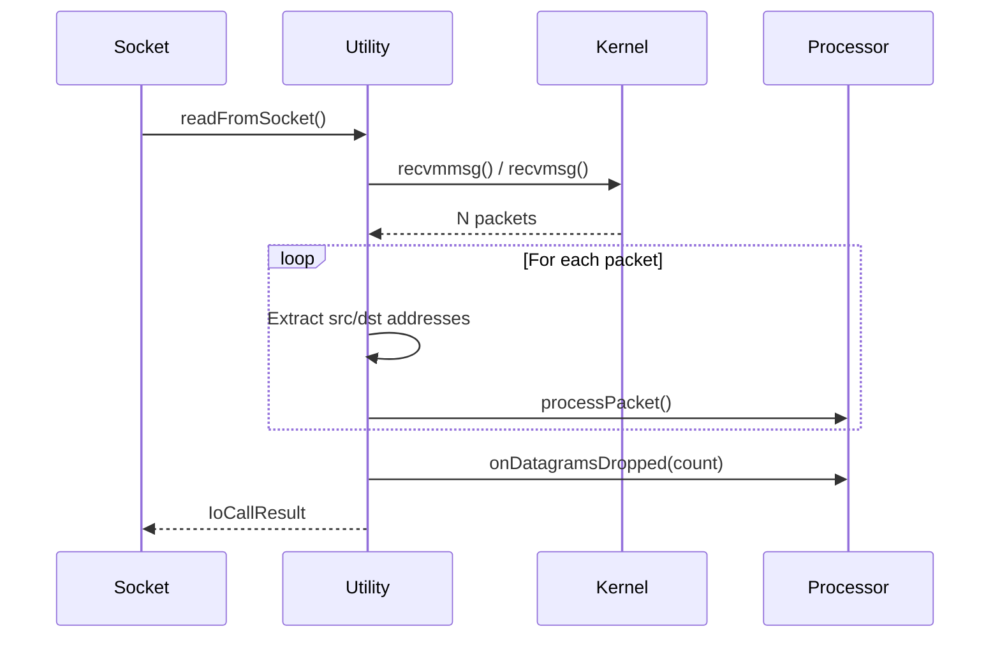
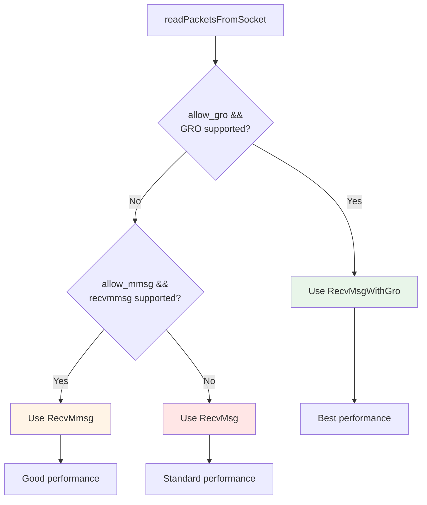
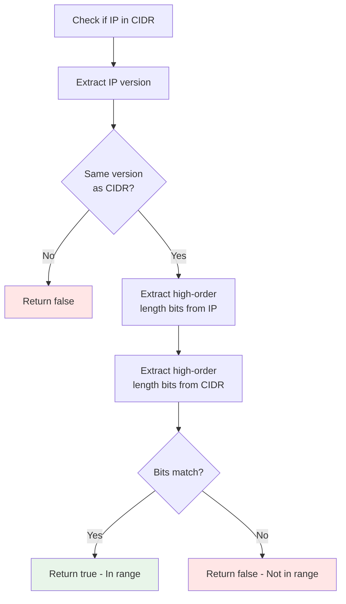
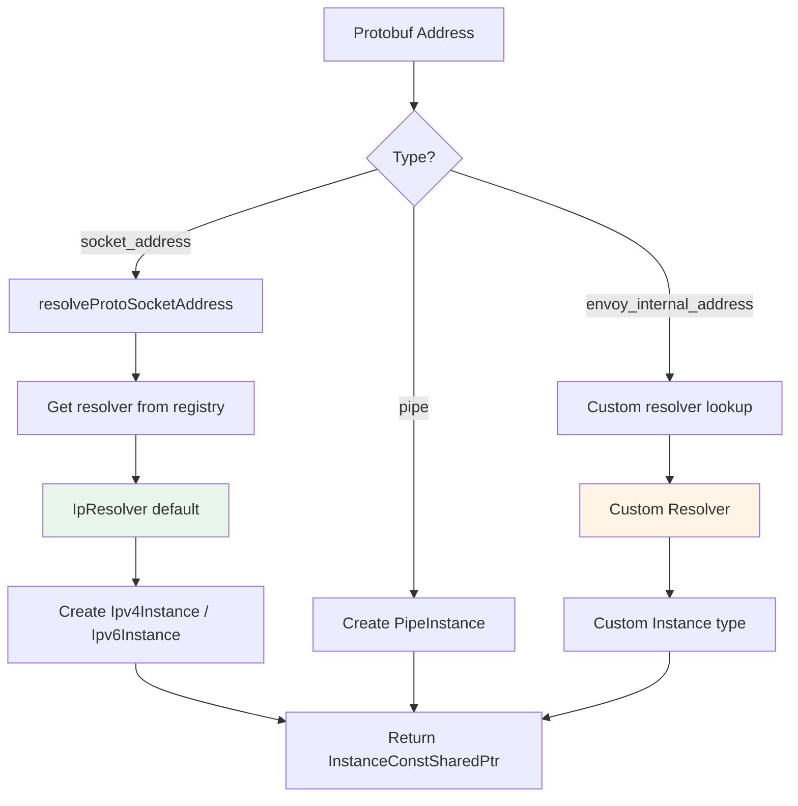
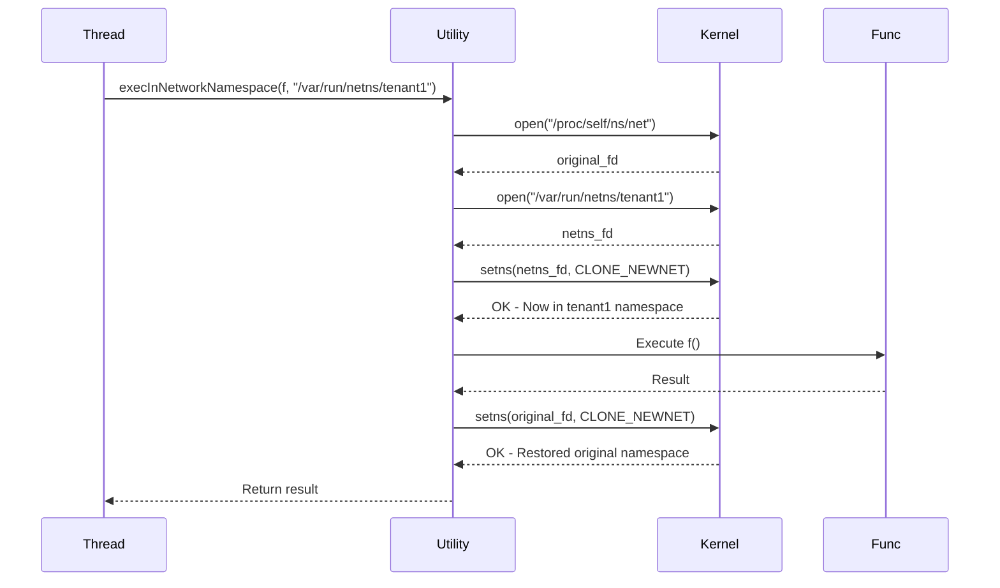
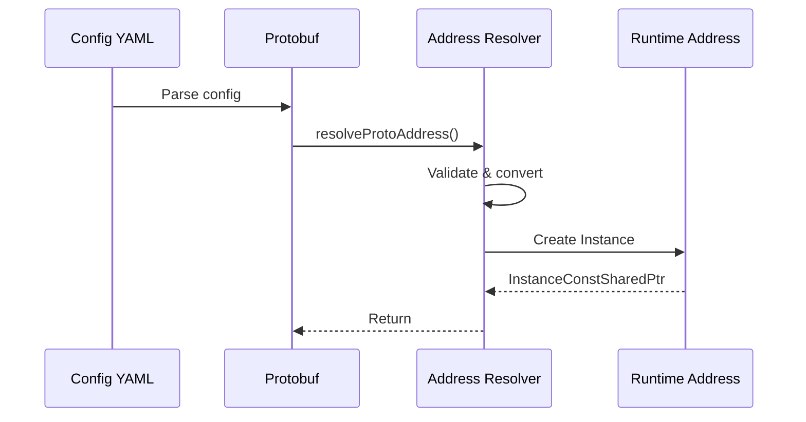

# Network Utilities

This document covers the essential utility functions and helper classes in Envoy's network layer that handle address conversions, CIDR matching, UDP operations, and protobuf resolution.

---

## Table of Contents

1. [Network Utility Class](#network-utility-class)
2. [CIDR Range Matching](#cidr-range-matching)
3. [Address Resolution](#address-resolution)
4. [UDP Packet Processing](#udp-packet-processing)

---

## Network Utility Class

**File:** `utility.h` (413 lines), `utility.cc`

The `Network::Utility` class provides a comprehensive collection of static helper functions for network operations.

### Architecture Overview

```mermaid
graph TB
    subgraph "Network::Utility Categories"
        A[Address Conversions]
        B[URL Handling]
        C[UDP Operations]
        D[IP Utilities]
        E[Special Addresses]
    end
    
    A --> A1[Protobuf ↔ Runtime]
    A --> A2[String → Instance]
    A --> A3[IPv6 byte order]
    
    B --> B1[URL parsing]
    B --> B2[Scheme detection]
    B --> B3[Socket type resolution]
    
    C --> C1[readFromSocket]
    C --> C2[writeToSocket]
    C --> C3[GRO support]
    
    D --> D1[Loopback detection]
    D --> D2[Internal address check]
    D --> D3[Original destination]
    
    E --> E1[Loopback addresses]
    E --> E2[Wildcard addresses]
    E --> E3[Catch-all CIDRs]
    
    style A fill:#e1f5ff
    style B fill:#fff4e6
    style C fill:#e8f5e9
    style D fill:#f3e5f5
    style E fill:#fff3e0
```



---

## 1. Address Conversions

### Protobuf ↔ Runtime Conversions

#### **protobufAddressToAddressNoThrow**

Converts protobuf address to runtime `Address::Instance`.

```cpp
static Address::InstanceConstSharedPtr protobufAddressToAddressNoThrow(
    const envoy::config::core::v3::Address& proto_address);
```

**Flow:**



**Example:**
```cpp
// Config: { socket_address: { address: "127.0.0.1", port_value: 8080 } }
envoy::config::core::v3::Address proto_addr;
proto_addr.mutable_socket_address()->set_address("127.0.0.1");
proto_addr.mutable_socket_address()->set_port_value(8080);

auto addr = Utility::protobufAddressToAddressNoThrow(proto_addr);
// addr->asString() == "127.0.0.1:8080"
```

---

#### **addressToProtobufAddress**

Reverse direction: runtime address → protobuf.

```cpp
static void addressToProtobufAddress(
    const Address::Instance& address,
    envoy::config::core::v3::Address& proto_address);
```

**Use Case:** Admin API dumps, dynamic configuration updates.

---

#### **protobufAddressSocketType**

Extracts socket type (TCP/UDP/Stream) from protobuf address.

```cpp
static Socket::Type protobufAddressSocketType(
    const envoy::config::core::v3::Address& proto_address);
```

**Returns:**
- `Socket::Type::Stream` - TCP or pipe
- `Socket::Type::Datagram` - UDP

---

### String Parsing

#### **parseInternetAddressNoThrow**

Parse IP address string (without port).

```cpp
static Address::InstanceConstSharedPtr parseInternetAddressNoThrow(
    const std::string& ip_address,
    uint16_t port = 0,
    bool v6only = true,
    absl::optional<std::string> network_namespace = absl::nullopt);
```

**Examples:**
```cpp
auto addr1 = Utility::parseInternetAddressNoThrow("192.168.1.1", 80);
// addr1->asString() == "192.168.1.1:80"

auto addr2 = Utility::parseInternetAddressNoThrow("::1", 443);
// addr2->asString() == "[::1]:443"
```

---

#### **parseInternetAddressAndPortNoThrow**

Parse IP address WITH port from string.

```cpp
static Address::InstanceConstSharedPtr parseInternetAddressAndPortNoThrow(
    const std::string& ip_address,
    bool v6only = true,
    absl::optional<std::string> network_namespace = absl::nullopt);
```

**Formats:**
- IPv4: `"1.2.3.4:80"`
- IPv6: `"[1234:5678::9]:443"`

**Example:**
```cpp
auto addr1 = Utility::parseInternetAddressAndPortNoThrow("10.0.0.1:8080");
auto addr2 = Utility::parseInternetAddressAndPortNoThrow("[::1]:9090");
```

---

### IPv6 Byte Order Conversion

#### **Ip6ntohl / Ip6htonl**

Convert IPv6 addresses between network and host byte order.

```cpp
static absl::uint128 Ip6ntohl(const absl::uint128& address);  // Network → Host
static absl::uint128 Ip6htonl(const absl::uint128& address);  // Host → Network
```

**Why needed:** LC-Trie and CIDR matching work in host byte order for bit manipulation.

**Example:**
```cpp
absl::uint128 network_order = ipv6->address();
absl::uint128 host_order = Utility::Ip6ntohl(network_order);

// Now can do bit manipulation
IpType masked = host_order & mask;
```

---

## 2. URL Handling

### URL Schemes

Envoy supports three URL schemes:



### Functions

#### **resolveUrl**

Parse URL and create address instance.

```cpp
static absl::StatusOr<Address::InstanceConstSharedPtr> resolveUrl(
    const std::string& url);
```

**Examples:**
```cpp
auto addr1 = Utility::resolveUrl("tcp://127.0.0.1:8080");
auto addr2 = Utility::resolveUrl("udp://0.0.0.0:53");
auto addr3 = Utility::resolveUrl("unix:///tmp/envoy.sock");
```

---

#### **socketTypeFromUrl**

Determine socket type from URL without creating address.

```cpp
static StatusOr<Socket::Type> socketTypeFromUrl(const std::string& url);
```

**Returns:**
- `Socket::Type::Stream` for tcp:// or unix://
- `Socket::Type::Datagram` for udp://

---

#### **urlFromDatagramAddress**

Create URL string from address (for UDP sockets).

```cpp
static std::string urlFromDatagramAddress(const Address::Instance& addr);
```

**Output:**
- IP addresses → `"udp://1.2.3.4:5678"`
- Pipes → `"unix:///path/to/socket"`

---

#### **Scheme Detection**

Quick checks without full parsing:

```cpp
static bool urlIsTcpScheme(absl::string_view url);
static bool urlIsUdpScheme(absl::string_view url);
static bool urlIsUnixScheme(absl::string_view url);
```

**Example:**
```cpp
if (Utility::urlIsUdpScheme("udp://0.0.0.0:8080")) {
    // Handle UDP-specific logic
}
```

---

## 3. Special Addresses

### Loopback Addresses

#### **getCanonicalIpv4LoopbackAddress**

Returns `127.0.0.1`.

```cpp
static Address::InstanceConstSharedPtr getCanonicalIpv4LoopbackAddress();
```

**Note:** Full range `127.0.0.0/8` is loopback, but `127.0.0.1` is canonical.

---

#### **getIpv6LoopbackAddress**

Returns `::1`.

```cpp
static Address::InstanceConstSharedPtr getIpv6LoopbackAddress();
```

---

### Wildcard Addresses (Bind-any)

Used for listening on all interfaces.

#### **getIpv4AnyAddress**

Returns `0.0.0.0`.

```cpp
static Address::InstanceConstSharedPtr getIpv4AnyAddress();
```

#### **getIpv6AnyAddress**

Returns `::`.

```cpp
static Address::InstanceConstSharedPtr getIpv6AnyAddress();
```

**Usage:**
```cpp
// Listen on all interfaces
auto bind_addr = Utility::getIpv4AnyAddress();
socket.bind(Utility::getAddressWithPort(*bind_addr, 8080));
```

---

### CIDR Catch-All

#### **getIpv4CidrCatchAllAddress**

Returns `"0.0.0.0/0"` (matches all IPv4 addresses).

#### **getIpv6CidrCatchAllAddress**

Returns `"::/0"` (matches all IPv6 addresses).

---

## 4. IP Address Utilities

### Address Classification

#### **isLoopbackAddress**

Check if address is loopback.

```cpp
static bool isLoopbackAddress(const Address::Instance& address);
```

**Returns true for:**
- IPv4: `127.0.0.0/8`
- IPv6: `::1`

---

#### **isInternalAddress**

Check if address is RFC1918 private address.

```cpp
static bool isInternalAddress(const Address::Instance& address);
```

**Returns true for:**
- `10.0.0.0/8`
- `172.16.0.0/12`
- `192.168.0.0/16`
- IPv6 link-local: `fe80::/10`
- IPv6 unique local: `fc00::/7`

---

#### **isSameIpOrLoopback**

Determine if connection is local (same IP or loopback).

```cpp
static bool isSameIpOrLoopback(const ConnectionInfoProvider& socket);
```

**Use Case:** Trust decisions for local connections.

---

### Address Manipulation

#### **getAddressWithPort**

Clone address with different port.

```cpp
static Address::InstanceConstSharedPtr getAddressWithPort(
    const Address::Instance& address,
    uint32_t port);
```

**Example:**
```cpp
auto base_addr = parseInternetAddressNoThrow("192.168.1.1");
auto addr_8080 = Utility::getAddressWithPort(*base_addr, 8080);
auto addr_9090 = Utility::getAddressWithPort(*base_addr, 9090);
```

---

#### **getOriginalDst**

Retrieve original destination from redirected socket (iptables REDIRECT/TPROXY).

```cpp
static Address::InstanceConstSharedPtr getOriginalDst(Socket& sock);
```

**Platform-specific:**
- Linux: Uses `SO_ORIGINAL_DST` / `IP6T_SO_ORIGINAL_DST`
- Windows: Uses redirect records

**Use Case:** Transparent proxy, original destination listener filter.

---

#### **getLocalAddress**

Get first non-loopback local interface address.

```cpp
static Address::InstanceConstSharedPtr getLocalAddress(
    const Address::IpVersion version);
```

**Fallback:** Returns loopback if no public interfaces found.

---

## UDP Packet Processing

### ResolvedUdpSocketConfig

Configuration wrapper for UDP sockets with defaults.

```cpp
struct ResolvedUdpSocketConfig {
    ResolvedUdpSocketConfig(
        const envoy::config::core::v3::UdpSocketConfig& config,
        bool prefer_gro_default);

    uint64_t max_rx_datagram_size_;  // Default: 1500
    bool prefer_gro_;                // Generic Receive Offload
};
```

**Defaults:**
```cpp
static const uint64_t DEFAULT_UDP_MAX_DATAGRAM_SIZE = 1500;
static const uint64_t NUM_DATAGRAMS_PER_RECEIVE = 16;
static const uint64_t MAX_NUM_PACKETS_PER_EVENT_LOOP = 6000;
```

---

### UdpPacketProcessor Interface

Callback interface for processing received UDP packets.

```cpp
class UdpPacketProcessor {
  public:
    virtual void processPacket(
        Address::InstanceConstSharedPtr local_address,
        Address::InstanceConstSharedPtr peer_address,
        Buffer::InstancePtr buffer,
        MonotonicTime receive_time,
        uint8_t tos,
        Buffer::OwnedImpl saved_cmsg) PURE;

    virtual void onDatagramsDropped(uint32_t dropped) PURE;
    virtual uint64_t maxDatagramSize() const PURE;
    virtual size_t numPacketsExpectedPerEventLoop() const PURE;
};
```

---

### UDP Receive Methods

Envoy supports three system call strategies:

```cpp
enum class UdpRecvMsgMethod {
    RecvMsg,           // Standard recvmsg
    RecvMsgWithGro,    // recvmsg with GRO (Linux)
    RecvMmsg,          // recvmmsg (batch)
};
```

**Performance Comparison:**



---

### readFromSocket

Read single batch of packets.

```cpp
static Api::IoCallUint64Result readFromSocket(
    IoHandle& handle,
    const Address::Instance& local_address,
    UdpPacketProcessor& udp_packet_processor,
    TimeSource& time_source,
    UdpRecvMsgMethod recv_msg_method,
    uint32_t* packets_dropped,
    uint32_t* num_packets_read);
```

**Flow:**



---

### readPacketsFromSocket

Read multiple batches up to `MAX_NUM_PACKETS_PER_EVENT_LOOP`.

```cpp
static Api::IoErrorPtr readPacketsFromSocket(
    IoHandle& handle,
    const Address::Instance& local_address,
    UdpPacketProcessor& udp_packet_processor,
    TimeSource& time_source,
    bool allow_gro,
    bool allow_mmsg,
    uint32_t& packets_dropped);
```

**Features:**
- Auto-detects GRO support
- Falls back to recvmmsg if GRO unavailable
- Limits packets per event loop for fairness

**Method Selection:**



---

### writeToSocket

Send UDP packet with optional source address control.

```cpp
static Api::IoCallUint64Result writeToSocket(
    IoHandle& handle,
    Buffer::RawSlice* slices,
    uint64_t num_slices,
    const Address::Ip* local_ip,        // Source IP override
    const Address::Instance& peer_address);
```

**Use Cases:**
- Normal UDP send: `local_ip = nullptr`
- Source address spoofing (for testing): `local_ip = specific_addr`
- Multi-homed servers: `local_ip = specific_interface_addr`

---

## CIDR Range Matching

**File:** `cidr_range.h` (148 lines), `cidr_range.cc`

### CidrRange Class

Represents a CIDR range (IP + prefix length).

```cpp
class CidrRange {
  public:
    // Create from address + length
    static absl::StatusOr<CidrRange> create(
        InstanceConstSharedPtr address,
        int length);

    // Create from string "192.168.1.0/24"
    static absl::StatusOr<CidrRange> create(const std::string& range);

    // Create from protobuf
    static absl::StatusOr<CidrRange> create(
        const envoy::config::core::v3::CidrRange& cidr);

    // Check if address is in range
    bool isInRange(const Instance& address) const;

    // Get components
    const Ip* ip() const;
    int length() const;  // -1 if invalid

    // String representation
    std::string asString() const;  // "10.0.0.0/8"
};
```

---

### CIDR Matching Logic



**Example:**
```cpp
auto cidr = CidrRange::create("192.168.0.0/16").value();

auto addr1 = parseInternetAddressNoThrow("192.168.1.100");
cidr.isInRange(*addr1);  // true

auto addr2 = parseInternetAddressNoThrow("10.0.0.1");
cidr.isInRange(*addr2);  // false
```

---

### Address Truncation

**truncateIpAddressAndLength** - Zero out bits beyond prefix length.

```cpp
static InstanceConstSharedPtr truncateIpAddressAndLength(
    InstanceConstSharedPtr address,
    int* length_io);
```

**Example:**
```cpp
auto addr = parseInternetAddressNoThrow("192.168.1.100");
int length = 16;
auto truncated = CidrRange::truncateIpAddressAndLength(addr, &length);
// truncated->asString() == "192.168.0.0"
// length == 16
```

**Visual:**
```
Input:  192.168.1.100/16
        11000000.10101000.00000001.01100100
        <----16 bits----->

Output: 192.168.0.0/16
        11000000.10101000.00000000.00000000
        <----16 bits----->  zeros
```

---

### IpList Class

Efficiently check if IP matches any CIDR in a list.

```cpp
class IpList {
  public:
    static absl::StatusOr<std::unique_ptr<IpList>> create(
        const Protobuf::RepeatedPtrField<envoy::config::core::v3::CidrRange>& cidrs);

    bool contains(const Instance& address) const;
    size_t getIpListSize() const;
};
```

**Usage:**
```cpp
// Config: allowed_cidrs: ["10.0.0.0/8", "172.16.0.0/12", "192.168.0.0/16"]
auto ip_list = IpList::create(proto_config.allowed_cidrs()).value();

auto client_addr = connection.connectionInfoProvider().remoteAddress();
if (ip_list->contains(*client_addr)) {
    // Allow internal traffic
}
```

**Implementation:**
- Iterates through all CIDR ranges
- For large lists, consider using LC-Trie (see UTILITY_COMPONENTS.md)

---

## Address Resolution

**File:** `resolver_impl.h` (32 lines), `resolver_impl.cc`

### resolveProtoAddress

Main entry point for protobuf → runtime address conversion.

```cpp
absl::StatusOr<Address::InstanceConstSharedPtr> resolveProtoAddress(
    const envoy::config::core::v3::Address& address);
```

**Delegates to:**
```cpp
absl::StatusOr<Address::InstanceConstSharedPtr> resolveProtoSocketAddress(
    const envoy::config::core::v3::SocketAddress& address);
```

---

### IpResolver

Default resolver registered in extension registry.

```cpp
DECLARE_FACTORY(IpResolver);
```

**Handles:**
- IPv4 addresses
- IPv6 addresses
- Standard socket addresses

**Extension Point:** Custom resolvers can be registered for:
- Custom address families
- Special protocol addresses
- Dynamic resolution with external lookups

---

### Resolution Flow



**Example:**
```cpp
envoy::config::core::v3::Address proto_addr;
auto* socket_addr = proto_addr.mutable_socket_address();
socket_addr->set_address("10.0.0.1");
socket_addr->set_port_value(8080);

auto addr = Address::resolveProtoAddress(proto_addr).value();
// addr is Ipv4Instance("10.0.0.1:8080")
```

---

## Network Namespace Support (Linux)

### execInNetworkNamespace

Execute function in different network namespace.

```cpp
template <typename Func>
static auto execInNetworkNamespace(Func&& f, const char* netns)
    -> absl::StatusOr<typename std::invoke_result_t<Func>>;
```

**Flow:**



**Use Case:**
```cpp
auto result = Utility::execInNetworkNamespace(
    []() {
        // Create socket in specific namespace
        return createSocket();
    },
    "/var/run/netns/tenant1"
);
```

**Safety:**
- Automatically restores original namespace
- Uses RAII for file descriptor cleanup
- RELEASE_ASSERT if restoration fails (unrecoverable)

---

## Common Patterns

### Pattern 1: Config to Runtime Address



```cpp
// Step 1: Load config
envoy::config::core::v3::Address proto_addr;
MessageUtil::loadFromYaml(yaml_string, proto_addr);

// Step 2: Resolve to runtime address
auto addr = Address::resolveProtoAddress(proto_addr).value();

// Step 3: Use in socket operations
socket->bind(addr);
```

---

### Pattern 2: Access Control by CIDR

```cpp
// Initialize allow list
std::vector<Address::CidrRange> allowed_ranges = {
    Address::CidrRange::create("10.0.0.0/8").value(),
    Address::CidrRange::create("172.16.0.0/12").value(),
};

// Check client IP
auto client_ip = connection.connectionInfoProvider().remoteAddress();
bool allowed = false;
for (const auto& range : allowed_ranges) {
    if (range.isInRange(*client_ip)) {
        allowed = true;
        break;
    }
}

// For large lists, use IpList or LC-Trie instead
```

---

### Pattern 3: UDP Packet Batch Processing

```cpp
class MyUdpProcessor : public UdpPacketProcessor {
  public:
    void processPacket(
        Address::InstanceConstSharedPtr local_address,
        Address::InstanceConstSharedPtr peer_address,
        Buffer::InstancePtr buffer,
        MonotonicTime receive_time,
        uint8_t tos,
        Buffer::OwnedImpl saved_cmsg) override {
        // Handle packet
    }

    uint64_t maxDatagramSize() const override { return 9000; }
    size_t numPacketsExpectedPerEventLoop() const override { return 100; }
};

// In UDP listener
MyUdpProcessor processor;
uint32_t packets_dropped = 0;

auto error = Utility::readPacketsFromSocket(
    handle,
    local_address,
    processor,
    time_source,
    true,   // allow_gro
    true,   // allow_mmsg
    packets_dropped
);
```

---

## Performance Considerations

### Address Parsing
- **Cache parsed addresses:** Don't parse same string repeatedly
- **Use NoThrow variants:** Avoid exception overhead in hot paths
- **Prefer protobuf resolution:** Direct conversion is faster than string parsing

### CIDR Matching
- **Small lists (<10):** Use `IpList` (linear scan is fast)
- **Large lists (>100):** Use `LC-Trie` (O(log n) lookup)
- **Avoid string conversions:** Use `Ip*` methods directly

### UDP Operations
- **Enable GRO:** 10-20x throughput improvement on Linux
- **Use recvmmsg:** 5-10x better than recvmsg
- **Batch processing:** Process multiple packets per event loop iteration
- **Avoid malloc:** Reuse buffers when possible

---

## Summary Table

| Component | Purpose | Key Methods |
|-----------|---------|-------------|
| **Utility** | Core network helpers | Address parsing, URL handling, UDP I/O |
| **CidrRange** | IP range representation | `create()`, `isInRange()` |
| **IpList** | Multiple CIDR matching | `contains()` |
| **Resolver** | Protobuf → Runtime | `resolveProtoAddress()` |
| **UdpPacketProcessor** | UDP callback interface | `processPacket()` |
| **ResolvedUdpSocketConfig** | UDP socket configuration | Wraps proto config with defaults |

---

## Related Documentation

- **LC-Trie:** See `UTILITY_COMPONENTS.md` for fast IP lookup data structure
- **Filter State:** See `UTILITY_COMPONENTS.md` for network namespace filter state
- **Addresses:** See `address_impl.md` for `Address::Instance` implementation details
- **Sockets:** See `socket_and_io_handle.md` for IoHandle and socket operations
