# Envoy Network Layer — Overview Part 1: Architecture & Connections

**Directory:** `source/common/network/`  
**Part:** 1 of 4 — Overall Architecture, TCP Connections, Happy Eyeballs, Filter Manager

---

## Table of Contents

1. [High-Level Architecture](#1-high-level-architecture)
2. [Component Map](#2-component-map)
3. [Connection Hierarchy](#3-connection-hierarchy)
4. [ConnectionImpl Deep Dive](#4-connectionimpl-deep-dive)
5. [Data Flow: Read and Write Paths](#5-data-flow-read-and-write-paths)
6. [Watermark and Backpressure](#6-watermark-and-backpressure)
7. [FilterManagerImpl — Network Filter Chain](#7-filtermanagerimpl--network-filter-chain)
8. [HappyEyeballsConnectionImpl — RFC 8305](#8-happyeyeballsconnectionimpl--rfc-8305)
9. [Key Design Patterns](#9-key-design-patterns)

---

## 1. High-Level Architecture

**Code Path Through Network Layer:**

**Downstream Path (Client → Envoy)** (`tcp_listener_impl.cc:200-270`, `connection_impl.cc:120-450`):
- **Listener Accept**: `TcpListenerImpl::onSocketEvent()` → `accept()` syscall → returns connected socket fd
- **Listener Filters**: `ActiveTcpSocket::continueFilterChain()` → TLS Inspector calls `SSL_peek()` → extracts SNI/ALPN → stores in `StreamInfo`
- **Server Connection**: `ServerConnectionImpl` created with socket → `connection_impl_base.cc:65`
  - Wraps fd in `IoSocketHandleImpl` or `IoUringSocketHandleImpl`
  - Creates `TransportSocket` (TLS or RawBufferSocket)
  - Registers file event with dispatcher: `enableFileEvents(Read | Write)`

**Connection Layer (Core Processing)** (`filter_manager_impl.cc:85-320`):
- **Filter Chain**: `FilterManagerImpl::onContinueReading()` → iterates `upstream_filters_` list
  - Each filter's `onData(buffer)` called with incoming bytes
  - Filter returns: `Continue` → advance to next, `StopIteration` → pause, `Close` → terminate
- **Transport Socket**: `TransportSocketImpl::doRead()` / `doWrite()`
  - TLS: `SSL_read()` / `SSL_write()` with OpenSSL
  - Raw: Direct `IoHandle::read()` / `write()` syscalls
  - QUIC: `quic::QuicSession::ProcessUdpPacket()`
- **I/O Handle**: `IoSocketHandleImpl::write(buffer)` → `::writev()` syscall
  - Returns bytes written → updates buffer drain position
  - `EAGAIN` → re-enables write events, waits for socket writeable

**Upstream Path (Envoy → Backend)** (`happy_eyeballs_connection_impl.cc:120-280`):
- **Connection Initiation**: `ClientConnectionImpl::connect()` → `socket()` + `::connect()` non-blocking
- **Happy Eyeballs**: Races IPv4 and IPv6 addresses
  - Primary connection attempt starts immediately
  - Secondary family waits 300ms (connection delay timer)
  - First successful connection wins → closes other attempt
- **Same Layers**: Uses identical `FilterManagerImpl`, `TransportSocket`, `IoHandle` infrastructure

**Key Mechanisms:**
- **Event Loop Integration**: All I/O operations are non-blocking with dispatcher callbacks
- **Buffer Management**: Read/write buffers with high/low watermark backpressure
- **Filter Chain**: Same network filter interface for downstream and upstream
- **Transport Abstraction**: Filters agnostic to encryption layer (TLS transparent)

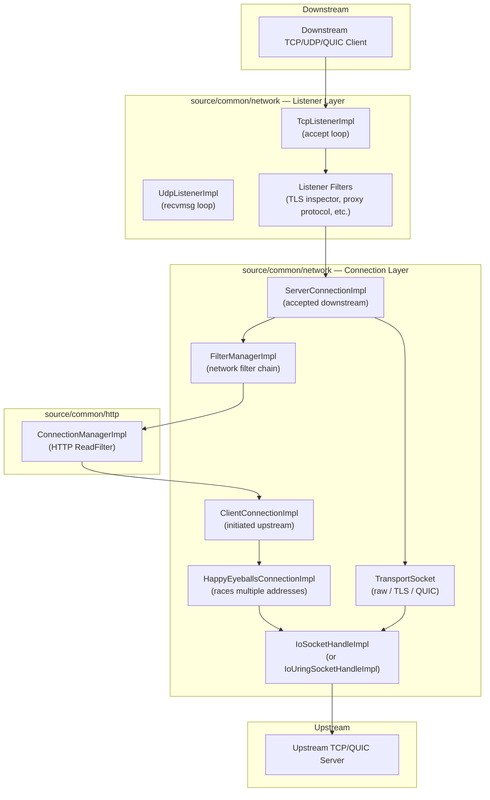

---

## 2. Component Map

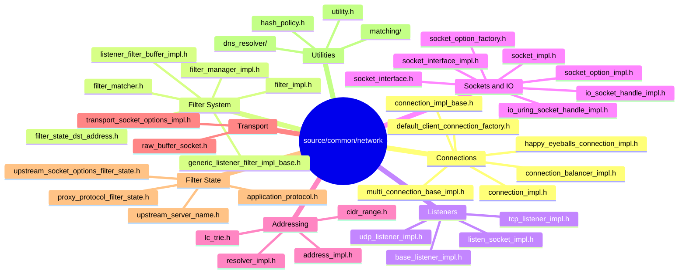

---

## 3. Connection Hierarchy

**This class hierarchy shows how connections are structured in Envoy:**

**Base Classes:**
- **ConnectionImplBase**: Provides common functionality
  - Connection ID generation and tracking
  - Connection callback management (connect, close, etc.)
  - Delayed close timer for graceful shutdown
  - Dispatcher integration for event loop

- **ConnectionImpl**: Adds full connection functionality
  - **Filter chain management**: Read and write filters
  - **Transport socket integration**: TLS or raw buffers
  - **I/O buffers**: Read and write buffers with watermarks
  - **Data transfer**: `write()` for sending, `onReadReady()` for receiving
  - **Backpressure**: High/low watermark notifications

**Concrete Implementations:**
- **ServerConnectionImpl**: For accepted downstream connections
  - Created by listener after `accept()`
  - May have transport connect timeout (for TLS handshake)

- **ClientConnectionImpl**: For initiated upstream connections
  - Created when connecting to upstream server
  - Has `connect()` method to initiate connection
  - Tracks connection addresses and stream info

**Why This Hierarchy:**
- Common code in base classes prevents duplication
- Server vs Client differences are minimal (mainly initiation direction)
- Both use identical filter chain and transport infrastructure
- Polymorphism allows treating all connections uniformly

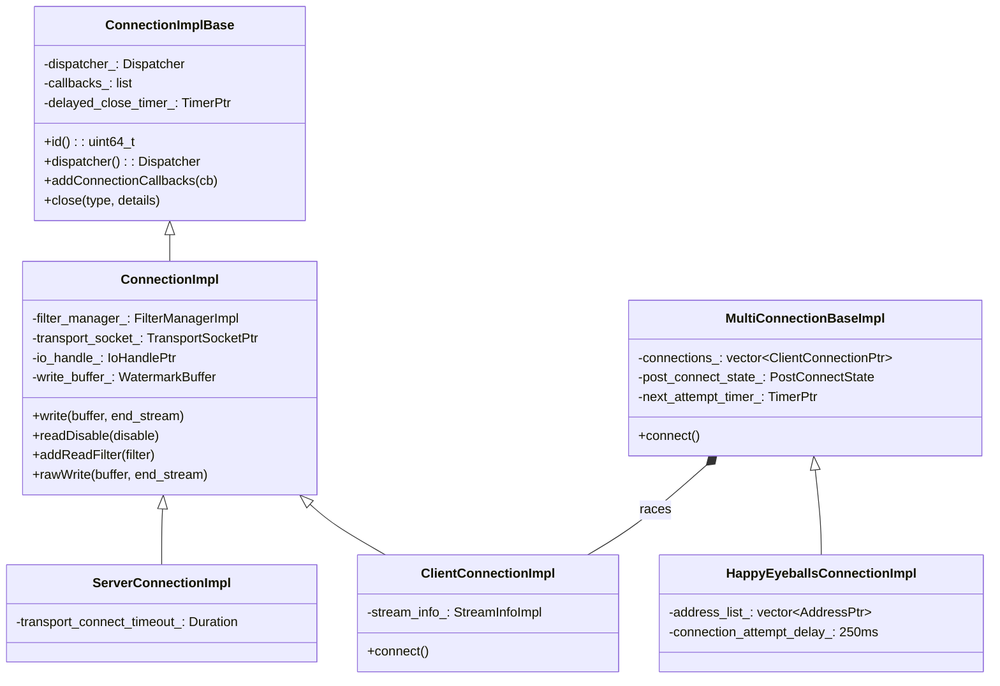

**Class Responsibilities and Code Paths:**

**`ConnectionImplBase`** (`connection_impl_base.h:35-120`, `connection_impl_base.cc:25-180`):
- **Purpose**: Provides lifecycle management and callback infrastructure for all connections
- **Key Members**:
  - `id_: uint64_t` - Unique connection ID from atomic counter
  - `dispatcher_: Event::Dispatcher&` - Event loop for this connection
  - `callbacks_: std::list<ConnectionCallbacks*>` - Observers for connection events
  - `delayed_close_timer_: Event::TimerPtr` - Allows drain before close (graceful shutdown)
- **Key Methods**:
  - `addConnectionCallbacks(cb)` - Register for `onEvent()` notifications
  - `close(type, details)` - Immediate or delayed close based on type (`FlushWrite`, `NoFlush`)
  - `initializeDelayedCloseTimer()` - Arms timer for graceful close window

**`ConnectionImpl`** (`connection_impl.h:60-280`, `connection_impl.cc:120-850`):
- **Purpose**: Core connection logic with filter chain, transport, I/O, and buffer management
- **Key Members**:
  - `filter_manager_: std::unique_ptr<FilterManagerImpl>` - Manages network filter chain execution
  - `transport_socket_: TransportSocketPtr` - Encryption layer (TLS, raw, QUIC)
  - `io_handle_: IoHandlePtr` - Socket wrapper with file event registration
  - `write_buffer_: Buffer::WatermarkBuffer` - Outbound bytes with high/low watermark callbacks
  - `read_buffer_: Buffer::OwnedImpl` - Inbound bytes from `read()` syscall
- **Key Methods**:
  - `write(buffer, end_stream)` - Adds to write buffer → triggers `onLowWatermark()` if needed
  - `onReadReady()` - Called by dispatcher → `transport_socket_->doRead()` → fills read buffer
  - `onWriteReady()` - Socket writeable → `transport_socket_->doWrite()` → drains write buffer
  - `readDisable(disable)` - Stops read events (backpressure from upstream filters)

**`ServerConnectionImpl`** (`connection_impl.h:285-310`):
- **Purpose**: Accepted downstream connections with optional TLS handshake timeout
- **Key Addition**:
  - `transport_connect_timeout_: std::chrono::milliseconds` - Max time for TLS handshake after accept
  - Timer started on creation → closed if transport not ready in time
- **Created By**: `ActiveStreamListenerBase::newActiveConnection()` after listener filters pass

**`ClientConnectionImpl`** (`connection_impl.h:315-360`):
- **Purpose**: Envoy-initiated upstream connections with `connect()` support
- **Key Additions**:
  - `connect()` - Calls `socket()` + `::connect()` non-blocking → registers for write event → `onConnected()` when writeable
  - `stream_info_: StreamInfo::StreamInfoImpl` - Tracks connection metadata (start time, bytes, upstream host)
- **Created By**: Cluster connection pools or Happy Eyeballs for upstream connections

**`MultiConnectionBaseImpl`** (`multi_connection_base_impl.h:40-150`):
- **Purpose**: Base for racing multiple connection attempts (Happy Eyeballs pattern)
- **Key Members**:
  - `connections_: std::vector<ClientConnectionPtr>` - All attempts in progress
  - `next_attempt_timer_: Event::TimerPtr` - Delays secondary address family by 250ms
  - `post_connect_state_: PostConnectState` - Tracks which connection won the race
- **Method**: `connect()` - Starts primary connection immediately, schedules secondary after delay

**`HappyEyeballsConnectionImpl`** (`happy_eyeballs_connection_impl.h:30-95`):
- **Purpose**: RFC 8305 dual-stack connection racing (IPv6 vs IPv4)
- **Key Member**:
  - `address_list_: std::vector<Address::InstanceConstSharedPtr>` - Sorted by address family
  - `connection_attempt_delay_: 250ms` - Delay before starting second family (tunable)
- **Algorithm**: Try IPv6 first → if not connected in 250ms → also try IPv4 → first success wins

---

## 4. ConnectionImpl Deep Dive

### What `ConnectionImpl` Owns

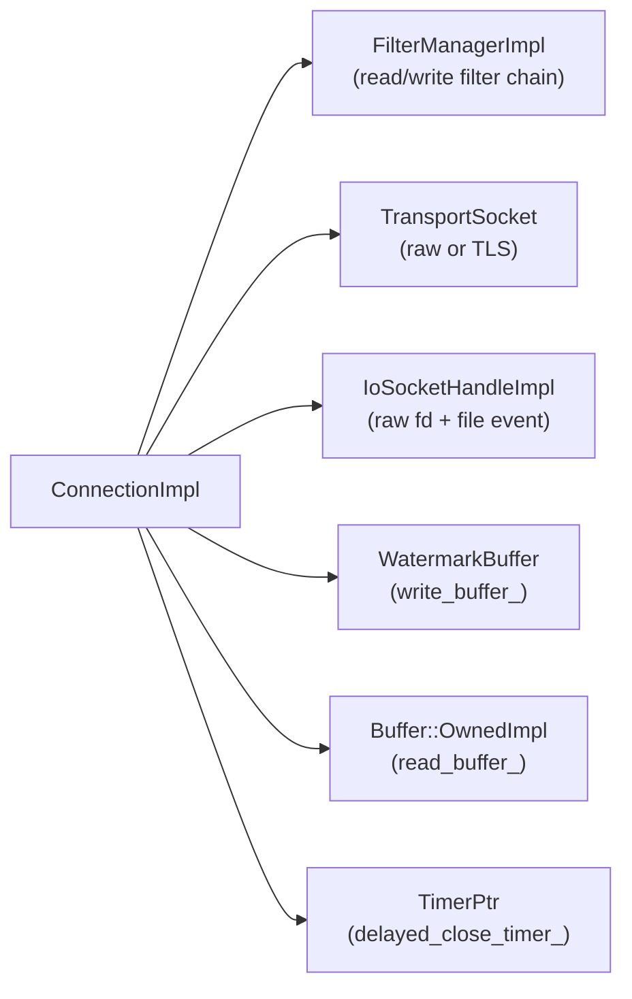

### Connection State Machine

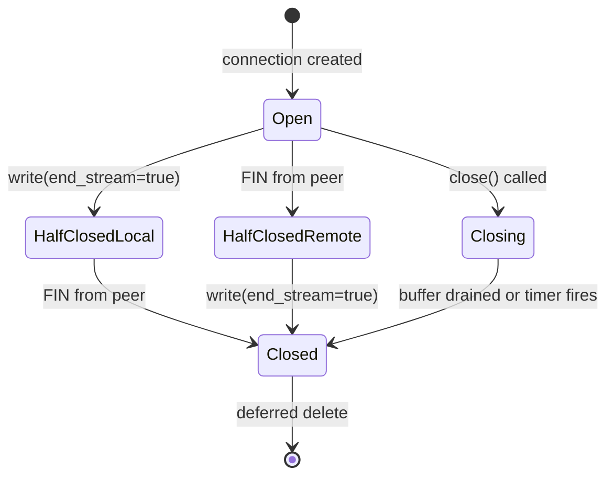

**State Transition Code Paths:**

| From State | Event | Action Taken | Code Location | Next State |
|------------|-------|--------------|---------------|------------|
| Created | Constructor completes | Initialize members, register file events | `connection_impl.cc:120` | Open |
| Open | `write(buffer, end_stream=true)` | Move bytes to `write_buffer_`, set `end_stream_` flag, call `shutdown(SHUT_WR)` | `connection_impl.cc:280` | HalfClosedLocal |
| Open | FIN received in `onReadReady()` | `read()` returns 0 → set `read_end_stream_` → notify filters | `connection_impl.cc:450` | HalfClosedRemote |
| Open | `close(FlushWrite)` called | If `write_buffer_` not empty → drain first | `connection_impl_base.cc:95` | Closing |
| Open | `close(NoFlush)` called | Immediate `io_handle_->close()`, discard pending writes | `connection_impl_base.cc:100` | Closed |
| HalfClosedLocal | FIN from peer | Both directions closed → trigger `LocalClose` event | `connection_impl.cc:455` | Closed |
| HalfClosedRemote | `write(end_stream=true)` | Finish sending response → both directions closed | `connection_impl.cc:285` | Closed |
| Closing | Write buffer drained | `write_buffer_.length() == 0` → `io_handle_->close()` | `connection_impl.cc:520` | Closed |
| Closing | Delayed close timer fires | `delayed_close_timeout_` expires → force close even if buffer not empty | `connection_impl_base.cc:150` | Closed |
| Closed | Connection closed | `raiseEvent(ConnectionEvent::RemoteClose or LocalClose)` → notify callbacks | `connection_impl.cc:180` | [End] |
| Closed | Deferred deletion | `dispatcher_.deferredDelete(this)` scheduled | `connection_impl.cc:185` | [Destroyed] |

**Key Fields Tracking State:**
- `end_stream_: bool` - Set when `write(end_stream=true)` called → local half-close
- `read_end_stream_: bool` - Set when `read()` returns 0 → remote half-close
- `write_buffer_.length()` - Tracks pending bytes to send before close
- `delayed_close_timer_: TimerPtr` - Optional grace period for draining
- `state_: State` - Explicitly tracks Open/HalfClosedLocal/HalfClosedRemote/Closing/Closed

### Close Types

| `CloseType` | Behavior |
|-------------|---------|
| `NoFlush` | Immediate close, discard pending writes |
| `FlushWrite` | Drain write buffer first, then close |
| `FlushWriteAndDelay` | Drain, then wait `delayed_close_timeout` |

### `readDisable` — Reference-Counted Backpressure

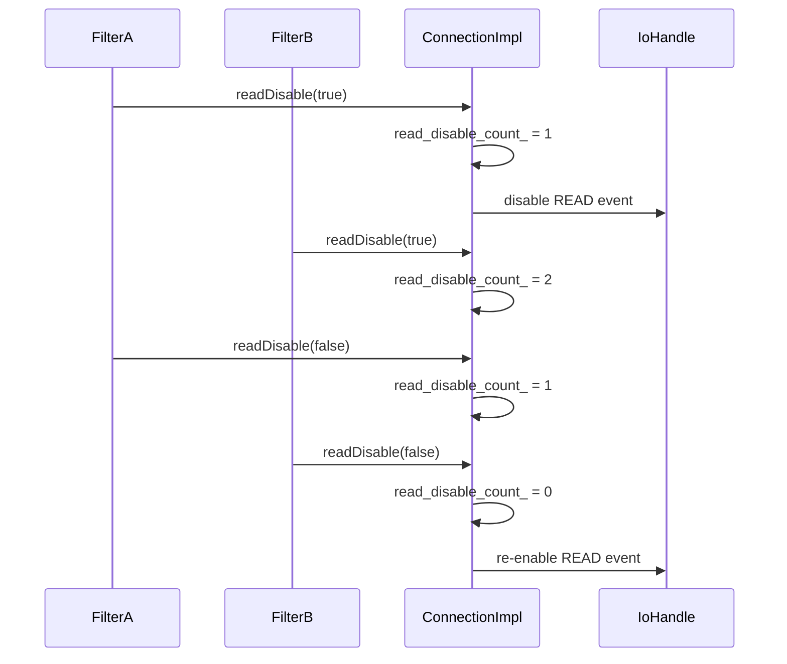

---

## 5. Data Flow: Read and Write Paths

### Read Path (Downstream → Filter Chain)

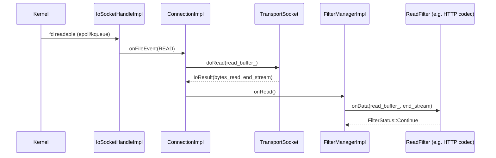

### Write Path (Filter Chain → Downstream)

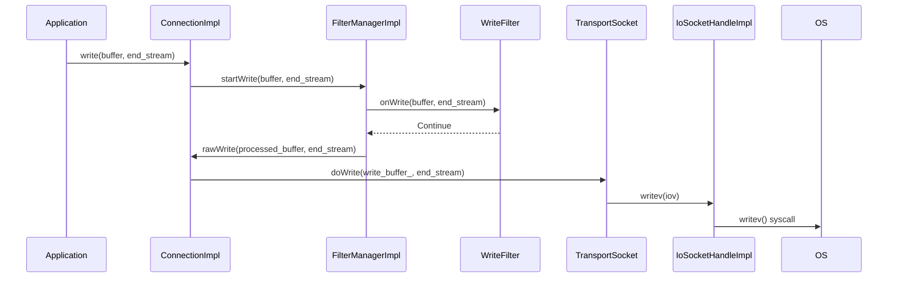

### Transport Socket as Middleware

```mermaid
flowchart LR
    subgraph TransportSocketChain
        CI["ConnectionImpl"] -->|doRead| TS_Read["TransportSocket::doRead<br/>(e.g. TLS decrypt)"] -->|plaintext| RB["read_buffer_"]
        WB["write_buffer_<br/>(ciphertext or plaintext)"] <--|doWrite| TS_Write["TransportSocket::doWrite<br/>(e.g. TLS encrypt)"] <--|plaintext| App
    end
```

---

## 6. Watermark and Backpressure

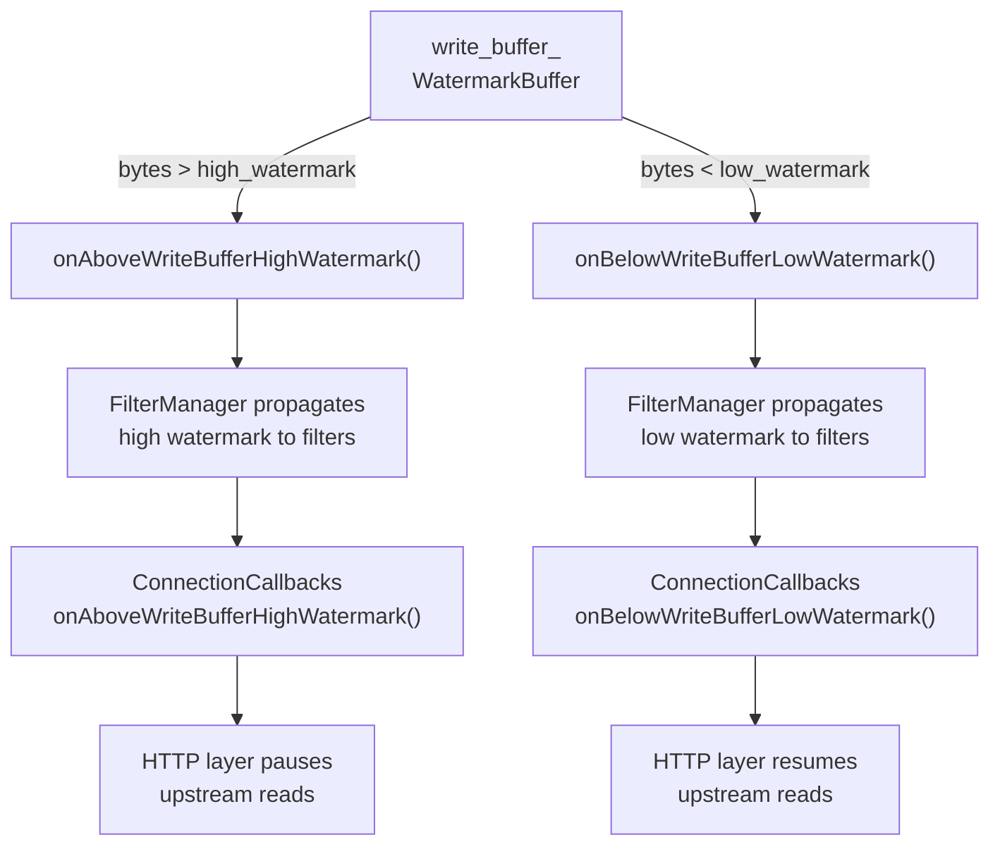

### Default Watermark Values

| Level | Default | Configurable via |
|-------|---------|-----------------|
| Low watermark | 32 KB | `setBufferLimits()` |
| High watermark | 64 KB | `setBufferLimits()` |

---

## 7. FilterManagerImpl — Network Filter Chain

### Filter Ordering

```mermaid
flowchart LR
    subgraph ReadFilters["Read Filters (forward: A → B → C)"]
        direction LR
        RA["ReadFilter A<br/>(e.g. TLS)"] --> RB["ReadFilter B<br/>(e.g. HTTP codec)"] --> RC["ReadFilter C"]
    end

    subgraph WriteFilters["Write Filters (reverse: C → B → A)"]
        direction RL
        WA["WriteFilter A"] <-- WB["WriteFilter B"] <-- WC["WriteFilter C"]
    end

    Net["Network (raw bytes)"] --> RA
    RC --> App["Application"]
    App --> WA
    WC --> Net
```

### Filter Initialization (`onNewConnection`)

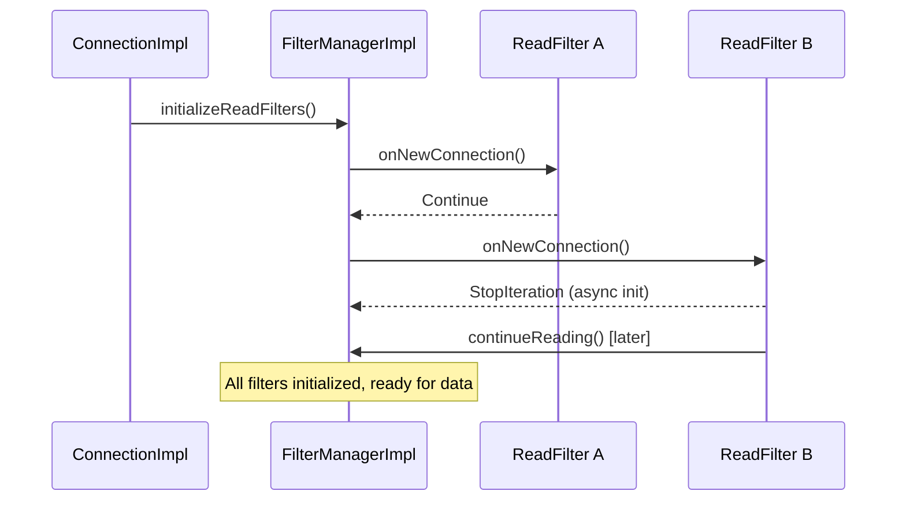

### Pending Close Safety

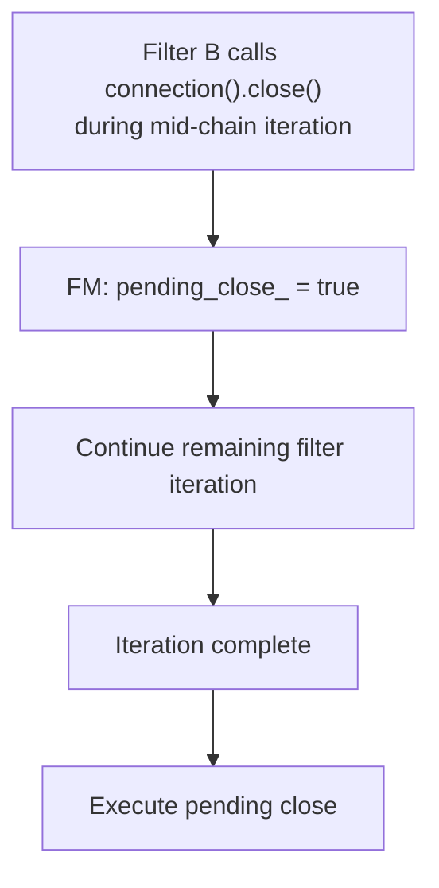

---

## 8. HappyEyeballsConnectionImpl — RFC 8305

### Racing Multiple Addresses

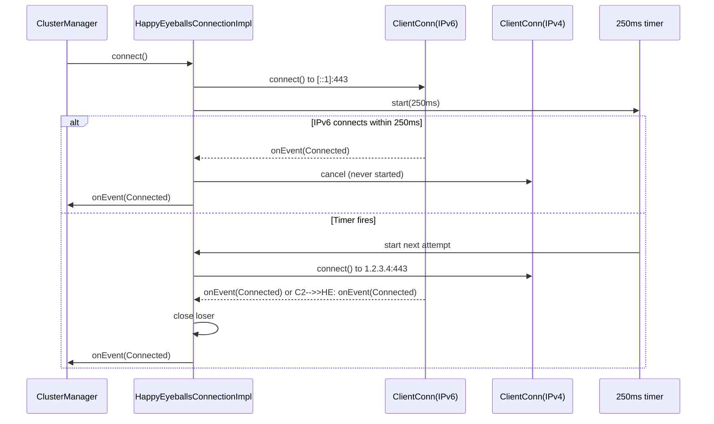

### `PostConnectState` — Deferred Replay

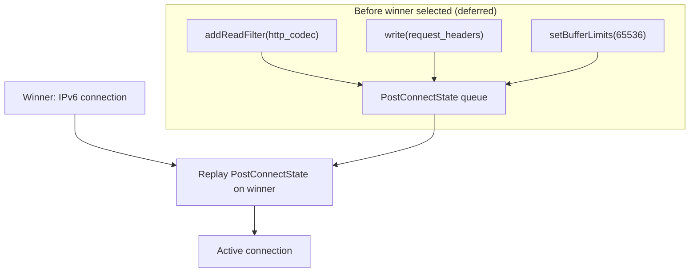

---

## 9. Key Design Patterns

### Pattern 1: Layered I/O Abstraction

Each layer has a single responsibility:

```
IoHandle  →  raw OS syscalls (readv, writev, accept, connect)
Socket    →  addressing + socket options + connection metadata
Connection →  filter chain + transport socket + lifecycle
```

### Pattern 2: Deferred Deletion

All connection objects implement `Event::DeferredDeletable`. Destruction is deferred to the next event loop iteration to prevent use-after-free within the current callback:

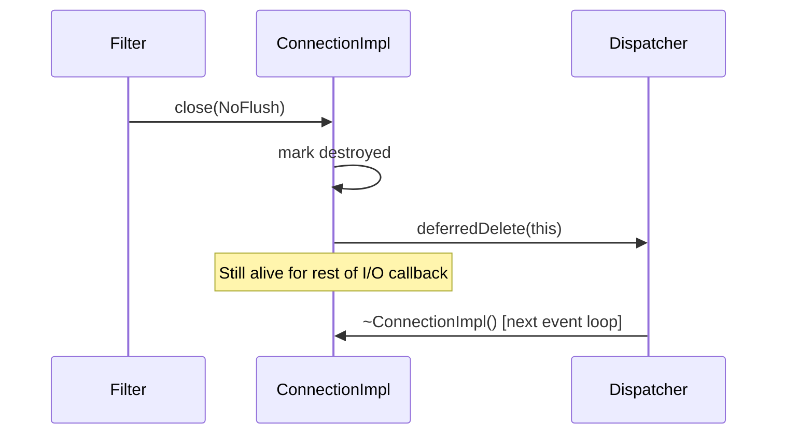

### Pattern 3: Injectable `SocketInterface`

The `SocketInterfaceSingleton` decouples `IoHandle` creation from `ConnectionImpl`, enabling the io_uring backend without any connection code changes:

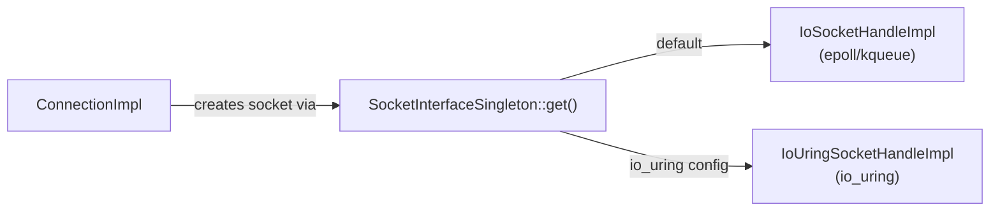

### Pattern 4: Filter State for Cross-Layer Tuning

Downstream filter state travels to the upstream transport layer without tight coupling:

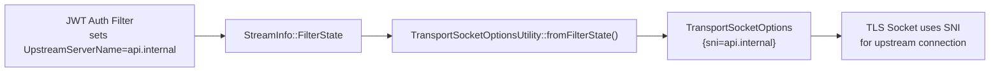

---

## Navigation

| Part | Topics |
|------|--------|
| **Part 1 (this file)** | Architecture, Connections, Happy Eyeballs, Filter Manager |
| [Part 2](OVERVIEW_PART2_filters_and_listeners.md) | Network Filters, TCP/UDP Listeners, Listener Filters |
| [Part 3](OVERVIEW_PART3_sockets_and_io.md) | Sockets, IoHandles, Socket Options, io_uring |
| [Part 4](OVERVIEW_PART4_addressing_dns_and_utilities.md) | Addressing, CIDR, DNS, Matching, Transport Socket Options |
