# Network Layer Utility Components

This document covers small but important utility components in `source/common/network/` that enable advanced features like filter state management, IP lookup optimization, listener filter matching, and connection distribution.

---

## Table of Contents

1. [Filter State Objects](#filter-state-objects)
2. [LC-Trie (IP Address Lookup)](#lc-trie-ip-address-lookup)
3. [Listener Filter Matching](#listener-filter-matching)
4. [Connection Management Utilities](#connection-management-utilities)
5. [Socket Option Utilities](#socket-option-utilities)

---

## Filter State Objects

Filter state objects allow filters to store and share typed data throughout the connection/stream lifecycle. These objects are stored in `StreamInfo::FilterState` and accessible by subsequent filters.

### Architecture

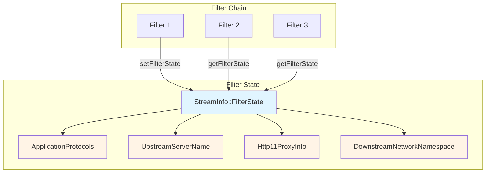

### Key Filter State Objects

#### 1. **ApplicationProtocols** (`application_protocol.h`)

**Purpose:** Override ALPN protocols for upstream TLS connections.

**File:** `application_protocol.h` (15-20 lines)

**Usage:**
```cpp
// HTTP filter sets ALPN override
auto alpn = std::make_shared<ApplicationProtocols>(std::vector<std::string>{"h2", "http/1.1"});
stream_info.filterState().setData(ApplicationProtocols::key(), alpn, 
                                   StreamInfo::FilterState::StateType::ReadOnly);

// TLS socket reads it during handshake
const auto* alpn_obj = stream_info.filterState().getDataReadOnly<ApplicationProtocols>(
    ApplicationProtocols::key());
if (alpn_obj) {
    // Use alpn_obj->value() for TLS handshake
}
```

**Key:** `envoy.network.application_protocols`

---

#### 2. **UpstreamServerName** (`upstream_server_name.h`)

**Purpose:** Override SNI (Server Name Indication) for upstream TLS connections.

**Similar to ApplicationProtocols:** Allows HTTP filters to set custom SNI based on routing decisions.

**Key:** `envoy.network.upstream_server_name`

---

#### 3. **UpstreamSubjectAltNames** (`upstream_subject_alt_names.h`)

**Purpose:** Specify expected Subject Alternative Names for upstream TLS certificate verification.

**Use Case:** Dynamic SAN verification based on routing or header inspection.

**Key:** `envoy.network.upstream_subject_alt_names`

---

#### 4. **UpstreamSocketOptionsFilterState** (`upstream_socket_options_filter_state.h`)

**Purpose:** Apply socket options (SO_MARK, IP_TOS, etc.) to upstream connections.

**Example:**
```cpp
// Set SO_MARK for traffic routing
auto socket_opts = std::make_shared<UpstreamSocketOptionsFilterState>();
socket_opts->addOption(std::make_shared<SocketOptionImpl>(
    Network::SocketOptionName(SOL_SOCKET, SO_MARK), 42));
stream_info.filterState().setData(UpstreamSocketOptionsFilterState::key(), socket_opts, ...);
```

**Key:** `envoy.network.upstream_socket_options`

---

#### 5. **Http11ProxyInfoFilterState** (`filter_state_proxy_info.h`)

**Purpose:** Signal that upstream connection should use an HTTP/1.1 CONNECT proxy.

**Structure:**
- `hostname_` - Target hostname for the CONNECT request
- `address_` - Proxy server address

**Usage Flow:**

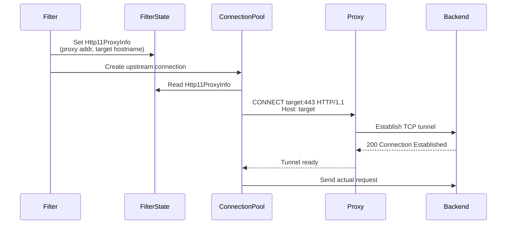

**Code Example:**
```cpp
auto proxy_info = std::make_shared<Http11ProxyInfoFilterState>(
    "backend.example.com",  // Target hostname
    proxy_address           // Proxy server address
);
stream_info.filterState().setData(Http11ProxyInfoFilterState::key(), proxy_info, ...);
```

**Key:** `envoy.network.http11_proxy_info`

---

#### 6. **DownstreamNetworkNamespace** (`downstream_network_namespace.h`)

**Purpose:** Store the network namespace of the downstream listener for multi-tenant environments.

**Auto-populated:** Set automatically when a connection is accepted on a listener with network namespace configured.

**Use Cases:**
- Logging which tenant/namespace originated the connection
- Routing decisions based on source namespace
- Access control

**Key:** `envoy.network.downstream_network_namespace`

---

#### 7. **AddressObject** (`filter_state_dst_address.h`)

**Purpose:** Override destination address for routing decisions.

**Use Case:** Original destination filters can set the true destination address before NAT.

**Key:** `envoy.network.filter_state_dst_address`

---

#### 8. **ProxyProtocolFilterState** (`proxy_protocol_filter_state.h`)

**Purpose:** Store PROXY protocol header information (source IP, port, etc.).

**Populated by:** PROXY protocol listener filter

**Key:** `envoy.network.proxy_protocol`

---

### Filter State Lifecycle

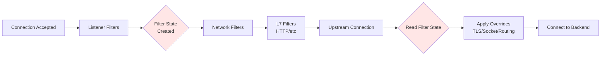

**Lifecycle Rules:**
- Created per-connection or per-stream (HTTP)
- Immutable after creation (`StateType::ReadOnly`)
- Mutable for filter coordination (`StateType::Mutable`)
- Survives across filter chain execution

---

## LC-Trie (IP Address Lookup)

### Purpose

**LC-Trie** (Level-Compressed Trie) is a highly optimized data structure for fast IP address → data lookups with CIDR range matching. Used for:
- Rate limiting by IP range
- RBAC (access control) by subnet
- GeoIP lookups
- Custom routing by source IP

**File:** `lc_trie.h` (700+ lines of template implementation)

**Algorithm:** Based on "IP-address lookup using LC-tries" by S. Nilsson and G. Karlsson

### Key Features

- **Fast Lookups:** O(log n) worst case, typically O(1) with good branching
- **IPv4 and IPv6:** Single interface for both
- **Nested Ranges:** Supports overlapping CIDR ranges with inheritance
- **Memory Efficient:** 20-bit internal pointers, maximum 2^20 nodes

### Architecture

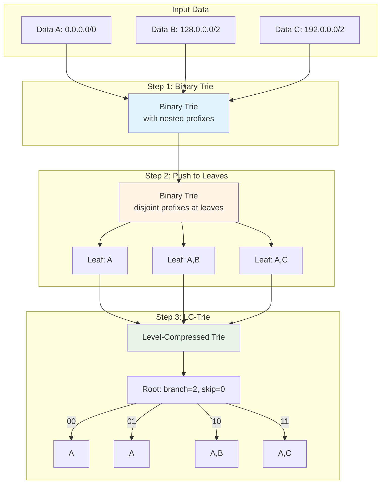

### Three-Step Construction

#### Step 1: Binary Trie with Nested Prefixes

```
Input: A: 0.0.0.0/0, B: 128.0.0.0/2, C: 192.0.0.0/2

Binary Trie (nested):
       +---+
       | A |  (0.0.0.0/0 matches everything)
       +---+
            \ 1
           +---+
           |   |
           +---+
         0/     \1
       +---+   +---+
       | B |   | C |  (128.x/2 and 192.x/2 are nested under A)
       +---+   +---+
```

**Problem:** Classic LC-Trie doesn't handle nested prefixes.

#### Step 2: Push Prefixes to Leaves

```
After pushing to leaves (disjoint):
       +---+
       |   |
       +---+
     0/     \ 1
   +---+   +---+
   | A |   |   |
   +---+   +---+
         0/     \1
       +---+   +---+
       |A,B|   |A,C|  ← All data now at leaves, no nesting
       +---+   +---+
```

**Result:** Disjoint prefixes that can be used with classic LC-Trie algorithm.

#### Step 3: Build LC-Trie

```
LC-Trie (branch_factor=2, fill_factor=0.5):
  +---------------------------+
  | branch=2, skip=0          |
  +---------------------------+
00/       01|         |10       \11
+---+    +---+     +---+      +---+
| A |    | A |     |A,B|      |A,C|
+---+    +---+     +---+      +---+

Internal representation (compact):
 Index | branch | skip | address | data
-------+--------+------+---------+------
   0   |    2   |   0  |    1    |  -     ← Root: 4 children (2^2)
   1   |    0   |   0  |    -    |  A     ← Child 0 (bits: 00)
   2   |    0   |   0  |    -    |  A     ← Child 1 (bits: 01)
   3   |    0   |   0  |    -    |  A,B   ← Child 2 (bits: 10)
   4   |    0   |   0  |    -    |  A,C   ← Child 3 (bits: 11)
```

### LcNode Structure

```cpp
struct LcNode {
    uint32_t branch_ : 5;    // Branching factor (max 2^31 children)
    uint32_t skip_ : 7;      // Bits to skip (supports IPv6: 0-127)
    uint32_t address_ : 20;  // Index into trie_ or ip_prefixes_
};
```

**Compact:** 32 bits per node (5 + 7 + 20)

### Lookup Algorithm

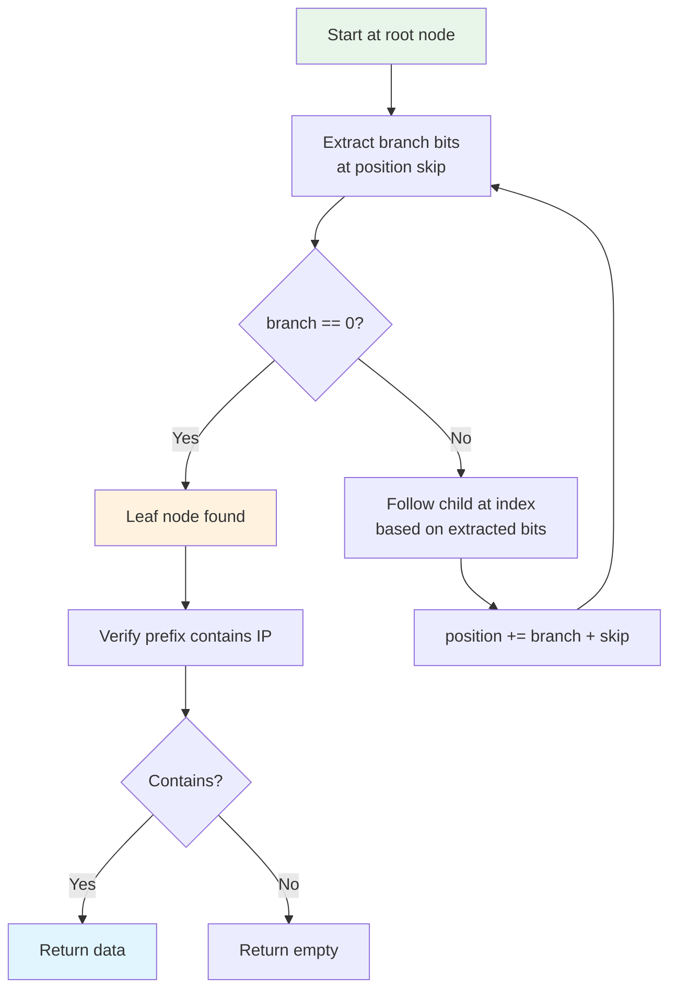

**Pseudo-code:**
```cpp
Node node = trie_[0];
uint32_t position = 0;

while (node.branch_ != 0) {  // Not a leaf
    position += node.skip_;
    uint32_t bits = extractBits(ip, position, node.branch_);
    node = trie_[node.address_ + bits];
    position += node.branch_;
}

// Verify the prefix actually contains the IP
if (ip_prefixes_[node.address_].contains(ip)) {
    return ip_prefixes_[node.address_].data_;
}
return {};
```

### Usage Example

```cpp
// Create LC-Trie with CIDR ranges
std::vector<std::pair<std::string, std::vector<Network::Address::CidrRange>>> data = {
    {"allow",  {parseCIDR("10.0.0.0/8"), parseCIDR("172.16.0.0/12")}},
    {"deny",   {parseCIDR("192.168.0.0/16")}},
    {"admin",  {parseCIDR("10.1.2.0/24")}}
};

Network::LcTrie::LcTrie<std::string> trie(data, 
    false,  // exclusive = false (inherit data from wider ranges)
    0.5,    // fill_factor
    0       // root_branching_factor
);

// Lookup
auto ip = parseIP("10.1.2.100");
std::vector<std::string> tags = trie.getData(ip);
// Result: ["allow", "admin"] (matches both 10.0.0.0/8 and 10.1.2.0/24)
```

### Performance Characteristics

| Operation | Complexity | Notes |
|-----------|------------|-------|
| Construction | O(n log n) | n = number of prefixes |
| Lookup | O(log n) worst case | Often O(1) with high branching factor |
| Memory | ~4n bytes | With fill_factor=0.5, up to 2n nodes |
| Max Prefixes | 262,144 | With fill_factor=1.0, max 2^20 nodes |

### Configuration Parameters

**`fill_factor`** (default: 0.5)
- Controls trade-off between memory and lookup speed
- Higher = more nodes, faster lookups
- Lower = fewer nodes, more memory efficient

**`root_branching_factor`** (default: 0)
- Paper suggests 16 for large tries
- Reduces tree depth
- Use 0 for small tries

**`exclusive`** (default: false)
- `false`: Inherit data from wider ranges (10.1.2.100 matches both 10.0.0.0/8 and 10.1.2.0/24)
- `true`: Only return data from most specific match

---

## Listener Filter Matching

### Purpose

Conditional execution of listener filters based on connection properties (destination port, protocol, etc.).

**Files:**
- `filter_matcher.h` (80 lines)
- `filter_matcher.cc` (44 lines)
- `generic_listener_filter_impl_base.h` (41 lines)

### Architecture

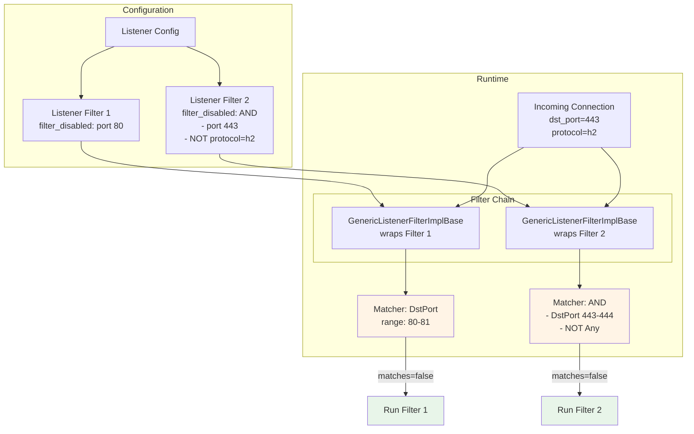

### Matcher Types

#### 1. **AnyMatcher**
Always matches (always disables filter).

```cpp
class ListenerFilterAnyMatcher {
    bool matches(ListenerFilterCallbacks&) const { return true; }
};
```

#### 2. **DstPortMatcher**
Matches based on destination port range.

```cpp
class ListenerFilterDstPortMatcher {
    bool matches(ListenerFilterCallbacks& cb) const {
        const auto port = cb.socket().connectionInfoProvider().localAddress()->ip()->port();
        return start_ <= port && port < end_;
    }
};
```

**Config:**
```yaml
filter_disabled:
  destination_port_range:
    start: 80
    end: 81  # Matches port 80
```

#### 3. **NotMatcher**
Logical NOT - inverts sub-matcher result.

```cpp
class ListenerFilterNotMatcher {
    bool matches(ListenerFilterCallbacks& cb) const {
        return !sub_matcher_->matches(cb);
    }
};
```

#### 4. **AndMatcher**
Logical AND - all sub-matchers must match.

```cpp
bool matches(ListenerFilterCallbacks& cb) const {
    return std::all_of(sub_matchers_.begin(), sub_matchers_.end(),
                       [&cb](const auto& m) { return m->matches(cb); });
}
```

#### 5. **OrMatcher**
Logical OR - any sub-matcher matches.

```cpp
bool matches(ListenerFilterCallbacks& cb) const {
    return std::any_of(sub_matchers_.begin(), sub_matchers_.end(),
                       [&cb](const auto& m) { return m->matches(cb); });
}
```

### Builder Pattern

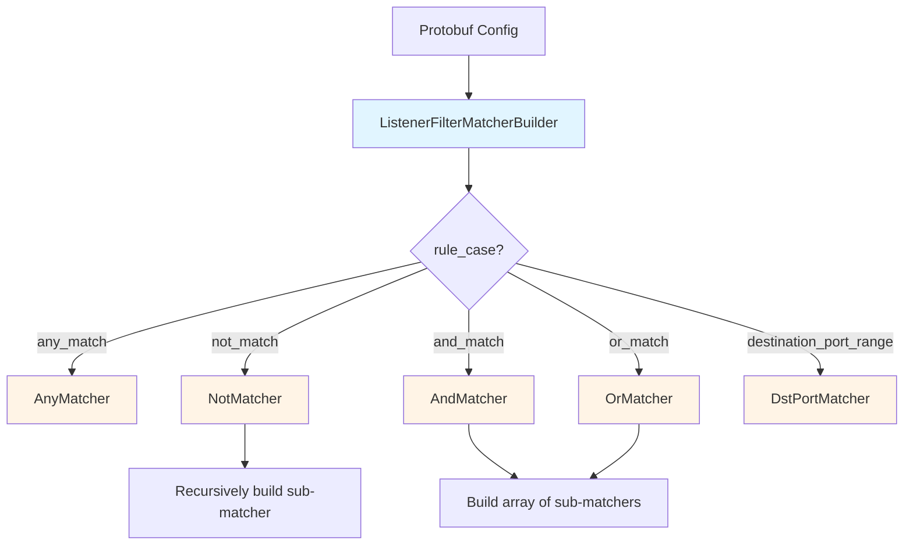

**Code:**
```cpp
ListenerFilterMatcherPtr buildListenerFilterMatcher(
    const envoy::config::listener::v3::ListenerFilterChainMatchPredicate& match_config) {
    switch (match_config.rule_case()) {
        case kAnyMatch:
            return std::make_unique<ListenerFilterAnyMatcher>();
        case kNotMatch:
            return std::make_unique<ListenerFilterNotMatcher>(match_config.not_match());
        case kAndMatch:
            return std::make_unique<ListenerFilterAndMatcher>(match_config.and_match().rules());
        case kOrMatch:
            return std::make_unique<ListenerFilterOrMatcher>(match_config.or_match().rules());
        case kDestinationPortRange:
            return std::make_unique<ListenerFilterDstPortMatcher>(
                match_config.destination_port_range());
    }
}
```

### Wrapper Integration

**GenericListenerFilterImplBase** wraps actual filters:

```cpp
template <typename ListenerFilterType>
class GenericListenerFilterImplBase : public ListenerFilterType {
  public:
    Network::FilterStatus onAccept(ListenerFilterCallbacks& cb) override {
        if (isDisabled(cb)) {
            return Network::FilterStatus::Continue;  // Skip filter
        }
        return listener_filter_->onAccept(cb);  // Run filter
    }

  protected:
    bool isDisabled(ListenerFilterCallbacks& cb) {
        if (matcher_ == nullptr) {
            return false;  // No matcher = always run
        }
        return matcher_->matches(cb);  // Matcher returns true = disabled
    }

  private:
    const std::unique_ptr<ListenerFilterType> listener_filter_;
    const Network::ListenerFilterMatcherSharedPtr matcher_;
};
```

### Execution Flow

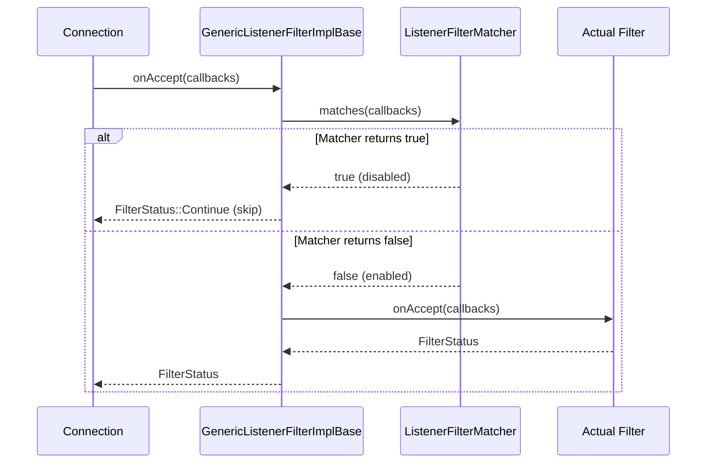

### Configuration Examples

**Example 1: Skip TLS inspector on port 80**
```yaml
listener_filters:
- name: "envoy.filters.listener.tls_inspector"
  filter_disabled:
    destination_port_range:
      start: 80
      end: 81
```

**Example 2: Complex boolean logic**
```yaml
listener_filters:
- name: "expensive_filter"
  filter_disabled:
    or_match:
      rules:
      - destination_port_range:
          start: 80
          end: 81
      - and_match:
          rules:
          - destination_port_range:
              start: 443
              end: 444
          - not_match:
              any_match: {}
```

Logic: Disable if (port == 80) OR (port == 443 AND false) = port == 80

---

## Connection Management Utilities

### 1. Connection Balancer (`connection_balancer_impl.h`)

**Purpose:** Distribute accepted connections across worker threads.

**Strategies:**

#### Exact Balance
```cpp
// Always chooses least-loaded worker
class ExactConnectionBalancerImpl : public ConnectionBalancer {
    BalancedConnectionHandlerOptRef pickTargetHandler(BalancedConnectionHandler&) override {
        return findLeastUsedWorker();
    }
};
```

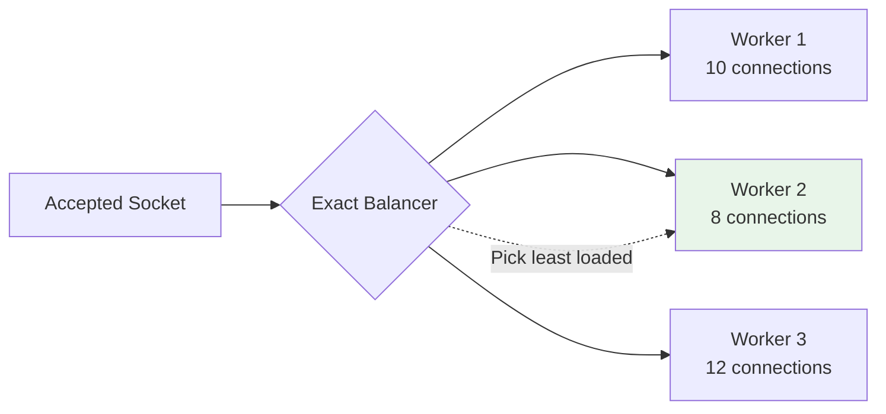

### 2. Multi-Connection Base (`multi_connection_base_impl.h`)

**Purpose:** Manage multiple concurrent connections as a single logical connection (e.g., QUIC with multiple streams).

**Interface:**
```cpp
class MultiConnectionBaseImpl : public ClientConnection {
    // Delegates operations to primary connection
    void addWriteFilter(WriteFilterSharedPtr filter) override {
        connections_[0]->addWriteFilter(filter);
    }
    
    void write(Buffer::Instance& data, bool end_stream) override {
        // Round-robin or priority-based write to sub-connections
    }
};
```

### 3. Hash Policy (`hash_policy.h`)

**Purpose:** Generate consistent hash for connection-based load balancing.

**Usage in TCP Proxy:**
```cpp
class HashPolicyImpl : public Network::HashPolicy {
    absl::optional<uint64_t> generateHash(const Network::Connection& connection) const override {
        // Hash based on source IP, dest IP, source port, etc.
        HashUtil::xxHash64 hasher;
        hasher.update(connection.connectionInfoProvider().remoteAddress()->asString());
        return hasher.digest();
    }
};
```

**Use Case:** Consistent hashing for session affinity (same client → same backend).

### 4. Read Filter Base (`filter_impl.h`)

**Purpose:** Convenience base class for read filters that don't need initialization.

```cpp
class ReadFilterBaseImpl : public ReadFilter {
  public:
    void initializeReadFilterCallbacks(ReadFilterCallbacks&) override {}
    Network::FilterStatus onNewConnection() override {
        return Network::FilterStatus::Continue;
    }
};
```

**Usage:**
```cpp
class MySimpleFilter : public ReadFilterBaseImpl {
    Network::FilterStatus onData(Buffer::Instance& data, bool end_stream) override {
        // Only implement data handling
    }
};
```

---

## Socket Option Utilities

### 1. Address Family Aware Socket Option (`addr_family_aware_socket_option_impl.h`)

**Purpose:** Apply different socket options based on address family (IPv4 vs IPv6).

**Example:**
```cpp
// Set IP_TOS for IPv4, IPV6_TCLASS for IPv6
auto opt = std::make_shared<AddrFamilyAwareSocketOptionImpl>(
    envoy::config::core::v3::SocketOption::STATE_PREBIND,
    ENVOY_MAKE_SOCKET_OPTION_NAME(IPPROTO_IP, IP_TOS),
    ENVOY_MAKE_SOCKET_OPTION_NAME(IPPROTO_IPV6, IPV6_TCLASS),
    0x10  // DSCP value
);
```

### 2. Windows Redirect Records Option (`win32_redirect_records_option_impl.h`)

**Purpose:** Windows-specific socket option for connection redirection (similar to SO_ORIGINAL_DST on Linux).

---

## Summary Table

| Component | File | Purpose | Key Use Cases |
|-----------|------|---------|---------------|
| **ApplicationProtocols** | `application_protocol.h` | Override ALPN for TLS | HTTP/2, gRPC negotiation |
| **Http11ProxyInfoFilterState** | `filter_state_proxy_info.h` | Signal HTTP/1.1 CONNECT proxy use | Corporate proxies |
| **DownstreamNetworkNamespace** | `downstream_network_namespace.h` | Track source network namespace | Multi-tenant logging |
| **LC-Trie** | `lc_trie.h` | Fast IP→data lookup | Rate limiting, RBAC, GeoIP |
| **ListenerFilterMatcher** | `filter_matcher.h` | Conditional filter execution | Skip filters on specific ports |
| **GenericListenerFilterImplBase** | `generic_listener_filter_impl_base.h` | Wrap filters with matchers | Filter chain optimization |
| **ConnectionBalancer** | `connection_balancer_impl.h` | Load distribution | Worker thread balancing |
| **HashPolicy** | `hash_policy.h` | Connection hashing | Session affinity |
| **ReadFilterBaseImpl** | `filter_impl.h` | Simplified filter base | Quick filter development |

---

## Common Patterns

### Pattern 1: Filter State for Configuration Overrides

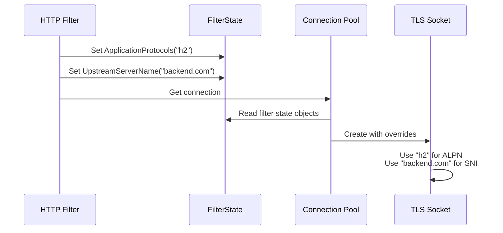

### Pattern 2: Conditional Filter Execution

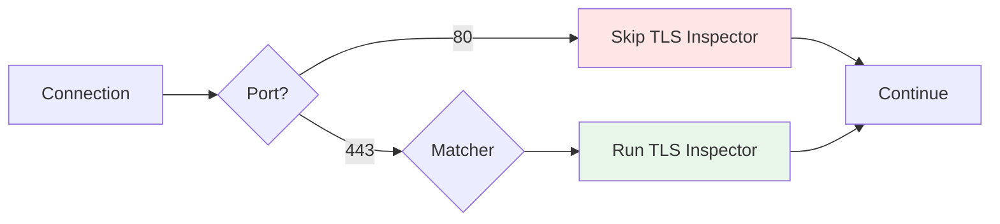

### Pattern 3: IP-Based Access Control

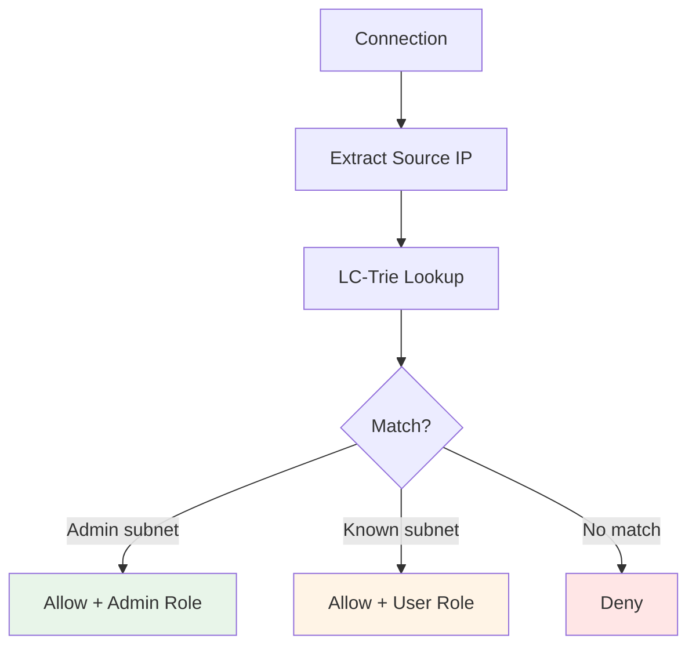

---

## Performance Considerations

### Filter State
- **Overhead:** Minimal (hash map lookup per key)
- **Memory:** ~100 bytes per object
- **Best Practice:** Use `StateType::ReadOnly` when possible to avoid copies

### LC-Trie
- **Lookup:** 50-200ns typical (highly dependent on branching factor)
- **Memory:** ~4 bytes per node, up to 4MB for max size trie
- **Best Practice:** Use higher `fill_factor` (0.7-0.9) for performance-critical paths

### Listener Filter Matching
- **Overhead:** 10-50ns per matcher evaluation
- **Optimization:** Port-based matching is fastest, complex boolean logic adds overhead
- **Best Practice:** Put most common case first in OR matchers

---

## Further Reading

- **LC-Trie Paper:** https://www.nada.kth.se/~snilsson/publications/IP-address-lookup-using-LC-tries/
- **Filter State Design:** See `envoy/stream_info/filter_state.h`
- **Connection Balancing:** See `envoy/network/connection_handler.h`
