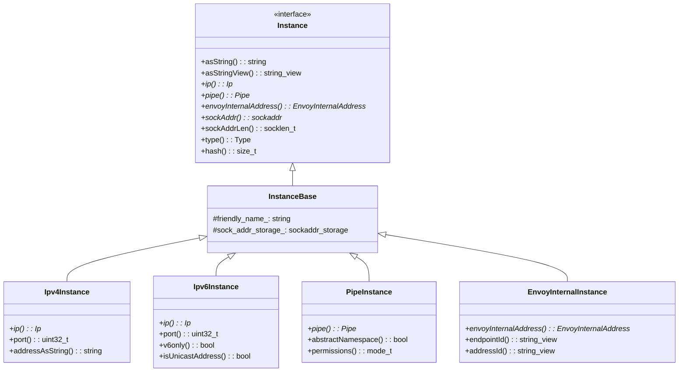
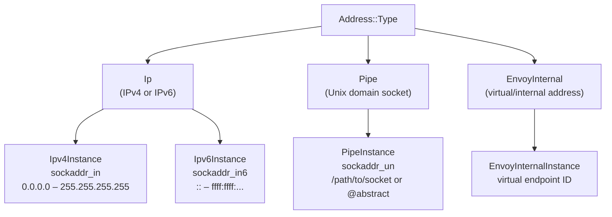
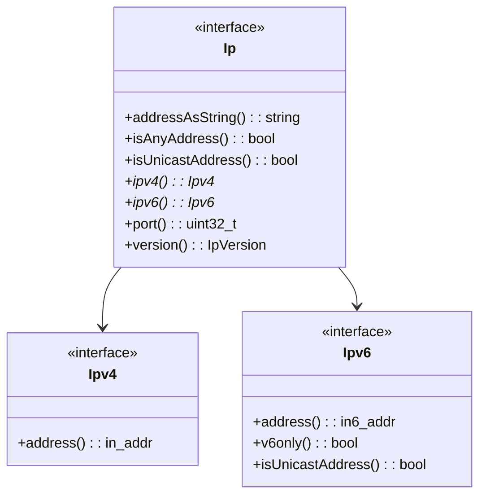
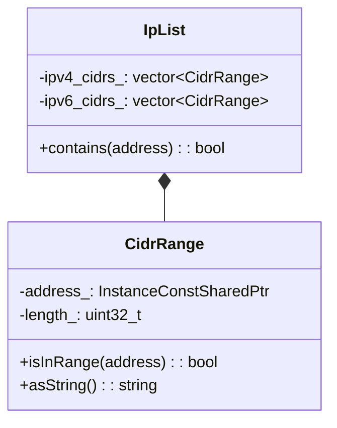
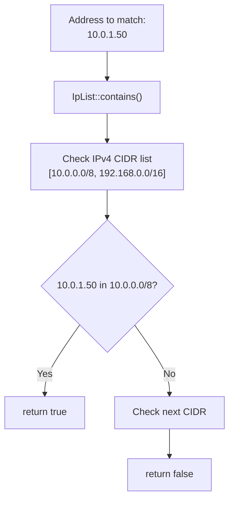
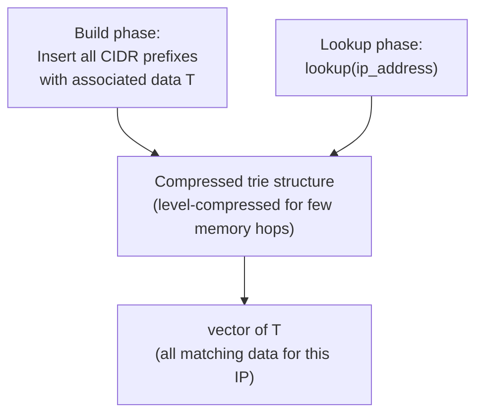
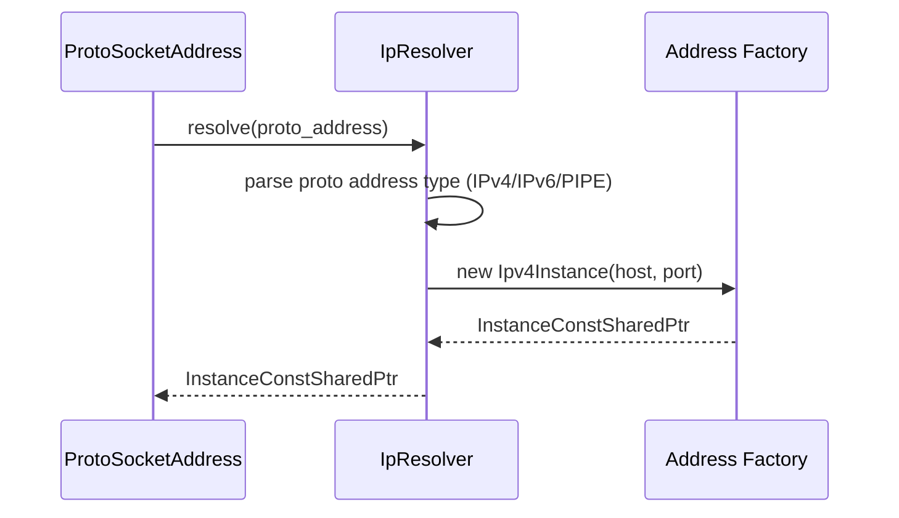
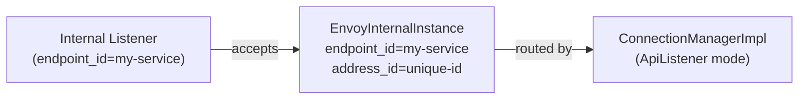

# Address Implementation

**Files:** `source/common/network/address_impl.h` / `.cc`  
**Namespace:** `Envoy::Network::Address`

## Overview

The address system provides a unified `Instance` interface over IPv4, IPv6, Unix domain sockets (pipes), and Envoy-internal virtual addresses. All address objects are **immutable** and **const-shared**, making them safe to share across threads without locking.

### Why a Unified Address Type?

Network addresses appear in almost every part of Envoy: listener bind addresses, upstream endpoint addresses, source and destination addresses on connections, CIDR ranges in access control lists, and upstream DNS resolution results. Without a common type, every subsystem would need to handle IPv4 and IPv6 separately, and Unix sockets would be awkward edge cases.

The `Instance` interface lets all these subsystems be written generically. A `FilterChainManagerImpl` comparing destination IPs, an RBAC policy checking source CIDRs, and a cluster manager recording upstream endpoint addresses all use the same `InstanceConstSharedPtr` type with the same interface — no template specializations, no `if (is_ipv4)` branches in calling code.

### Immutability and Const-Sharing

All address objects are `const` after construction. This is enforced by the type alias:

```cpp
using InstanceConstSharedPtr = std::shared_ptr<const Instance>;
```

Because addresses are immutable, they can be freely shared across any number of worker threads without locking. A listener's bind address created on the main thread can be stored in `StreamInfo` on a worker thread, passed to an access logger on a third thread, and read by an HTTP filter simultaneously — all safely.

This property is especially valuable for upstream endpoint addresses: the cluster manager updates the endpoint list on the main thread, but worker threads constantly read endpoint addresses for load balancing and connection routing. Since addresses are const, worker threads never see a partially-updated address.

## Class Hierarchy



## Address Types



### The Four Address Types in Practice

**`Ipv4Instance`** is the most common type for listener bind addresses (`0.0.0.0:443`) and upstream IPv4 endpoint addresses. It wraps a `sockaddr_in` struct directly in `InstanceBase::sock_addr_storage_`, so passing it to socket syscalls like `bind()` and `connect()` requires zero conversion — just cast `sockAddr()` to `const sockaddr*`.

**`Ipv6Instance`** handles both pure IPv6 addresses and IPv4-mapped IPv6 addresses (`::ffff:1.2.3.4`). The `v6only()` flag controls whether the IPv6 socket also accepts IPv4 connections. In dual-stack deployments, Envoy may bind to `[::]:443` with `v6only=false` to accept both IPv4 and IPv6 connections on a single listener.

**`PipeInstance`** wraps Unix domain socket paths stored as `sockaddr_un`. Abstract namespace sockets (starting with `@`) are supported — the leading `@` is stripped and replaced with a null byte in the actual `sockaddr_un` struct, which is the Linux abstract namespace convention. Abstract sockets have no filesystem entry and are automatically cleaned up when the last file descriptor closes.

**`EnvoyInternalInstance`** is a virtual address type with no OS socket backing. It identifies internal listeners (listeners that accept connections from within Envoy itself, not from the network). The `endpoint_id` is a string that routes to the right internal listener, and `address_id` disambiguates multiple connections to the same endpoint.

## `Ip` Interface

Both `Ipv4Instance` and `Ipv6Instance` expose an `Ip*` from `instance.ip()`:



## Creating Addresses — `InstanceFactory`

```mermaid
flowchart TD
    F["InstanceFactory"] --> A{Address type?}
    A -->|IPv4 string "1.2.3.4:80"| B["new Ipv4Instance(ip, port)"]
    A -->|IPv6 string "[::1]:443"| C["new Ipv6Instance(ip, port)"]
    A -->|sockaddr_in| D["new Ipv4Instance(sockaddr_in)"]
    A -->|sockaddr_in6| E["new Ipv6Instance(sockaddr_in6)"]
    A -->|path string "/tmp/sock"| G["new PipeInstance(path, permissions)"]
    A -->|abstract "@sock"| H["new PipeInstance(abstract_name)"]
    A -->|internal endpoint| I["new EnvoyInternalInstance(endpoint, address)"]
```

### The `Ip` Interface: Type-Safe Dispatch Without Dynamic Cast

The `Ip*` returned by `instance.ip()` provides protocol-specific details without requiring a `dynamic_cast`. If `instance.type() == Type::Ip`, then `instance.ip()` is non-null and can be queried for `version()`, `port()`, and `addressAsString()`. The returned `Ip*` can further be narrowed to `Ipv4*` via `ip->ipv4()` or `Ipv6*` via `ip->ipv6()`.

This two-level dispatch (first check `type()`, then check `ip()->version()`) avoids casting the address object itself and keeps the type hierarchy simple. Code that only cares about port numbers (e.g., filter chain matching by destination port) can call `instance.ip()->port()` without knowing whether the address is IPv4 or IPv6.

## CIDR Range Matching — `CidrRange` and `IpList`



### CIDR Matching Flow



### `IpList` vs. `LcTrie`: Two Tools for Different Scales

`IpList` is a simple O(n) linear scan over a list of `CidrRange` objects. It is perfectly adequate for small access control lists (say, 5–20 CIDR entries) that are configured in listener or cluster configs. Most production deployments have a handful of trusted IP ranges — subnets for internal services, load balancer CIDRs, health check sources — and `IpList` covers them with zero build overhead.

`LcTrie<T>` is a compiled data structure for large, high-performance lookups. It is used in `FilterChainManagerImpl` for matching thousands of filter chain destination and source IP prefixes, and in RBAC filters where access policies may contain hundreds of CIDR ranges covering entire RFC1918 spaces. The `T` type parameter allows the trie to return arbitrary data (a filter chain pointer, a permission object) not just a bool.

## LC-Trie — `LcTrie<T>` (Fast CIDR Lookup)

`LcTrie` implements the Nilsson-Karlsson Level-Compressed Trie algorithm for O(1) (few memory accesses) CIDR-to-data mapping, used in RBAC and access control:



### Performance Comparison

| Structure | Lookup Complexity | Use Case |
|-----------|------------------|---------|
| `IpList` | O(n) linear scan | Small lists (< 10 ranges), simple config |
| `LcTrie<T>` | O(1) few memory hops | Large CIDR tables (RBAC policies, access logs) |

### How LC-Trie Achieves Near-Constant Time

The Nilsson-Karlsson Level-Compressed Trie compresses runs of single-child nodes in a binary trie into single "branch" nodes that skip multiple bits at once. Each node stores a branch factor and a skip count. A lookup processes 2–5 node hops regardless of trie size — achieving O(1) in practice (bounded by the 32 or 128 bits of an IP address).

At build time, all CIDR prefixes are inserted into the trie and the structure is compressed. This build step is non-trivial (several microseconds for large tables) and happens once at config time. Runtime lookups are the hot path and take a few hundred nanoseconds even for large tables.

## `Resolver` and `ResolverImpl`



Free functions `resolveProtoAddress()` and `resolveProtoSocketAddress()` convert proto config addresses (`core::v3::Address`) to `Address::InstanceConstSharedPtr`.

### Proto to Address: The Resolver Bridge

The `resolveProtoAddress()` and `resolveProtoSocketAddress()` free functions bridge the xDS proto world and the C++ address world. They accept `envoy::config::core::v3::Address` protos (which carry a `SocketAddress` or `Pipe` oneof) and return an `InstanceConstSharedPtr`.

This conversion happens at config parse time — when a listener proto's bind address is read, when an endpoint address in a cluster config is parsed, when a route's direct response address is set. After this conversion, downstream code never touches the proto again; it works only with the typed `Instance` object.

The `IpResolver` registered as the default resolver handles the common IPv4/IPv6 case. Custom `Resolver` implementations (registered in the extension registry) can handle non-standard address families or custom protocol addresses.

## `EnvoyInternalInstance` — Internal Addressing

Used for in-process communication between Envoy components (e.g., internal listeners, direct response listeners):



## Thread Safety

All `Address::Instance` objects are:
- **Immutable** after construction
- **Const-shared** (`InstanceConstSharedPtr = shared_ptr<const Instance>`)
- **Safe to share** across worker threads without locking
