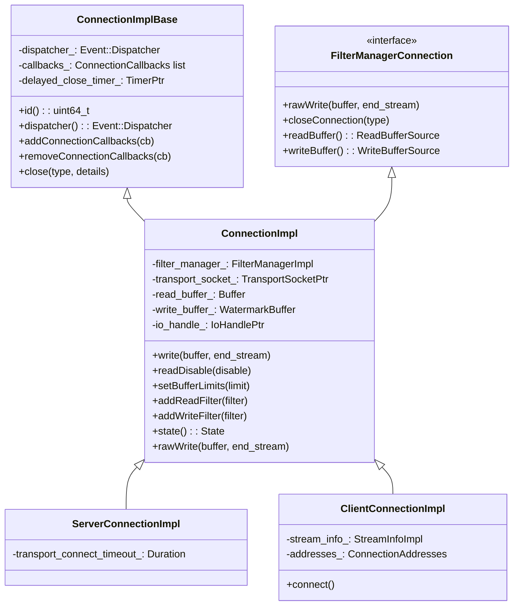
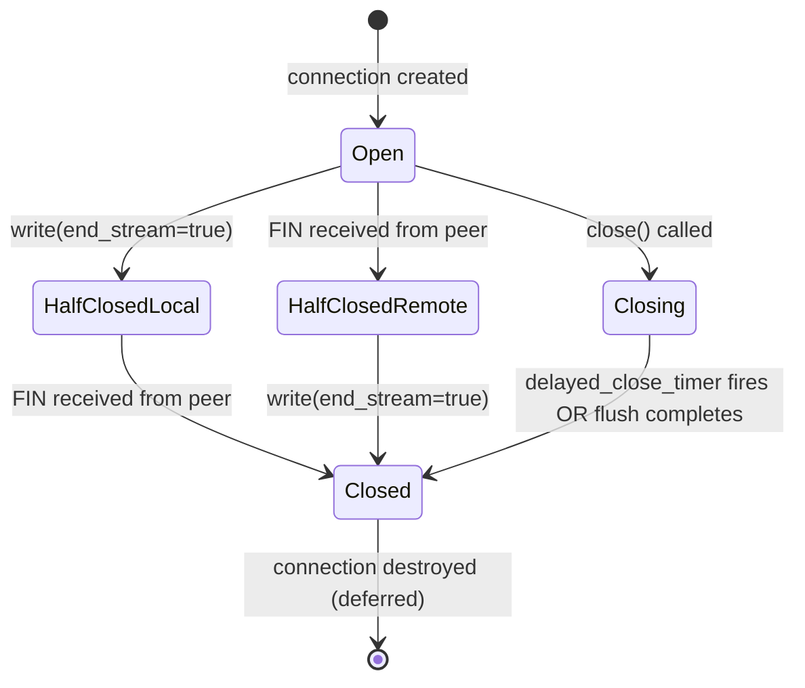
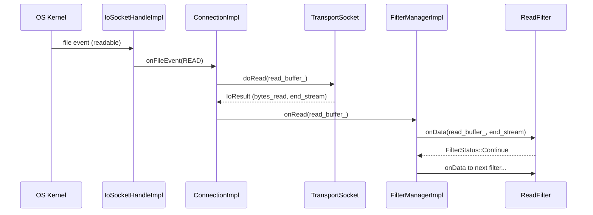
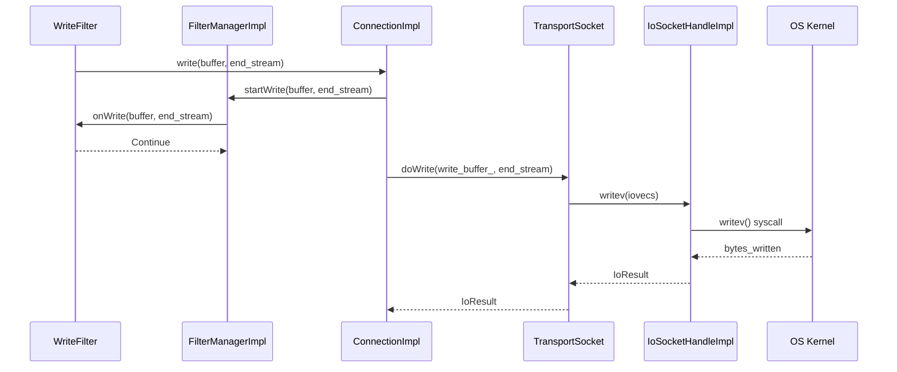
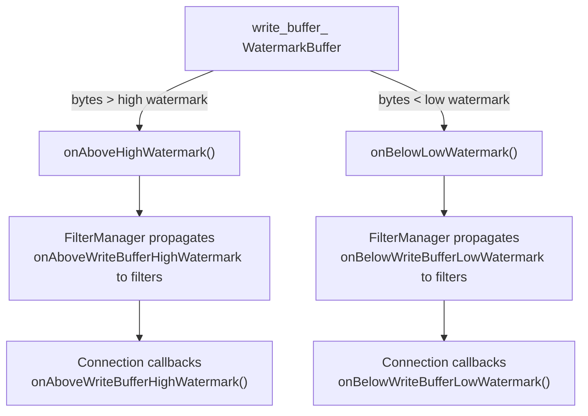
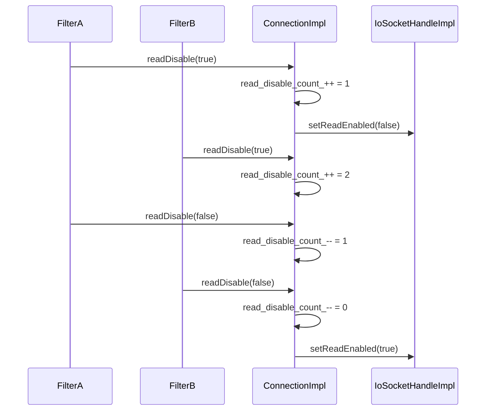
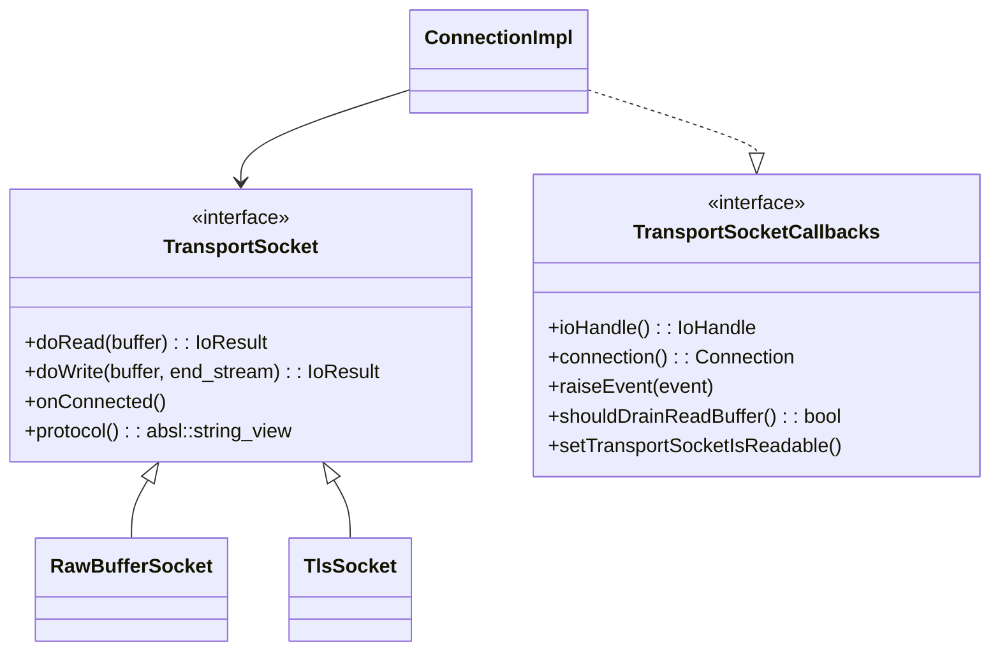
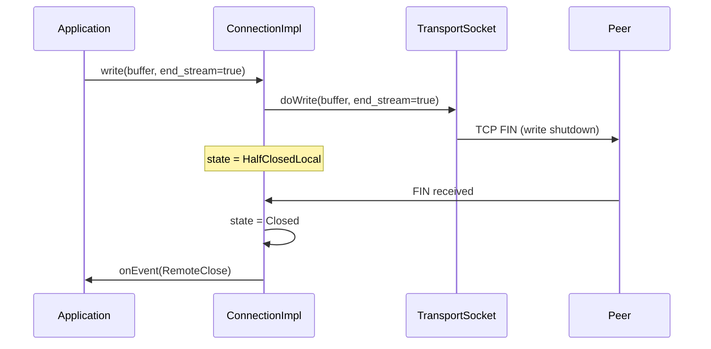
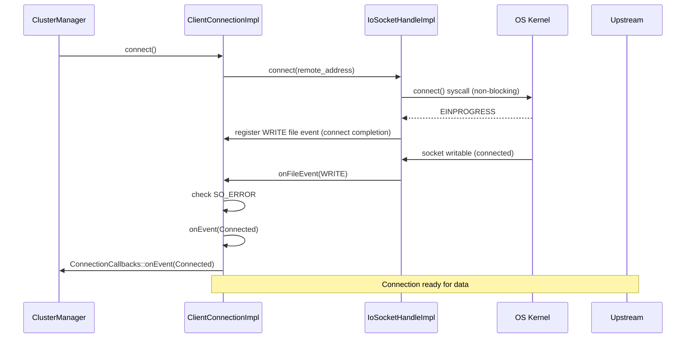

# ConnectionImpl

**Files:**
- `source/common/network/connection_impl_base.h/.cc` (abstract base)
- `source/common/network/connection_impl.h/.cc` (~30 KB header, ~70 KB impl)
**Namespace:** `Envoy::Network`

## Overview

`ConnectionImpl` is the core TCP connection implementation in Envoy. It owns the `IoHandle` (raw file descriptor), drives the read/write filter chain via `FilterManagerImpl`, manages backpressure watermarks, delayed-close timers, and half-close semantics. Two concrete subclasses exist: `ServerConnectionImpl` (for accepted downstream connections) and `ClientConnectionImpl` (for initiated upstream connections).

### The Central Object in Envoy's Network Stack

If you had to pick one class that represents "a TCP connection in Envoy," it would be `ConnectionImpl`. Every piece of data that flows between a client and Envoy, or between Envoy and an upstream, passes through a `ConnectionImpl` instance. It is the object that:

- Reads bytes from the OS socket (via `IoHandle`) and decrypts them (via `TransportSocket`)
- Passes those bytes through the network filter chain (via `FilterManagerImpl`)
- Collects bytes written by filters and flushes them back to the OS socket
- Manages the connection's observable state (`Open`, `HalfClosedLocal`, `HalfClosedRemote`, `Closed`)
- Enforces backpressure by disabling reads when downstream or upstream is slow
- Tracks statistics (bytes in/out, connection duration)

### `ServerConnectionImpl` vs `ClientConnectionImpl`

Both inherit from `ConnectionImpl` but differ in how they are created and their initialization:

**`ServerConnectionImpl`** is created by `ActiveTcpListener::newActiveConnection()` when an accepted connection has been matched to a filter chain. The OS socket fd is already connected when this object is created — `accept4()` has already completed the 3-way handshake. `ServerConnectionImpl` starts in `Open` state and immediately begins reading.

**`ClientConnectionImpl`** is created by the upstream connection pool when establishing a new upstream connection. The fd exists but the TCP handshake has not yet happened. `ClientConnectionImpl::connect()` is called explicitly, which triggers the non-blocking `connect()` syscall. The connection transitions to `Open` only after the event loop signals the socket as writable (indicating `connect()` completed) and `SO_ERROR` is checked for success.

### The Transport Socket Layer

`ConnectionImpl` does not directly call `read()` or `write()` on the socket fd. Instead, it delegates to `transport_socket_->doRead()` and `transport_socket_->doWrite()`. The `TransportSocket` interface abstracts the encryption layer:

- `RawBufferSocket`: Passes bytes directly to/from the `IoHandle` via `readv()`/`writev()`. Used for plaintext connections.
- `SslSocket` (from `source/extensions/transport_sockets/tls/`): Wraps BoringSSL. `doRead()` calls `SSL_read()` which internally reads from the fd and decrypts. `doWrite()` calls `SSL_write()` which encrypts and calls `writev()`. The TLS handshake is driven through the same `doRead()`/`doWrite()` calls.

This abstraction means network filters above the transport socket always see plaintext bytes, regardless of whether the connection is encrypted. The HTTP connection manager, TCP proxy, and rate limit filter are all written against the plaintext interface.

## Class Hierarchy



## Connection Lifecycle

**This state machine shows the complete lifecycle of a TCP connection:**

**States Explained:**

**Open (Active State):**
- Connection is fully established and bidirectional
- Both sending and receiving data
- Filters are actively processing
- Most connections spend majority of time here

**HalfClosedLocal (Envoy sent FIN):**
- Envoy called `write()` with `end_stream=true`
- TCP FIN sent to peer (no more data from Envoy)
- Still receiving data from peer
- Waiting for peer to close their side

**HalfClosedRemote (Peer sent FIN):**
- Received FIN from peer (peer finished sending)
- Envoy can still send data
- Common when client sends request and waits for response
- Envoy closes after sending full response

**Closing (Shutdown in Progress):**
- `close()` was explicitly called
- Delayed close timer may be active (flush pending writes)
- Not accepting new data
- Waiting for clean shutdown

**Closed (Terminal State):**
- Connection fully terminated
- Resources released
- Object scheduled for deferred deletion
- Cannot be reopened

**Half-Close vs Full-Close:**
- **Half-close** enables efficient request/response patterns (HTTP)
- **Full-close** happens when either side calls `close()` or error occurs
- Half-close is graceful, full-close may be abrupt



### The Connection State Machine: Half-Close as First-Class State

Most proxy implementations treat connections as binary (open or closed), but TCP actually supports half-close: one side can close its write direction (send a FIN) while still receiving data on its read direction. This is essential for HTTP/1.1 request streaming and for protocols that use the FIN to signal end-of-stream.

`ConnectionImpl` models this with four states: `Open` (both directions active), `HalfClosedLocal` (Envoy sent FIN, still reading), `HalfClosedRemote` (peer sent FIN, Envoy still writing), and `Closed`. Most connections go through `Open` → `Closed` for keep-alive connections, but HTTP/1.1 non-keep-alive connections typically go `Open` → `HalfClosedRemote` (client sends request, sends FIN) → `Closed` (Envoy finishes response).

The `enable_half_close` config flag controls whether Envoy treats a remote FIN as a full close (`false`, legacy behavior) or a half-close (`true`, needed for streaming protocols).

## Data Read Flow

**This sequence shows how data flows from the network into the application:**

**Step-by-Step Process:**

1. **OS Kernel**: Data arrives on socket, kernel buffers it
2. **Event Notification**: Socket becomes readable, event loop wakes up
3. **IoHandle**: Receives file event, calls ConnectionImpl
4. **ConnectionImpl::onFileEvent()**: Handles read event
5. **TransportSocket::doRead()**: Reads and potentially decrypts data
   - For TLS: Reads encrypted data, decrypts, returns plaintext
   - For raw: Directly reads into read buffer
6. **FilterManagerImpl::onRead()**: Passes data to filter chain
7. **ReadFilter::onData()**: Each filter processes data in sequence
   - Can return **Continue** (pass to next filter)
   - Can return **StopIteration** (pause, resume later)
   - Filter may consume, modify, or buffer data

**Transport Socket Role:**
- Abstracts encryption/decryption from filters
- Filters always see plaintext, regardless of transport
- TLS handshake happens transparently
- Application code doesn't need to know about encryption

**Filter Chain Execution:**
- Filters execute in registration order
- First filter gets first look at data
- Last filter (often HTTP Connection Manager or TCP Proxy) handles final processing
- Filters can stop chain (buffering, async operations)

**Backpressure:**
- If read buffer grows too large, `readDisable()` is called
- Stops reading from socket until buffer drains
- Prevents memory exhaustion
- Automatically resumes when buffer drops below low watermark



### The Read Path: From Event Loop to Filter

When the event loop signals the socket fd as readable, `ConnectionImpl::onFileEvent(READ)` is called. This method:

1. Calls `transport_socket_->doRead(read_buffer_)` — reads up to a batch of bytes into the connection's `read_buffer_`
2. Checks `IoResult::should_drain_read_buffer_`: if the transport socket needs Envoy to drain the userspace buffer before it can decrypt more data, it sets this flag
3. Calls `FilterManagerImpl::onRead()` — drives the buffer through the filter chain
4. Checks `read_disable_count_`: if any filter has disabled reads (backpressure), stops reading
5. Repeats if there is still data to read and reads have not been disabled

The `read_buffer_` is a `Buffer::OwnedImpl` that all filters share. Filters consume from the beginning and may leave data at the end (if they buffer for more bytes). `FilterManagerImpl` tracks the read position so subsequent filter calls see only new data.

## Data Write Flow



### The Write Path: Watermarks and Backpressure

The `write_buffer_` is a `WatermarkBuffer` — a buffer that fires callbacks when it crosses high and low byte thresholds. When a filter calls `connection().write(buffer, end_stream)`, the data is appended to `write_buffer_`. If `write_buffer_` is already large (upstream is slow to consume), the high watermark callback fires:

- `FilterManagerImpl::onAboveWriteBufferHighWatermark()` is called
- This propagates to the HTTP filter chain via `StreamDecoderFilter::onAboveWriteBufferHighWatermark()`
- The HTTP codec stops reading request data from the downstream connection (`readDisable(true)`)
- The result: downstream sends TCP window updates that eventually stall the client's writes

When `write_buffer_` drains below the low watermark:
- `FilterManagerImpl::onBelowWriteBufferLowWatermark()` fires
- The HTTP codec re-enables downstream reads (`readDisable(false)`)
- Data flows again

This end-to-end backpressure mechanism prevents memory exhaustion from a fast sender paired with a slow receiver.

## Close Types and Delayed Close

```mermaid
flowchart TD
    A[close called] --> B{CloseType?}
    B -->|NoFlush| C[Immediate close<br/>Discard write buffer]
    B -->|FlushWrite| D{Write buffer empty?}
    B -->|FlushWriteAndDelay| E[Flush + start delayed_close_timer]
    D -->|Yes| C
    D -->|No| F[Wait for write buffer drain]
    F --> C
    E --> G[Wait for timer OR flush]
    G --> C
    C --> H[close IoHandle]
    H --> I[onEvent(LocalClose) to callbacks]
```

### Close Type Reference

| `CloseType` | Behavior |
|-------------|---------|
| `NoFlush` | Immediately close; discard pending write data |
| `FlushWrite` | Drain write buffer first, then close |
| `FlushWriteAndDelay` | Drain write buffer, then wait for `delayed_close_timeout` before closing |

### Close Types: Why Three Different Close Behaviors?

Different situations require different close urgency:

- **`NoFlush`**: Abandon any pending write data and close immediately. Used when the connection is being forcibly terminated — e.g., when a request fails due to an upstream error and the downstream is being reset. There is no point in trying to flush a partial response.

- **`FlushWrite`**: Drain the write buffer before closing, but do not wait beyond that. Used for clean HTTP/1.1 connection teardown: Envoy sends the full response, then closes. The response is already in `write_buffer_`; flushing it ensures the client receives the complete response.

- **`FlushWriteAndDelay`**: Drain write buffer, then wait for `delayed_close_timeout` before actually calling `close()` on the fd. This is used to handle clients that are slow to close after receiving a response. The delay gives the client time to read the response and send a FIN before Envoy forces the close, preventing a TCP RST that would cause the client to discard the response it hasn't read yet.

## Watermark / Backpressure



### Read Disable

`readDisable(true)` disables the `READ` file event on the IoHandle, applying backpressure to the OS TCP receive window. It uses a ref-count (`read_disable_count_`) so nested disables work correctly:



### `readDisable` and the Ref-Count

Multiple independent subsystems may want to disable reads simultaneously. For example: the HTTP/2 codec may disable reads because the H2 flow control window is full, AND the write buffer backpressure mechanism may also disable reads because the upstream is slow. Reads should remain disabled until **both** subsystems re-enable them.

`read_disable_count_` handles this correctly: each `readDisable(true)` increments the counter; each `readDisable(false)` decrements it. Reads are only re-enabled when the counter reaches zero. Without this ref-count, a premature `readDisable(false)` from one subsystem would re-enable reads while the other subsystem still needs them disabled, causing a backpressure failure.

## Transport Socket Integration

`ConnectionImpl` delegates all actual I/O to a `TransportSocket` (e.g., `RawBufferSocket` for plaintext, TLS socket for encrypted). The transport socket calls back into the connection via `TransportSocketCallbacks`:



## Half-Close Semantics

HTTP/1.1 and other protocols need to send a FIN (EOF) on the write side while still reading. `ConnectionImpl` supports this via the `end_stream` parameter in `write()`:



## Stats / Logging

Key stats charged by `ConnectionImpl`:

| Stat | When |
|------|------|
| `cx_total` | Connection created |
| `cx_active` | Connection active (gauged) |
| `cx_destroy_local` | Closed locally |
| `cx_destroy_remote` | Closed by peer |
| `cx_tx_bytes_total` | Bytes written |
| `cx_rx_bytes_total` | Bytes read |
| `cx_connect_timeout` | Client connect timeout |

### `TransportSocketCallbacks`: The Transport Socket's View of the Connection

The `TransportSocket` interface is bidirectional: `ConnectionImpl` calls into it (`doRead`, `doWrite`, `onConnected`), and it calls back into `ConnectionImpl` via `TransportSocketCallbacks`. This callback interface is implemented by `ConnectionImpl` itself and gives the transport socket:

- `ioHandle()`: Access to the raw fd for actual read/write syscalls
- `connection()`: Access to the connection to schedule events or close it
- `raiseEvent(event)`: Signal a connection event to all `ConnectionCallbacks` (e.g., TLS handshake complete signals `Connected`)
- `shouldDrainReadBuffer()`: A hint that the connection's read buffer should be drained before more bytes are read from the socket — used by TLS to control buffering

When the TLS handshake completes, `SslSocket` calls `raiseEvent(Network::ConnectionEvent::Connected)`. This is the signal to the connection pool that the upstream connection is ready to use.

## `ClientConnectionImpl` — Initiating Connections



### `ClientConnectionImpl::connect()`: Non-Blocking TCP Connect

Non-blocking TCP connect works differently from accept. The `connect()` syscall on a non-blocking socket returns immediately with `EINPROGRESS`, meaning the SYN packet has been sent but the handshake is not complete. The caller must wait for the socket to become writable (the event loop signals `WRITE`-ready) and then check `getsockopt(SO_ERROR)` to determine whether the connection succeeded or failed.

`ClientConnectionImpl::connect()` does exactly this:
1. Calls `io_handle_->connect(remote_address)` — issues the non-blocking `connect()` syscall
2. Registers a `WRITE` file event callback on the socket fd
3. When the event fires, checks `SO_ERROR`:
   - `0`: Connection successful → transition to `Open`, call `transport_socket_->onConnected()` (starts TLS handshake if TLS)
   - Non-zero: Connection failed → `onEvent(RemoteClose)`, propagate error to caller

This entire path is asynchronous and never blocks the event loop thread.

## Key Configuration Points

| Config | Effect |
|--------|--------|
| `setBufferLimits(bytes)` | Sets high/low watermarks on write buffer |
| `delayed_close_timeout` | Duration for `FlushWriteAndDelay` close |
| `enable_half_close` | Whether to support half-close semantics |
| `detect_and_raise_rst_tcp_reset` | Map TCP RST to `ConnectionEvent::ConnectedZeroRtt` |
