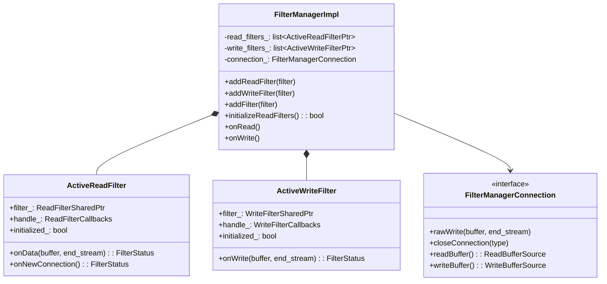
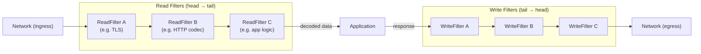
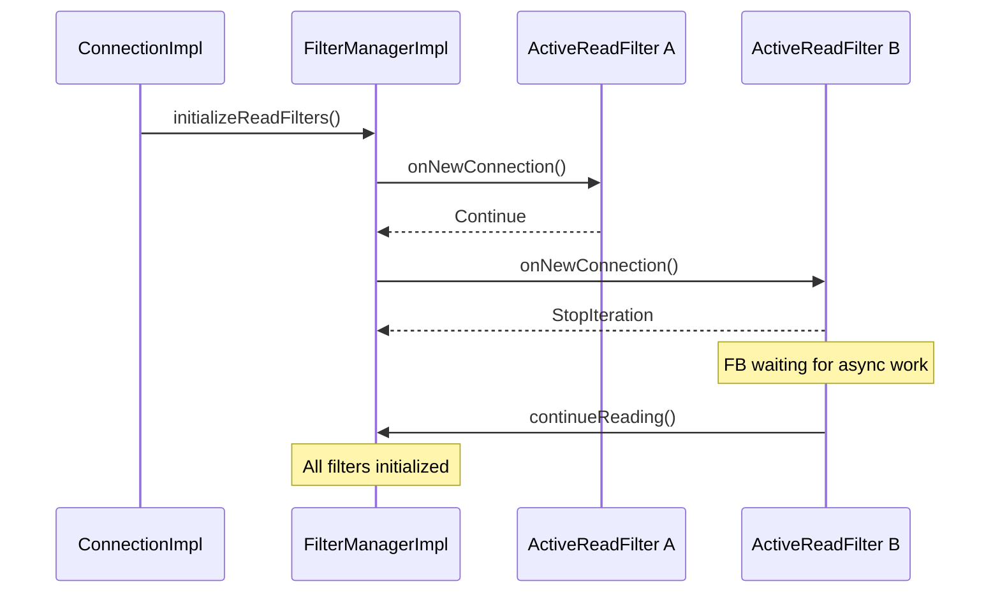
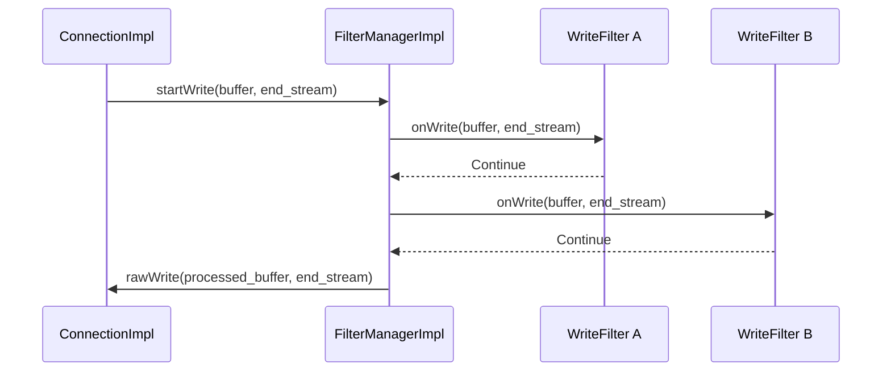
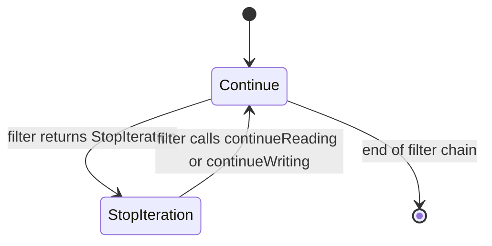
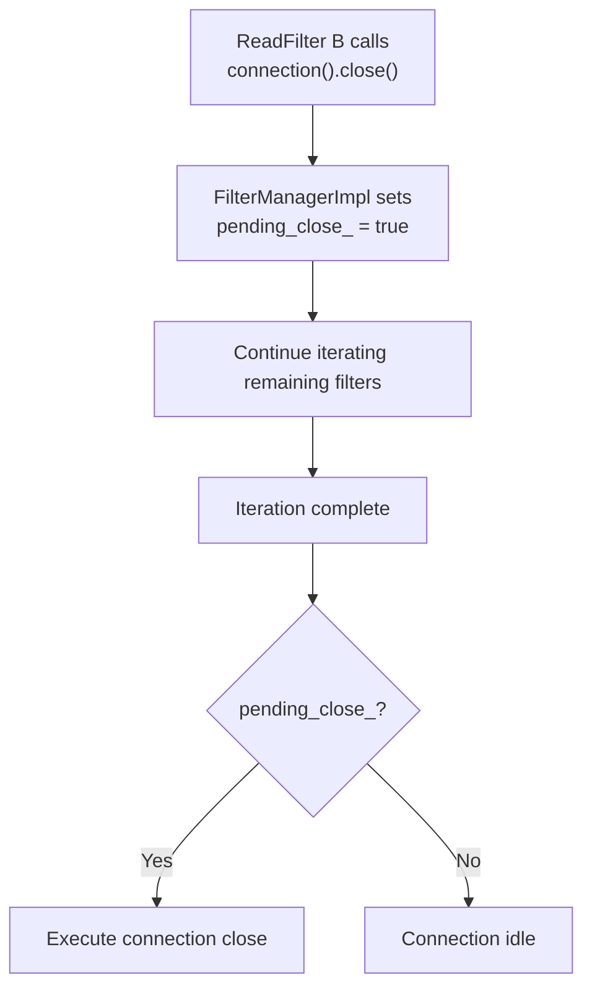

# FilterManagerImpl

**Files:** `source/common/network/filter_manager_impl.h` / `.cc`  
**Namespace:** `Envoy::Network`

## Overview

`FilterManagerImpl` manages the ordered list of **network read and write filters** installed on a `ConnectionImpl`. It drives data through the filter chain in both directions, manages filter initialization (lazy `onNewConnection`), handles connection draining after a filter signals close, and provides each filter with callback access to the connection.

This is the **network-layer** (L4) filter manager, distinct from the HTTP-layer `Http::FilterManager`. Network filters operate on raw `Buffer::Instance` data, not parsed HTTP headers.

### Where `FilterManagerImpl` Sits in the Stack

`FilterManagerImpl` sits between the `ConnectionImpl` (which owns the OS socket I/O via `IoHandle` and the transport socket for TLS) and the application-level filters (HTTP connection manager, TCP proxy, Redis proxy). It is the execution engine for the network filter chain — it does not own filters or decide which ones to install; `ListenerImpl::createNetworkFilterChain()` does that. `FilterManagerImpl` just runs them.

The `FilterManagerConnection` interface that `ConnectionImpl` implements gives `FilterManagerImpl` callbacks back into the connection: `rawWrite()` to flush data to the socket, `closeConnection()` to trigger a close from a filter's decision, and `readBuffer()`/`writeBuffer()` to access the buffers that filters operate on.

### How Filters Are Installed

Network filters are added to a connection one-by-one via `addReadFilter()` and `addWriteFilter()`. Each call wraps the raw filter in an `ActiveReadFilter` or `ActiveWriteFilter` struct that tracks:

- The filter object itself (`ReadFilterSharedPtr` or `WriteFilterSharedPtr`)
- An `initialized_` flag to track whether `onNewConnection()` has been called
- A callback handle that implements `ReadFilterCallbacks` or `WriteFilterCallbacks`, giving the filter a reference to the connection and the ability to continue or inject data

Filters share the same `read_buffer_` owned by `ConnectionImpl`. When a read filter calls `continueReading()`, `FilterManagerImpl` resumes iteration from that filter's position — not from the beginning of the chain. This is important: a filter that pauses and resumes does not re-execute preceding filters on the same data.

**What is a Network Filter?**

Network filters operate at Layer 4 (TCP/UDP), processing raw bytes before any protocol parsing:

**Common Network Filters:**
- **HTTP Connection Manager**: Parses HTTP and creates HTTP filter chain
- **TCP Proxy**: Proxies raw TCP streams to upstream
- **Redis Proxy**: Parses Redis protocol, provides connection pooling
- **MySQL Proxy**: Parses MySQL protocol, provides query routing
- **Mongo Proxy**: Parses MongoDB protocol, provides sharding
- **TLS Inspector (listener filter)**: Extracts SNI before connection is established

**Why Network Filters?**
- **Protocol agnostic**: Connection layer doesn't need to know about HTTP, Redis, etc.
- **Composability**: Can stack filters (rate limit → protocol parser → proxy)
- **Early decision making**: Can reject connections before expensive parsing
- **Resource management**: Can limit connections based on raw metrics

**Network Filter vs HTTP Filter:**
- **Network Filter**: Sees raw bytes, operates at connection level
- **HTTP Filter**: Sees parsed HTTP (headers, body), operates at request level
- HTTP Connection Manager is a network filter that creates HTTP filters internally

## Class Hierarchy



### Why `StopIteration` Exists at the Network Layer

Network filters sometimes need to read more data before they can make a decision. A naive implementation would have the filter block until more data arrives, but that would block the event loop thread and prevent other connections from being served.

Instead, a filter returns `StopIteration` to indicate "I need more data before I can proceed." `FilterManagerImpl` stops the iteration and returns control to the event loop. When more bytes arrive on the socket, `ConnectionImpl::onFileEvent(READ)` fires again, reads more data into `read_buffer_`, and calls `FilterManagerImpl::onRead()` again — which resumes from the same filter position.

This is the pattern used by the HTTP connection manager when it needs to buffer a complete HTTP request body before dispatching to an HTTP filter: the codec filter returns `StopIteration` until the complete body is available, then calls `continueReading()`.

## Filter Chain Ordering

**This diagram shows how network filters process data in both directions:**

**Read Filters (Downstream → Envoy):**
- Execute in **forward order**: First filter added gets first look at data
- Each filter can inspect, modify, or buffer data
- Filter A might do rate limiting
- Filter B might parse protocol (HTTP Connection Manager)
- Filter C might do application-specific logic
- Data flows: Network → A → B → C → Application

**Write Filters (Envoy → Downstream):**
- Execute in **reverse order**: Last filter added gets first look at response
- Symmetric with read filters for layering
- Filter C might add metadata
- Filter B might encode protocol
- Filter A might compress data
- Data flows: Application → C → B → A → Network

**Why Reverse Order for Writes?**
- **Symmetry**: Filter that unwraps on read can wrap on write
- **Layering**: Matches OSI model (application → transport)
- **Example**:
  - Filter A: Encryption - decrypts on read, encrypts on write
  - Filter B: Compression - decompresses on read, compresses on write
  - Processing: Read: encrypted → compressed → plain | Write: plain → compressed → encrypted



- **Read filters** iterate **forward** (first added → last added)
- **Write filters** iterate **reverse** (last added → first added)

### The Write Direction: Reverse Ordering and Why It Matters

Write filters iterate in **reverse order** (last added to first added). This creates natural layering symmetry with read filters. Consider a connection with two filters installed in order: a rate limiter (A) and an HTTP codec (B):

- **On read**: A sees raw bytes first (can enforce rate limits on incoming data), then B parses HTTP
- **On write**: B runs first (encodes HTTP responses into bytes), then A sees the encoded bytes last

This is correct layering: the codec should produce bytes before the rate limiter counts them. If write filters ran forward, the rate limiter would count bytes before the codec had encoded them — which might not even be the same data.

In practice, most deployed network filters are read-only (they don't implement `WriteFilter`). The HTTP connection manager implements both directions but handles them internally at the HTTP layer. The rate limit filter (`RateLimit`) is a common pure read filter.

## Filter Initialization — `onNewConnection()`

Filters are lazily initialized. `initializeReadFilters()` is called once when the connection is accepted, walking each `ActiveReadFilter` and calling `onNewConnection()`. If a filter returns `StopIteration`, the chain pauses until that filter calls `continueReading()`.



## Read Data Flow

```mermaid
sequenceDiagram
    participant CI as ConnectionImpl
    participant FM as FilterManagerImpl
    participant FA as ReadFilter A
    participant FB as ReadFilter B

    CI->>FM: onRead()
    FM->>FA: onData(read_buffer, end_stream)
    FA-->>FM: Continue
    FM->>FB: onData(read_buffer, end_stream)
    FB-->>FM: StopIteration
    Note over FB: FB paused; data stays in read_buffer
    FB->>FM: continueReading()
    FM->>FB: onData(remaining_data)
```

## Write Data Flow



## Filter Status State Machine



### `onNewConnection()`: The First Call for Each Filter

`initializeReadFilters()` is called once, immediately after the filter chain is installed on a new connection. It walks the read filter list and calls `onNewConnection()` on each uninitialized filter. This gives filters a chance to set up per-connection state before any data arrives.

A filter that returns `StopIteration` from `onNewConnection()` (rare but valid) causes `initializeReadFilters()` to pause — subsequent filters in the list are not initialized yet. They will be initialized when the stopped filter calls `continueReading()`. This allows a filter to perform async setup (e.g., check a rate limit counter in Redis) before the connection proceeds.

Most filters return `Continue` from `onNewConnection()` since their setup is synchronous. The HTTP connection manager, for example, creates its codec and returns `Continue` immediately.

## Pending Close Handling

If a filter calls `connection().close()` while the filter chain is mid-iteration, `FilterManagerImpl` records a `pending_close_` flag and defers the actual close until the current iteration completes:



### Pending Close: Why Deferred Closure Is Necessary

When a read filter calls `connection().close(NoFlush)` mid-iteration (while `FilterManagerImpl` is inside its `onRead()` loop), the connection cannot be immediately destroyed. The current call stack is inside the filter's `onData()` callback — returning from `close()` back to the caller would be returning into code that operates on a destroyed object.

`FilterManagerImpl` handles this by setting `pending_close_ = true` and deferring the actual close until the current iteration completes. After all remaining filters in the chain are called (they may still want to act on the data even though a close was requested), the loop checks `pending_close_` and performs the actual close.

This deferred-close pattern ensures that no filter sees a partially-destroyed connection, and that all filters in the chain get a chance to handle the data even if one of them requested closure.

## `ActiveReadFilter` — ReadFilterCallbacks

Each `ActiveReadFilter` wraps the real `ReadFilter` and also implements `ReadFilterCallbacks` to give the filter access to the connection:

| Callback | Behavior |
|----------|---------|
| `continueReading()` | Resume chain from this filter's position |
| `connection()` | Returns reference to the `Connection` |
| `injectReadDataToFilterChain(buffer, end_stream)` | Inject synthetic data into the chain |
| `upstreamHost()` | Returns upstream `HostDescription` (for cluster filters) |

## `ActiveWriteFilter` — WriteFilterCallbacks

| Callback | Behavior |
|----------|---------|
| `injectWriteDataToFilterChain(buffer, end_stream)` | Inject synthetic data into the write chain |
| `connection()` | Returns reference to the `Connection` |

### `injectReadDataToFilterChain`: Synthetic Data Injection

`ReadFilterCallbacks::injectReadDataToFilterChain(buffer, end_stream)` is a special mechanism that lets a filter inject synthetic data into the read filter chain as if it came from the network. This is used for features like:

- **Tunneling**: A filter that unwraps an encapsulated connection (e.g., HTTP CONNECT tunnel) can inject the unwrapped payload bytes as if they arrived directly from the OS socket
- **Replay**: A filter that buffers data for retry can inject the buffered data back into the chain after setup completes

The injected data enters the chain at the calling filter's position and flows forward through subsequent filters — it does not re-execute the calling filter or any preceding filter.

## Comparison: Network vs HTTP Filter Manager

| Aspect | `Network::FilterManagerImpl` | `Http::FilterManager` |
|--------|-----------------------------|-----------------------|
| Data type | Raw `Buffer::Instance` | Parsed HTTP headers/body/trailers |
| Filter interfaces | `ReadFilter` / `WriteFilter` | `StreamDecoderFilter` / `StreamEncoderFilter` |
| Direction | Read = forward; Write = reverse | Decoder = forward; Encoder = reverse |
| Per-stream | No (per-connection) | Yes (per HTTP request) |
| Local reply | No | Yes (`sendLocalReply`) |
| Initialization | `onNewConnection()` called once | Filter factories called per request |
| Buffering | In `read_buffer_` on `ConnectionImpl` | Per-filter `buffered_body_` |
