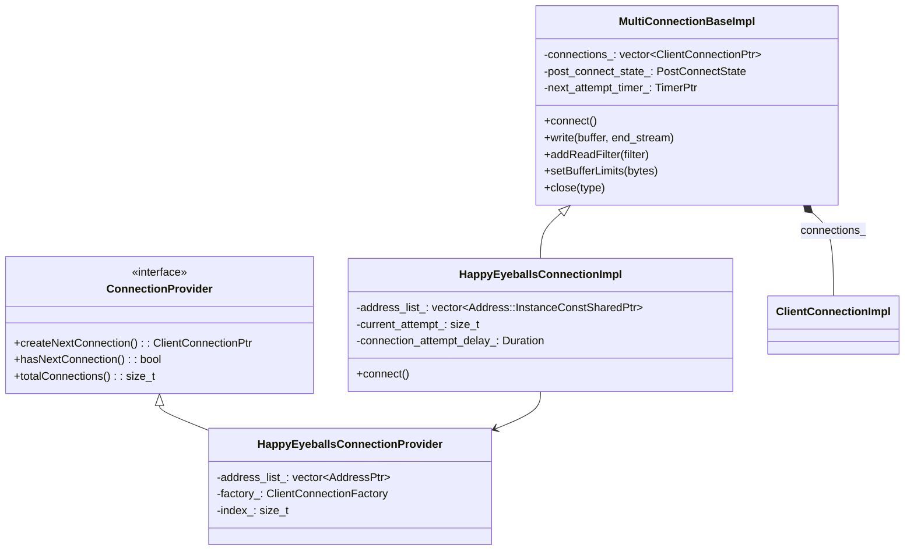
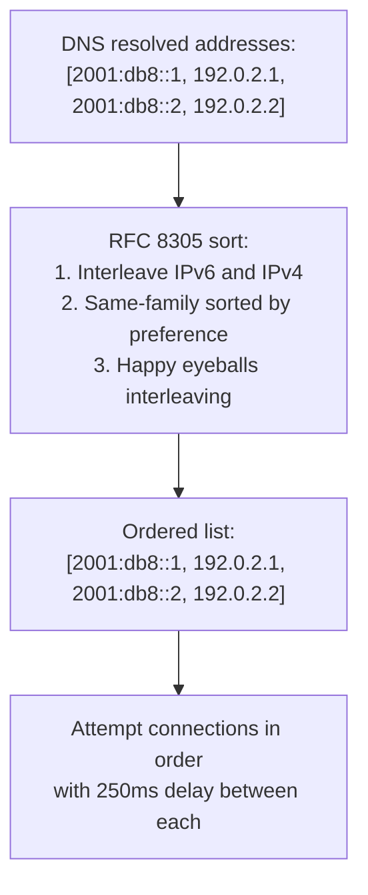
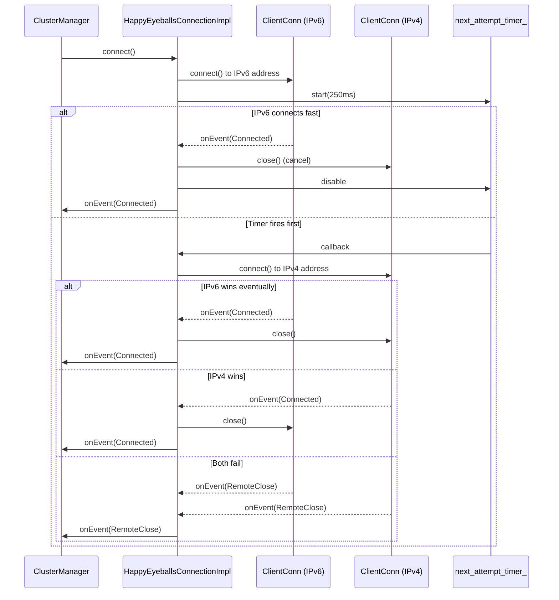
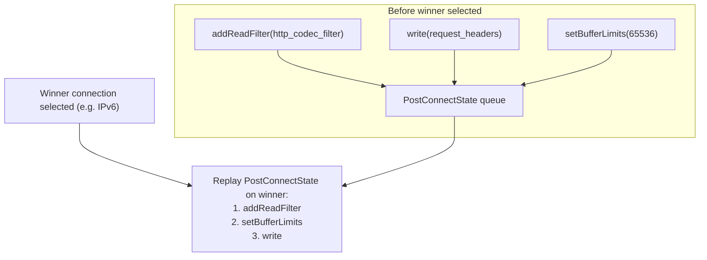
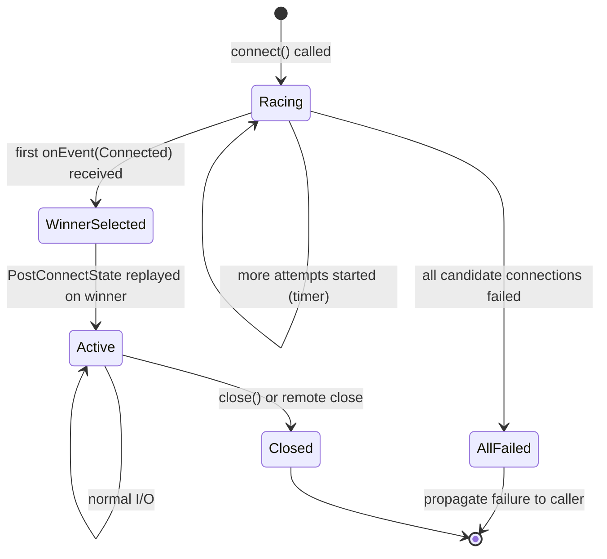
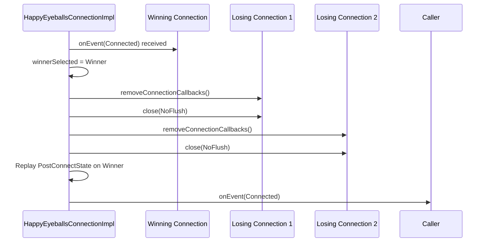

# HappyEyeballsConnectionImpl

**Files:**
- `source/common/network/multi_connection_base_impl.h/.cc` (base)
- `source/common/network/happy_eyeballs_connection_impl.h/.cc`
**Namespace:** `Envoy::Network`

## Overview

`HappyEyeballsConnectionImpl` implements **RFC 8305 (Happy Eyeballs v2)** for upstream TCP connections. When an upstream hostname resolves to multiple addresses (e.g., both IPv6 and IPv4), it races connections to each address in priority order, using the first one that successfully connects while cancelling the others.

`MultiConnectionBaseImpl` is the generic racing base; `HappyEyeballsConnectionImpl` extends it with RFC 8305–compliant address ordering and the 250ms per-attempt delay.

### The Problem: Dual-Stack Networks and IPv6 Unreachability

Modern DNS resolvers return both `AAAA` (IPv6) and `A` (IPv4) records for most internet hostnames. IPv6 is generally preferred because it is more scalable and has better routing properties. However, IPv6 connectivity is not universal — some networks have IPv6 configured but broken (misconfigured routers, firewall holes), leading to connection attempts that silently timeout rather than fail fast.

Without Happy Eyeballs, a proxy that naively tries IPv6 first and waits for the full TCP timeout (up to 75 seconds by default) before falling back to IPv4 would be effectively unusable on broken IPv6 networks. End users would experience multi-second delays on every connection.

The Happy Eyeballs algorithm solves this by racing IPv6 and IPv4 connections in parallel with a short delay between starts. Whichever connects first wins, and the loser is cancelled. The delay (250ms per RFC 8305) is short enough that a working IPv6 connection has time to win, but long enough that IPv4 is started before a broken IPv6 connection times out. The result: fast connections on healthy networks, automatic fallback on broken ones, and no perceived latency when everything works.

### Where It Is Used in Envoy

`HappyEyeballsConnectionImpl` is used by upstream connection pools when the cluster's DNS resolution returns multiple addresses. The `ClusterManagerImpl` checks whether a cluster has Happy Eyeballs enabled (via `upstream_http_protocol_options.use_upstream_http_protocol_options` or per-connection logic) and creates a `HappyEyeballsConnectionImpl` instead of a plain `ClientConnectionImpl` when multiple addresses are available.

From the connection pool's perspective, `HappyEyeballsConnectionImpl` is a drop-in replacement — it implements the same `ClientConnection` interface. The pool does not need to know that multiple TCP connections were started internally.

## Class Hierarchy



## RFC 8305 Address Ordering

RFC 8305 specifies a specific address ordering algorithm to maximize the benefit of IPv6 preference while ensuring interleaving with IPv4 for rapid fallback. The key principle is: **interleave address families so that each attempt has a different family than the one before it**.

For example, given DNS results `[2001:db8::1, 2001:db8::2, 192.0.2.1, 192.0.2.2]` (two IPv6 and two IPv4):
- The reordering produces `[2001:db8::1, 192.0.2.1, 2001:db8::2, 192.0.2.2]`
- Attempt 1 starts at t=0 to `2001:db8::1` (IPv6 preferred)
- Attempt 2 starts at t=250ms to `192.0.2.1` (IPv4 fallback)
- Attempt 3 starts at t=500ms to `2001:db8::2` (second IPv6)
- Attempt 4 starts at t=750ms to `192.0.2.2` (second IPv4)

This interleaving means that if IPv6 is completely broken, IPv4 is always the second attempt — not the fifth. On a network where IPv6 works but is slow, IPv4 may still win the race for the first request, but subsequent requests will likely establish IPv6 faster once the network path is warmed.

Before attempting connections, addresses are sorted per RFC 8305:



## Connection Racing Flow



### The 250ms Delay: Balancing Preference and Speed

The 250ms `connection_attempt_delay` is the RFC 8305 recommended value, chosen based on measurements of typical IPv6 round-trip times and TCP connection establishment times on well-functioning networks. The idea is:

- If IPv6 is working, a connection should complete in well under 250ms on any modern network
- If IPv6 is broken (no route, firewall drop), the first SYN packet is lost and the OS won't retransmit for at least 1 second
- 250ms is long enough to let a healthy IPv6 connection win, short enough to start IPv4 before a broken IPv6 connection sits idle for seconds

In practice, this means that on a working dual-stack network, users see approximately the latency of the best connection (usually IPv6) with no fallback overhead. On a network with broken IPv6, users see approximately 250ms of extra latency on the first connection — acceptable for a proxy serving long-lived connections.

## `PostConnectState` — Deferred Operations

Before a winner is selected, operations like `write()`, `addReadFilter()`, and `setBufferLimits()` are deferred and replayed on the winning connection:



### PostConnectState: The Challenge of Deferred Calls

When `HappyEyeballsConnectionImpl` is created, the caller typically makes several setup calls before `connect()` is even invoked:

```cpp
auto conn = createHappyEyeballsConnection(...);
conn->addReadFilter(http_codec_filter);   // Must be on winner
conn->setBufferLimits(65536);             // Must be on winner
conn->connect();                          // Starts the race
```

The problem: `addReadFilter()` is called before a winner is known, but it must eventually be applied to exactly the winning `ClientConnectionImpl`. If it were applied to all candidate connections, the HTTP codec filter would be initialized on all of them — wasting resources and potentially causing issues when losers are closed.

`PostConnectState` solves this by queuing these calls in order. When a winner is selected, the queue is replayed on the winner in the exact order the caller made them. The caller's code is unchanged — it doesn't need to know about the racing internal mechanism.

## `PerConnectionState` — Applied Immediately to All

Some state must be applied to every candidate connection (not deferred):

| State | Reason Applied to All |
|-------|----------------------|
| `setBufferLimits()` | Watermarks must be consistent across all attempts |
| `noDelay(true)` | TCP_NODELAY applied immediately on socket creation |
| `addConnectionCallbacks()` | Internal callbacks needed for race tracking |

### PerConnectionState vs PostConnectState: Why Two Categories?

Some state must be applied to **all** candidate connections immediately, because it affects behavior before connection establishment — not after. `TCP_NODELAY` is applied immediately on socket creation because it affects the SYN packet. Buffer limits must be consistent across all candidates because the event loop might deliver read events on any of them before a winner is chosen.

Internal connection callbacks (`addConnectionCallbacks()` for the race tracker itself) must also be applied to all candidates — the racing logic works by observing `onEvent(Connected)` and `onEvent(RemoteClose)` events from each candidate.

External callbacks (added by the upstream pool) are deferred in `PostConnectState` because they should only fire once — on the winning connection. If they were applied to all candidates, the pool would receive multiple `onEvent(Connected)` callbacks when multiple connections briefly succeed (possible in rare race conditions).

## Winner Selection State Machine



## Cancellation and Cleanup

When a winner is selected, all losing connections are closed:



## Attempt Timing

| Parameter | Default | Purpose |
|-----------|---------|---------|
| `connection_attempt_delay` | 250ms (RFC 8305) | Delay before starting next address attempt |
| Max attempts | `address_list_.size()` | One attempt per resolved address |

## Key Design Properties

- **Transparent substitution**: `HappyEyeballsConnectionImpl` implements the same `ClientConnection` interface as `ClientConnectionImpl`, so upstream pool code needs no changes.
- **No extra latency when first address succeeds**: If the first connection (typically IPv6) succeeds before the 250ms timer fires, no additional connection is ever made.
- **Filter/callback replay**: All `addReadFilter()`, `addWriteFilter()`, `addConnectionCallbacks()`, and initial `write()` calls are safely deferred and replayed exactly once on the winner.
