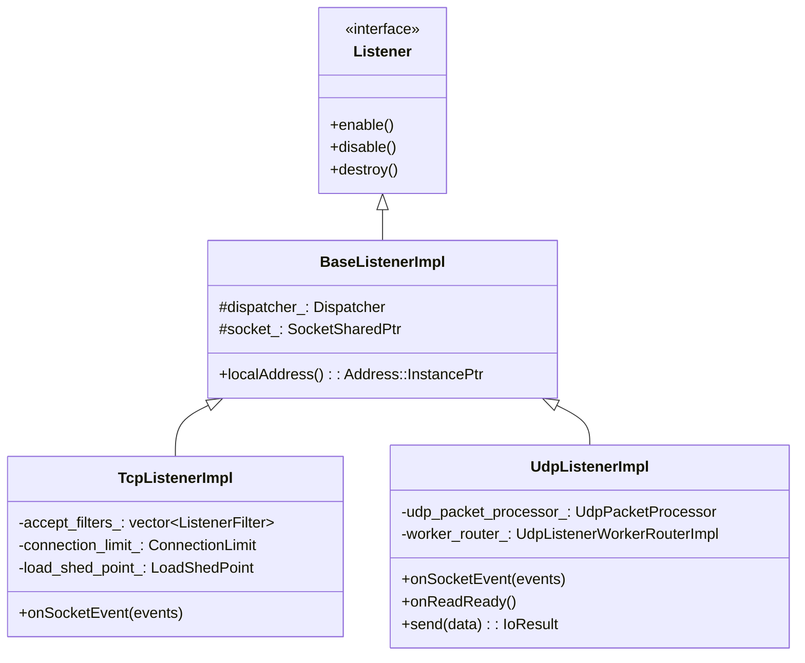
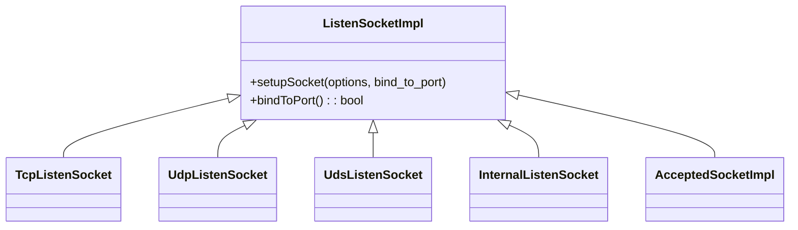
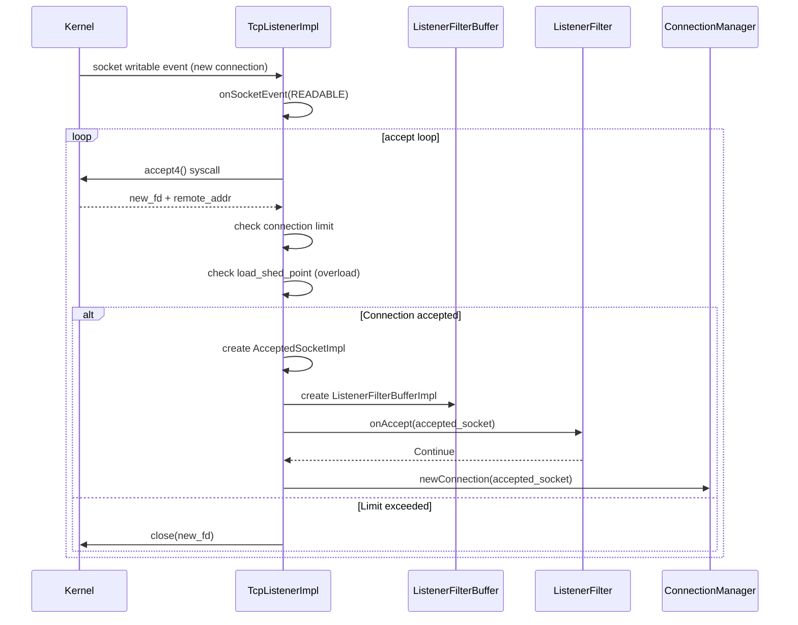
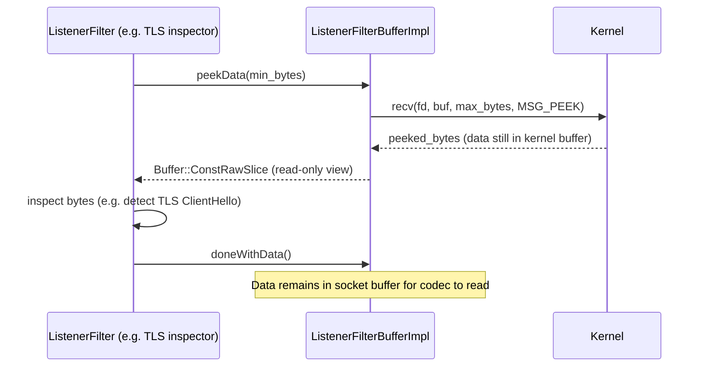
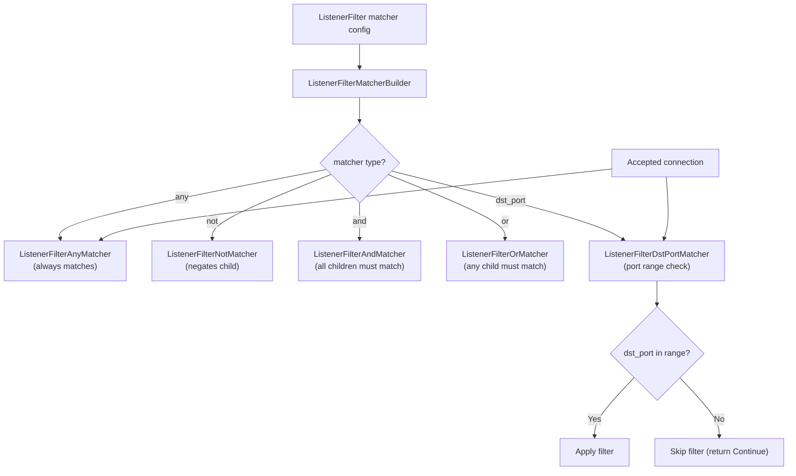
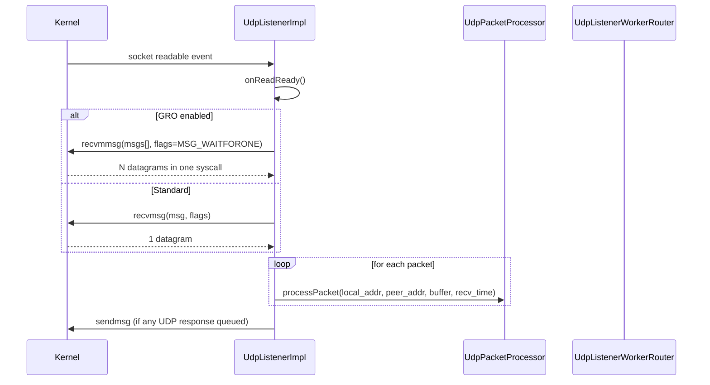
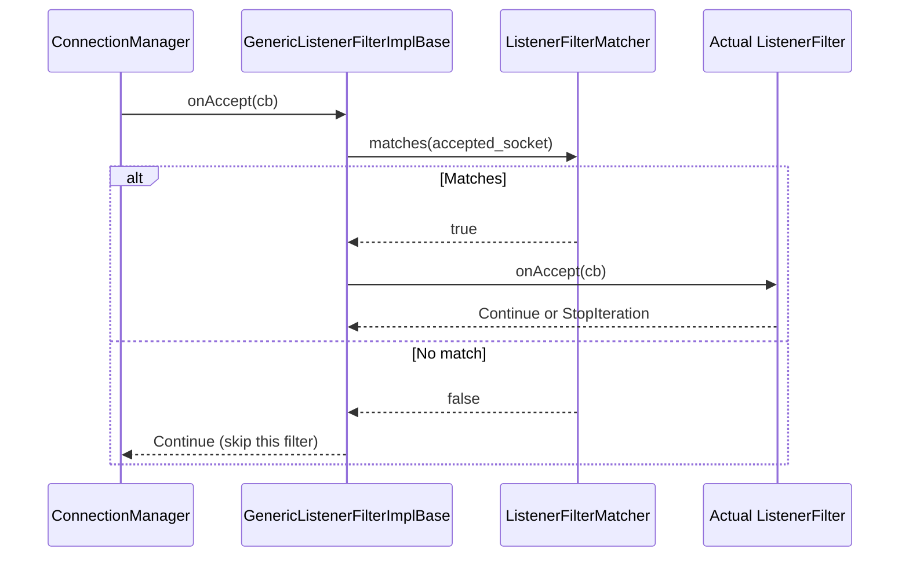
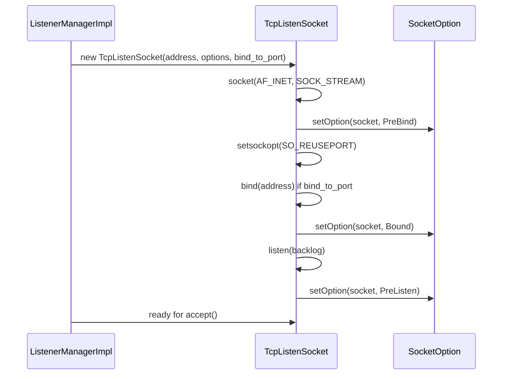

# TCP and UDP Listeners

**Files:**
- `source/common/network/base_listener_impl.h/.cc`
- `source/common/network/tcp_listener_impl.h/.cc`
- `source/common/network/udp_listener_impl.h/.cc`
- `source/common/network/listen_socket_impl.h/.cc`
- `source/common/network/listener_filter_buffer_impl.h/.cc`
**Namespace:** `Envoy::Network`

## Overview

Envoy's listener layer accepts new connections (TCP) or datagrams (UDP) from the OS, applies listener filters (L4 pre-processing before the connection is handed to a filter chain), enforces connection limits and overload shedding, and dispatches to the appropriate worker thread.

### The Listener Layer's Responsibilities

The classes in this file form the **OS interface layer** of Envoy's network stack. They are responsible for the narrow but critical window between "the OS has a new connection" and "the connection handler is processing it." Their jobs are:

1. **Accept connections from the kernel**: Call `accept4()` on the listen socket fd when the event loop signals it is readable. Retrieve the connected socket fd and the peer address.

2. **Enforce admission control**: Check global connection limits and load shedding thresholds before the connection consumes any significant resources. Connections rejected here are dropped at the OS level — they never enter Envoy's filter pipeline.

3. **Run listener filters**: Allow pre-connection filters to inspect raw socket metadata (TLS ClientHello, proxy protocol header, original destination) and set metadata on the socket object. This is the last chance to gather information that must come from the raw bytes before any codec parsing.

4. **Hand off to the connection handler**: After listener filters complete, pass the annotated socket to `ConnectionHandlerImpl::ActiveTcpListener`, which selects a filter chain and creates a `ConnectionImpl`.

### `TcpListenerImpl` vs. `UdpListenerImpl`: Fundamentally Different Models

TCP and UDP require completely different architectures because their OS semantics are opposite:

**TCP** is connection-oriented. Each `accept()` call returns a new file descriptor representing one specific connection. That fd lives until the connection closes. Envoy creates one `ConnectionImpl` per fd and runs the full filter pipeline on it.

**UDP** is connectionless. There is a single socket fd for all incoming datagrams, regardless of source. `recvmsg()` reads one datagram at a time, including the source address. Envoy must implement its own session demultiplexing — grouping datagrams by source IP:port to route them to the right QUIC or UDP session handler. `UdpListenerWorkerRouterImpl` provides this by consistently hashing the source address to a worker thread.

### Why the `Listener` Interface Is Minimal

The `Listener` interface has only three methods: `enable()`, `disable()`, and `destroy()`. This is intentional — the listener object is not responsible for deciding what to do with connections, only for controlling whether the OS accept loop is running. Higher-level code (`ActiveTcpListener`, `ConnectionHandlerImpl`) owns connection processing logic.

`disable()` is used during graceful drain: when a listener is being removed, it stops accepting new connections immediately while existing connections finish. The OS keeps the listen socket open (so no SYN resets) but Envoy stops calling `accept()` on it. After the drain timeout, `destroy()` closes the socket.

## Class Hierarchy



## Listen Socket Hierarchy



### Why `BaseListenerImpl` Exists

Both `TcpListenerImpl` and `UdpListenerImpl` share the same lifecycle pattern: they wrap a `SocketSharedPtr`, register a file event on the socket's fd with the worker thread's dispatcher, and unregister it on destruction. `BaseListenerImpl` extracts this common boilerplate, keeping the concrete implementations focused on their protocol-specific accept/receive logic.

## TCP Accept Flow



### The Accept Loop: Batching for Throughput

`TcpListenerImpl::onSocketEvent()` does not accept one connection per event. It loops, calling `accept4()` repeatedly up to `max_connections_to_accept_per_socket_event_` times. This batching is critical for throughput: a single `epoll_wait()` wakeup can process dozens of queued connections in one event loop iteration, rather than waking up once per connection.

The limit prevents starvation: if many connections arrive simultaneously, the accept loop must eventually yield so other work (data I/O on existing connections, timers) can proceed. The `max_connections_to_accept_per_socket_event` tunable balances throughput vs. fairness.

After each accepted fd, admission control runs:
1. `rejectCxOverGlobalLimit()`: Checks the `num_connections_` gauge against the configured `GlobalConnectionLimit`. If over, the fd is closed and `onReject(GlobalCxLimit)` is called.
2. `shouldShedLoad()`: Consults the `OverloadManager` LoadShedPoint. If overloaded, a random fraction of connections are shed.

Both rejections happen before any Envoy state is allocated for the connection — the fd is closed immediately and the kernel cleans up.

## Listener Filter Buffer — Peek Without Consuming

`ListenerFilterBufferImpl` lets listener filters peek at the first bytes of a connection (e.g., for TLS detection, proxy protocol parsing) using `recv(MSG_PEEK)` so the data is not consumed:



### `ListenerFilterBufferImpl`: Non-Destructive Peeking

The TLS Inspector listener filter needs to read the first few bytes of the TLS ClientHello to extract SNI and ALPN. But those bytes cannot be consumed — they are part of the TLS handshake and must remain in the socket buffer to be processed by the TLS transport socket later.

`ListenerFilterBufferImpl` uses `recv(MSG_PEEK)` which reads bytes into a userspace buffer **without removing them from the kernel socket buffer**. The TLS Inspector reads this peek buffer, extracts the metadata, and returns `Continue`. When the `ConnectionImpl` is created and its transport socket calls `doRead()`, the `read()` syscall picks up the same bytes again — the peek was truly non-destructive.

`MSG_PEEK` is not always sufficient: the TLS ClientHello may arrive in multiple TCP segments, and the initial peek may not have enough bytes for the Inspector to parse the SNI extension. In that case, the filter returns `StopIteration`. When more data arrives, `ListenerFilterBufferImpl` performs a larger peek and the filter retries. This process continues until the full ClientHello is available or the timeout fires.

## Listener Filter Match Predicates

`filter_matcher.h` provides composable predicates that determine whether a listener filter applies to a given accepted connection:



## Overload / Connection Limit Protection

`TcpListenerImpl` integrates with two protection mechanisms:

```mermaid
flowchart TD
    Accept["New connection accepted"] --> A{Global connection<br/>limit reached?}
    A -->|Yes| B["Reject: close(new_fd)<br/>cx_overflow++ stat"]
    A -->|No| C{LoadShedPoint<br/>check (overload)?}
    C -->|Shed| D["Reject: close(new_fd)<br/>overload_reject++ stat"]
    C -->|Accept| E["Hand to listener filter chain"]
```

| Protection | Source | Stat |
|------------|--------|------|
| Connection limit | `config.globalConnectionLimit()` | `listener.downstream_cx_overflow` |
| Load shedding | `OverloadManager::LoadShedPoint` | `listener.downstream_cx_overload_reject` |

### Overload Protection: Two Distinct Mechanisms

**Global connection limit** is a hard cap on the total number of simultaneously active connections across all listeners. It is enforced by a shared atomic counter (`num_connections_`). When the counter reaches the limit, new connections are rejected immediately regardless of which listener accepts them. This prevents memory exhaustion from connection storms.

**Load shedding** is a softer mechanism from the `OverloadManager`. It monitors system resources (memory pressure, CPU utilization, open file descriptors) and when thresholds are crossed, it enables a LoadShedPoint that causes a configurable fraction of new connections to be randomly rejected. The random fraction increases as pressure increases. This creates a graduated response instead of a cliff-edge cutoff: the system degrades gracefully rather than suddenly rejecting all new connections.

The two mechanisms are independent and both run on every accepted socket. Connection limit is checked first because it is O(1) (atomic load) and has the highest priority.

## UDP Listener Flow

UDP listeners have different semantics — there are no connections, only datagrams. `UdpListenerImpl` uses `recvmsg`/`recvmmsg` (with optional GRO) to batch-receive packets:



### UDP: `recvmmsg` and GRO for Performance

For high-throughput UDP workloads (like QUIC), individual `recvmsg()` calls are too slow — each syscall has overhead that limits throughput. `UdpListenerImpl` uses two optimizations:

**`recvmmsg()`** (multiple message receive): A single syscall returns N datagrams into a pre-allocated array. This amortizes syscall overhead across many packets, dramatically improving packets-per-second throughput.

**Generic Receive Offload (GRO)**: With `UDP_GRO` socket option, the kernel coalesces multiple UDP datagrams from the same source into a single large buffer, which is received in one `recvmsg()` call. GRO trades latency for throughput — it is most beneficial for bulk UDP transfers (QUIC with many small packets) but adds latency for interactive low-packet-rate workloads.

## UDP Worker Routing

For multi-worker setups, UDP packets from the same peer are consistently routed to the same worker thread:

```mermaid
flowchart TD
    Pkt["UDP packet from 10.0.0.1:5000"] --> Router["UdpListenerWorkerRouterImpl"]
    Router -->|hash(peer_addr)| W0["Worker 0"]
    Router -->|hash(peer_addr)| W1["Worker 1"]
    Router -->|hash(peer_addr)| W2["Worker 2"]
    W1 -->|all packets from 10.0.0.1:5000| Session["UDP Session Handler"]
```

### Socket Setup: The Three Phases of Socket Options

`TcpListenSocket` applies socket options in three phases, corresponding to the three `SocketState` values: `PreBind`, `Bound`, and `PostBind` (also called `Listening`/`PreListen`). This phasing matters because some options must be set before `bind()` (like `SO_REUSEPORT`, which affects whether the bind succeeds), some after `bind()` but before `listen()` (like `SO_RCVBUF`), and some only make sense on a listening socket.

The `SocketOption` abstraction allows protocol-specific options (`TCP_FASTOPEN`, `IPV6_V6ONLY`) to be configured generically and applied at the right phase automatically, without the socket setup code needing to know about every possible option.

## `GenericListenerFilterImplBase<T>`

A template that wraps any listener filter with a `ListenerFilterMatcher`, short-circuiting `onAccept()` when the predicate doesn't match:



### UDP Worker Routing: Consistent Hashing for Stateful Sessions

QUIC and other UDP-based protocols are stateful — a QUIC connection is identified by a Connection ID embedded in each packet, not by the 5-tuple. When a QUIC client sends the second packet of a connection, it must arrive at the same Envoy worker thread that handled the first packet, or the connection state won't be found.

`UdpListenerWorkerRouterImpl` achieves this by hashing the peer address (IP + port) to a consistent worker thread. Because a QUIC client always uses the same source port, all its packets hash to the same worker. This is weaker than using the QUIC Connection ID (which the client might change during connection migration) but is sufficient for the common case.

For QUIC connection migration, more sophisticated routing (e.g., based on Connection ID) is handled at a higher layer in the QUIC listener stack.

## Socket Setup Lifecycle


