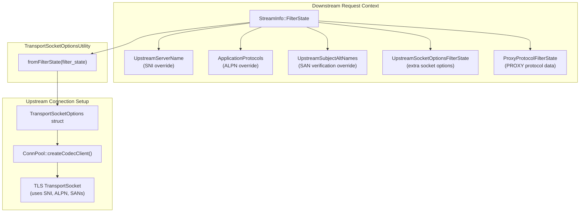
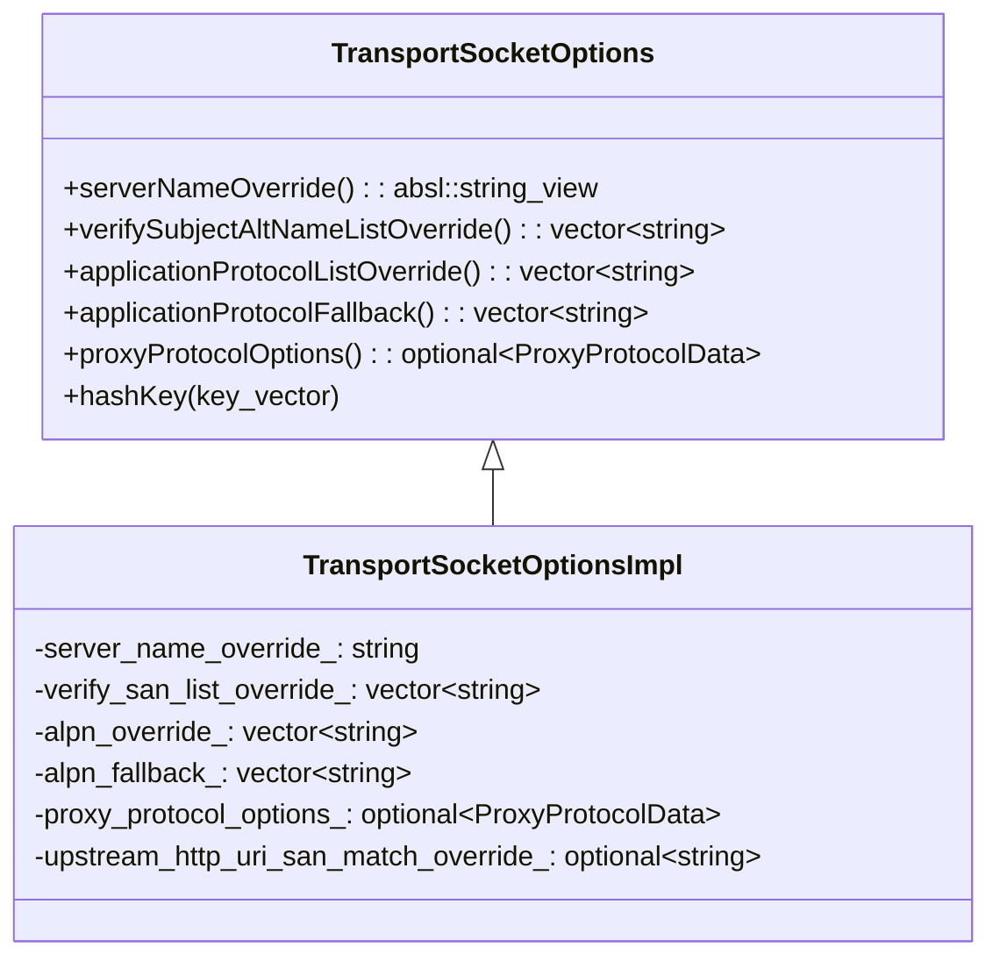
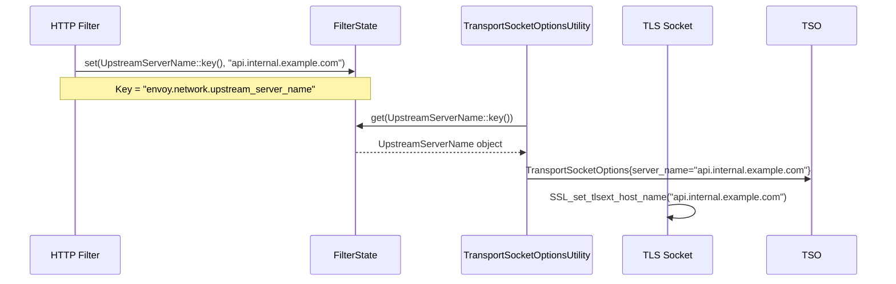
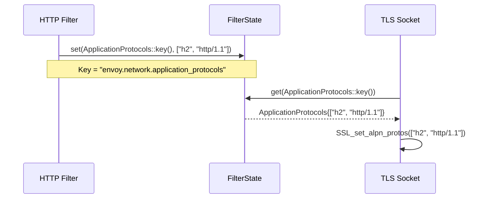
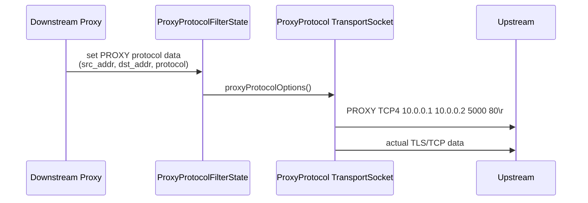
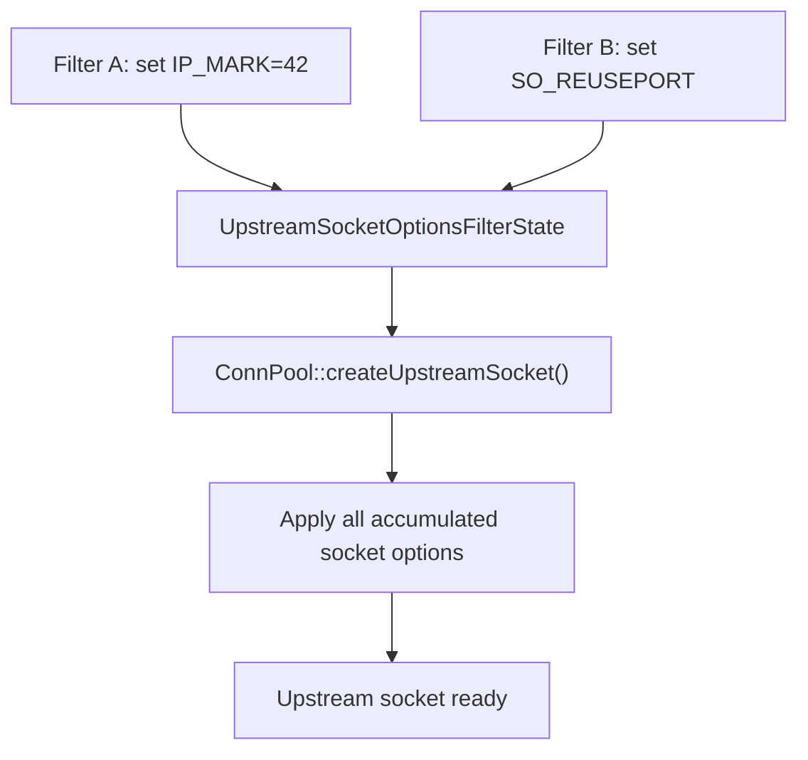
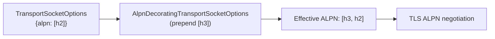
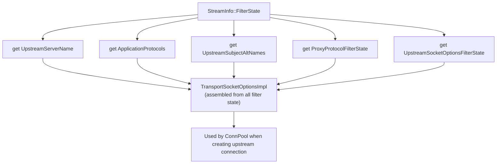
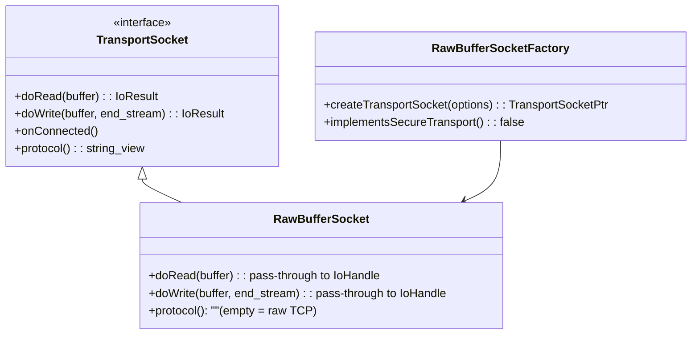
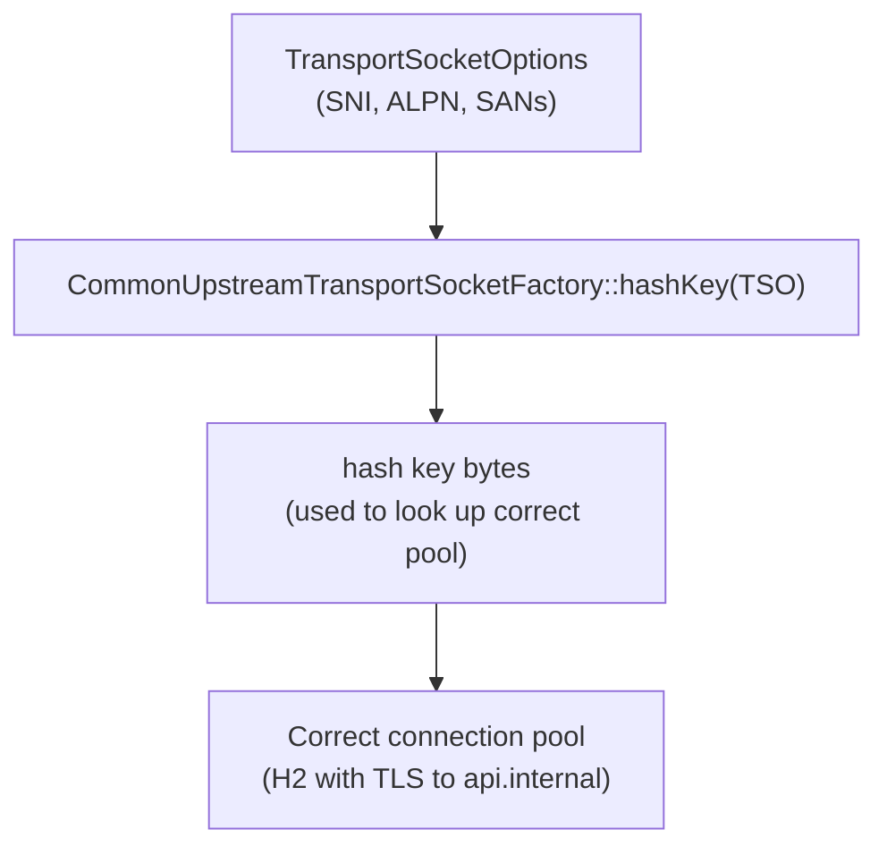

# Transport Socket Options & Upstream Filter State

**Files:**
- `source/common/network/transport_socket_options_impl.h/.cc`
- `source/common/network/application_protocol.h/.cc`
- `source/common/network/upstream_server_name.h/.cc`
- `source/common/network/upstream_subject_alt_names.h/.cc`
- `source/common/network/upstream_socket_options_filter_state.h/.cc`
- `source/common/network/proxy_protocol_filter_state.h/.cc`
- `source/common/network/raw_buffer_socket.h/.cc`
**Namespace:** `Envoy::Network`

## Overview

`TransportSocketOptions` carries upstream connection tuning parameters (SNI, ALPN, SANs, socket options, proxy protocol) from the downstream request context into the TLS/QUIC layer when establishing upstream connections. These parameters travel via `FilterState` objects keyed by well-known string constants.

### The Problem: Downstream Context Reaching Upstream TLS

In a proxy, the upstream TLS connection is established long before the HTTP filter chain knows which upstream backend is being targeted. The upstream connection pool may re-use an existing connection — or create a new one — deep in the routing stack, far from where request headers were inspected.

Yet there are legitimate reasons to vary upstream TLS behavior per-request:
- **Service mesh routing**: The requested server name (SNI) should match the upstream service identity, which is derived from the downstream request's routing destination
- **Protocol negotiation**: An HTTP/2-capable upstream should be negotiated with `h2` ALPN, but a downstream that sends HTTP/1.1 may need a compatible codec
- **Proxy protocol**: A transparent proxy needs to preserve the original client address in PROXY protocol headers sent to the upstream, which comes from the downstream connection's metadata

`TransportSocketOptions` solves this by providing a typed, strongly-named container that HTTP filters can populate in `StreamInfo::FilterState`. When the connection pool creates a new upstream connection, it calls `TransportSocketOptionsUtility::fromFilterState()` to assemble all these options into a single struct and passes it to the transport socket factory.

### The Filter State Pattern

Each option is stored as a distinct `FilterState` object with a statically-defined string key. This design has several advantages:

- **Extensibility**: New options can be added without changing the `TransportSocketOptions` interface — just add a new `FilterState` type with a new key
- **Optional by default**: A filter state entry that isn't set simply isn't read; there is no need to distinguish "not configured" from "configured to empty"
- **Per-request overrides**: Different requests can have different upstream TLS settings even when sharing the same connection pool (for pools that don't hash on transport options)
- **Filter independence**: Any HTTP filter in the chain can set these values without coordinating with other filters, as long as each uses the correct key

## Architecture

## `TransportSocketOptions` struct

## How Connection Pool Hashing Uses `TransportSocketOptions`

`TransportSocketOptions` participates in the connection pool hash key. When creating a new upstream connection, `CommonUpstreamTransportSocketFactory::hashKey()` serializes the relevant options (SNI, ALPN, SAN overrides) into a byte vector used to look up or create the right pool.

Two requests with different SNI overrides will land in different connection pools, because an H2 or TLS connection to `api.internal.example.com` is not interchangeable with one to `db.internal.example.com`. The hash key ensures that Envoy never serves an upstream connection to the wrong backend just because socket addresses happen to match.

## Filter State Objects

Each filter state object has a static string key and is stored in `StreamInfo::FilterState`:

### `UpstreamServerName`

Overrides the TLS SNI hostname for upstream connections. In a service mesh, this is typically set by the router or metadata exchange filter to the service identity of the upstream backend (e.g., `outbound|443||reviews.bookinfo.svc.cluster.local`). Without this override, the TLS SNI would default to the cluster's static TLS configuration, which may not match the per-request routing target.

### `ApplicationProtocols`

Overrides ALPN protocols offered to the upstream TLS server. This is used when the upstream cluster is configured with `use_downstream_protocol_detection` — the downstream codec (HTTP/1.1 or HTTP/2) detected on the downstream connection is propagated to the upstream TLS handshake to ensure protocol compatibility. An HTTP/2 downstream will try to negotiate `h2` with the upstream; an HTTP/1.1 downstream will offer only `http/1.1`.

### `ProxyProtocolFilterState`

Carries PROXY protocol v1/v2 header data to prepend on the upstream connection. PROXY protocol is commonly used in deployments where the upstream backend needs to see the original client IP but the connection goes through multiple proxy hops. The downstream proxy protocol listener filter extracts the original client address, stores it in `ProxyProtocolFilterState`, and the upstream proxy protocol transport socket picks it up and prepends the PROXY header when connecting to the next hop.

### `UpstreamSocketOptionsFilterState`

Accumulates additional socket options to apply when creating the upstream socket:

### `UpstreamSocketOptionsFilterState`

Accumulates extra socket-level options (beyond TLS parameters) to apply when creating the upstream OS socket. Uses cases include:
- **`IP_MARK`** / **`SO_MARK`**: Set a firewall mark on upstream sockets for policy routing (e.g., send upstream traffic through a specific routing table)
- **`IP_TOS`**: Set DSCP/QoS marking on upstream packets
- **Transparent proxy**: `IP_TRANSPARENT` allows binding to non-local addresses for transparent proxying

Multiple filters in the chain can independently push socket options — they are accumulated in a list and all applied at socket creation time.

## `AlpnDecoratingTransportSocketOptions`

Wraps existing `TransportSocketOptions` and prepends additional ALPN protocols for dynamic protocol negotiation:

## `TransportSocketOptionsUtility::fromFilterState()`

The key function that reads all filter state objects and assembles a `TransportSocketOptions`:

### `AlpnDecoratingTransportSocketOptions`: Prepending ALPN Without Overriding

Sometimes multiple layers of Envoy's stack want to influence ALPN. The HTTP/3 alt-svc detection layer may want to offer `h3` in addition to whatever the downstream-derived ALPN is. `AlpnDecoratingTransportSocketOptions` wraps an existing `TransportSocketOptions` object and **prepends** additional protocols rather than replacing them. The final ALPN list is the decorator's protocols followed by the base's protocols.

This composition pattern allows layers to add preferences without knowing what other layers have configured. The TLS handshake uses the merged list, and the upstream server picks whichever protocol it supports best.

## `RawBufferSocket` — Plaintext Transport

`RawBufferSocket` is the no-op transport socket used for unencrypted TCP connections:

### `RawBufferSocket` in the Filter Stack

`RawBufferSocket` is used whenever a connection is configured without TLS. Its `doRead()` and `doWrite()` are simple pass-throughs to the `IoHandle` — they read and write directly to the OS socket buffer with no transformation. `protocol()` returns an empty string, which signals to the connection manager that no transport-level protocol negotiation happened.

`RawBufferSocket` is also used as the backing socket for the TLS transport socket during the TLS handshake phase itself. Before TLS is established, the `SslSocket` calls back to `RawBufferSocket` for the actual byte I/O. After the handshake, it switches to TLS-encrypted mode transparently.

## `CommonUpstreamTransportSocketFactory`

Base class for upstream transport socket factories. Provides `hashKey()` for connection pool identity (different TLS configs → different pools):

## Filter State Keys Reference

| Filter State Object | Key String | Purpose |
|--------------------|-----------|---------|
| `UpstreamServerName` | `envoy.network.upstream_server_name` | Override TLS SNI |
| `ApplicationProtocols` | `envoy.network.application_protocols` | Override ALPN |
| `UpstreamSubjectAltNames` | `envoy.network.upstream_subject_alt_names` | Override SAN verification |
| `UpstreamSocketOptionsFilterState` | `envoy.network.upstream_socket_options` | Extra socket options |
| `ProxyProtocolFilterState` | `envoy.network.proxy_protocol` | PROXY protocol data |
| `AddressObject` | `envoy.network.filter_state_dst_address` | Override destination address |
| `DownstreamNetworkNamespace` | `envoy.network.downstream_network_namespace` | Per-listener network namespace |
