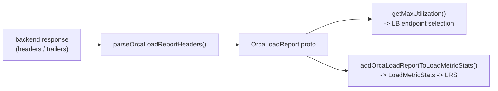

# ORCA — Overview

> Source: `source/common/orca/orca_parser.{h,cc}`, `source/common/orca/orca_load_metrics.{h,cc}`.
> Proto: `xds.data.orca.v3.OrcaLoadReport`.

**ORCA** (Open Request Cost Aggregation) is the xDS standard for backends to report their own
**load** back to clients. An upstream host can tell Envoy "I'm at 80% CPU, 60% memory, here are
my custom utilization metrics," and Envoy can feed those signals into load balancing (e.g.
weighted-least-request with endpoint utilization) and into LRS load reporting. This folder holds
the two pieces Envoy needs: **parsing** ORCA reports out of responses, and **extracting** named
metrics from them.

## Two responsibilities

### 1. Parsing — `orca_parser`

Backends emit an `OrcaLoadReport` either inline in HTTP response headers or (for gRPC) in
trailers/messages. `parseOrcaLoadReportHeaders()` reads it from a header map, supporting three
on-the-wire encodings selected by a prefix:

| Header / prefix | Format |
|-----------------|--------|
| `endpoint-load-metrics-bin` | Serialized binary proto |
| `endpoint-load-metrics: BIN ...` | Base64 binary |
| `endpoint-load-metrics: JSON ...` | JSON |
| `endpoint-load-metrics: TEXT ...` | Native text (`key:value` pairs) |

The known fields include `cpu_utilization`, `mem_utilization`, `application_utilization`, `eps`
(errors-per-second), `rps_fractional`, and open-ended `named_metrics.*` / `utilization.*`
entries. The function returns `absl::StatusOr<OrcaLoadReport>` so malformed reports surface as
errors rather than bad data.

### 2. Metric extraction — `orca_load_metrics`

Once parsed, two helpers pull specific metrics out of a report:

```cpp
void addOrcaLoadReportToLoadMetricStats(const LrsReportMetricNames& names,
                                        const OrcaLoadReport& report,
                                        Upstream::LoadMetricStats& stats);
double getMaxUtilization(const LrsReportMetricNames& names, const OrcaLoadReport& report);
```

- `addOrcaLoadReportToLoadMetricStats` accumulates the named metrics into per-host
  `LoadMetricStats` for **LRS** (Load Reporting Service) — so the control plane sees aggregated
  backend load.
- `getMaxUtilization` returns the max of the named metrics — used by load balancers that steer
  traffic away from the most-utilized endpoints.

## Flow



## Mental model

ORCA is the channel for **backend-reported load**. This folder is the plumbing: decode the
report from whatever format the backend used, then either feed its utilization into
load-balancing decisions or aggregate its named metrics for upstream load reporting. The
load-balancing *policies* that consume these signals live under
`source/extensions/load_balancing_policies/`.
