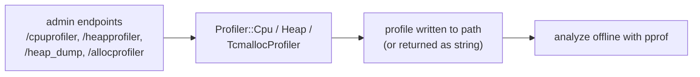

# Profiler — Overview

> Source: `source/common/profiler/profiler.{h,cc}`.

This subsystem is a thin wrapper around the allocator's **CPU and heap profilers**, exposed so
the admin console can start/stop profiling at runtime and dump output for offline analysis with
`pprof`. It is allocator-dependent: the real implementation only exists when the build links a
profiling-capable tcmalloc; otherwise the calls are no-ops.

## Build gating

```cpp
#if defined(GPERFTOOLS_TCMALLOC) && !defined(ENVOY_MEMORY_DEBUG_ENABLED)
#define PROFILER_AVAILABLE
#endif
```

Profiling support ships in the **release** `gperftools` tcmalloc but not the debug one, so all
profiling code is `#ifdef`'d on `PROFILER_AVAILABLE`. When unavailable, `profilerEnabled()`
returns false and start/stop become no-ops — callers don't need to special-case the build.

## The three classes

| Class | Purpose |
|-------|---------|
| `Profiler::Cpu` | Process-wide CPU profiling: `profilerEnabled()`, `startProfiler(path)`, `stopProfiler()`. |
| `Profiler::Heap` | Process-wide heap profiling: `profilerEnabled()`, `isProfilerStarted()`, `startProfiler(path)`, `stopProfiler()`. |
| `Profiler::TcmallocProfiler` | Newer tcmalloc (not gperftools) helpers: `tcmallocHeapProfile()`, `startAllocationProfile()`, `stopAllocationProfile()`. Not thread-safe. |

`Cpu` and `Heap` are static utility classes (no instances) writing profile data to a file path.
`TcmallocProfiler` returns profiles as strings via `absl::StatusOr`.

## How it's driven



An operator toggles profiling through the admin console; the handler calls into the matching
profiler class; output is written to a path (or returned) and later visualized with `pprof`.

## Mental model

Treat this as a capability-gated facade: "if the build supports it, start/stop CPU or heap
profiling and dump to a file." The admin console is the primary caller. There's no profiling
logic of Envoy's own here — it just brokers access to the allocator's profiler so it can be
controlled at runtime without restarting the process.
