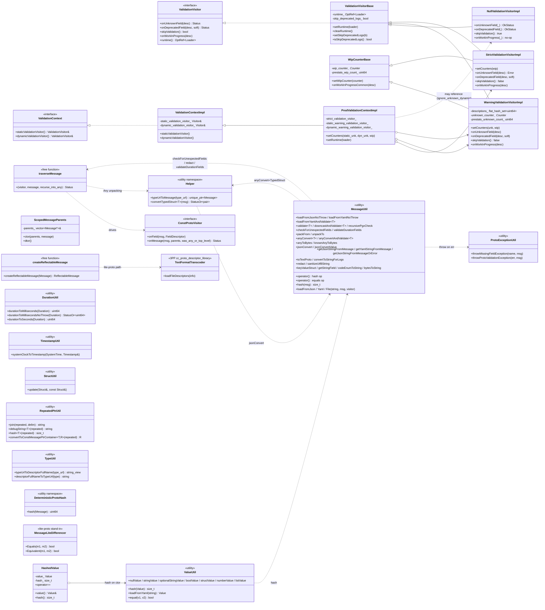

# `protobuf/` — Class hierarchy (UML)

Interfaces from `envoy/protobuf/message_validator.h` are in italics. Concrete classes in this folder are bold.
This folder is dominated by **static utility classes** (no inheritance) so the diagram has more of those than
inheritance trees.

### What's not on the diagram (because they're free functions / aliases)

- The macros: `PROTOBUF_GET_*`, `PROTOBUF_PERCENT_TO_*`. Live in `utility.h`.
- The `Envoy::Protobuf` namespace itself: 30+ `using ::google::protobuf::X` declarations under
  `#if !ENVOY_ENABLE_FULL_PROTOS`. Live in `protobuf.h`.
- `Envoy::ProtobufTypes::MessagePtr`, `Envoy::ProtobufUtil`. Aliases in `protobuf.h`.
