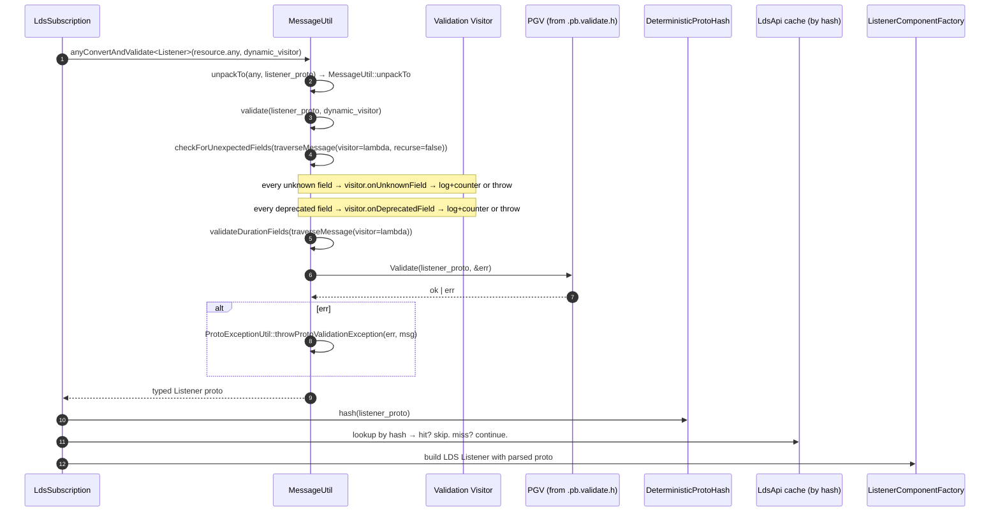

# `source/common/protobuf/` — Overview

This folder is what `import google.protobuf as Envoy.Protobuf` *and* a couple thousand lines of opinion would
look like if it were a Python project. It exists to:

1. **Insulate** the rest of the codebase from `google::protobuf` so an alternative implementation can be
   substituted (e.g. inside Google).
2. **Standardize** every protobuf operation Envoy needs — load from YAML/JSON/file/Any/Struct, hash, validate,
   redact, print, equal-check, walk — so that policy decisions (unknown-field handling, deprecated-field
   handling, recursion into `google.protobuf.Any`) are made in **one** place.
3. **Support both full-proto and lite-proto builds.** Lite mode strips reflection from generated classes; this
   folder provides `createReflectableMessage` and a baked-in descriptor pool to claw reflection back when admin
   / JSON / config_dump needs it.

For class-level detail see [`protobuf_h.md`](protobuf_h.md), [`utility.md`](utility.md),
[`validation.md`](validation.md), [`visitor.md`](visitor.md), [`deterministic_hash.md`](deterministic_hash.md).

---

## The five concerns

### 1. Namespace shim (`protobuf.h`)

Anywhere in Envoy you'd write `google::protobuf::SomeType`, you instead write `Envoy::Protobuf::SomeType`. The
header does one of two things:

- **`ENVOY_ENABLE_FULL_PROTOS`** (the default): `namespace Protobuf = ::google::protobuf;` — straight alias.
- **Otherwise** (lite build): one `using ::google::protobuf::Foo` per type Envoy actually needs, with `Message`
  redefined to `MessageLite` and `ReflectableMessage` defined as `std::unique_ptr<Message>` so reflective
  paths must explicitly call `createReflectableMessage` to materialize a heap copy.

Also defined: `ProtobufTypes::MessagePtr` (`unique_ptr<Message>`), `ProtobufUtil = ::google::protobuf::util`,
`MessageLiteDifferencer` (lite-proto stand-in for `MessageDifferencer`), and `ConstMessagePtrVector`.

### 2. Loading, parsing, conversion (`MessageUtil`)

Roughly 50 static methods covering:

| Job                                | Methods                                                        |
|------------------------------------|----------------------------------------------------------------|
| Load from external format          | `loadFromJson`, `loadFromYaml`, `loadFromFile`                 |
| Load **without** throwing          | `loadFromJsonNoThrow`, `loadFromYamlNoThrow`                   |
| Validate                           | `validate<T>`, `downcastAndValidate<T>`, `recursivePgvCheck`, `checkForUnexpectedFields`, `validateDurationFields` |
| Any pack/unpack                    | `packFrom`, `unpackTo`, `anyConvert<T>`, `anyConvertAndValidate<T>` |
| Any → string bytes                 | `anyToBytes`, `knownAnyToBytes`                                |
| Render                             | `getJsonStringFromMessage`, `getYamlStringFromMessage`, `getJsonStringFromMessageOrError`, `toTextProto`, `convertToStringForLogs` |
| Mutate                             | `redact` (zero out fields tagged `[(udpa.annotations.sensitive) = true]`), `jsonConvert*`, `sanitizeUtf8String` |
| Misc                               | `hash` (text-format based, deterministic), `keyValueStruct`, `getStringField`, `codeEnumToString`, `bytesToString` |

The macros in `utility.h` (`PROTOBUF_GET_WRAPPED_OR_DEFAULT`, `PROTOBUF_GET_MS_OR_DEFAULT`,
`PROTOBUF_PERCENT_TO_ROUNDED_INTEGER_OR_DEFAULT`, …) wrap the `has_X()` / accessor dance to keep config-loading
code readable.

### 3. Validation visitors (`message_validator_impl.*`)

Three flavours of `ValidationVisitor`:

| Class                              | `onUnknownField` | `onDeprecatedField`                            | `skipValidation` |
|------------------------------------|------------------|------------------------------------------------|------------------|
| `NullValidationVisitorImpl`        | `OkStatus`       | `OkStatus`                                     | `true`           |
| `WarningValidationVisitorImpl`     | log+counter+OK   | log+counter+OK (or throw if hard-deprecated)   | `false`          |
| `StrictValidationVisitorImpl`      | return error     | OK or error depending on hard/soft deprecation | `false`          |

Each carries an `OptRef<Runtime::Loader>` so deprecated-field handling can consult runtime guards
(`envoy.deprecated_features.<field>`).

`ValidationContextImpl` owns two visitors:

- **static** — used during bootstrap / file-loaded config (strict by default).
- **dynamic** — used during xDS responses (warning by default).

`ProdValidationContextImpl` is the production wiring (server picks visitor flavors based on
`allow_unknown_static_fields`, `allow_unknown_dynamic_fields`, `ignore_unknown_dynamic_fields`,
`skip_deprecated_logs` from the bootstrap).

### 4. Tree traversal (`visitor.*`)

```cpp
class ConstProtoVisitor {
  virtual void onField(const Message&, const FieldDescriptor&) PURE;
  virtual absl::Status onMessage(const Message&,
                                 absl::Span<const Message* const> parents,
                                 bool was_any_or_top_level) PURE;
};
absl::Status traverseMessage(ConstProtoVisitor&, const Message&, bool recurse_into_any);
```

A single recursive visitor used by every "I need to walk every field" job:

- `checkForUnexpectedFields` (validation),
- `recursivePgvCheck` (deep PGV),
- `redact` (sensitive-field scrubbing),
- `validateDurationFields` (duration-bounds enforcement),
- bottom-up dependency discovery in extensions registration.

`recurse_into_any` opens `google.protobuf.Any` fields by `type_url` (via `Helper::typeUrlToMessage`) and walks
the contained message too. Without it, validation/redaction stops at the Any.

### 5. Deterministic hashing

Envoy has **two** hash functions:

- **`MessageUtil::hash`** — old text-format-based, computes
  `xxHash64(TextFormat::Printer(...).Print(msg))` with `SetExpandAny(true)`, `SetUseFieldNumber(true)`,
  `SetSingleLineMode(true)`, `SetHideUnknownFields(true)`. Deterministic across runs but slow on big configs
  because it stringifies the whole message. See [issue #8301].
- **`DeterministicProtoHash::hash`** — newer, walks fields by descriptor and feeds them into xxHash directly.
  Ignores unknown fields and unknown Any types (a documented limitation).

Both are used as cache keys (xDS subscription dedupe, secret/RDS provider dedupe, tracer manager dedupe, etc.);
the choice between them is per call-site preference but `DeterministicProtoHash` is preferred for new code.

---

## End-to-end flow: parsing a listener LDS update



Notice that **every** decision the visitor makes is policy-rich: it can be silent, log a warning, or throw an
exception, depending on the visitor flavor chosen at server startup. The same proto, validated through a
`WarningValidationVisitorImpl`, would log and continue; through a `StrictValidationVisitorImpl` it would refuse
the listener.

---

## Lite-proto build mode

When `ENVOY_ENABLE_FULL_PROTOS` is off, the generated `.pb.h` headers produce `MessageLite` subclasses that
**have no reflection** (no `GetDescriptor()`, no `GetReflection()`, no text-format printing). Several Envoy
features need reflection:

- `/config_dump` and `?format=json` admin endpoints (need JSON serialization).
- `MessageUtil::redact` (needs `FieldDescriptor` to find `udpa.annotations.sensitive`).
- `traverseMessage` (needs to enumerate fields).
- `MessageUtil::hash` (TextFormat-based path).

`create_reflectable_message.cc` solves this with a **baked-in descriptor pool**: a long list of
`kFileDescriptorInfo` constants is loaded into a single `TextFormatTranscoder` at static init time
(`createTranscoder`). `createReflectableMessage(msg)` then calls `createDynamicMessage(transcoder, msg)`
to produce a `unique_ptr<Message>` with full reflection over the same wire bytes.

In the full-proto build the same function is a `const_cast` no-op (returns the original `Message*`).

Adding new protos to the lite build requires extending the `file_descriptors` vector in
`createTranscoder()` — that's why the file is ~250 lines of `#include` and 230 lines of vector entries.

---

## Macros

The two families of preprocessor macros in `utility.h` are widely used in factory code:

```cpp
PROTOBUF_GET_WRAPPED_OR_DEFAULT(cfg, max_requests, 1024)            // UInt32Value etc.
PROTOBUF_GET_OPTIONAL_WRAPPED(cfg, max_requests)                    // → absl::optional<uint32_t>
PROTOBUF_GET_WRAPPED_REQUIRED(cfg, max_requests)                    // throw if unset
PROTOBUF_GET_MS_OR_DEFAULT(cfg, timeout, 30'000)                    // Duration → ms
PROTOBUF_GET_MS_REQUIRED(cfg, timeout)
PROTOBUF_GET_OPTIONAL_MS(cfg, timeout)
PROTOBUF_GET_SECONDS_OR_DEFAULT(cfg, idle_timeout, 60)              // Duration → seconds
PROTOBUF_GET_SECONDS_REQUIRED(cfg, idle_timeout)
PROTOBUF_GET_STRING_OR_DEFAULT(cfg, name, "default")

PROTOBUF_PERCENT_TO_DOUBLE_OR_DEFAULT(cfg, percent, 50.0)
PROTOBUF_PERCENT_TO_ROUNDED_INTEGER_OR_DEFAULT(cfg, percent, 10'000, 5'000)
```

All throw `EnvoyException` on out-of-range / NaN inputs through `ProtoExceptionUtil::throwMissingFieldException`
or `ExceptionUtil::throwEnvoyException`.

---

## What this folder explicitly does **not** do

- **No xDS subscription logic.** That's `source/common/config/`.
- **No bootstrap loading.** That's `source/server/configuration_impl.*`.
- **No CEL or matcher evaluation.** Those live in `source/extensions/common/matcher` / `source/extensions/common/cel`.
- **No proto generation.** The PGV-generated `.pb.validate.{h,cc}` and `.pb.{h,cc}` come from build rules in
  `bazel/api_build_system.bzl`.

---

See also:

- [`protobuf_h.md`](protobuf_h.md) — the namespace shim and the lite/full-proto bridge.
- [`utility.md`](utility.md) — `MessageUtil`, `ValueUtil`, helpers, macros.
- [`validation.md`](validation.md) — three visitor flavours, two contexts.
- [`visitor.md`](visitor.md) — `traverseMessage` and the helpers around it.
- [`deterministic_hash.md`](deterministic_hash.md) — the new hash function.
- [`CLASS_HIERARCHY.md`](CLASS_HIERARCHY.md) — visual UML.

[issue #8301]: https://github.com/envoyproxy/envoy/issues/8301
