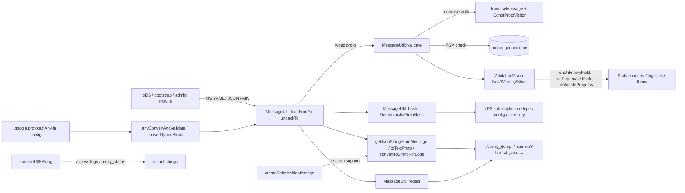

# `source/common/protobuf/` — Protobuf utility belt

This folder is the **single chokepoint** for every protobuf interaction in Envoy. It wraps the
`google::protobuf` namespace (so an alternative protobuf implementation can be substituted), provides typed
helpers for parsing/validating/comparing/hashing/printing/redacting messages, and hosts the validation visitors
that decide what to do when an Envoy config references an unknown or deprecated field.

> **TL;DR** — this folder owns:
> - **`protobuf.h`** — the `Envoy::Protobuf` namespace, `Envoy::ProtobufTypes::MessagePtr`,
>   `Envoy::ProtobufUtil` aliases, and the `ReflectableMessage` abstraction (full-protos vs lite-protos).
> - **`utility.{h,cc}`** + **`yaml_utility.cc`** — `MessageUtil`, `ValueUtil`, `HashedValue`, `DurationUtil`,
>   `TimestampUtil`, `StructUtil`, `RepeatedPtrUtil`, `TypeUtil`, `ProtoExceptionUtil`, plus the
>   `PROTOBUF_GET_*` / `PROTOBUF_PERCENT_TO_*` macros. The actual JSON/YAML codepaths live in
>   `yaml_utility.cc` under `#ifdef ENVOY_ENABLE_YAML`.
> - **`message_validator_impl.{h,cc}`** — `NullValidationVisitorImpl`, `WarningValidationVisitorImpl`,
>   `StrictValidationVisitorImpl`, `ValidationContextImpl`, `ProdValidationContextImpl`. These decide whether
>   an unknown field / deprecated field is fatal, warning, or silently ignored.
> - **`visitor.{h,cc}`** + **`visitor_helper.{h,cc}`** — `traverseMessage(visitor, msg, recurse_into_any)` that
>   walks a `Message` tree, plus `ScopedMessageParents` RAII for visitor state and `typeUrlToMessage` /
>   `convertTypedStruct` helpers for Any/TypedStruct round-tripping.
> - **`deterministic_hash.{h,cc}`** — `DeterministicProtoHash::hash(msg)` — replaces the legacy `TextFormat`
>   based hash with an O(n) one-pass deterministic hash, used by xDS dedupe and config caches.
> - **`create_reflectable_message.cc`** — provides `createReflectableMessage(msg)` that returns either the
>   `Message*` itself (full-protos) or a dynamically-built reflective copy from a baked-in
>   `FileDescriptorInfo` registry (lite-protos / `#if !ENVOY_ENABLE_FULL_PROTOS`).

---

## Folder map

```
source/common/protobuf/
├── BUILD
├── protobuf.h                  # the Envoy::Protobuf namespace + aliases
├── utility.{h,cc}              # MessageUtil / ValueUtil / Duration / Timestamp / Struct / RepeatedPtr / TypeUtil
├── yaml_utility.cc             # YAML/JSON paths (compiled when ENVOY_ENABLE_YAML)
├── message_validator_impl.{h,cc}# validation visitors + ValidationContext
├── visitor.{h,cc}              # ConstProtoVisitor + traverseMessage
├── visitor_helper.{h,cc}       # typeUrlToMessage, convertTypedStruct, ScopedMessageParents
├── deterministic_hash.{h,cc}   # DeterministicProtoHash::hash
└── create_reflectable_message.cc # createReflectableMessage (full vs lite-proto)
```

All public interfaces (`Envoy::ProtobufMessage::ValidationVisitor`, `Envoy::ProtobufMessage::ValidationContext`,
`Envoy::ProtobufMessage::traverseMessage`) live under `envoy/protobuf/` — this folder is the only first-party
implementation.

---

## Per-topic table

| Topic                                     | Document                                                      | Source                                              |
|-------------------------------------------|---------------------------------------------------------------|-----------------------------------------------------|
| Architecture & layering                   | [`OVERVIEW.md`](OVERVIEW.md)                                  | how all classes fit together                        |
| Class hierarchy (UML)                     | [`CLASS_HIERARCHY.md`](CLASS_HIERARCHY.md)                    | every class in this folder, one canvas              |
| `protobuf.h` namespace shim                | [`protobuf_h.md`](protobuf_h.md)                              | `protobuf.h`, `create_reflectable_message.cc`       |
| `MessageUtil`, `ValueUtil`, helpers       | [`utility.md`](utility.md)                                    | `utility.{h,cc}`, `yaml_utility.cc`                 |
| Validation visitors (unknown/deprecated)  | [`validation.md`](validation.md)                              | `message_validator_impl.{h,cc}`                     |
| Tree traversal & TypedStruct conversion   | [`visitor.md`](visitor.md)                                    | `visitor.{h,cc}`, `visitor_helper.{h,cc}`           |
| Deterministic hashing                     | [`deterministic_hash.md`](deterministic_hash.md)              | `deterministic_hash.{h,cc}`                         |

---

## Big picture



Every entry point on the left ends up touching:

- **`MessageUtil`** for parsing, validation, hashing, printing, redaction, and Any/Struct conversion.
- **`ValidationVisitor`** for "what happens when the proto carries an unknown or deprecated field".
- **`traverseMessage`** for any operation that needs to walk a `Message` tree (validation, redaction, dependency
  graph discovery, etc.).
- **`createReflectableMessage`** to bridge between Envoy's "lite proto" build mode and full-proto APIs.

---

## Relationships with the rest of Envoy

| Depends on                          | Why                                                            |
|-------------------------------------|----------------------------------------------------------------|
| `google::protobuf::*`               | obvious; aliased into `Envoy::Protobuf`                        |
| `cc_proto_descriptor_library`       | required when `ENVOY_ENABLE_FULL_PROTOS` is off, to materialize reflective messages |
| `protoc-gen-validate` (PGV)         | `Validate(msg, &err)` called from `MessageUtil::validate`      |
| `envoy/protobuf/message_validator.h`| `ValidationVisitor` / `ValidationContext` PURE interfaces      |
| `envoy/runtime/runtime.h`           | the validators carry an `OptRef<Runtime::Loader>` for guard checks |
| `envoy/stats/stats.h`               | warning validators publish counters                            |
| `source/common/common/*`            | `HashUtil::xxHash64`, `EnvoyException`, `accumulateToString`   |

| Used by                                                     | What it pulls                                                  |
|-------------------------------------------------------------|----------------------------------------------------------------|
| `source/server/configuration_impl.*`                        | bootstrap parsing + validation                                 |
| `source/common/config/*`                                    | every xDS subscription parses + hashes proto                   |
| `source/common/secret/`, `source/common/rds/`               | hash for dedupe                                                |
| `source/server/admin/`                                      | `/config_dump`, `/listeners?format=json`, redaction            |
| Every codebase that calls `Validate*()`                     | indirect via PGV-generated `.pb.validate.h`                    |

---

## Quick reading order

1. **[`OVERVIEW.md`](OVERVIEW.md)** — the conceptual model: namespace shim, validation, hashing, conversion,
   redaction.
2. **[`protobuf_h.md`](protobuf_h.md)** — why `Envoy::Protobuf` exists and how `ReflectableMessage` works
   across full vs lite proto builds.
3. **[`utility.md`](utility.md)** — `MessageUtil` is large; this is its tour.
4. **[`validation.md`](validation.md)** — visitors are the decision point for *every* config-parse failure
   message.
5. **[`visitor.md`](visitor.md)** — `traverseMessage` powers `recurse_into_any` and the whole tree-walking
   side of validation/redaction.
6. **[`deterministic_hash.md`](deterministic_hash.md)** — why we have *two* hashing functions and when to use
   which.
7. **[`CLASS_HIERARCHY.md`](CLASS_HIERARCHY.md)** — visual checkpoint.
