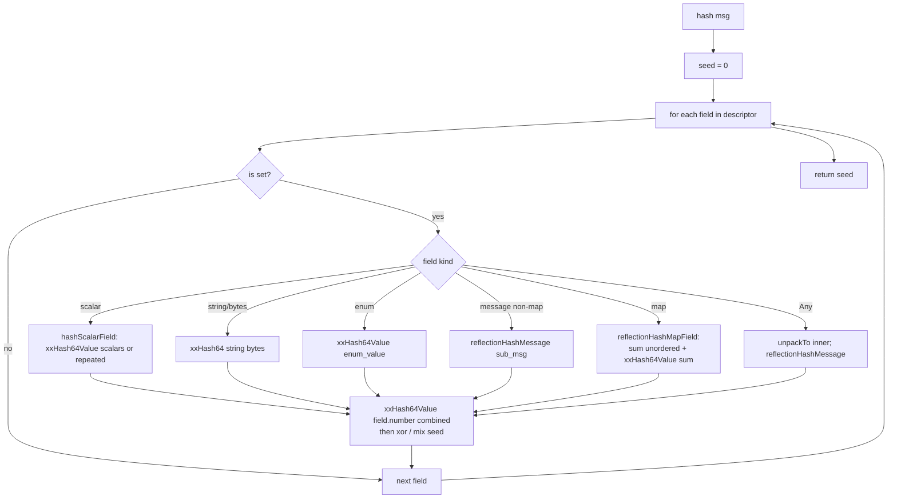

# `deterministic_hash.{h,cc}` — `DeterministicProtoHash::hash`

A single public function:

```cpp
namespace Envoy::DeterministicProtoHash {
  uint64_t hash(const Protobuf::Message& message);
}
```

…and a dense ~230 lines of internal helpers. Available only when `ENVOY_ENABLE_FULL_PROTOS` is on (relies on
reflection).

This was added to replace `MessageUtil::hash` for hot xDS / config-cache paths where the TextFormat-based hash
was a bottleneck on big configs.

---

## Why a new hash function?

`MessageUtil::hash`:

1. Serializes the message to TextFormat (`Printer` with several flags).
2. xxHash64 of the resulting string.

The text serialization is the cost. Big configs (Bootstrap protos with many listeners, big RouteConfigurations
with thousands of vhosts) blow up the string to tens of MB. Reflecting on the fly and feeding bytes directly
into xxHash skips that. Also see [envoyproxy/envoy#8301].

The trade-off: the new function does **not** include unknown fields or unknown `Any` types in the hash, which
the TextFormat path also doesn't (because `SetHideUnknownFields(true)`), but the contract is now
explicitly documented (and ASCII-art-comment'd) in the header:

> Note: this ignores unknown fields and unrecognized types in Any fields. ... If this is used as part of
> making a hash table, it may result in collisions if unknown fields are present and are not ignored by the
> corresponding comparator.

The matching `MessageDifferencer` is configurable; if you keep its `set_message_field_comparison(EQUIVALENT)`
default plus `set_repeated_field_comparison(AS_SET)` for the right cases, you get a consistent equivalence
relation.

---

## Algorithm — the per-field hash dispatch



### Key pieces

#### Scalar dispatch (`hashScalarField<T>`)

`reflection->GetXxx(...)` returns the right type per field kind; the template wraps that into a single hash
call:

```cpp
template <typename T, enable_if_t<is_scalar_v<T>>>
uint64_t hashScalarField(const Reflection& r, const Message& m, const FieldDescriptor& f, uint64_t seed) {
  if (f.is_repeated()) {
    for (const T& s : r.GetRepeatedFieldRef<T>(m, &f)) seed = xxHash64Value(s, seed);
  } else {
    seed = xxHash64Value(reflectionGet<T>(r, m, f), seed);
  }
  return seed;
}
```

`reflectionGet<T>` is a per-type specialization (`GetUInt32`, `GetInt32`, …). Eight specializations cover all
scalar kinds; the compiler emits the right one based on the template type.

#### Map dispatch (`reflectionHashMapField`)

Maps are tricky because protobuf iteration order is **not stable**. The trick:

```cpp
uint64_t combined = 0;
for (entry in map) {
  uint64_t e = hash(entry.key, 0);
  e = hash(entry.value, e);
  combined += e;          // ← unordered combine (commutative)
}
return xxHash64Value(combined, seed);
```

Sum is commutative, so the order entries are visited doesn't change `combined`. Then the sum is folded into
the running `seed` with the standard xxHash mix.

The cost: hash collisions in `combined` are possible for two different maps that happen to sum to the same
combined value. xxHash64 makes that vanishingly rare in practice (cryptographic-grade for non-adversarial
inputs), and the wider xxHash mix on top makes constructing two messages that hash the same far harder.

#### Message dispatch (`reflectionHashMessage`)

Recurse into the sub-message, feed each field through `reflectionHashField` in descriptor order. Because
descriptor iteration is stable and field numbers don't change, the result is deterministic.

#### Any dispatch

`Any` fields look like `message` but carry an inner serialized payload. The code unpacks via
`Helper::typeUrlToMessage(any.type_url())`, then hashes the inner reflectively. If the type_url isn't
registered (extension not compiled in), the Any is treated as empty — that's the documented "ignores
unknown types in Any" behaviour.

---

## Compared to `MessageUtil::hash`

| Property                       | `MessageUtil::hash`                          | `DeterministicProtoHash::hash`                       |
|--------------------------------|----------------------------------------------|------------------------------------------------------|
| Deterministic across runs      | Yes                                          | Yes                                                  |
| Stable across field renames    | Yes (`SetUseFieldNumber(true)`)              | Yes (descriptor → field_number is used)              |
| Skips unknown fields           | Yes                                          | Yes                                                  |
| Unpacks Any                    | Yes (`SetExpandAny`)                         | Yes (`typeUrlToMessage` + `unpackTo`)                |
| Speed                          | O(text-serialised size) + allocations        | O(reflective walk size) — no string allocation       |
| Lite-proto build               | Goes through `createReflectableMessage`      | Not compiled in lite mode (full-protos only)         |
| Available without YAML support | Yes                                          | Yes                                                  |
| Collision risk on big maps     | None beyond xxHash64 over text               | Slightly higher due to commutative combine for maps  |

For brand-new code, prefer `DeterministicProtoHash::hash`. For drop-in replacement of a `MessageUtil::hash`
callsite, check that the comparator (or `MessageDifferencer` config) handles the "unknown field" gotcha the
same way.

---

## Usage examples

```cpp
// xDS dedup
const uint64_t key = ENVOY_ENABLE_FULL_PROTOS
    ? DeterministicProtoHash::hash(resource_proto)
    : MessageUtil::hash(resource_proto);

// Cache key in flat_hash_map<HashedConfig, Provider>:
struct HashedConfig {
  Config cfg;
  uint64_t hash;
  bool operator==(const HashedConfig& o) const { return hash == o.hash && MessageDifferencer::Equals(cfg, o.cfg); }
};
template <> struct std::hash<HashedConfig> {
  size_t operator()(const HashedConfig& c) const { return c.hash; }
};
```

`TracerManagerImpl`, `SecretManagerImpl`, `RouteConfigProviderManagerImpl`, and several xDS subscriptions all
key their dedupe caches on `MessageUtil::hash` today; some can be migrated to the new hash for speedup.

---

## Gotchas

1. **Lite-proto build doesn't have it.** The whole file is `#if defined(ENVOY_ENABLE_FULL_PROTOS)`. Callers
   must `#ifdef` around use, or live with the slow text-format path.
2. **Unknown Any types hash like an empty Any** — operators who care about extension-config diffs should
   ensure those extensions are compiled in.
3. **Repeated scalar fields are hashed in proto order** (the order they were added). If two messages have
   the same values in different orders, they hash differently. That's correct per proto wire spec but can
   surprise people who think of repeated as set-like.
4. **Maps hash order-independently** (intentional — that's the protobuf-canonical behaviour). Lists do not.
5. **Floats / doubles hash by raw bits.** `+0.0 != -0.0` here. Use `MessageDifferencer::ApproximatelyEquals`
   if you need fuzzy comparison.

[envoyproxy/envoy#8301]: https://github.com/envoyproxy/envoy/issues/8301
