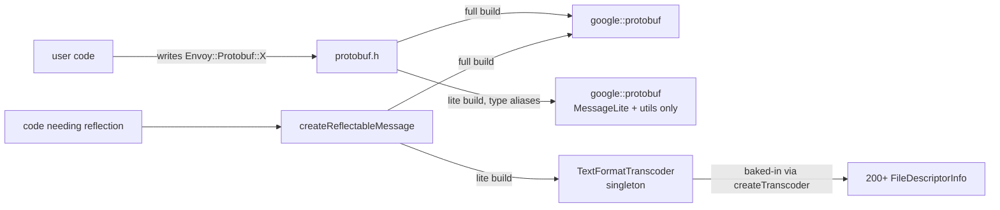

# `protobuf.h` + `create_reflectable_message.cc` — the namespace shim

These two files together provide Envoy's **single point of contact** with the upstream protobuf library:

- **`protobuf.h`** — defines `Envoy::Protobuf`, `Envoy::ProtobufUtil`, `Envoy::ProtobufTypes`, and the
  `ReflectableMessage` abstraction.
- **`create_reflectable_message.cc`** — implements `createReflectableMessage(msg)` in two flavours:
  - **Full-proto build:** identity cast, returns the same `Message*`.
  - **Lite-proto build:** uses a baked-in `TextFormatTranscoder` to construct a heap-allocated reflective copy.

The point of the shim: at Google (and other forks), `google::protobuf` is sometimes replaced with an internal
protobuf implementation. Concentrating every direct `google::protobuf::` use into one header lets a porter
remap them with minimal diff.

---

## `Envoy::Protobuf` namespace — two flavours

### Full-proto build (default)

`ENVOY_ENABLE_FULL_PROTOS` is defined. `Envoy::Protobuf` is just a namespace alias:

```cpp
namespace Envoy {
namespace Protobuf = google::protobuf;
}
namespace google::protobuf {
using ReflectableMessage = ::google::protobuf::Message*;
}
```

So `Envoy::Protobuf::Message`, `Envoy::Protobuf::Any`, etc. are aliases for the upstream types. `ReflectableMessage`
is a raw `Message*` because the message *already* has reflection.

### Lite-proto build

`ENVOY_ENABLE_FULL_PROTOS` is **not** defined (typically when building the size-optimised "envoy-lite" binary).
The header explicitly enumerates every type Envoy uses:

```cpp
namespace Envoy {
namespace Protobuf {
  using ::google::protobuf::Any;
  using ::google::protobuf::Arena;
  using ::google::protobuf::Empty;
  using ::google::protobuf::Descriptor;
  using ::google::protobuf::FieldDescriptor;
  using ::google::protobuf::Reflection;
  using ::google::protobuf::DynamicMessageFactory;
  using ::google::protobuf::RepeatedField;
  using ::google::protobuf::RepeatedPtrField;
  using ::google::protobuf::Struct;
  using ::google::protobuf::Value;
  using ::google::protobuf::TextFormat;
  using ::google::protobuf::Duration;
  using ::google::protobuf::Timestamp;
  using ::google::protobuf::UInt32Value;
  using ::google::protobuf::BoolValue;
  using ::google::protobuf::BytesValue;
  using ::google::protobuf::StringValue;
  // … ~30 more …

  using Message = ::google::protobuf::MessageLite;         // ← important
  using ReflectableMessage = std::unique_ptr<::google::protobuf::Message>;

  namespace io  { /* CodedInputStream, ZeroCopyInputStream, … */ }
  namespace util{
    using ::google::protobuf::util::JsonStringToMessage;
    using ::google::protobuf::util::MessageToJsonString;
    using ::google::protobuf::util::NewTypeResolverForDescriptorPool;
    using MessageDifferencer = MessageLiteDifferencer;     // see below
    using ::google::protobuf::util::JsonParseOptions;
    using ::google::protobuf::util::JsonPrintOptions;
    using ::google::protobuf::util::TimeUtil;
  }
}

// Stand-in differencer (full one needs reflection)
class MessageLiteDifferencer {
public:
  static bool Equals(const Message&, const Message&);
  static bool Equivalent(const Message&, const Message&);
};
}
```

The crucial difference: **`Envoy::Protobuf::Message` is `MessageLite`**, not `Message`. `MessageLite` has no
reflection. Code that needs `GetDescriptor`/`GetReflection` (anything that walks fields) must call
`createReflectableMessage(msg)` to obtain a reflective copy on demand.

### `ProtobufTypes` and `ProtobufUtil`

```cpp
namespace ProtobufTypes {
  using MessagePtr = std::unique_ptr<Protobuf::Message>;
  using ConstMessagePtrVector = std::vector<std::unique_ptr<const Protobuf::Message>>;
  using Int64 = int64_t;
}

namespace ProtobufUtil = ::google::protobuf::util;
```

`MessagePtr` is the universal return type for "build me a message of unspecified-at-call-site type" factories
(`Config::Utility::translateToFactoryConfig`, `Server::Configuration::*Factory::createEmptyConfigProto`).
`ProtobufUtil` is used for things like `MessageDifferencer`, `TimeUtil` — kept aliased separately so the port
can target a different util namespace if needed.

---

## `createReflectableMessage` — the lite-proto escape hatch

### Full-proto build

```cpp
Protobuf::ReflectableMessage createReflectableMessage(const Protobuf::Message& message) {
  return const_cast<Protobuf::ReflectableMessage>(&message);
}
```

`Protobuf::ReflectableMessage` is `Message*`. The `const_cast` is justified because the consumer agrees by
contract not to mutate the returned message — it's there only to take advantage of the reflection accessors.

### Lite-proto build

`createReflectableMessage` calls `createDynamicMessage(getTranscoder(), message)` which:

1. Looks up the `Descriptor` for the message type (by `message.GetTypeName()`) in the singleton
   `TextFormatTranscoder`.
2. Allocates a new heap reflective message of that type via `DynamicMessageFactory`.
3. Serializes `message` to wire bytes (it's a `MessageLite`, but it still has `SerializeAsString`).
4. Parses those bytes into the reflective message.
5. Returns a `unique_ptr<Message>`.

The returned `Message` has full reflection but is a *copy*. Mutations to it do not propagate back. This is fine
for the use cases: JSON serialization, field walking, redaction (which acts on the reflective copy, then
re-serializes if a write-back is needed).

#### The transcoder singleton

```cpp
TextFormatTranscoder& getTranscoder() {
  static std::unique_ptr<TextFormatTranscoder> transcoder = createTranscoder();
  return *transcoder;
}
```

Constructed at first use via `createTranscoder()` which:

1. Allocates a `TextFormatTranscoder` with `allow_global_fallback=false` (so only known types work).
2. Builds a `vector<FileDescriptorInfo>` of literally **every Envoy API .pb.h needed at runtime** — admin,
   bootstrap, listener, cluster, route, endpoint, RDS, EDS, CDS, LDS, SRDS, RTDS, SDS, ADS, HDS, MS, RLS,
   accesslog, trace (Datadog/OTel/Lightstep/SkyWalking/Xray/Zipkin), every http/network/listener filter that
   ships with envoy-lite, every transport socket, DNS resolvers, regex engines, request_id, UDP packet writers,
   matcher inputs, type/* shared types, watchdog, etc.
3. Iterates the vector and calls `transcoder->loadFileDescriptors(info)` for each.

The list is ~230 entries and **must be kept in sync** when:

- A new proto is added to the API tree that envoy-lite needs at runtime, or
- An existing proto adds a new dependency that envoy-lite needs at runtime.

Out-of-sync entries produce a runtime assertion at `createReflectableMessage`:

```cpp
ASSERT(reflectable_message,
       absl::StrCat("Unable to create dynamic message for: ", message.GetTypeName()));
```

#### `loadFileDescriptors(info)` — public extension hook

`protobuf.h` declares:

```cpp
void loadFileDescriptors(const FileDescriptorInfo& info);
```

…which in lite-proto builds adds another `FileDescriptorInfo` to the singleton transcoder. Extensions that
ship their own protos can use this in their static-init code to register their descriptor at load time.

---

## `MessageLiteDifferencer` (lite-proto only)

The full-proto build uses `Protobuf::util::MessageDifferencer::Equals(m1, m2)` for value equality. That impl
needs reflection so isn't available in the lite build. `MessageLiteDifferencer` is the stand-in:

```cpp
class MessageLiteDifferencer {
public:
  static bool Equals(const Message& m1, const Message& m2);     // by serialized bytes
  static bool Equivalent(const Message& m1, const Message& m2); // same as Equals in lite mode
};
```

Implementation (in `utility.cc`): serializes both messages with stable field ordering and compares the byte
strings. Slower than the reflection-based version but correct.

`MessageUtil::operator()` (used as the `Equals` functor for `flat_hash_map<Message, V, MessageUtil, MessageUtil>`)
calls `Protobuf::util::MessageDifferencer::Equals(lhs, rhs)` which in lite-proto build resolves to
`MessageLiteDifferencer::Equals` via the `using` alias in the lite namespace.

---

## Building this folder



In the full build, anything inside `google::protobuf` works as-is.

In the lite build:

- Generated protos are `MessageLite` subclasses (no reflection, no JSON, no `DebugString`).
- `MessageUtil::hash` (TextFormat-based) still needs reflection → uses `createReflectableMessage` internally.
- `redact` / `getJsonStringFromMessage` / `traverseMessage` etc. likewise.
- The transcoder has to know about every proto type whose reflection any runtime path might touch.

---

## Gotchas

1. **Never `#include "google/protobuf/foo.h"` in Envoy code.** Always go through `protobuf.h`. CI rules
   enforce this via `tools/code_format`.
2. **Don't mutate the result of `createReflectableMessage`** expecting writes to propagate back in lite mode.
   It's a copy.
3. **Adding a new proto to envoy-lite means editing `create_reflectable_message.cc`.** Otherwise the first time
   anything tries to reflect on that type, the `ASSERT` will fire (debug) or you'll crash (release).
4. **`MessageLite::DebugString()` does not exist in lite mode.** Use `MessageUtil::convertToStringForLogs` which
   handles both modes.
5. **`Message` ≠ `MessageLite`.** Generated `.pb.h` files in lite mode produce `MessageLite` subclasses. Most
   downstream code references `Envoy::Protobuf::Message` which is one or the other depending on build flag,
   and that's fine — but tests sometimes assume reflection and break in lite mode.
