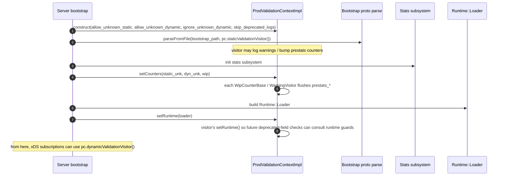

# `message_validator_impl.{h,cc}` — Validation visitors & context

This file is the **policy point** for every "what do we do with an unknown / deprecated / WIP field in this
proto?" decision in Envoy. It implements:

- **`ValidationVisitorBase`** — common storage of the runtime loader pointer and the
  `skip_deprecated_logs` flag.
- **`NullValidationVisitorImpl`** — accepts everything, validates nothing.
- **`WarningValidationVisitorImpl`** — logs + counters; doesn't fail.
- **`StrictValidationVisitorImpl`** — fails on unknown fields, may fail on deprecated.
- **`WipCounterBase`** — common storage for the work-in-progress counter (shared by warning + strict).
- **`ValidationContextImpl`** — pair of visitors (static + dynamic).
- **`ProdValidationContextImpl`** — production wiring of the three visitor flavours behind two
  `ValidationContext` slots.

---

## The `ValidationVisitor` interface (recap)

Defined in `envoy/protobuf/message_validator.h`:

```cpp
class ValidationVisitor {
public:
  virtual absl::Status onUnknownField(absl::string_view description) PURE;
  virtual absl::Status onDeprecatedField(absl::string_view description, bool soft_deprecation) PURE;
  virtual bool skipValidation() PURE;
  virtual void onWorkInProgress(absl::string_view description) PURE;
  virtual OptRef<Runtime::Loader> runtime() PURE;
};
```

`description` is a fully-qualified message-path string like
`envoy.config.cluster.v3.Cluster.transport_socket.matches[2].name`. `soft_deprecation` distinguishes between
*allowed-but-discouraged* deprecation (warning only) and *disallowed* deprecation (must throw unless a runtime
guard overrides).

---

## `ValidationVisitorBase`

```cpp
class ValidationVisitorBase : public ValidationVisitor {
  OptRef<Runtime::Loader> runtime_;
  bool skip_deprecated_logs_{false};
public:
  void setRuntime(Runtime::Loader& r) { runtime_ = r; }
  void clearRuntime() { runtime_ = {}; }       // tests
  OptRef<Runtime::Loader> runtime() override { return runtime_; }
  void setSkipDeprecatedLogs(bool s) { skip_deprecated_logs_ = s; }
  bool isSkipDeprecatedLogs() const { return skip_deprecated_logs_; }
};
```

- **`runtime_`** is captured (set by `ProdValidationContextImpl::setRuntime` once the bootstrap loader is
  ready). The visitor uses this to consult `envoy.deprecated_features.<field_name>` flags when an enforced
  deprecation is hit, allowing operators to keep using a deprecated field by toggling a runtime guard.
- **`skip_deprecated_logs_`** — when true, the *warning* part of deprecation handling is suppressed (still
  throws on enforced deprecations). Used in test runners and by operators who've already migrated and want
  clean logs.

---

## `WipCounterBase` — shared by warning + strict

Work-in-progress fields are an annotation (`[(xds.annotations.v3.field_status).work_in_progress) = true]`)
that says "this field exists but its semantics are subject to change". WIP handling is identical between
warning and strict visitors, so it's extracted into a base class:

```cpp
class WipCounterBase {
  Stats::Counter* wip_counter_{};
  uint64_t prestats_wip_count_{};
protected:
  void setWipCounter(Stats::Counter& c) {
    ASSERT(wip_counter_ == nullptr);
    wip_counter_ = &c;
    c.add(prestats_wip_count_);                 // flush pre-stats encounters
  }
  void onWorkInProgressCommon(absl::string_view desc) {
    ENVOY_LOG_MISC(warn, "{}", desc);
    if (wip_counter_ != nullptr) wip_counter_->inc();
    else                          prestats_wip_count_++;
  }
};
```

The `prestats_*` counter exists because **`ValidationVisitor` is used during bootstrap loading, before stats
are initialized.** During that window, the counter pointer is null; bumps are buffered in the integer field
and flushed when `setWipCounter` is later called by the server bootstrap.

---

## `NullValidationVisitorImpl`

```cpp
class NullValidationVisitorImpl : public ValidationVisitorBase {
public:
  absl::Status onUnknownField(absl::string_view) override { return absl::OkStatus(); }
  absl::Status onDeprecatedField(absl::string_view, bool) override { return absl::OkStatus(); }
  bool skipValidation() override { return true; }
  void onWorkInProgress(absl::string_view) override {}
};
ValidationVisitor& getNullValidationVisitor();   // MUTABLE_CONSTRUCT_ON_FIRST_USE singleton
```

Use case: callers that explicitly **don't want** validation. Example: when xDS is configured with
`ignore_unknown_dynamic_fields=true`, dynamic resources are validated through this visitor so the proto parse
silently strips unknown fields.

Note the **`skipValidation() == true`** — this short-circuits `MessageUtil::validate`, which then skips the
`checkForUnexpectedFields` traversal entirely (saving traversal cost on dynamic resources that already
opted-out).

---

## `WarningValidationVisitorImpl`

```cpp
class WarningValidationVisitorImpl : public ValidationVisitorBase,
                                     public WipCounterBase,
                                     public Loggable<config> {
  absl::flat_hash_set<uint64_t> descriptions_;   // hashes of descriptions we've seen
  Stats::Counter* unknown_counter_{};
  uint64_t prestats_unknown_count_{};
public:
  void setCounters(Stats::Counter& unk, Stats::Counter& wip);
  absl::Status onUnknownField(absl::string_view desc) override;
  absl::Status onDeprecatedField(absl::string_view desc, bool soft) override;
  bool skipValidation() override { return false; }
  void onWorkInProgress(absl::string_view desc) override;
};
```

### `onUnknownField`

```cpp
absl::Status WarningValidationVisitorImpl::onUnknownField(absl::string_view description) {
  const uint64_t hash = HashUtil::xxHash64(description);
  if (!descriptions_.insert(hash).second) {
    return absl::OkStatus();                                 // already seen → skip
  }
  ENVOY_LOG(warn, "Unknown field: {}", description);
  if (unknown_counter_ == nullptr) ++prestats_unknown_count_;
  else                             unknown_counter_->inc();
  return absl::OkStatus();
}
```

The **hash-deduped log** matters: every time an xDS push contains the same unknown field, we'd otherwise spam
the log. We store the xxHash64 of the description (not the string itself — saves memory).

The dedup is **process-lifetime**, not per-update; once an unknown field is reported, it never reports again.
For operators this can be confusing ("I fixed the config but still see this field somewhere?"). Workaround:
restart the process.

### `onDeprecatedField`

Delegates to the shared `onDeprecatedFieldCommon`:

```cpp
absl::Status onDeprecatedFieldCommon(string_view desc, bool soft, bool skip_logs) {
  if (soft) {
    if (!skip_logs) ENVOY_LOG_MISC(warn, "Deprecated field: {}{}", desc, deprecation_error);
    return absl::OkStatus();
  }
  return absl::InvalidArgumentError(absl::StrCat(desc, deprecation_error));
}
```

- **Soft deprecation** (`disallowed_by_default=false`): log only, accept the field.
- **Hard deprecation** (`disallowed_by_default=true`): return an error → `MessageUtil::validate` throws.

The `deprecation_error` constant adds a hint pointing at the runtime-override docs:

```text
 If continued use of this field is absolutely necessary, see
 <ENVOY_DOC_URL_RUNTIME_OVERRIDE_DEPRECATED> for how to apply a temporary and highly discouraged override.
```

The hint is appended even on *soft* deprecations to give operators an early signal of the migration path.

---

## `StrictValidationVisitorImpl`

```cpp
class StrictValidationVisitorImpl : public ValidationVisitorBase, public WipCounterBase {
public:
  absl::Status onUnknownField(absl::string_view desc) override {
    return absl::InvalidArgumentError(
        absl::StrCat("Protobuf message (", desc, ") has unknown fields"));
  }
  absl::Status onDeprecatedField(absl::string_view desc, bool soft) override {
    return onDeprecatedFieldCommon(desc, soft, isSkipDeprecatedLogs());
  }
  bool skipValidation() override { return false; }
  void onWorkInProgress(absl::string_view desc) override { onWorkInProgressCommon(desc); }
};
ValidationVisitor& getStrictValidationVisitor();   // MUTABLE_CONSTRUCT_ON_FIRST_USE singleton
```

- **Unknown fields** → always error. Bootstrap config / file-loaded config is expected to be tightly
  authored, so the operator should see "you wrote a field name we don't recognise" immediately.
- **Deprecated fields** → same as warning visitor: soft = warn, hard = error.

The stock static instance returned by `getStrictValidationVisitor()` has **no WIP counter wired**, which is
why there's a `TODO(mattklein123)` in the source recommending its removal in favor of the per-server
production visitor.

---

## `ValidationContextImpl` and `ProdValidationContextImpl`

`ValidationContext` (interface, in `envoy/protobuf/message_validator.h`) groups two visitors:

```cpp
class ValidationContext {
  virtual ValidationVisitor& staticValidationVisitor() PURE;
  virtual ValidationVisitor& dynamicValidationVisitor() PURE;
};
```

`ValidationContextImpl` is the trivial impl that just holds two references. `ProdValidationContextImpl` is the
real production version that **owns** three visitor instances and routes them per config:

```cpp
class ProdValidationContextImpl : public ValidationContextImpl {
  StrictValidationVisitorImpl strict_validation_visitor_;
  WarningValidationVisitorImpl static_warning_validation_visitor_;
  WarningValidationVisitorImpl dynamic_warning_validation_visitor_;
public:
  ProdValidationContextImpl(bool allow_unknown_static_fields,
                            bool allow_unknown_dynamic_fields,
                            bool ignore_unknown_dynamic_fields,
                            bool skip_deprecated_logs)
    : ValidationContextImpl(
        allow_unknown_static_fields ? static_warning_validation_visitor_
                                     : strict_validation_visitor_,
        allow_unknown_dynamic_fields
            ? (ignore_unknown_dynamic_fields ? getNullValidationVisitor()
                                              : dynamic_warning_validation_visitor_)
            : strict_validation_visitor_) {
    strict_validation_visitor_.setSkipDeprecatedLogs(skip_deprecated_logs);
    static_warning_validation_visitor_.setSkipDeprecatedLogs(skip_deprecated_logs);
    dynamic_warning_validation_visitor_.setSkipDeprecatedLogs(skip_deprecated_logs);
  }

  void setCounters(Stats::Counter& static_unknown_counter,
                   Stats::Counter& dynamic_unknown_counter,
                   Stats::Counter& wip_counter);
  void setRuntime(Runtime::Loader& runtime);
};
```

### Visitor selection matrix

| `allow_unknown_static_fields` | `allow_unknown_dynamic_fields` | `ignore_unknown_dynamic_fields` | static visitor | dynamic visitor |
|-------------------------------|---------------------------------|----------------------------------|----------------|------------------|
| false (default)               | false                           | -                                | strict         | strict           |
| true                          | false                           | -                                | warning        | strict           |
| false                         | true                            | false                            | strict         | warning          |
| true                          | true                            | false                            | warning        | warning          |
| -                             | true                            | true                             | (per col 1)    | null (silent)    |
| -                             | false                           | true                             | (per col 1)    | strict (flag has no effect)  |

`ignore_unknown_dynamic_fields` is only meaningful when `allow_unknown_dynamic_fields=true`.

### `setCounters` / `setRuntime` ordering



The two-phase setup (counters then runtime) reflects the order of subsystem availability during server boot:

1. Validation runs **before** stats exist (bootstrap parse), so counters are deferred.
2. Validation runs **before** runtime exists (bootstrap parse), so deprecated-field overrides aren't consulted
   during bootstrap. (Deprecated bootstrap fields therefore always behave per-default; you can't runtime-override
   a deprecation in the static config that *creates* the runtime.)

---

## End-to-end: an unknown field encountered during xDS

```mermaid
sequenceDiagram
    autonumber
    participant Eds as EdsSubscription
    participant MU as MessageUtil
    participant TM as traverseMessage
    participant Vis as ProdValidationContextImpl.dynamicValidationVisitor()
    participant Stats as stats
    participant Log as logger

    Eds->>MU: anyConvertAndValidate<Endpoints>(any, dyn_visitor)
    MU->>TM: checkForUnexpectedFields(msg, dyn_visitor, recurse_into_any=false)
    TM->>TM: walk fields; find unknown
    TM->>Vis: onUnknownField("envoy.config.endpoint.v3.ClusterLoadAssignment.endpoints[3].extra_field")
    alt Vis is WarningValidationVisitorImpl
        Vis->>Vis: hash dedupe → first time
        Vis->>Log: WARN Unknown field: ...
        Vis->>Stats: server.dynamic.unknown_counter++
        Vis-->>TM: OkStatus
        TM-->>MU: keep walking
    else Vis is StrictValidationVisitorImpl
        Vis-->>TM: InvalidArgumentError("Protobuf message (...) has unknown fields")
        TM-->>MU: error
        MU->>MU: throw EnvoyException
    else Vis is NullValidationVisitorImpl
        Note over TM,Vis: traverseMessage is never called (skipValidation()==true earlier)
    end
```

The exact same field, observed in the *static* bootstrap config, would go through
`staticValidationVisitor()` — same logic but with the static-counter wiring.

---

## Gotchas

1. **`WarningValidationVisitorImpl` dedupes by hash for process lifetime.** Fixing the source of the field
   won't make the next push's warning disappear if you've already burned the hash entry. Restart required for
   a clean slate.
2. **Strict visitor doesn't fire on `Any` payloads unless `recurse_into_any=true`.** The default in
   `MessageUtil::validate` is `false`. Filter factories that unpack `typed_config` should pass `true` if they
   want strict checking inside the unpacked message.
3. **Soft vs hard deprecation comes from the proto annotation.** `[(envoy.annotations.disallowed_by_default) =
   true]` → hard. Otherwise → soft.
4. **`getNullValidationVisitor()` and `getStrictValidationVisitor()` are process-wide singletons.** Don't
   call `setRuntime` / `setCounters` on them; that mutates state for every other caller. The production code
   uses fresh instances inside `ProdValidationContextImpl` for that reason.
5. **`runtime()` returns `OptRef<Runtime::Loader>`** — may be empty during early bootstrap. Callers that
   consult runtime guards should check before dereferencing.
