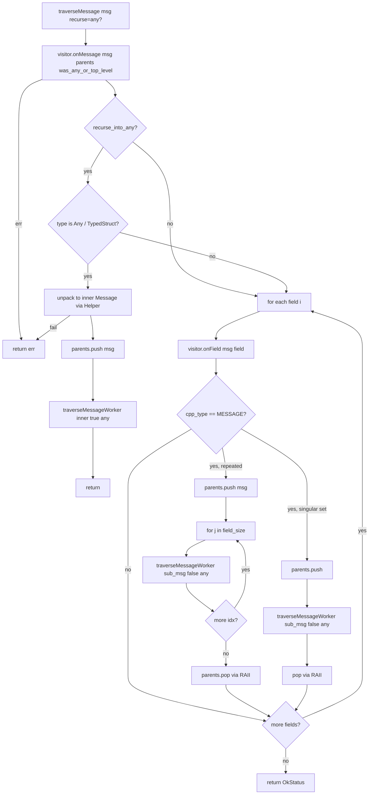

# `visitor.{h,cc}` + `visitor_helper.{h,cc}` — Tree traversal

These files implement the **single** recursive walker that every "I want to do something to every field / every
message in this config" operation in Envoy reuses. Validation, redaction, duration-bounds checking, and PGV
deep checks all funnel through `traverseMessage`.

---

## The visitor interface

```cpp
class ConstProtoVisitor {
public:
  virtual void onField(const Message&, const FieldDescriptor&) PURE;
  virtual absl::Status onMessage(const Message&,
                                 absl::Span<const Message* const> parents,
                                 bool was_any_or_top_level) PURE;
};

absl::Status traverseMessage(ConstProtoVisitor& visitor,
                             const Protobuf::Message& message,
                             bool recurse_into_any);
```

- `onMessage(msg, parents, was_any_or_top_level)` — called once per message visited.
  `parents` is the chain from the root to `msg`'s parent (excluding `msg` itself). `was_any_or_top_level`
  marks `msg` as either the original top-level call or as the *inner* message of a freshly-unpacked `Any` /
  `TypedStruct`.
- `onField(msg, field)` — called once per descriptor field of `msg`, *whether or not the field is set*.
  Lets the visitor inspect annotations even on absent fields.

Both return `absl::Status`/`void` — when `onMessage` returns non-OK, traversal short-circuits and the error
bubbles all the way up.

---

## `traverseMessageWorker` — the algorithm

```cpp
absl::Status traverseMessageWorker(ConstProtoVisitor& visitor,
                                   const Message& message,
                                   vector<const Message*>& parents,
                                   bool was_any_or_top_level,
                                   bool recurse_into_any) {
  RETURN_IF_NOT_OK(visitor.onMessage(message, parents, was_any_or_top_level));

  if (recurse_into_any) {
    // Try to identify the message as a Any / TypedStruct wrapper and unpack:
    unique_ptr<Message> inner; string_view target_type_url;
    if (message.GetTypeName() == "google.protobuf.Any") {
      auto* any = DynamicCastMessage<Any>(&message);
      inner = Helper::typeUrlToMessage(any->type_url());
      target_type_url = any->type_url();
      if (!inner) return InvalidArgumentError("Invalid type_url '" + target_type_url + "'");
      RETURN_IF_NOT_OK(MessageUtil::unpackTo(*any, *inner));
    } else if (message.GetTypeName() == "xds.type.v3.TypedStruct") {
      auto [m, url] = Helper::convertTypedStruct<xds::type::v3::TypedStruct>(message).value();
      inner = std::move(m); target_type_url = url;
    } else if (message.GetTypeName() == "udpa.type.v1.TypedStruct") {
      auto [m, url] = Helper::convertTypedStruct<udpa::type::v1::TypedStruct>(message).value();
      inner = std::move(m); target_type_url = url;
    }

    if (inner) {
      ScopedMessageParents sp{parents, message};                     // push, RAII-pop
      return traverseMessageWorker(visitor, *inner, parents, true, recurse_into_any);
    } else if (!target_type_url.empty()) {
      return InvalidArgumentError("Invalid type_url '" + target_type_url + "'");
    }
  }

  // Walk fields:
  ReflectableMessage reflectable = createReflectableMessage(message);  // identity in full-proto build
  const Descriptor* descriptor = reflectable->GetDescriptor();
  const Reflection* reflection = reflectable->GetReflection();
  for (int i = 0; i < descriptor->field_count(); ++i) {
    const FieldDescriptor* field = descriptor->field(i);
    visitor.onField(message, *field);

    if (field->cpp_type() == FieldDescriptor::CPPTYPE_MESSAGE) {
      ScopedMessageParents sp{parents, message};
      if (field->is_repeated()) {
        for (int j = 0; j < reflection->FieldSize(*reflectable, field); ++j) {
          RETURN_IF_NOT_OK(traverseMessageWorker(visitor,
              reflection->GetRepeatedMessage(*reflectable, field, j),
              parents, false, recurse_into_any));
        }
      } else if (reflection->HasField(*reflectable, field)) {
        RETURN_IF_NOT_OK(traverseMessageWorker(visitor,
            reflection->GetMessage(*reflectable, field),
            parents, false, recurse_into_any));
      }
    }
  }
  return OkStatus();
}
```

### Flow diagram



Two key behaviours to keep in mind:

1. **`recurse_into_any` mode replaces the field walk** for the matched message types. Once a message is
   detected as `Any` / `TypedStruct` and successfully unpacked, the original (wrapper) message's fields are
   **not** walked further; only the inner unpacked message is visited recursively. That's the whole point of
   the mode.
2. **`parents` is mutated in place**, but every push is paired with a `ScopedMessageParents` RAII pop on
   scope exit. So callers see a correctly-shaped `Span<const Message* const>` even after deep recursion
   throws or early-returns.

---

## `Helper::typeUrlToMessage`

```cpp
std::unique_ptr<Protobuf::Message> typeUrlToMessage(absl::string_view type_url);
```

Looks up the descriptor by `type_url`, allocates a fresh `Message` of that type. Returns `nullptr` if the URL
doesn't resolve in the descriptor pool (e.g., an extension type compiled out of the binary).

This is what makes `recurse_into_any` work — without a descriptor, we can't even know what shape the bytes
inside the `Any` have.

---

## `Helper::convertTypedStruct<T>`

```cpp
template <typename T>
absl::StatusOr<pair<unique_ptr<Message>, string_view>>
convertTypedStruct(const Message& message) {
  auto* typed_struct = DynamicCastMessage<T>(&message);
  auto inner = typeUrlToMessage(typed_struct->type_url());
  auto target = typed_struct->type_url();
  if (inner) {
#ifdef ENVOY_ENABLE_YAML
    MessageUtil::jsonConvert(typed_struct->value(),
                             getNullValidationVisitor(),
                             *inner);
#else
    return InvalidArgumentError("JSON and YAML support compiled out.");
#endif
  }
  return make_pair(std::move(inner), target);
}
```

`xds.type.v3.TypedStruct` (and the older `udpa.type.v1.TypedStruct`) is a "weak Any" — type_url plus a
`Protobuf::Struct` payload (rather than packed bytes). Used when a config writer wants to pass a typed config
without paying the cost of always compiling the typed proto into Envoy.

Conversion: convert the Struct to JSON, then parse the JSON into the looked-up message type. The
`getNullValidationVisitor()` is used here intentionally — we **don't** want the conversion itself to fail on
unknown fields; that's the visitor's job once the inner message is on the parent traversal.

---

## `ScopedMessageParents`

```cpp
struct ScopedMessageParents {
  ScopedMessageParents(vector<const Message*>& parents, const Message& message);
  ~ScopedMessageParents();
private:
  vector<const Message*>& parents_;
};
```

Implementation: ctor pushes `&message` onto `parents`, dtor pops. Provides exception/early-return safety —
no matter how `onMessage`/`onField` panics or returns an error, `parents` is restored on scope exit.

The choice of `vector<>` (rather than a linked list) is deliberate: the visitor receives the parents as
`absl::Span<const Message* const>` which is essentially `(T*, size_t)` — O(1) to construct from the underlying
`vector` data.

---

## How `MessageUtil::validate` uses traverseMessage

`MessageUtil::checkForUnexpectedFields(msg, visitor, recurse_into_any)` (defined in `utility.cc`) constructs
a lambda-style visitor that:

- On `onField`, checks the field's `[deprecated]`, `[xds.annotations.v3.field_status.work_in_progress]`,
  and `[envoy.annotations.disallowed_by_default]` annotations; calls the `ValidationVisitor::onDeprecatedField`
  / `onWorkInProgress` accordingly. Bumps an `unknown_field_` counter when reflection reports unset fields
  that nonetheless have wire bytes.
- On `onMessage`, no-op (or, for `recurse_into_any`, just continues).

Then calls `traverseMessage(adapter_visitor, msg, recurse_into_any)`.

Similarly `MessageUtil::validateDurationFields` and `MessageUtil::redact` each construct a different
`ConstProtoVisitor` that does the duration-bounds / redaction work in `onField`, and wires it the same way.

---

## Gotchas

1. **`onField` is called for *every* descriptor field**, set or not. Visitors that care only about set fields
   need to gate on `reflection->HasField(msg, field)` themselves.
2. **`recurse_into_any` requires descriptor pool registration of the inner type**. In lite-proto mode that
   means the type must be in `create_reflectable_message.cc`. Without it, traversal fails with
   `Invalid type_url`.
3. **`Helper::convertTypedStruct` needs `ENVOY_ENABLE_YAML`**. In builds without it, the function returns an
   error and `recurse_into_any` silently stops at TypedStructs.
4. **Map fields walk through generated synthetic repeated message fields.** Each entry has a `key` and `value`
   sub-field. So a `map<string, Endpoint>` shows up as a repeated message with two sub-fields.
5. **No cycle detection.** Protobuf schemas can't contain cycles (it's a DAG), so the walker doesn't bother.
   If you somehow construct an aliasing graph (rare via reflection), you'll stack-overflow.
6. **`parents` does not include the message itself**, only its ancestors. The visitor's `onMessage` receives
   the message via the `msg` parameter and the lineage via `parents`.
