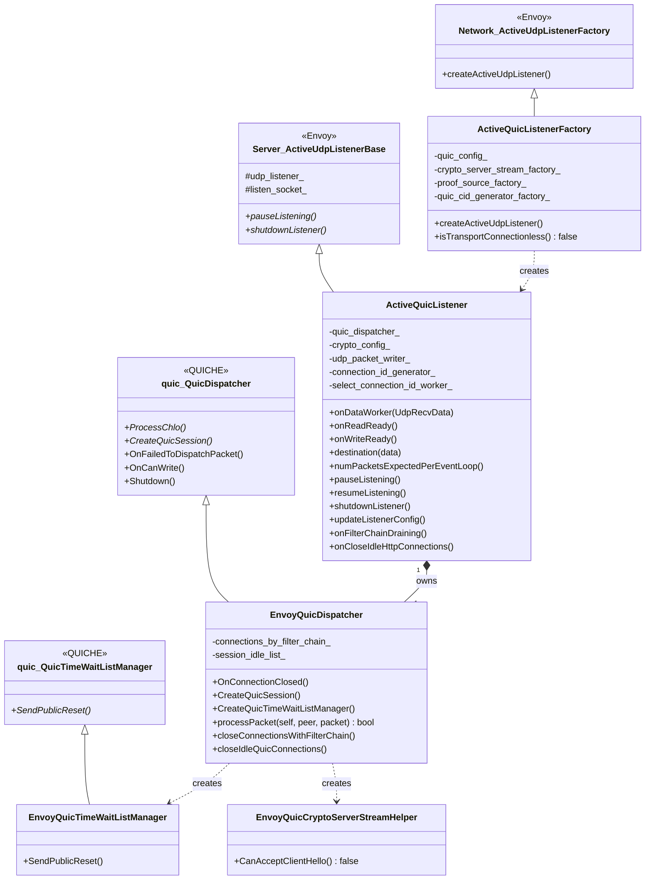
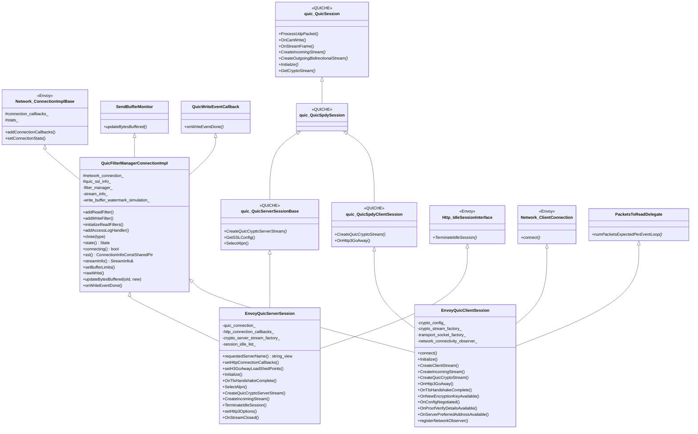
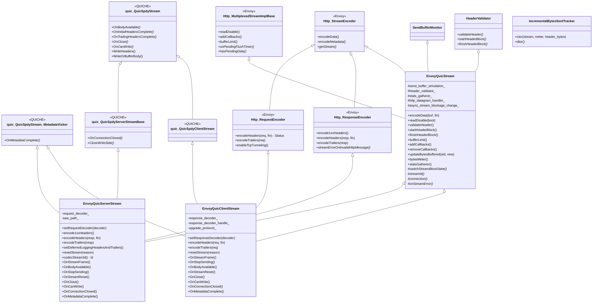
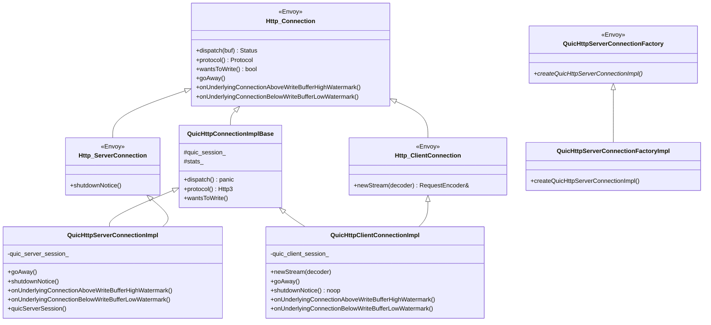
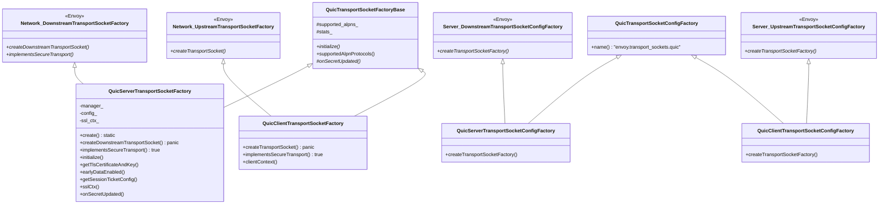
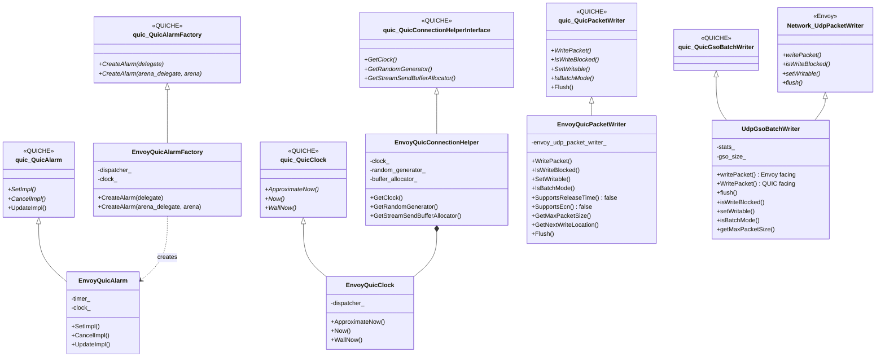
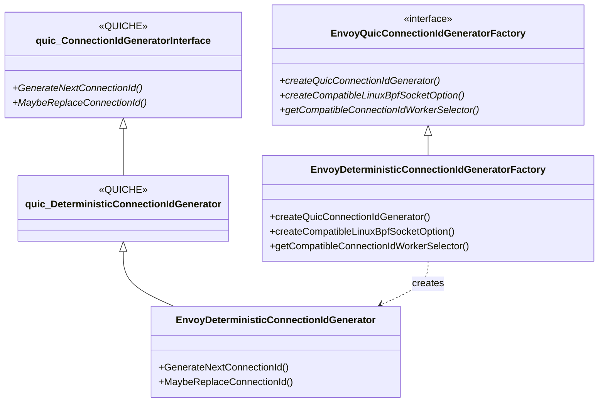
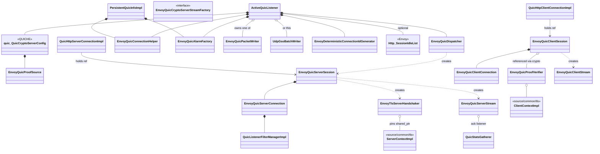

# Class hierarchy — UML view

> *A single place to pin the class graph in your head. Diagrams here use Mermaid `classDiagram` with the common UML conventions: solid arrow with hollow head = inheritance / `is a`, dashed arrow = composition / `has a`, `<<QUICHE>>` and `<<Envoy>>` markers indicate which world a base class belongs to.*

This file is dense on purpose. Read it together with [`OVERVIEW_PART1`](OVERVIEW_PART1_architecture_and_layering.md) (architecture) — that doc tells you *why* the inheritance is shaped this way; this one shows you the exact graph.

## Sections

1. [Listener & dispatcher](#1-listener--dispatcher)
2. [Sessions](#2-sessions)
3. [Connections](#3-connections)
4. [Streams](#4-streams)
5. [HTTP/3 codec adapters](#5-http3-codec-adapters)
6. [Crypto, ProofSource, ProofVerifier](#6-crypto-proofsource-proofverifier)
7. [Transport socket factories](#7-transport-socket-factories)
8. [Glue (clock, alarm, packet writer)](#8-glue-clock-alarm-packet-writer)
9. [Connection ID and packet routing](#9-connection-id-and-packet-routing)
10. [Watermark, stats, monitors](#10-watermark-stats-monitors)
11. [Everything‑on‑one‑canvas (collapsed)](#11-everything-on-one-canvas-collapsed)

---

## 1. Listener & dispatcher



---

## 2. Sessions

The two session classes share `QuicFilterManagerConnectionImpl` but each adds its own QUICHE base on the other side.



---

## 3. Connections

Both connection classes inherit from `quic::QuicConnection`, but the client also implements `Network::UdpPacketProcessor` because it owns its socket directly.

```mermaid
classDiagram
    class quic_QuicConnection {
        <<QUICHE>>
        +OnPacketHeader()
        +ProcessUdpPacket()
        +OnCanWrite()
        +OnPathDegradingDetected()
        +OnEffectivePeerMigrationValidated()
        +WritePacket()
    }
    class QuicNetworkConnection {
        +setConnectionStats()
        +setEnvoyConnection()
        +connectionSocket() ptr&
        +id() uint64_t
        #setConnectionSocket()
        #onWriteEventDone()
        #networkConnection()
        -connection_sockets_
        -envoy_connection_
        -write_callback_
    }
    class Network_UdpPacketProcessor {
        <<Envoy>>
        +processPacket(local, peer, buf, time, tos, cmsg)*
        +maxDatagramSize()*
        +onDatagramsDropped()*
        +numPacketsExpectedPerEventLoop()*
        +saveCmsgConfig()*
    }

    class EnvoyQuicServerConnection {
        +OnPacketHeader()
        +OnCanWrite()
        +ProcessUdpPacket()
        +actuallyDeferSend()
        +OnEffectivePeerMigrationValidated()
        -listener_filter_manager_
        -first_packet_received_
    }
    class EnvoyQuicSelfIssuedConnectionIdManager {
        +(uses quic CID manager)
    }
    class EnvoyQuicClientConnection {
        +processPacket()
        +maxDatagramSize()
        +setUpConnectionSocket(socket, delegate)
        +switchConnectionSocket()
        +OnPathDegradingDetected()
        +OnCanWrite()
        +onPathValidationSuccess()
        +onPathValidationFailure()
        +probeAndMigrateToServerPreferredAddress()
        +getOrCreateMigrationHelper()
        -dispatcher_
        -migration_helper_
        -writer_factory_
    }
    class EnvoyQuicPathValidationContext {
        +WriterToUse()
        +releaseWriter()
        +probingSocket()
        +releaseSocket()
    }
    class EnvoyQuicMigrationHelper {
        +FindAlternateNetwork()
        +CreateQuicPathContextFactory()
        +OnMigrationToPathDone()
        +GetDefaultNetwork()
        +GetCurrentNetwork()
    }
    class EnvoyPathValidationResultDelegate {
        +OnPathValidationSuccess()
        +OnPathValidationFailure()
    }
    class EnvoyQuicClinetPathContextFactory {
        +CreatePathValidationContext()
    }
    class quic_QuicPathValidationContext {
        <<QUICHE>>
    }
    class quic_QuicMigrationHelper {
        <<QUICHE>>
    }
    class quic_QuicSelfIssuedConnectionIdManager {
        <<QUICHE>>
    }
    class quic_QuicPathValidator_ResultDelegate {
        <<QUICHE>>
    }
    class quic_QuicPathContextFactory {
        <<QUICHE>>
    }

    quic_QuicConnection <|-- EnvoyQuicServerConnection
    QuicNetworkConnection <|-- EnvoyQuicServerConnection
    quic_QuicConnection <|-- EnvoyQuicClientConnection
    QuicNetworkConnection <|-- EnvoyQuicClientConnection
    Network_UdpPacketProcessor <|-- EnvoyQuicClientConnection
    quic_QuicSelfIssuedConnectionIdManager <|-- EnvoyQuicSelfIssuedConnectionIdManager

    EnvoyQuicClientConnection +-- EnvoyQuicPathValidationContext : nested
    EnvoyQuicClientConnection +-- EnvoyQuicMigrationHelper : nested
    EnvoyQuicClientConnection +-- EnvoyPathValidationResultDelegate : nested
    EnvoyQuicClientConnection +-- EnvoyQuicClinetPathContextFactory : nested

    quic_QuicPathValidationContext <|-- EnvoyQuicPathValidationContext
    quic_QuicMigrationHelper <|-- EnvoyQuicMigrationHelper
    quic_QuicPathValidator_ResultDelegate <|-- EnvoyPathValidationResultDelegate
    quic_QuicPathContextFactory <|-- EnvoyQuicClinetPathContextFactory
```

---

## 4. Streams

The stream layer is the densest cross‑inheritance.



---

## 5. HTTP/3 codec adapters



---

## 6. Crypto, ProofSource, ProofVerifier

```mermaid
classDiagram
    class quic_ProofSource {
        <<QUICHE>>
        +GetProof()*
        +GetCertChain()*
        +ComputeTlsSignature()*
        +OnNewSslCtx()
        +GetTicketCrypter()
        +SupportedTlsSignatureAlgorithms()*
    }
    class quic_ProofSource_Details {
        <<QUICHE>>
    }
    class quic_TlsServerHandshaker {
        <<QUICHE>>
    }
    class quic_QuicCryptoServerStreamBase {
        <<QUICHE>>
    }
    class quic_ProofVerifier {
        <<QUICHE>>
        +VerifyProof()
        +VerifyCertChain()*
    }
    class quic_ProofVerifyContext {
        <<QUICHE>>
    }
    class quic_ProofVerifyDetails {
        <<QUICHE>>
        +Clone()*
    }

    class EnvoyQuicProofSourceDetails {
        +filterChain() FilterChain&
        -filter_chain_
    }
    class EnvoyQuicProofSourceBase {
        +GetProof()
        +ComputeTlsSignature()
        +SupportedTlsSignatureAlgorithms()
        +GetTicketCrypter() nullptr
        #signPayload()*
    }
    class EnvoyQuicProofSource {
        +OnNewSslCtx()
        +GetCertChain()
        +signPayload()
        +updateFilterChainManager()
        -listen_socket_
        -filter_chain_manager_
        -listener_stats_
        -time_source_
    }
    class EnvoyQuicProofSourceFactoryInterface {
        +createQuicProofSource()*
    }

    class EnvoyTlsServerHandshaker {
        +ticketKeyCallback() static
        +handshakerExDataIndex() static
        -pinnedServerContext()
        -pinned_ssl_ctx_
    }
    class EnvoyQuicCryptoServerStreamFactoryInterface {
        +createEnvoyQuicCryptoServerStream()*
    }

    class EnvoyQuicProofVerifyContext {
        +dispatcher()*
        +isServer()*
        +transportSocketOptions()*
        +extraValidationContext()*
    }
    class EnvoyQuicProofVerifierBase {
        +VerifyProof()
    }
    class EnvoyQuicProofVerifier {
        +VerifyCertChain()
        -context_
        -accept_untrusted_
    }
    class CertVerifyResult {
        +isValid()
        +Clone()
        -is_valid_
    }
    class EnvoyQuicCryptoClientStreamFactoryInterface {
        +createEnvoyQuicCryptoClientStream()*
    }

    quic_ProofSource <|-- EnvoyQuicProofSourceBase
    EnvoyQuicProofSourceBase <|-- EnvoyQuicProofSource
    quic_ProofSource_Details <|-- EnvoyQuicProofSourceDetails
    quic_TlsServerHandshaker <|-- EnvoyTlsServerHandshaker
    quic_ProofVerifier <|-- EnvoyQuicProofVerifierBase
    EnvoyQuicProofVerifierBase <|-- EnvoyQuicProofVerifier
    quic_ProofVerifyContext <|-- EnvoyQuicProofVerifyContext
    quic_ProofVerifyDetails <|-- CertVerifyResult
```



---

## 7. Transport socket factories

QUIC transport socket factories never make a real `TransportSocket`. They exist only to carry TLS context config.



---

## 8. Glue (clock, alarm, packet writer)



---

## 9. Connection ID and packet routing



---

## 10. Watermark, stats, monitors

```mermaid
classDiagram
    class quic_QuicAckListenerInterface {
        <<QUICHE>>
        +OnPacketAcked()*
        +OnPacketRetransmitted()*
    }
    class SendBufferMonitor {
        +updateBytesBuffered()*
        +isDoingWatermarkAccounting()
    }
    class ScopedWatermarkBufferUpdater {
        +ctor(quic_stream, monitor)
        +dtor() computes delta
    }
    class EnvoyQuicSimulatedWatermarkBuffer {
        +checkHighWatermark()
        +checkLowWatermark()
        +highWatermark()
        +lowWatermark()
        -high_
        -low_
    }
    class QuicStatsGatherer {
        +OnPacketAcked()
        +OnPacketRetransmitted()
        +addBytesSent()
        +setAccessLogHandlers()
        +setDeferredLoggingHeadersAndTrailers()
        +maybeDoDeferredLog()
        +loggingDone()
        +bytesOutstanding()
        -bytes_outstanding_
        -access_log_handlers_
        -stream_info_
        -time_source_
    }
    class QuicWriteEventCallback {
        +onWriteEventDone()*
    }
    class QuicNetworkConnectivityObserver {
        <<interface>>
        +onNetworkChanged()*
        +onNetworkConnected()*
        +onNetworkDisconnected()*
        +onNetworkSoonToDisconnect()*
        +onNetworkMadeDefault()*
    }
    class QuicNetworkConnectivityObserverImpl

    quic_QuicAckListenerInterface <|-- QuicStatsGatherer
    SendBufferMonitor +-- ScopedWatermarkBufferUpdater : nested
    QuicNetworkConnectivityObserver <|-- QuicNetworkConnectivityObserverImpl
```

---

## 11. Everything‑on‑one‑canvas (collapsed)

A bird's‑eye composition view. Shows ownership (`*--`), not inheritance — for inheritance, use the sections above.



That's the whole folder. If you ever feel lost, come back to this picture — every concrete class you'll touch is in it.
