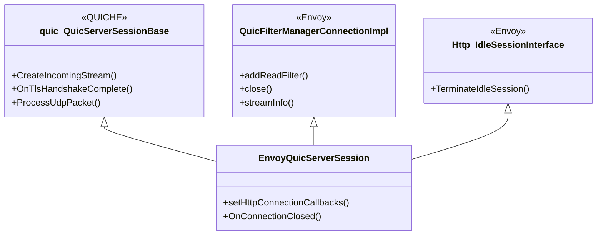
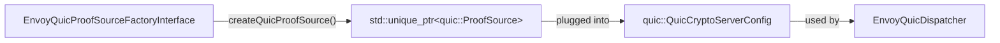
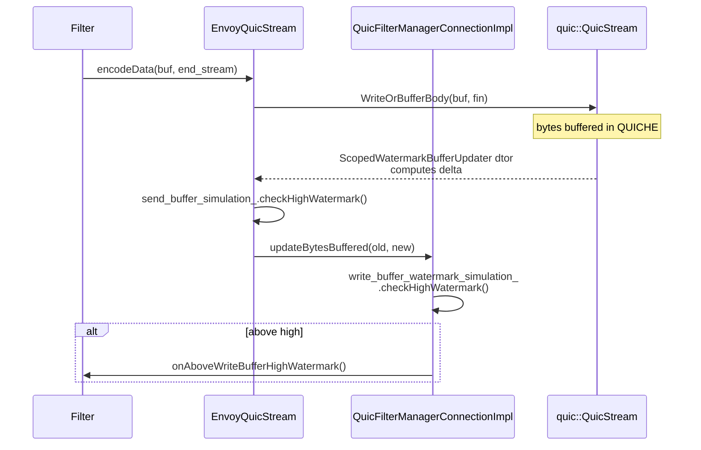
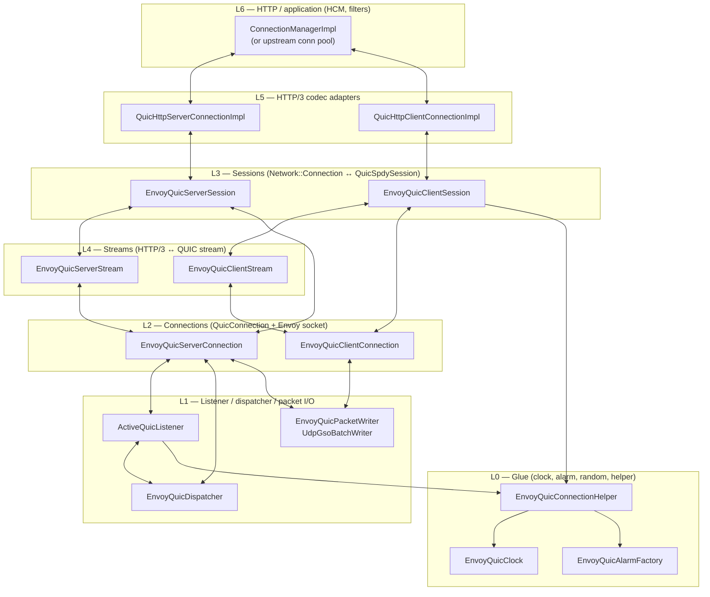
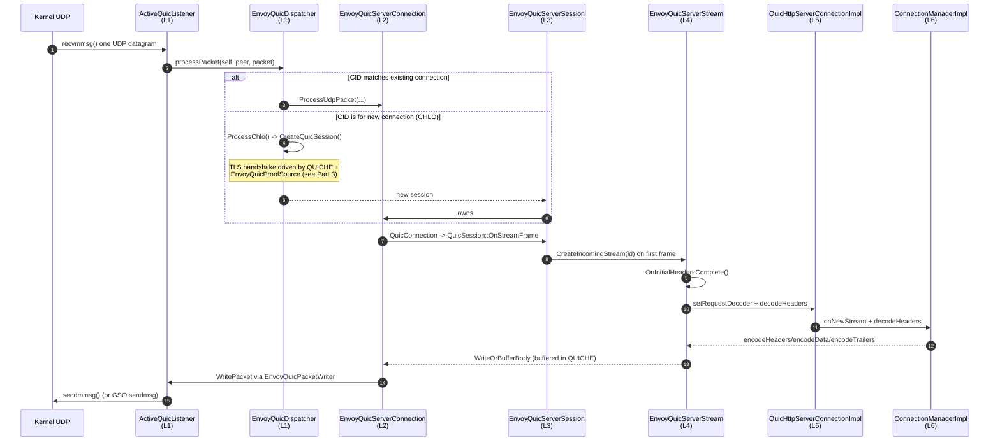

# Overview, Part 1 — Architecture & layering

> *Read this first. It explains how the folder is shaped so the rest of the docs make sense.*

The `source/common/quic` folder sits at the intersection of three independently designed worlds:

- **Envoy**, which thinks in terms of `Network::Connection` + `FilterManager` + `Http::ConnectionManager`.
- **QUICHE** (Google's QUIC library), which thinks in terms of `QuicDispatcher` + `QuicSession` + `QuicStream` and expects to own the entire TLS handshake, packet pacing, loss recovery, and congestion control.
- **BoringSSL**, which thinks in terms of `SSL_CTX*` + `SSL*` and is reached through QUICHE's `TlsServerHandshaker` / `TlsClientHandshaker`.

This folder's whole job is to **make these three speak to each other**, without forking any of them. It does that with a small set of architectural ideas, applied consistently across ~90 files.

## The five architectural ideas

### Idea 1 — "Multiple‑inheritance adapter classes"

The largest classes in this folder inherit from *both* a QUICHE base class and an Envoy interface, then forward calls between them. The Envoy side hands the object to HCM / the connection pool, the QUICHE side hands it to the dispatcher / handshaker.

The same pattern repeats for `EnvoyQuicClientSession`, `EnvoyQuicServerConnection`, `EnvoyQuicServerStream`, and `EnvoyQuicClientStream`. The full inheritance graph is in [`CLASS_HIERARCHY.md`](CLASS_HIERARCHY.md).

### Idea 2 — "Pluggable interfaces wrap QUICHE interfaces"

Anywhere QUICHE accepts an interface (proof source, alarm factory, packet writer, crypto stream factory, CID generator, debug visitor, …) this folder defines an **Envoy interface** that maps 1:1 to the QUICHE one. That way:

- Extensions (in `source/extensions/quic/…`) can plug in alternatives via the registry.
- The built‑in implementation can be swapped out in tests.
- Mobile, OSS, and SFDC‑internal builds can supply different proof sources without forking the dispatcher.

Same pattern: `EnvoyQuicCryptoServerStreamFactoryInterface`, `EnvoyQuicConnectionIdGeneratorFactory`, `EnvoyQuicConnectionDebugVisitorFactoryInterface`, `EnvoyQuicServerPreferredAddressConfigFactory`, `QuicClientPacketWriterFactory`.

### Idea 3 — "All side‑effects through `Event::Dispatcher`"

QUICHE was originally designed to run inside Chrome / a Google server framework, with its own scheduler. To run it inside Envoy's per‑worker `libevent` loop, **everything that touches time, timers, or I/O must go through `Event::Dispatcher`**.

This folder provides one adapter per QUICHE side‑effect interface:

| QUICHE wants | Envoy provides | File |
|---|---|---|
| `quic::QuicClock` | `EnvoyQuicClock` over `Event::Dispatcher::timeSource()` | `envoy_quic_clock.{h,cc}` |
| `quic::QuicAlarm` | `EnvoyQuicAlarm` over `Event::Timer` | `envoy_quic_alarm.{h,cc}` |
| `quic::QuicAlarmFactory` | `EnvoyQuicAlarmFactory` | `envoy_quic_alarm_factory.{h,cc}` |
| `quic::QuicPacketWriter` | `EnvoyQuicPacketWriter` over `Network::UdpPacketWriter` (or `UdpGsoBatchWriter` direct) | `envoy_quic_packet_writer.{h,cc}` |
| `quic::QuicRandom` | `QuicRandom::GetInstance()` (default singleton) | `envoy_quic_connection_helper.h` |
| `quiche::QuicheBufferAllocator` | `SimpleBufferAllocator` (per‑connection) | `envoy_quic_connection_helper.h` |

These are bundled into `EnvoyQuicConnectionHelper` (per session) and passed to QUICHE at session/connection construction. Once that's done, QUICHE is fully under Envoy's `Dispatcher` control — no background threads, no `gettimeofday()`, no `epoll()`.

### Idea 4 — "Reuse `source/common/tls` for cert validation, never reinvent"

QUIC has its own TLS 1.3 stack, but Envoy already has a battle‑tested cert validator, OCSP parser, private‑key provider, and session‑ticket implementation in `source/common/tls`. This folder reuses all of it:

- **Server**: `EnvoyTlsServerHandshaker` pins a `ServerContextImpl` (from `source/common/tls`) into the QUICHE `SSL*` ex_data. The session‑ticket‑key callback is installed once on the shared `SSL_CTX*` and routes to the pinned `ServerContextImpl::sessionTicketProcess()`. Result: the same session‑ticket keys, the same rotation behaviour, the same SDS dynamic‑update story as TCP TLS.
- **Client**: `EnvoyQuicProofVerifier` holds an `Envoy::Ssl::ClientContextSharedPtr` and forwards `VerifyCertChain()` to `ClientContextImpl::customVerifyCertChainForQuic()`, which runs Envoy's full `CertValidator` chain (default validator, SAN matchers, SPIFFE, etc.).

`quic_ssl_connection_info.h` exposes the QUIC `SSL*` as an `Ssl::ConnectionInfo` so HCM, access loggers, and filters read TLS info the same way for QUIC and TCP TLS.

### Idea 5 — "Per‑stream watermarks simulated against QUICHE's send buffer"

QUICHE buffers all outgoing data in **per‑stream** send buffers; there is no connection‑level send buffer. Envoy's filter contract, however, requires *connection‑wide* high/low watermarks (`onAboveWriteBufferHighWatermark` / `onBelowWriteBufferLowWatermark`).

This folder bridges that with:

- `EnvoyQuicSimulatedWatermarkBuffer` — a stateless watermark state machine.
- `SendBufferMonitor::ScopedWatermarkBufferUpdater` — measures bytes buffered in a `quic::QuicStream` before and after an operation and forwards the delta.
- `EnvoyQuicStream::updateBytesBuffered()` — applies the delta to the stream's own `EnvoyQuicSimulatedWatermarkBuffer` *and* calls up to `QuicFilterManagerConnectionImpl::updateBytesBuffered()`, which aggregates across all streams.

That gives downstream filters a real "connection write buffer hit high watermark" event without the connection ever actually buffering bytes.

---

## The layered picture

The cleanest way to think about the folder is as a stack with **six layers**. Each layer only knows about the one above and the one below.

### Why this matters

Every concrete file in this folder lives at exactly **one** layer, and the dependencies always point downward. That is the invariant that makes the code maintainable despite the deep multiple inheritance. If you ever find yourself thinking "should this go in the stream or the session?", ask "which layer owns this concern?" first.

| Layer | Owns | Doesn't know about |
|---|---|---|
| L0 | Time, timers, RNG, buffer allocator | Connections, sessions, anything HTTP |
| L1 | Sockets, UDP I/O, packet routing, dispatcher, new‑session creation | HTTP, filter chains (forwarded, not handled) |
| L2 | One QUIC connection (CID, packet pacing, congestion control, migration, listener filters) | Streams, HTTP |
| L3 | Network::Connection contract, filter manager, TLS state, watermark roll‑up, close‑delay timer | Stream payload, HTTP framing |
| L4 | One HTTP/3 stream, header validation, deferred logging, datagrams, watermark simulation | Connection migration, packet pacing |
| L5 | `Http::Connection` interface (`goAway`, `wantsToWrite`, watermark forwarding) | TLS, packet I/O |
| L6 | The actual HTTP application | Anything QUIC‑specific |

---

## Why so much multiple inheritance?

It's easy to look at `EnvoyQuicServerSession`'s seven‑deep inheritance graph and worry. The reason is that **both QUICHE and Envoy demand to own the object**:

- QUICHE wants a `quic::QuicSession*` that *it* allocates inside `CreateQuicSession()`, *it* owns from then on, and *it* destroys.
- Envoy wants a `Network::Connection*` that lives in `Network::ConnectionHandler`'s connection list, is reachable from `ListenerFilterCallbacks`, and is destroyable via `close()`.

Composition would require *two* objects with mutual pointers and a careful lifetime contract. Multiple inheritance gives *one* object with one lifetime, where each base class can be cast to and used independently. The cost is that you have to read the inheritance graph carefully — which is exactly what [`CLASS_HIERARCHY.md`](CLASS_HIERARCHY.md) is for.

> `quic_filter_manager_connection_impl.h` even has a `TODO(danzh)` noting that the inheritance could be flattened by making `QuicConnection` a member instead of a base. That refactor would simplify the lifetime story but is currently blocked by the QUICHE API surface.

---

## How a single byte flows through the layers

This is the picture you should keep in your head. It also tells you exactly which file to open for each step.

The reverse direction (the client codec writes a request and the server returns a response) is just this picture replayed for the client classes — see [`OVERVIEW_PART2`](OVERVIEW_PART2_listener_session_connection.md) for the side‑by‑side.

---

## What's next

- [`OVERVIEW_PART2_listener_session_connection.md`](OVERVIEW_PART2_listener_session_connection.md) — L1–L3 in detail. How a UDP datagram becomes a `Network::Connection`.
- [`OVERVIEW_PART3_crypto_and_tls.md`](OVERVIEW_PART3_crypto_and_tls.md) — Where the certs come from and how the handshake is wired.
- [`OVERVIEW_PART4_streams_codecs_http3.md`](OVERVIEW_PART4_streams_codecs_http3.md) — L4–L5. How a request flows.
- [`CLASS_HIERARCHY.md`](CLASS_HIERARCHY.md) — The class graph as one big UML diagram.
