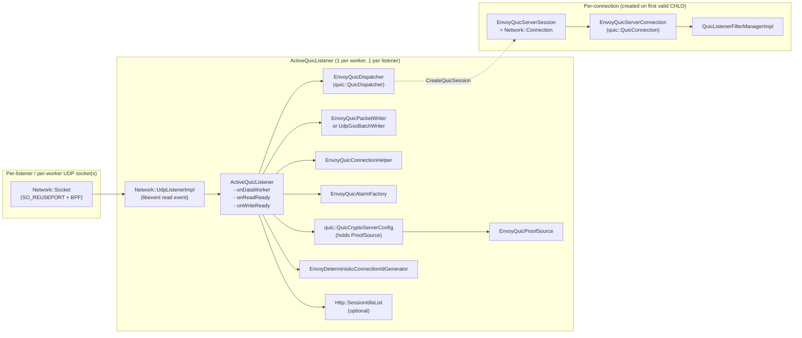
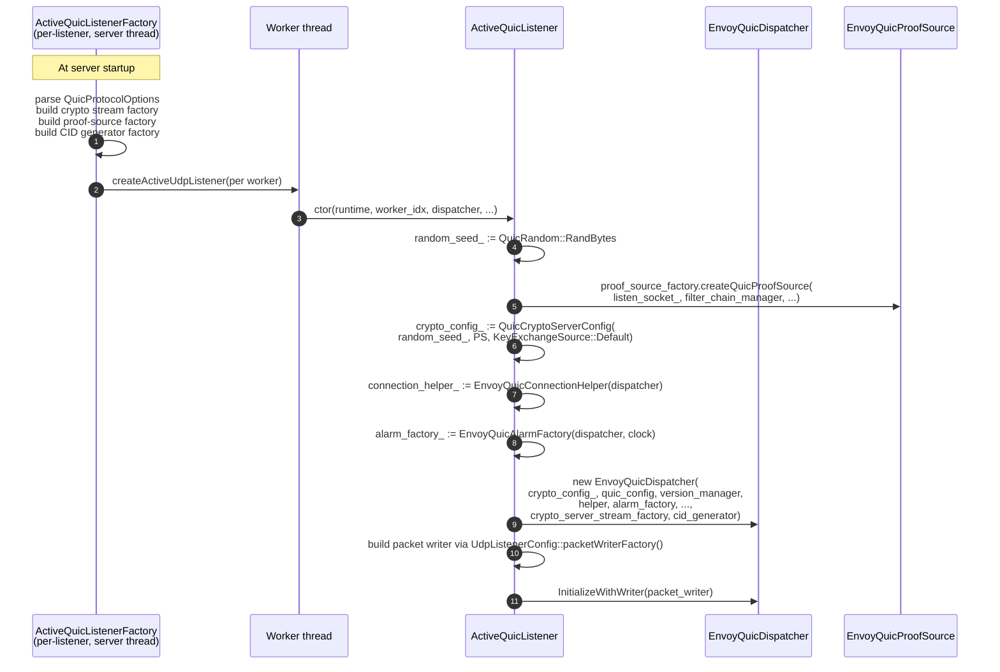
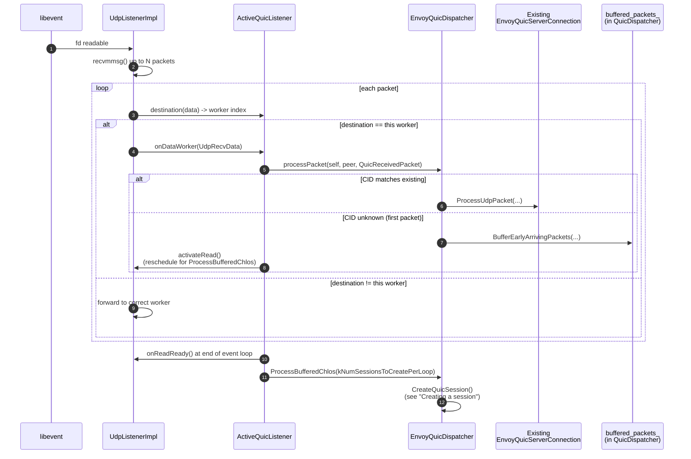
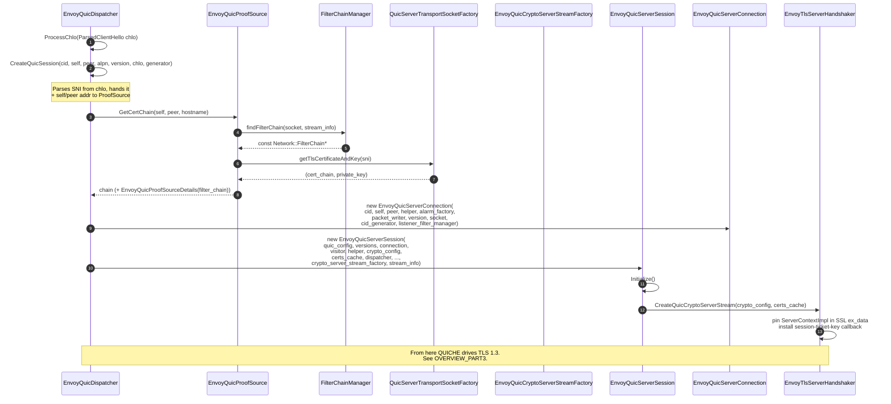
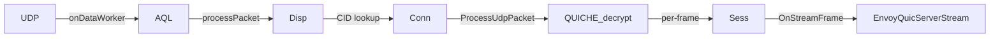
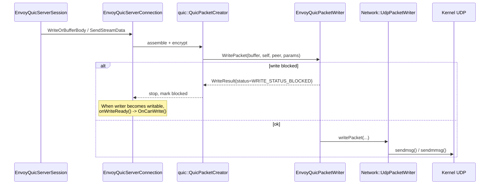
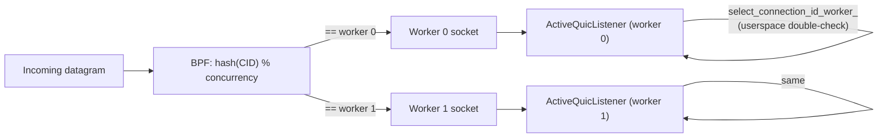
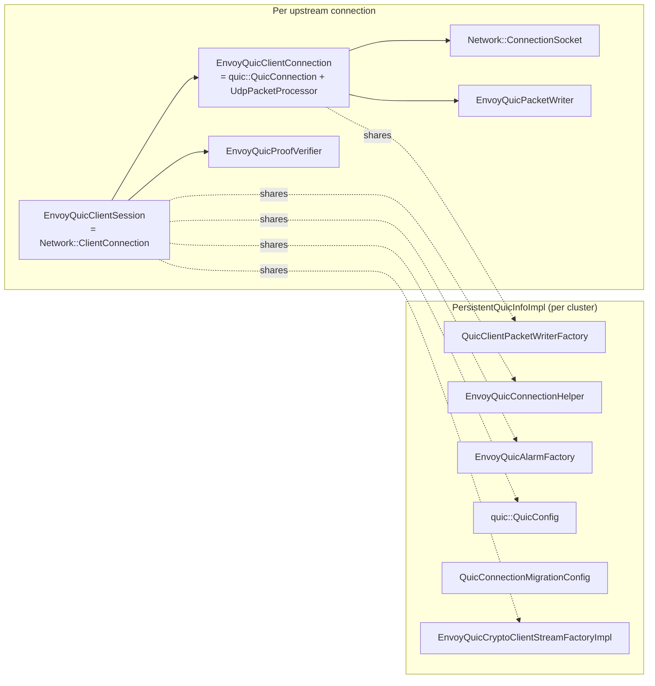
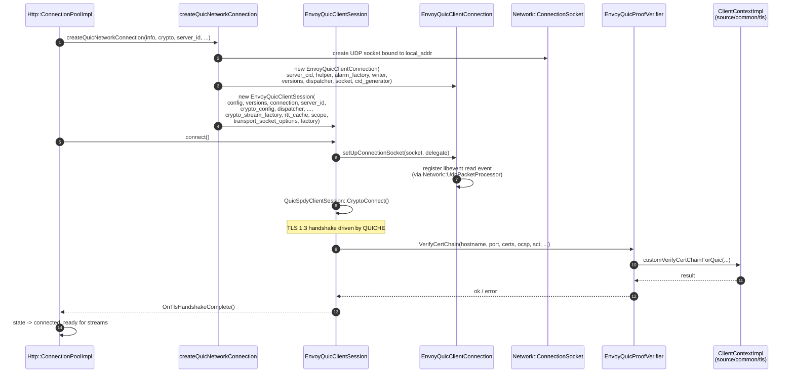
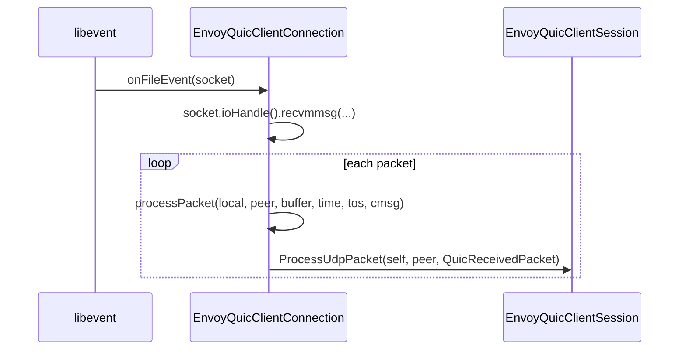

# Overview, Part 2 — Listener, dispatcher, session, and connection

> *Read [`OVERVIEW_PART1`](OVERVIEW_PART1_architecture_and_layering.md) first.*

This part walks **L1 → L2 → L3**:

1. Where does the UDP listener come from?
2. How does the **dispatcher** demux a packet to the right connection?
3. How is a brand‑new **session** created when a `CHLO` arrives?
4. What are the **client‑side** counterparts (which look very different)?

## Server side — the path from socket to session

### Block diagram

### Who creates whom, when?

The factory runs **once** in the listener-manager (main) thread. The listener itself is constructed **once per worker** when `Worker::addListener()` calls `createActiveUdpListener`. The dispatcher is per‑listener‑per‑worker; the proof source and crypto config are too.

### Receiving a packet

`Network::UdpListenerImpl` registers a libevent read event on the UDP socket. When the event fires:

Two things to notice:

- `processPacket()` returns `bool`. False means QUICHE couldn't dispatch (e.g. unknown CID, invalid version, stateless reset issued). `ActiveQuicListener::onDataWorker()` then forwards the raw packet to the optional `NonDispatchedUdpPacketHandler` — used during hot restart so the *new* Envoy can take over inflight packets that miss its own CID table.
- New sessions are created **in batches** (`kNumSessionsToCreatePerLoop = 16`) by `ProcessBufferedChlos()` at the *end* of the event loop, not in the middle of `onDataWorker`. This bounds the time spent per event loop and keeps tail latency predictable under SYN‑flood‑style CHLO bursts.

### Creating a session (the L1 → L3 jump)

After this dance, the session is fully wired:

- `EnvoyQuicServerConnection` knows its socket, its peer/self address, its CID, and the listener filter manager.
- `EnvoyQuicServerSession` is registered with QUICHE under that CID, so subsequent packets routed by the dispatcher arrive at `ProcessUdpPacket()`.
- The crypto stream is allocated and pinned to the matched filter chain's `ServerContextImpl`.

### Receiving subsequent packets (the steady state)

Once a session exists, packet flow shortcuts the buffered‑CHLO machinery:

The dispatcher and QUICHE core do all the framing / decryption / pacing internally. Envoy only sees the per‑frame callbacks (`OnStreamFrame`, `OnHeadersFrame`, `OnTrailersFrame`, `OnRstStream`, `OnStopSending`, ...). See [`OVERVIEW_PART4`](OVERVIEW_PART4_streams_codecs_http3.md).

### Sending packets (the write path)

QUICHE owns pacing and congestion control. Envoy only owns the **packet writer**.

For high throughput on Linux, the listener can be configured to use `UdpGsoBatchWriter`, which implements `quic::QuicPacketWriter` *directly* (no `EnvoyQuicPacketWriter` adapter). It coalesces up to ~64 KB of equally‑sized packets into one `sendmsg()` via `UDP_SEGMENT` GSO. See [`alarm_and_packet_io.md`](alarm_and_packet_io.md).

### Connection‑ID routing across workers

For `concurrency > 1`, the kernel BPF program (installed at listener creation) hashes the CID modulo `concurrency` to pick a worker. The CID is generated by `EnvoyDeterministicConnectionIdGenerator`, which **embeds the worker index in the first 4 bytes of the CID** so the BPF program can decode it. The same logic runs in userspace as a fallback when BPF is unavailable (`ActiveQuicListener::destination()`).

If the userspace check disagrees with the kernel routing, the packet stays on the wrong worker (logged at error level). This only happens in the brief window during BPF setup.

---

## Client side — the path from `connect()` to session

The client side is symmetric in concept but very different in shape. There's no listener and no dispatcher: each client connection owns its **own** UDP socket and registers its **own** read event.

### Per‑cluster vs per‑connection state

- **Per cluster**: `PersistentQuicInfoImpl` (defined in `client_connection_factory_impl.h`) caches the bits that don't change between connections to the same cluster — alarm factory, connection helper, `QuicConfig`, crypto stream factory, migration config, packet‑writer factory. One instance per cluster, lazily created.
- **Per connection**: everything else. Each `createQuicNetworkConnection()` call builds a fresh `EnvoyQuicClientConnection` + `EnvoyQuicClientSession`.

### Connecting and handshaking

### Receiving packets (no dispatcher)

The client connection implements `Network::UdpPacketProcessor` itself; the file event is registered by the connection, not by a listener:

This is structurally simpler than the server side because there's no demux: every packet on this socket belongs to this connection (modulo migration). The complication is **connection migration**: the connection can hold multiple sockets in `connection_sockets_`, and only the *last* one is used for writing. See [`envoy_quic_connection.md`](envoy_quic_connection.md) for the full migration story.

---

## The Session ↔ Connection relationship

A common point of confusion: there is **one `Session` and one `Connection` per QUIC connection**, and they have very specific responsibilities.

| Concern | Lives in `Session` | Lives in `Connection` |
|---|---|---|
| `Network::Connection` interface (HCM contract) | ✓ (via `QuicFilterManagerConnectionImpl`) | |
| Stream creation / lookup | ✓ (`QuicSession`) | |
| HTTP/3 framing, QPACK | ✓ (`QuicSpdySession`) | |
| TLS handshake | ✓ (via crypto stream) | |
| Packet encryption / decryption | | ✓ (QUIC packet headers, frame parser) |
| Congestion control, loss recovery | | ✓ (`QuicSentPacketManager`) |
| ACK / RTT tracking | | ✓ |
| Migration / path validation | | ✓ |
| The UDP socket | | ✓ (server: borrowed from listener; client: owned) |
| Filter chain | ✓ (`Network::FilterManager`) | |
| Listener filters (QUIC only) | | ✓ (server: `QuicListenerFilterManagerImpl`) |

The session **owns** the connection (`std::unique_ptr<EnvoyQuicServerConnection> quic_connection_;`). When the session is destroyed, the connection goes with it. The connection never outlives its session.

---

## What's next

- [`OVERVIEW_PART3_crypto_and_tls.md`](OVERVIEW_PART3_crypto_and_tls.md) — Where the certs come from. How `EnvoyQuicProofSource` finds the right filter chain, how `EnvoyTlsServerHandshaker` plumbs session tickets, and how `EnvoyQuicProofVerifier` reuses `source/common/tls`.
- [`OVERVIEW_PART4_streams_codecs_http3.md`](OVERVIEW_PART4_streams_codecs_http3.md) — From `OnStreamFrame` to `decodeHeaders` and back. The stream + codec layer.
- [`active_quic_listener.md`](active_quic_listener.md) — Deep dive into the listener and dispatcher code.
- [`envoy_quic_session.md`](envoy_quic_session.md) — Deep dive into both sessions.
- [`envoy_quic_connection.md`](envoy_quic_connection.md) — Deep dive into both connections, including migration.
