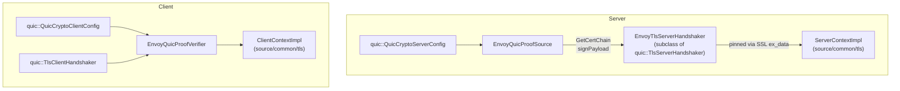
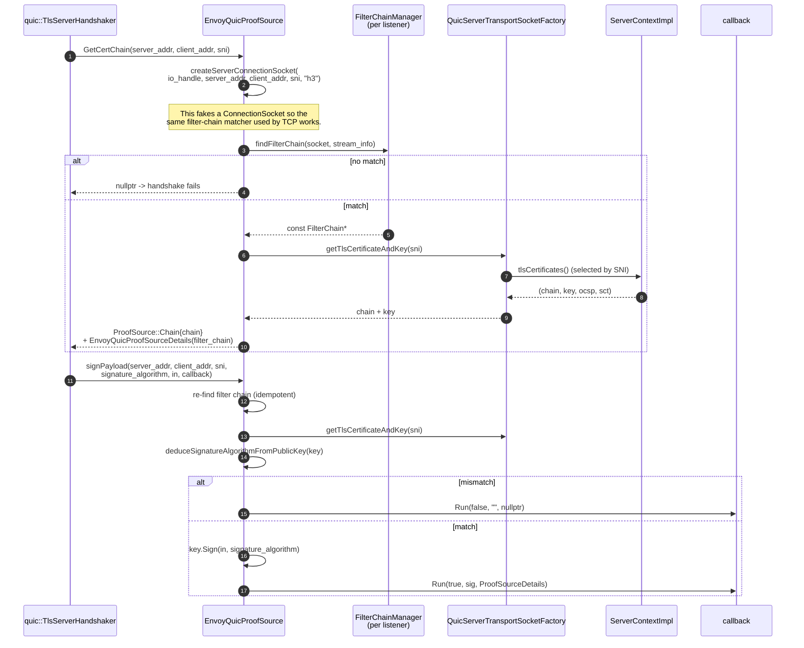
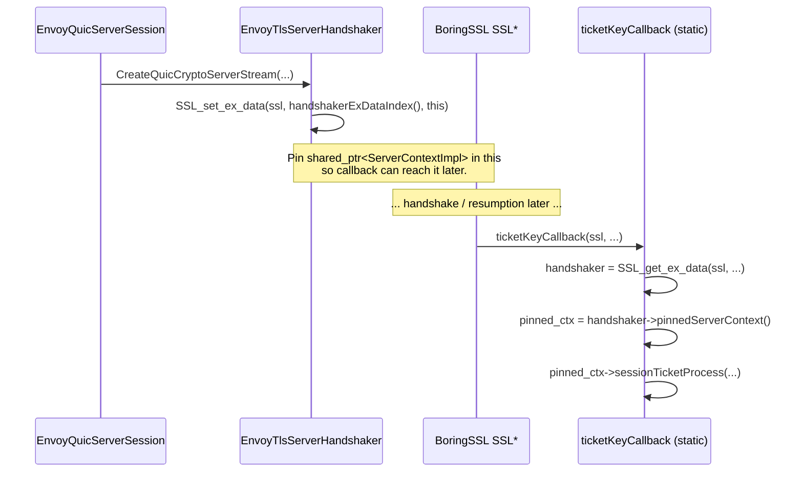

# Overview, Part 3 — Crypto, ProofSource, and TLS integration

> *Read [`OVERVIEW_PART1`](OVERVIEW_PART1_architecture_and_layering.md) and [`OVERVIEW_PART2`](OVERVIEW_PART2_listener_session_connection.md) first.*

QUIC carries TLS 1.3 inside transport packets (RFC 9001). The TLS state machine lives inside QUICHE, but the **identity material** (certificates, private keys, session‑ticket keys, peer‑trust roots) belongs to Envoy. This document explains how those two halves are wired together — and how that wiring is engineered to *reuse* the existing `source/common/tls` machinery instead of duplicating it.

## The three handshake "personas" you need to know

| Persona | Plays the role of | Lives in |
|---|---|---|
| **`quic::ProofSource`** | "Server, here is your cert + the signing oracle" | `envoy_quic_proof_source{,_base}.{h,cc}` |
| **`quic::ProofVerifier`** | "Client, validate this cert chain" | `envoy_quic_proof_verifier{,_base}.{h,cc}` |
| **TLS handshaker** | Drives the TLS 1.3 handshake itself, holds the `SSL*` | QUICHE‑owned; subclassed by `EnvoyTlsServerHandshaker` |

These three are wired together inside the `quic::QuicCryptoServerConfig` / `quic::QuicCryptoClientConfig` that the session uses.



---

## Server side — `EnvoyQuicProofSource`

### What ProofSource has to do

The QUICHE handshake calls back into `ProofSource` at two points:

1. **`GetCertChain(server_addr, client_addr, hostname)`** — early in the handshake, to learn what cert chain to send.
2. **`ComputeTlsSignature(... signature_algorithm, in, callback)`** — to sign the handshake transcript with the matching private key.

Both are SNI‑dependent (`hostname`) and so the Envoy proof source must consult the filter‑chain manager every time. It cannot cache a single chain, because:

- An Envoy listener can have many filter chains, each with its own cert.
- The filter chain to use depends on SNI, source IP, ALPN, transport protocol, server names, application protocols, …
- SDS can rotate the cert at any moment.

### The flow



### Why "filter chain" is returned via `ProofSource::Details`

QUICHE then surfaces the chosen filter chain back to Envoy at session construction (and later when applying network filters). The detail object is just a typed wrapper around a `const Network::FilterChain&` so the dispatcher / session can build the correct filter chain on the session without re‑running the matcher.

```cpp
class EnvoyQuicProofSourceDetails : public quic::ProofSource::Details {
  explicit EnvoyQuicProofSourceDetails(const Network::FilterChain& filter_chain);
  const Network::FilterChain& filterChain() const { return filter_chain_; }
};
```

### The `OnNewSslCtx` hook — where Envoy customises QUICHE's `SSL_CTX*`

QUICHE creates one `SSL_CTX*` *per* `QuicCryptoServerConfig` and shares it across all connections served by that config. After QUICHE finishes initialising it, it calls `ProofSource::OnNewSslCtx(SSL_CTX*)`. Envoy hooks that:

```cpp
void EnvoyQuicProofSource::OnNewSslCtx(SSL_CTX* ssl_ctx) {
  registerCertCompression(ssl_ctx);          // RFC 8879 brotli/zstd cert compression
  if (Runtime::runtimeFeatureEnabled("envoy.reloadable_features.quic_session_ticket_support")) {
    SSL_CTX_set_tlsext_ticket_key_cb(ssl_ctx, EnvoyTlsServerHandshaker::ticketKeyCallback);
  }
}
```

That's where the QUIC TLS context picks up the **same** cert‑compression registration and the **same** session‑ticket callback used by TCP TLS — defined in `source/common/tls`.

### Why session tickets need a per‑connection pinned context

The session‑ticket callback gets only a `SSL*` and has no idea which filter chain the connection belongs to. So `EnvoyTlsServerHandshaker` pins the right `ServerContextImpl` in SSL ex_data at connection creation:



The pinning matters for SDS:

- Without pinning, an SDS rotation that replaces the `ServerContextImpl` while connections are still using its keys would break tickets mid‑connection.
- With pinning, each connection keeps a `shared_ptr` to the `ServerContextImpl` it was born with. New connections after the SDS update use the new context; existing ones finish with the old one. Same lifetime story as TCP TLS — by construction.

---

## Client side — `EnvoyQuicProofVerifier`

The verifier is much simpler than the source, because the client just needs to validate the cert chain QUICHE hands it.

```mermaid
sequenceDiagram
  autonumber
  participant Hsk as quic::TlsClientHandshaker
  participant PV as EnvoyQuicProofVerifier
  participant Ctx as ClientContextImpl<br/>(source/common/tls)
  participant CV as CertValidator<br/>(default / SPIFFE / SAN / ...)

  Hsk->>PV: VerifyCertChain(hostname, port,<br/>  certs, ocsp, sct,<br/>  verify_context, error_details, details,<br/>  out_alert, callback)
  PV->>PV: build VerifyContext (dispatcher,<br/>  isServer=false, transport_socket_options)
  PV->>Ctx: customVerifyCertChainForQuic(<br/>  certs, callback, is_server=false,<br/>  hostname, ocsp, verify_context)
  Ctx->>CV: doVerifyCertChain(...)
  CV-->>Ctx: success / async pending / error
  alt sync success
    Ctx-->>PV: QUIC_SUCCESS
    PV-->>Hsk: QUIC_SUCCESS, details = CertVerifyResult(true)
  else async
    Note over CV: validation continues on dispatcher;<br/>callback->Run() later
  else failure
    Ctx-->>PV: QUIC_FAILURE
    PV-->>Hsk: QUIC_FAILURE, error_details, out_alert
  end
```

Three things to notice:

1. **`accept_untrusted_`** — for the `ACCEPT_UNTRUSTED` mode in `CertificateValidationContext`, the verifier still calls the validator (so SAN matching etc. runs) but ignores trust‑chain errors.
2. **Async support** — the same async cert‑validation callback contract used by TCP TLS works here, because `ClientContextImpl::customVerifyCertChainForQuic()` is the same function.
3. **`CertVerifyResult`** — the only `ProofVerifyDetails` Envoy returns. It's just a boolean wrapper QUICHE hands back later via `OnProofVerifyDetailsAvailable()`, where `EnvoyQuicClientSession` then calls `quic_ssl_info_->onCertValidated()`.

### `EnvoyQuicProofVerifyContext`

QUICHE allows the caller to pass an opaque `ProofVerifyContext*` into `VerifyCertChain()`. Envoy defines an abstract `EnvoyQuicProofVerifyContext` so the verifier can pull out:

- `dispatcher()` — needed if validation is async.
- `isServer()` — most validators behave differently for incoming vs outgoing handshakes.
- `transportSocketOptions()` — so verify‑subject‑alt‑name overrides from upstream cluster transport socket options can be applied.
- `extraValidationContext()` — currently just the parsed certs the validator may want to consume.

---

## Reusing `source/common/tls`

The whole point of these wrappers is **to use the existing TLS code unchanged**. Concretely:

| Concern | Reused class | Where |
|---|---|---|
| Cert chain selection by SNI | `DefaultTlsCertificateSelector` | `source/common/tls/default_tls_certificate_selector.cc` |
| Cert validation (default) | `DefaultCertValidator` | `source/common/tls/cert_validator/default_validator.cc` |
| Cert validation (SPIFFE / SAN / ...) | `CertValidator` plugins | `source/extensions/transport_sockets/tls/cert_validator/` |
| OCSP parsing | `OcspResponseWrapperImpl` | `source/common/tls/ocsp/` |
| Private‑key signing (HSM, async) | `PrivateKeyMethodManagerImpl` | `source/common/tls/private_key/` |
| Session ticket keys | `ServerContextImpl::sessionTicketProcess()` | `source/common/tls/server_context_impl.cc` |
| Cert compression (RFC 8879) | `registerCertCompression()` | `source/common/tls/cert_compression.cc` |
| `Ssl::ConnectionInfo` interface | `ConnectionInfoImplBase` | `source/common/tls/connection_info_impl_base.h` |

In each case the QUIC layer is *just an adapter*. The hard logic doesn't move.

---

## `QuicSslConnectionInfo` — exposing TLS to the rest of Envoy

Once the handshake completes, HCM, access loggers, formatters, and filters all want to read TLS info — cipher, SNI, ALPN, peer cert, etc. They do this via the generic `Ssl::ConnectionInfo` interface, regardless of transport.

`QuicSslConnectionInfo` (defined in `quic_ssl_connection_info.h`) extends `ConnectionInfoImplBase` and lazily reaches into the QUIC crypto stream's `SSL*`:

```cpp
SSL* ssl() const override {
  ASSERT(session_.GetCryptoStream() != nullptr);
  ASSERT(session_.GetCryptoStream()->GetSsl() != nullptr);
  return session_.GetCryptoStream()->GetSsl();
}
```

Everything `ConnectionInfoImplBase` knows how to extract — `tlsVersion()`, `ciphersuiteId()`, `sni()`, `alpn()`, etc. — works out of the box. There is **no need for a parallel "QUIC SSL info" interface**; the same one is reused.

Two known gaps:

- **mTLS** — QUICHE's QUIC TLS doesn't currently call `OnVerifyComplete()` in a way that exposes peer cert details to Envoy in full. `peerCertificatePresented()`, `sha256PeerCertificateDigest()`, `uriSanPeerCertificate()`, etc. return empty. Tracked in `#23809`.
- **Local cert reflection** — QUIC `SSL*` doesn't cache local cert info after the handshake; `subjectLocalCertificate()` and friends return empty. Cert chain retrieval would need to be cached at proof‑source time (TODO in code).

---

## End‑to‑end: a server handshake from CHLO to first request byte

```mermaid
sequenceDiagram
  autonumber
  participant Cl as Client
  participant Disp as EnvoyQuicDispatcher
  participant PS as EnvoyQuicProofSource
  participant FCM as FilterChainManager
  participant TSF as QuicServerTransportSocketFactory
  participant Sess as EnvoyQuicServerSession
  participant Hsk as EnvoyTlsServerHandshaker
  participant SSL as BoringSSL SSL*
  participant Cb as ticketKeyCallback

  Cl->>Disp: UDP[ Initial[ CRYPTO[ ClientHello{ SNI, ALPN[h3] } ] ] ]
  Disp->>Disp: ProcessChlo()
  Disp->>PS: GetCertChain(self, peer, SNI)
  PS->>FCM: findFilterChain(socket, stream_info)
  FCM-->>PS: FilterChain (sni-matched)
  PS->>TSF: getTlsCertificateAndKey(SNI)
  TSF-->>PS: (chain, key)
  PS-->>Disp: chain + Details(filter_chain)
  Disp->>Sess: new EnvoyQuicServerSession(...)
  Sess->>Hsk: CreateQuicCryptoServerStream(...)
  Hsk->>SSL: SSL_set_ex_data(this)
  Note over SSL: handshake proceeds inside QUICHE
  Sess->>PS: ComputeTlsSignature(...)
  PS->>PS: key.Sign(in, sig_alg)
  PS-->>Sess: signed
  Sess-->>Cl: ServerHello + Encrypted Extensions + Cert + CertVerify + Finished

  alt session ticket presented
    SSL->>Cb: ticketKeyCallback(ssl, key_name, iv, ...)
    Cb->>Cb: handshaker = SSL_get_ex_data(ssl, ...)
    Cb->>Cb: pinnedServerContext()->sessionTicketProcess(...)
    Cb-->>SSL: ok (HMAC + cipher restored)
    Note over SSL: PSK accepted, 0-RTT enabled
  end

  Cl->>Sess: 0-RTT or 1-RTT request
  Sess->>Sess: OnTlsHandshakeComplete()
  Sess->>Sess: CreateIncomingStream(stream_id)
  Note over Sess: First request byte processed; see PART4
```

---

## What's next

- [`OVERVIEW_PART4_streams_codecs_http3.md`](OVERVIEW_PART4_streams_codecs_http3.md) — Once the handshake is done, how does a stream become an HTTP request?
- [`crypto_and_proof_source.md`](crypto_and_proof_source.md) — Per‑file deep dive into all four `envoy_quic_proof_*` files and the handshaker subclass.
- [`CLASS_HIERARCHY.md`](CLASS_HIERARCHY.md) — UML view including the crypto / TLS classes.
