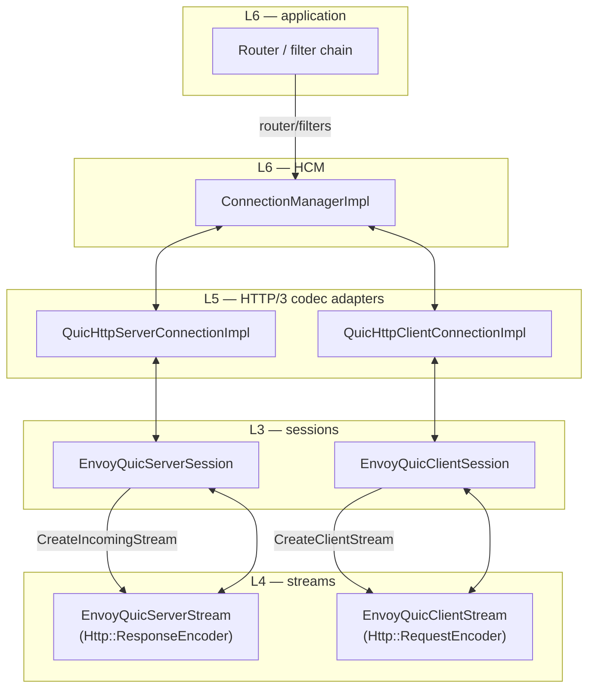
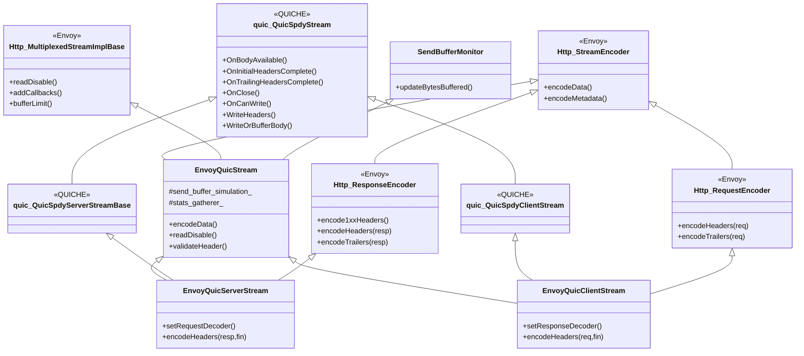
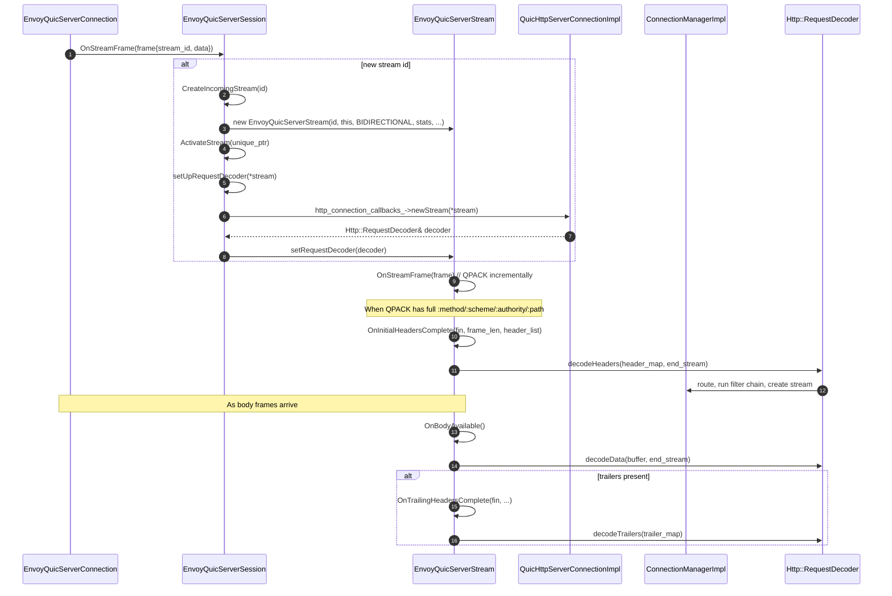
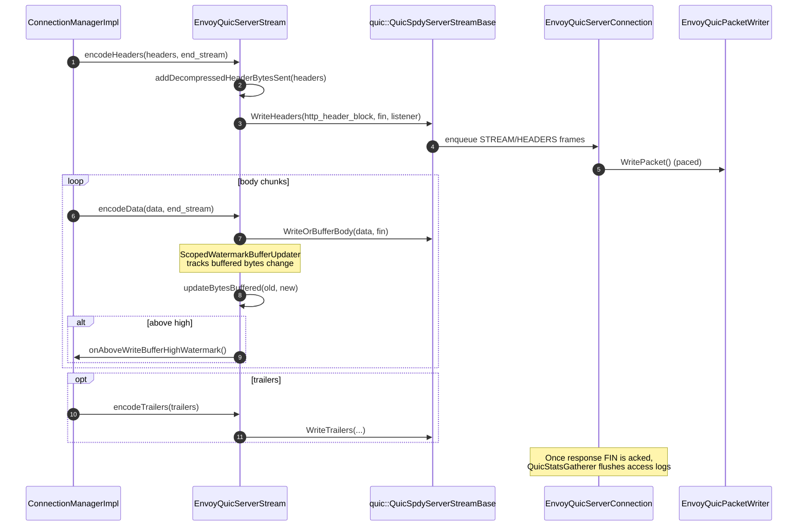
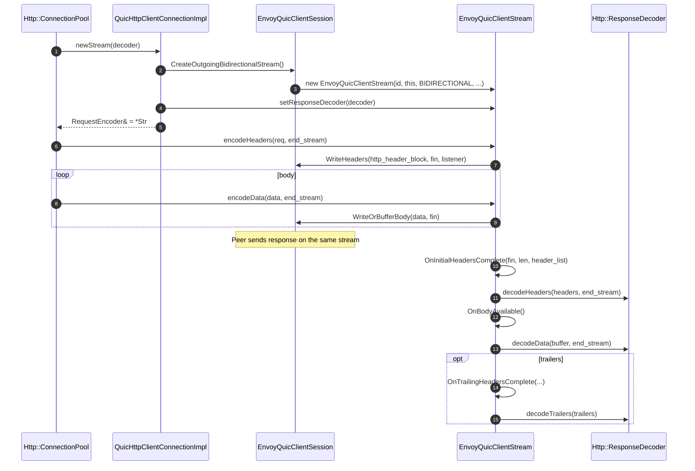
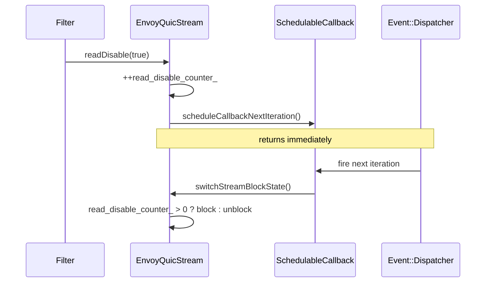
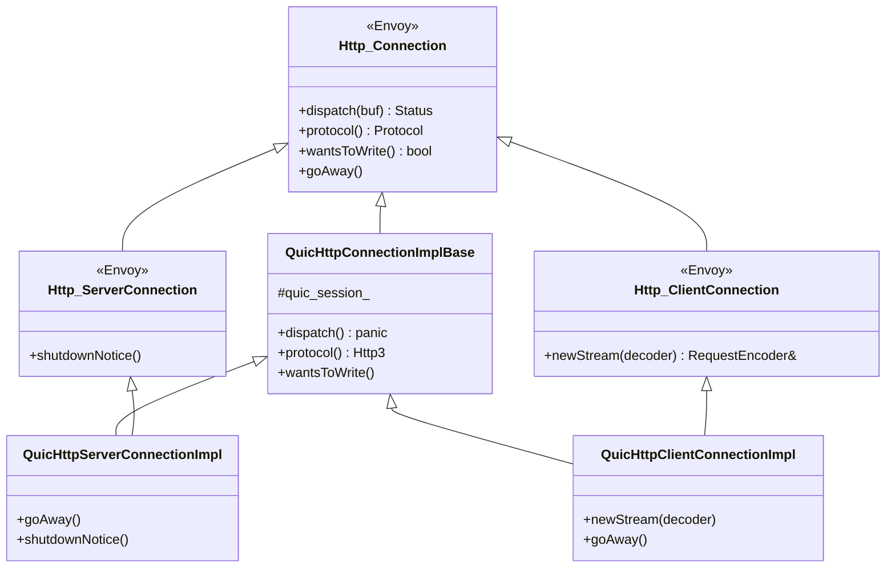
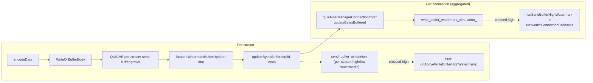

# Overview, Part 4 — Streams, codecs, and HTTP/3 integration

> *Read [`OVERVIEW_PART1`](OVERVIEW_PART1_architecture_and_layering.md), [`OVERVIEW_PART2`](OVERVIEW_PART2_listener_session_connection.md), [`OVERVIEW_PART3`](OVERVIEW_PART3_crypto_and_tls.md) first.*

By this point the server has accepted a session, the client has connected and the TLS handshake is complete. This document covers what happens **per stream / per request**: how QUIC stream events become HTTP requests and how HTTP responses become QUIC stream writes.

## Three layers, one request

The codec adapters at L5 are intentionally **thin** — most of the heavy lifting is in the stream classes at L4. The codec mostly exists to satisfy the `Http::Connection` interface (`goAway`, `wantsToWrite`, watermark forwarding) so HCM and the conn pool can drive the connection without knowing about QUIC.

---

## Stream class diagram

The detailed class graph including all base classes lives in [`CLASS_HIERARCHY.md`](CLASS_HIERARCHY.md). The take‑away here: each stream is **both** a `QuicSpdyStream` (so QUICHE can hand it frames) **and** a Stream/Encoder (so HCM can read its requests / write its responses).

---

## Server side — request flow

### Receiving a request

### Sending a response

### Deferred access logging

QUIC access logs are emitted **after the FIN is acked** so logged byte counts and RTTs reflect what actually reached the peer. The mechanism:

1. `EnvoyQuicServerStream::setDeferredLoggingHeadersAndTrailers()` (called by HCM at end of response) hands a copy of headers/trailers/stream_info to `QuicStatsGatherer`.
2. `QuicStatsGatherer` is also installed as a `quic::QuicAckListenerInterface` for the stream's writes, so QUICHE calls `OnPacketAcked()` for every chunk that gets acked.
3. When all outstanding bytes are acked **and** FIN has been sent, `maybeDoDeferredLog()` walks `access_log_handlers_` and emits the logs.

---

## Client side — request flow

The mirror picture:

Differences from server side:

- The stream is **outgoing‑bidirectional**, allocated up‑front from the pool, not in response to an incoming frame.
- `ShouldCreateOutgoingBidirectionalStream()` is overridden to always return `true` — the conn pool already gated stream creation, so re‑gating here would crash.
- The client side handles `OnHttp3GoAway(stream_id)`: any stream id ≥ the limit must not be issued again; the pool is told via `Http::ConnectionCallbacks::onGoAway`.

---

## Read‑disable and back‑pressure (per stream)

Envoy filters can call `readDisable(true)` to stop reading body bytes (e.g. when a downstream is slow). On QUIC streams this becomes flow‑control stop, not a TCP backpressure thing. The trick is QUICHE doesn't tolerate stream‑state changes from inside its own callstack, so the change is **scheduled** for the next event loop:

`read_disable_counter_` lets multiple `readDisable(true)` calls compose; only the count‑to‑zero transition actually unblocks.

---

## Header validation and pseudo‑header order

`EnvoyQuicStream::validateHeader()` is called for every header before it reaches HCM. It:

1. Runs `http2::adapter::HeaderValidator::ValidateSingleHeader()` — checks for forbidden chars, well‑formed names, etc.
2. Validates `content-length` (`Http::HeaderUtility::validateContentLength`) and stashes the parsed value so `updateReceivedContentBytes()` can sanity‑check the body length on stream end.
3. Enforces "all pseudo‑headers before any regular header".
4. Returns `REJECT` to make QUICHE skip the stream and call `onStreamError()`.

The connection‑close vs stream‑reset behaviour on a bad header is configurable via `http3_options.override_stream_error_on_invalid_http_message`.

---

## Codec adapters — what they actually do

`QuicHttpServerConnectionImpl` and `QuicHttpClientConnectionImpl` look thin because they are. They mostly:

- Implement `Http::Connection::protocol()` → `Protocol::Http3`.
- Implement `Http::Connection::dispatch()` as `PANIC` — QUIC hands data directly to streams, the codec never sees raw bytes.
- Implement `wantsToWrite()` by asking the session if any bytes are buffered (`bytesToSend() > 0`).
- Implement `goAway()` by calling `quic_session_.OnGoAway()` (server) or sending the appropriate H/3 GOAWAY frame.
- Forward `onUnderlyingConnectionAboveWriteBufferHighWatermark` / `Below` to the session.

The class hierarchy:

---

## HTTP/3 Datagrams and Capsule Protocol (optional)

When `ENVOY_ENABLE_HTTP_DATAGRAMS` is compiled in, `EnvoyQuicStream` can hold a `HttpDatagramHandler` that maps:

- Outgoing data passed to `encodeData()` is interpreted as **capsules** (RFC 9292) and sent over both stream bytes and QUIC DATAGRAM frames (RFC 9297).
- Incoming HTTP/3 datagrams arriving via the QUIC connection are turned into capsules and surfaced to filters as body.

This is the foundation for MASQUE / CONNECT‑UDP / WebTransport. The Envoy code in this folder is just the bridge; the actual MASQUE / WebTransport extensions live elsewhere.

---

## Watermark / back‑pressure flow end‑to‑end

Two independent watermark state machines (per stream + per connection), one set of `SendBufferMonitor::ScopedWatermarkBufferUpdater` measurements, no double‑counting.

---

## What's next

- [`envoy_quic_stream.md`](envoy_quic_stream.md) — Per‑file deep dive for both stream classes and the codec adapters.
- [`envoy_quic_session.md`](envoy_quic_session.md) — Where the streams are *owned*; the session's role in stream lifecycle.
- [`CLASS_HIERARCHY.md`](CLASS_HIERARCHY.md) — UML view of the full stream / session / codec graph.
